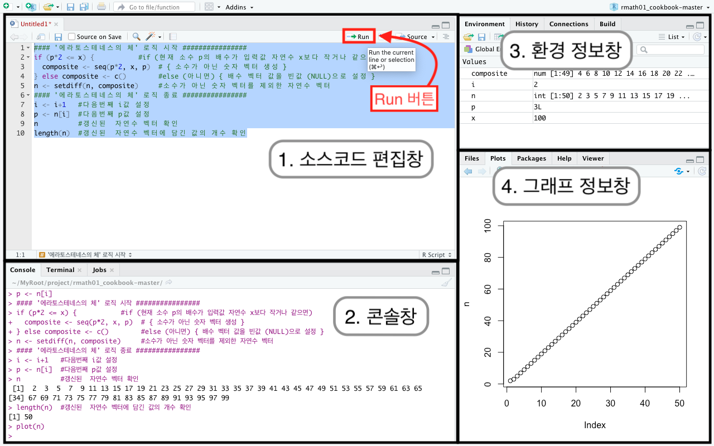

---
output:
  pdf_document: default
  html_document: default
  word_document: default
---
# R 시작하기 {#r-get-started}

이 책을 읽고 활용하기 위해서는 여러분은 두 가지 선행 조건을 만족시켜야 합니다. 첫째, 초등수학 교육 과정을 수료했어야 합니다. 중등 수학 $1$학년 과정을 다루기 때문에 초등학교 $6$학년 수준의 수학 내용을 이미 이해하고 있어야 합니다. 이 책은 중등 수학 $1$학년 과정의 입문서는 아니기 때문에 수학 개념 하나 하나에 대해서 친절히 설명하고 있지는 않습니다. 둘째, 사용할 컴퓨터에 R과 RStudio가 설치되어 있어야 합니다. 


## 왜 R인가?

소프트웨어 개발을 위한 목적으로 만들어진 언어인 C, Java, Python과는 달리, R은 통계학자에 의해 만들어졌으며 데이터 분석을 위한 상호작용 환경 (interactive environment)을 제공하는 도구입니다. 상호작용 환경을 통하여 사용자는 데이터를 빠르고 쉽게 탐색해보고 분석할 수 있을 뿐 아니라, 작업 내용을 스크립트 형태로 저장했다가 나중에 분석 과정을 그대로 재현해 볼 수도 있습니다. R은 무료이고 오픈소스입니다. 여러 플랫폼에서 작동하며 여러 과학 분야 전문가들이 사용합니다. 

- 여러 플랫폼 (Windows, Mac Os, UNIX/Linux)에서 작동하기 때문에, 플랫폼에 상관없이 스크립트와 데이터 객체들을 공유할 수 있습니다.
- 컴퓨터 공학, 통계학, 경제학, 생태학, 사회 과학, 지리학 등의 여러 분야 전문가가 활발히 활동하는 R 사용자 커뮤니티를 통해 배우고 질문할 수 있을 뿐 아니라 그들이 만든 다양한 R 팩키지를 통하여 새로운 분야의 데이터 과학 방법론을 쉽게 활용해 볼 수 있습니다. 


## R과 RStudio 설치하기


R을 다운로드 하기 위해서 사용할 컴퓨터에서 웹 브라우저를 열고 <https://cran.rstudio.com/>로 이동합니다. 윈도우즈, 리눅스, 맥용 설치 파일 링크 중 해당 링크를 선택하고 해당 설치 파일을 다운로드한 후 컴퓨터에 설치합니다. 새로운 버전의 R은 1년에 두세 번 정도 릴리즈 되기 때문에 정기적으로 버전 업데이트하는 것이 좋습니다. 


RStudio는 R 프로그래밍을 위한 통합 개발 환경 (integrated development environment, or IDE)을 제공합니다. <https://www.rstudio.com/download>에서 다운로드하여 설치할 수 있습니다. 무료 오픈소스 버전인 **RStudio Desktop**을 설치합니다. RStudio 또한 1년에 두세 번 정도 새로운 버전이 릴리즈 되므로 정기적으로 버전 업데이트하는 것이 좋습니다. 

RStudio를 설치한 후, 한글 데이터 처리 시 한글이 깨지는 문제를 막기 위해서 RStudio를 실행하여 아래와 같이 Global Option과  Project Option을 설정합니다. 

**Global Option 설정하기**

1. 메뉴에서 Tools >> Global Options…를 클릭  
1. Code >> Saving TAB에서 Default text encoding을 UTF-8로 설정

**Project Option 설정 확인하기**

1. 메뉴에서 File >> New Project…를 클릭
1. New Directory >> New Project >> Directory Name을 rmath01로 설정
1. Create project as subdirectory of의 Browse…버튼을 클릭하여 원하는 폴더 설정
1. Create Project 버튼을 클릭하여 프로젝트 생성
1. 메뉴에서 Tools >> Project Options…를 클릭  
1. Code Editing >> Text encoding을 UTF-8로 설정되어 있는지 확인
1. 메뉴에서 File >> Close Project를 클릭하여 프로젝트 닫기
1. 메뉴에서 File >> Quit Session…을 클릭하여 RStudio 세션 종료

**Project 열기**

1. RStudio 실행
1. 메뉴에서 File >> Open Project…를 클릭
1. 위에서 프로젝트를 저장한 폴더를 찾아가서 rmath01.Rproj을 선택하고 Open 버튼 클릭

또는

1. 파일탐색기나  파인더에서 프로젝트를 저장한 폴더를 찾아가서 rmath01.Rproj 파일을 더블 클릭


## R로 소스코드 작성하기

RStudio를 실행하고 콘솔 (console) 창에 소스코드를 입력하고 엔터를 눌러서 실행할 수 있습니다. ```#```으로 시작하는 라인은 주석문 (코멘트, comment)으로 코드, 함수, 결과 등에 대한 설명을 메모하여 소스코드를 더 잘 이해할 수 있게 도와줍니다. 

```{r eval=FALSE}
6+1
## [1] 7

```
위의 코드를 RStudio의 콘솔에 입력하고 엔터를 눌러서 실행하면 결과는 아래와 같이 나옵니다. 

```{r eval=FALSE}
> 6+1
[1] 7
```

책에 나오는 소스코드에는 콘솔의 프롬프트 (>, prompt)가 보이지 않지만, 여러분은 RStudio 콘솔의 프롬프트 (>) 오른쪽 부분에 항상 코드를 입력하게 됩니다. 책에 나오는 코드에서 예상 결과를 보여줄 때는 ```##> [1] 7``` 과 같이 주석문으로 처리되어 있습니다.
책에 나오는 내용 중 코드와 관련된 숫자, 문자 (변수), 데이터 객체 (data object), 함수 (function)등은 ```1```, ```a```, ```x```, ```mean()```과 같이 다른 글씨체로 표현됩니다. 함수인 경우 ```()```가 포함되어있습니다. 

함수는 어떤 입력값 (input arguments)을 받아서 정의된 계산을 수행한 다음에 결과값 (출력값, return value)을 반환합니다. 예를 들어, ```seq(1,5)```라는 함수는 ```()```안에 ```1```과 ```5``` 두 개의 숫자를 입력값으로 받아서 $1$부터 $5$까지 $1$ 간격으로 증가하는 숫자 집합 ```1 2 3 4 5```를 결과값으로 반환합니다. ```=```, ```<-```를 이용하여 ```a```와 같은 특정 문자 (변수)에 함수의 결과값 (반환된 숫자 또는 데이터 객체)을 저장할 수도 있습니다.  

```{r eval=FALSE}
a = seq(1,5)
a
## [1] 1 2 3 4 5
```

```a``` 라는 문자 (변수, variable)를 콘솔창에 입력하고 엔터를 눌러서 실행한 후에, 저장된 데이터 객체 값을 확인할 수도 있지만, ```print()``` 함수를 이용할 수도 있습니다.


```{r eval=FALSE}
a = seq(1,5)
print(a)
## [1] 1 2 3 4 5
```

특정 변수에 숫자 또는 데이터 객체를 할당할 때에 ```=``` 대신에 ```<-```를 주로 사용합니다. ```a = 3```라는 식에서 '좌항과 우항의 값이 같다'라는 의미보다는 '```a``` 변수에 ```3```을 할당한다 또는 저장한다'의 의미로 사용하기 때문입니다.

```{r eval=TRUE}
a <- seq(1,5)
print(a)
```

RStudio 메뉴에서 File >> New File >> R Script를 클릭한 후, R 스크립트 편집창에 위의 소스코드를 입력하고 마우스나 키보드를 이용하여 입력한 코드를 전부 선택한 다음에 스크립트창 상단에 위치한 Run 버튼을 클릭하면 선택된 소스코드의 모든 내용이 실행되고 그 결과가 콘솔창에 나타납니다 (그림 \@ref(fig:rscript-window)). 

R 스크립트 편집창에 소스코드를 입력한 후, 소스코드를 선택하는 과정을 생략하고 Run 버튼을 클릭하면 현재 마우스 커서가 있는 해당 라인의 코드만 실행되고, 마우스 커서는 다음 라인으로 자동으로 이동합니다. 마우스 커서를 소스코드의 첫 라인에 두고 Run 버튼 클릭을 반복하면 코드를 한 줄 씩 실행시킬 수 있습니다. 

마우스나 키보드를 이용하여 스크립트 편집창의 소스코드를 전부 선택한 상태에서 Ctrl+Enter를 눌러도 Run 버튼을 클릭한 것과 동일한 결과가 나타납니다. R 스크립트 편집창에서 소스코드를 전부 선택하는 과정 없이 Run 버튼에서 오른쪽으로 두 번째 위치에 있는 'Source the active document' 버튼을 클릭하여도 현재 스크립트 편집창의 전체 소스코드를 실행해 볼 수 있습니다.

```{r rscript-window, echo = FALSE, out.width = '75%', fig.cap = 'RStudio의 소스코드 편집창과 콘솔창'}

```

이 책에 나와 있는 소스코드들은 RStudio의 콘솔창에 직접 실행시킬 수도 있고, Notepad, Notes, Sublime Text 등과 같은 문서 편집기 (text editor)나 RStudio의 R 스크립트 편집창에 소스코드를 일부 수정한 후에 코드 한 줄 씩, 코드 일부만, 혹은 코드 전체를 실행해 볼 수 있습니다.

### 벡터 (vector)

변수 ```a```에 저장된 데이터 객체의 자료 형태를 R에서는 벡터 (vector)라고 부릅니다. 벡터는 동일한 자료형의 값이 여러 개 연속되어 있는 1차원 자료 형태입니다. 위의 예에서는 다섯 개의 자연수 $1$, $2$, $3$, $4$, $5$가 ```a``` 라는 이름의 변수에 벡터 형태로 저장되어 있습니다. 아래의 소스코드와 같이 ```c()``` 함수에 입력값들을 ```,```로 구분하여 넣어 주어도 벡터가 생성되며, 벡터에는 여러 개의 값이 저장되어 있기 때문에, ```length()```함수를 이용하여 벡터에 저장된 값의 개수를 알아볼 수도 있고, ```[]```기호를 이용하여 벡터를 이루는 각각의 값 (원소, element)에 접근할 수도 있습니다. ```typeof()```함수를 이용하여 어떤 자료 형태인지 확인해볼 수도 있고, ```is.vector()```함수를 이용하여 변수 ```a```가 벡터형이 맞는지 아닌지 확인해볼 수도 있습니다. 

```{r eval=FALSE}
a <- c(1,2,3,4,5)
print(a)
## [1] 1 2 3 4 5
print(length(a))
## [1] 5
print(a[1])
## [1] 1
print(a[5])
## [1] 5
print(typeof(a))
## [1] "integer"
print(is.vector(a))
## [1] TRUE
```

```a``` 라는 문자를 변수라고 부르는 이유는 그 이름에 저장된 데이터 객체 값이 변할 수 있기 때문입니다. 변수는 저장 창고 역할을 하고 그 안에 저장되는 물건 (데이터 객체)은 사용자가 임으로 변경할 수 있습니다. ```c()``` 함수에 ```1:5```와 같은 형태의 입력값도 가능하며 이는 $1$부터 $5$까지 연속된 정수로 이루어진 벡터를 생성해 줍니다. 그 자체로 벡터이기 때문에 굳이 ```c()```함수가 없어도 벡터를 생성할 수 있습니다. 

```{r eval=FALSE}
a <- seq(1,3)
print(a)
## [1] 1 2 3
a <- c(1,2,3)
print(a)
## [1] 1 2 3
a <- c(1:5)
print(a)
## [1] 1 2 3 4 5
a <- 1:5
print(a)
## [1] 1 2 3 4 5
```

벡터 자료를 생성하는 방법은 다양합니다. 숫자 뿐만 아니라 문자, 문자열도 벡터에 저장될 수 있습니다. 벡터를 저장하는 변수의 이름을 정할 때에는 그 변수에 담길 데이터 객체를 잘 표현해주면 좋습니다. 변수의 이름은 주로 영문자로 시작합니다. 변수의 이름을 숫자로 시작하거나 중간에 띄어쓰기하는 것은 불가능합니다. 

변수의 값이 문자인 경우 ```var1 <- 'a'```, ```var1 <- "a"```, ```var2 <- '안녕'```, ```var2 <- "1학년"```과 같이 문자값 (문자열값)의 시작과 끝을 ```''```, ```""```로 감싸서 표현합니다. 문자값 (문자열값)을 입력할 때 ```''```로 표현했어도, ```print()```로 화면 출력 될 때에는 ```""```로 표현됩니다. ```''```로 입력된 문자값이 R에 데이터 객체의 값으로 저장될 때에는 ```""```로 변경되어 저장되기 때문입니다.

문자값에 ```'```이 포함될 경우 ```"aaa'bbb'ccc"``` 또는 ```'aaa\'bbb\'ccc'```로 표현할 수 있습니다. 문자값에 ```"```가 포함될 경우에는 ```'aaa"bbb"ccc'``` 또는 ```"aaa\"bbb\"ccc"```로 표현할 수 있습니다.

```{r eval=FALSE}
a1 <- seq(1,3)         #숫자형 벡터
a2 <- seq(4,5)         #숫자형 벡터
myIntegers<- c(a1,a2)  #숫자형 벡터 두 개를 합친 숫자형 벡터
print(myIntegers)
## [1] 1 2 3 4 5
myCharacters <- c('a','b','c','d','e')  #문자형 벡터, 문자는 'a' 또는 "a"로 표현
print(myCharacters)
## [1] "a" "b" "c" "d" "e"
myWords <- c("hello","middle",'school')  #문자형 벡터 
print(myWords)
## [1] "hello"  "middle" "school"
myKorCharacters <- c('가','나','다')  #문자형 벡터
myKorCharacters
## [1] "가" "나" "다"
myKorWords <- c('안녕','중학교','1학년')  #문자형 벡터
myKorWords
## [1] "안녕"   "중학교" "1학년"
myFlags <- c(TRUE,TRUE,FALSE,TRUE)  #논리형 벡터
myFlags
## [1]  TRUE  TRUE FALSE  TRUE
```

콘솔에서 ```ls()```함수를 이용하여 현재 사용 중인 데이터 객체를 저장하고 있는 문자(변수)들을 확인해 볼 수 있습니다.

```{r eval=TRUE}
ls()
```

```sum()``` 또는 ```mean()``` 함수를 이용하여 ```a``` 라는 문자(변수)에 저장된 숫자 집합의 합, 평균 등도 구해볼 수 있습니다.
```{r eval=FALSE}
sum(a)
## [1] 15
mean(a)
## [1] 3
```

위에서 살펴본 소스코드를 모아보면 아래와 같습니다.
```{r eval=FALSE}
a = seq(1,5)         #1부터 5까지 연속된 숫자형 벡터를 변수 a에 할당
print(a)             #변수 a에 저장되어 있는 값들을 화면에 출력 
print(length(a))     #변수 a에 저장되어 있는 값들의 개수를 화면에 출력 
print(a[1])          #변수 a에 저장되어 있는 숫자형 벡터의 첫째 번째 값을 화면에 출력 
print(a[5])          #변수 a에 저장되어 있는 숫자형 벡터의 다섯번째 값을 화면에 출력 
print(typeof(a))     #변수 a에 저장되어 있는 데이터 객체의 자료형태를 화면에 출력 
print(is.vector(a))  #a가 벡터이면 TRUE, 아니면 FALSE를 출력
sum(a)               #a에 저장되어 있는 값들의 합 계산 
mean(a)              #a에 저장되어 있는 값들의 평 계산
print(c('안녕','중학교','1학년'))   #문자형 벡터의 값들을 출력
print(c(TRUE,TRUE,FALSE,TRUE))  #논리형 벡터의 값들을 출력
```

### 데이터 프레임 (data frame, df, ```data.frame```)

벡터와 함께 자료를 탐색/처리/분석하는데 가장 많이 쓰이는 데이터 구조가 데이터 프레임 (data frame, df, ```data.frame```)입니다. 데이터 프레임은 $2$차원 테이블 형태인데 행 (로우, row)과 열 (컬럼, column, col)로 구분할 수 있습니다. 데이터 프레임의 행과 열, 생성 방법을 설명하기 위해서 우리나라에서는 트럼프 카드(trump card)라는 별칭으로 불리기도 하는 플레잉 카드 (playing card) 한 묶음 (한 벌, one deck)을 가지고 설명해 보겠습니다. 지금 우리 눈앞에 플레잉 카드 한 벌이 있고, 그중에서 다섯 장만 무작위 (random)로 뽑았더니 그 결과가 표 \@ref(tab:card5-df)과 같았다고 생각해 봅시다. 

```{r card5-df, echo = FALSE}
library(dplyr)
library(kableExtra)
cards_df <- data.frame(
  card_num = c('첫 번째', '두 번째', '세 번째', '네 번째', '다섯번째'), 
  suit = c('spade', 'heart', 'spade', 'club', 'club'), 
  color = c('검은색', '빨간색', '검은색', '검은색', '검은색'),
  value = c(9, 5, 3, 1, 7))

knitr::kable(
  #data.frame(card_num = c('첫 번째', '두 번째', '세 번째', '네 번째', '다섯번째'), suit = c('spades', 'hearts', 'spades', 'clubs', 'clubs'), value = c(9, 5, 3, 1, 7)),
  cards_df,
  booktabs = TRUE, align = "c",
  caption = '다섯장의 플레잉 카드 정보'
) %>% kable_styling(full_width=FALSE,font_size=15)
```

위의 표는 $5$개의 행과 $4$개의 열로 이루어진 데이터 프레임인 ```cards_df```를 표로 표현한 것입니다. 데이터 프레임의 각 열 (컬럼)은 $4$개의 벡터로 부터 생성됩니다. 각 컬럼 벡터는 다섯 장 카드의 일부 정보를 가지게 됩니다. 예를 들어, ```card_num```,  ```suit```,  ```color```,  ```value```벡터들은 각각 카드 순서, 모양, 색상, 숫자 정보를 가집니다. 데이터 프레임에 담긴 데이터는 다양한 함수들 (nrow, ncol, dim, str 등)을 이용하여 탐색할 수 있습니다. 


```{r eval=TRUE}
cards_df <- data.frame(
  card_num = c('첫 번째', '두 번째', '세 번째', '네 번째', '다섯번째'), 
  suit = c('spade', 'heart', 'spade', 'club', 'club'), 
  color = c('검은색', '빨간색', '검은색', '검은색', '검은색'),
  value = c(9, 5, 3, 1, 7), 
  stringsAsFactors=FALSE) #문자형 벡터의 데이터 타입을 factor로 인코딩 하지 않기
```
```{r eval=FALSE}
print(ncol(cards_df))  #열(컬럼) 개수
## [1] 4
print(nrow(cards_df))  #행 개수
## [1] 5
dim(cards_df)          #행렬 정보
## [1] 5 4
```
```{r eval=TRUE}
str(cards_df)          #데이터 프레임의 구조 (structure)
head(cards_df, 3)      #처음 3행 정보
tail(cards_df, 3)      #마지막 3행 정보
```
```{r eval=FALSE}
cards_df[1,2]          #1행 2열 정보, 첫 번째 카드의 모양 정보
## [1] "spade"
cards_df[1, ]          #1행 정보, 1행의 모든 열 (컬럼) 정보
##   card_num  suit  color value
## 1   첫 번째   spade  검은색   9
```
```{r eval=TRUE}
cards_df[2:4, ]        #2행부터 4행까지의 모든 열 (컬럼) 정보
```
```{r eval=FALSE}
cards_df[ ,4]          #전체행의 4번째 열 (컬럼) 정보
## [1] 9 5 3 1 7
cards_df[ ,'value']    #전체행의 4번째 열 (컬럼) 정보
## [1] 9 5 3 1 7
cards_df$value         #전체행의 value 벡터 열 (컬럼) 정보
## [1] 9 5 3 1 7
```
```{r eval=TRUE}
cards_df[ ,c(2, 4)]    #전체행의 2번쨰 열과 4번째 열 (컬럼) 정보
```

플레잉 카드 데크 전체 카드는 $13 \times 4 = 52$장 입니다. 위에서 배운 것을 바탕으로 스페이드 $13$장, 하트 $13$장, 다이아몬드 $13$장, 클럽 (클로버) $13$장 순서로 $52$개의 행을 가진 ```deck_df``` 데이터 프레임을 만들어 보겠습니다. 아래 소스코드의 face 벡터와 value 벡터는 각각 $13$개의 값을 가지는 반면, ```suit```벡터는 $4$개의 값 (스페이드, 하트, 다이아몬드, 클럽)을 가집니다. ```color```, ```rank```, ```shape```벡터들은 ```suit```벡터에 저장된 스페이드, 하트, 다이아몬드, 클럽의 색상, 등급, 모양 특성을 표현한 것으로 각각 $4$개의 값을 가집니다.


```{r eval=TRUE}
faceVec0 <- c('ace', 'two', 'three', 'four', 'five', 'six', 
              'seven', 'eight', 'nine', 'ten', 'jack', 'queen', 'king')
valueVec0 <- c(1:13)
suitVec0 <- c('spade', 'heart', 'diamond', 'club')          #스페이드, 하트, 다이아몬드, 클럽 
colorVec0 <- c('black', 'red', 'red', 'black')              #카드의 모양별 색상
rankVec0 <- c('major', 'major', 'minor', 'minor')           #카드의 모양별 등급 정보
shapeVec0 <- c('pointed', 'rounded', 'pointed', 'rounded')  #카드의 모양별 특성 정보
```

위의 벡터들을 모두 $52$개의 값을 가지는 벡터로 변환한 다음에 데이터 프레임을 생성할 수 있습니다. 데이터 프레임의 컬럼 벡터가 되는 ```value```벡터와 ```suit```벡터를 중심으로 생각하면, 두 컬럼 벡터 모두 스페이드 $13$장, 하트 $13$장, 다이아몬드 $13$장, 클럽 $13$장 순서로 $52$개 값을 가진 벡터를 생성하게 됩니다. 

```value```벡터는 $1$부터 $13$까지 $13$장의 카드가 스페이드, 하트, 다이아몬드, 클럽 순으로 $4$번 반복하는 값을 가지기 위하여 $13$개의 값을 가지는 벡터를 $4$번 반복하여야 합니다. ```c()```를 이용하여 $4$개의 벡터들을 연결하는 하나의 벡터를 생성할 수도 있고 ( ```c(1:13, 1:13, 1:13, 1:13)```), ```rep()```함수를 이용하여 특정 값 (벡터값)을 반복 (repeat)할 수도 있습니다 (```rep(1:13, times = 4)``` 또는 ```rep(1:13, 4)```). ```rep(x=1:13, times=4)```와 같이 ```입력값 이름 = 입력값```의 형식으로 함수의 입력값을 줄 수도 있고, 입력값이 순서대로 입력될 경우에는 ```rep(1:13, 4)```와 같이 입력값의 이름이 생략될 수 있습니다. 입력값의 이름이 생략된 경우, 입력값의 순서가 달라 지면 (```rep(4, 1:13)```) 원하는 결과를 얻을 수 없습니다.

```suit```벡터의 경우, 스페이드가 $13$개, 하트가 $§3$개, 다이아몬드가 $13$개, 클럽이 $13$개 이므로 스페이드, 하트, 다이아몬드, 클럽을 각 각 13번 씩 반복하거나 (```c(rep('spade',13), rep('heart',13), rep('diamond',13), rep('club',13))```), 스페이드, 하트, 다이아몬드, 클럽을 값으로 가지는 벡터를 생성하고 벡터값의 첫 번째 값부터 각 값을 (each) $13$번 씩 반복할 수 있습니다 (```rep(c('spade','heart','diamond','club'),each=13)```). 

아래와 소스코드로 $6$개의 컬럼벡터가 모두 $52$개의 값을 가지도록 설정할 수 있습니다.

```{r eval=TRUE}
faceVec <- rep(faceVec0, times = 4)   #ace부터 king까지 4번 반복
print(faceVec)
print(length(faceVec))
valueVec <-rep(valueVec0, times = 4)  #1부터 13까지 4번 반복
print(valueVec)
print(length(valueVec))
suitVec <- rep(suitVec0, each = 13)    #스페이드 13번 반복, 그 다음 모양 13번 반복...
print(suitVec)
print(length(suitVec))
colorVec <- rep(colorVec0, each = 13)  #스페이드 색상 13번 반복, 그 다음 색상 13번 반복...
print(colorVec)
print(length(colorVec))
rankVec <- rep(rankVec0, each = 13)    #스페이드 등급 13번 반복, 그 다음 등급 13번 반복...
print(rankVec)
print(length(rankVec))
shapeVec <- rep(shapeVec0, each = 13)  #스페이드 모양특성 13번 반복, 그 다음 모양특성 13번 반복...
print(shapeVec)
print(length(shapeVec))
```

이제 초기값 벡터 (Vec0)로 부터 6개의 벡터 (Vec)가 모두 $52$개의 값을 가지도록 설정되었습니다. 이 $6$개의 벡터들을  컬럼값으로 가지는 데이터 프레임 ```deck_df```를 생성해 보겠습니다. 원래 플레잉 카드 데크에는 두 장의 조커 카드가 더 있지만 이번 예제에서는 조커 카드는 제외하도록 하겠습니다.

```{r eval=TRUE}
deck_df <- data.frame(
  face = faceVec, 
  value = valueVec, 
  suit = suitVec,
  color = colorVec, 
  rank = rankVec, 
  shape = shapeVec)
```

생성한 데이터 프레임 또는 다른 데이터 객체를 여러분 컴퓨터 작업 폴더에 파일로 저장하거나 읽어올 수 있습니다.

```{r eval=FALSE}
getwd()  #현재 작업 디렉토리 (working directory, wd) 확인

#setwd("/my/rmath01")  #원하는 폴더를 작업 디렉토리로 설정하거나,
#RStudio 메뉴에서 Tools >> Global Options… 클릭한 후,
#Code >> Default working directory >> Browse… 원하는 폴더를  작업 디렉토리 (wd)로 설정 

saveRDS(deck_df, file = "deck_df.RDS") 
deck_df <- readRDS("deck_df.RDS")

```

코드를 실행하기 전에 어떤 값이 출력 될지 미리 생각해보는 것이 중요합니다. 행과 열 정보가 무언인지 미리 생각해보고 아래의 소스코드를 실행해봅니다. 

```{r eval=FALSE}
dim(deck_df)  
nrow(deck_df)
ncol(deck_df) 
```

문자형 벡터 컬럼들의 속성 정보에 못 보던 factor, levels 같은 용어와 값들이 있습니다. 6개의 초기값 (Vec0) 벡터들이 가지는 값들 중 중복되는 값을 제거하고 유일하게 남는 (unique) 구별된 (distinct) 값의 개수를 생각해봅니다. color 컬럼의 경우 검은색 아니면 빨간색 2가지 값 중 하나를 가집니다 ($2$ levels, black을 $1$로 표현, red를 $2$로 표현). 현재는 factor, levels에 대한 개념은 어렴풋이 알아도 충분합니다.

```{r eval=FALSE}
str(deck_df)
summary(deck_df)
```

$52$장의 카드 중 위에 위치한 몇 장의 카드 정보와 밑에 위치한 카드 정보를 확인합니다. 52개의 벡터를 만들었을 때 모양 (suit) 순서를 생각해보면서 출력 될 값의 value 컬럼값과 suit 컬럼값을 미리 예상해보고 아래의 소스코드를 실행합니다.

```{r eval=FALSE}
head(deck_df)
tail(deck_df)
```

예상했던 값과 일치합니까? 일치하지 않았다면 예상한 값이 왜 틀렸는지 알았습니까? 미리 예상값 (기대값)을 가지고 데이터를 확인하는 과정은 정말 중요한 작업입니다. 

1. 데이터를 처리하면서 기대값 미리 예상하기 
1. 데이터값 확인하기
1. 기대값과 데이터값이 불일치하는 경우 원인 파악하기
1. 기대값 (예상값)이 잘못된 경우 기대값이 잘못된 이유 깨닫기 (두뇌 튜닝)
1. 데이터값이 이상한 경우 데이터를 좀 더 탐색하고 분석 (데이터 탐색 분석)하여 오류 수정 또는 제거하기
1. 데이터 자체가 잘못되었다고 판단될 경우 새로운 데이터 소스 파악하고 얻기
1. 문제가 없는 경우에도 다른 소스의 데이터를 구할 수 있으면 다시 한번 비교 확인 (더블체크)

위의 $5$장의 카드 데이터 프레임 ```cards_df```에서 시작해서 이제 $52$장 전부를 가진 플레잉 카드 데크 데이터 프레임 ```deck_df```을 생성했습니다. 이제 $52$장의 카드 중 임의로 (무작위로, randomly) 카드 $7$장을 뽑아보겠습니다. 모집단 (관심의 대상이 되는 전체 그룹, population)에서 표본(분석을 위해 추출한 부분 집합, 샘플, sample)을 추출하는 과정입니다. 


```{r eval=TRUE}
nrow(deck_df)
#랜덤으로 값을 가져오기 위한 시드(seed) 값을 1000으로 설정됨 (시드값을 설정하지 않으면 랜덤으로 자동 설정됨)   
set.seed(1000)      
rowNumOfCardSamples <- sample(nrow(deck_df), 7) #데이터프레임에서 7개의 행번호를 랜덤으로 추출함
rowNumOfCardSamples
cardSamples <- deck_df[rowNumOfCardSamples, ]
cardSamples
# -c(): 특정 값들만 제외, 이미 뽑은 카드 7장을 데크에서 제외
deck_df <- deck_df[-c(rowNumOfCardSamples), ] 
nrow(deck_df)
summary(deck_df)
```

이번 장에서는 아주 기본적인 R 소스코드 작성법을 배웠으며 중요한 개념인 벡터와 데이터 프레임에 대해서도 살펴보았습니다. 이제 앞으로 나아갈 시간입니다. 중학교 수학 $1$학년 교과 과정에 맞추어서 차근 차근 R을 활용해서 수학적 소양 (수학적 이해 능력, math literacy, numeracy)과 데이터 이해 능력 (데이터 활용 능력, data literacy)을 동시에 높여 나가봅시다. 교과 과정을 습득해 나가는 방법은 다양합니다. 효율적인 학습 방법을 추구할 수도 있고 창의적인 학습 방법을  추구할 수도 있습니다. 반복 적인 학습을 통해 깊이를 더 해 가는 방법도 있습니다. 

이 책에서 시도하는 방법은 조금 엉뚱해 보일 수 있습니다. 하지만, 여러분의 머릿속에 저장되어 있는 수학적인 개념 (dots)과 새로운 데이터 개념 (new dots)을 연결해 가는 (connecting dots) 과정 속에서 여러분이 세계를 바라보는 시야가 확장되길 바랍니다. 서론이 길었습니다. 이제 **\@ref(number-calc)장 수와 연산**에 대하여 본격적으로 알아봅시다. 
