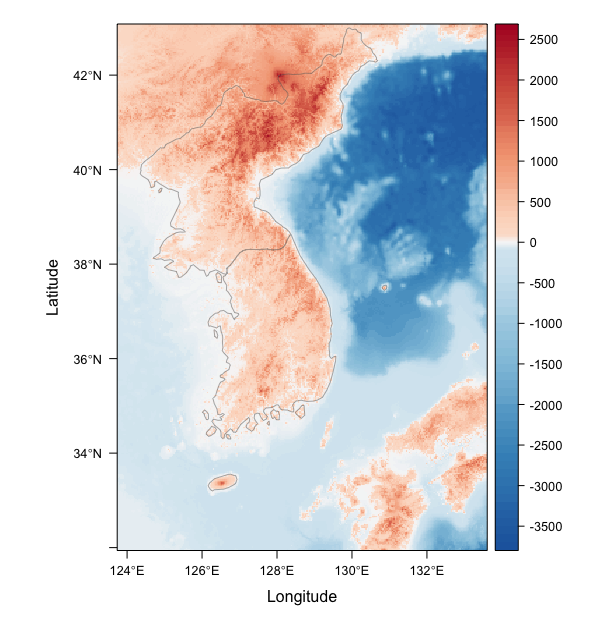

# 수와터연산 {#number-calc}

정수 (integer)와 유리수 (rational number)의 뜻에 대하여 살펴보고 정수와 유리수의 대소관계 및 연산에 대하여 알아봅니다.

RStudio가 열려 있지 않으면 RStudio를 실행하고 메뉴에서 File >> Open Project…를 클릭하여 이전에 저장한 R 프로젝트 파일인 rmath01.Rproj을 찾아서 선택하고 Open 버튼을 클릭하여 이전에 작업하던 프로젝트 환경을 로딩합니다. 파일탐색기나  파인더에서 rmath01.Rproj 파일을 찾아서 더블 클릭하여도 RStudio가 실행되면서 작업하던 프로젝트 환경이 로딩됩니다. 프로젝트 환경이 로딩된 후에 RStudio 콘솔창에 ```getwd()```를 실행하여 작업 환경이 제대로 로딩되었는지 확인합니다. RStudio 환경이 잘 로딩되었으면, 이제 본격적으로 시작해 봅시다.


## 소인수분해 (prime factorization) {#prime-factor}

$0$보다 큰 정수인 자연수 (natural number)를 소수 (prime number)와 합성수 (composite number)로 구분해보고, 합성수를 소수들의 곱형태로 분해하는 방법에 대해 알아봅니다.

### 합성수의 소인수분해

$1$보다 큰 자연수 중 $1$과 그 자신 만을 약수로 가지는 수를 소수라고 하고, 소수가 아닌 자연수를 합성수라고 합니다. 합성수를 소수들의 곱으로 분해하는 과정을 소인수분해라고 합니다. 소인수 (prime factor)란 소수 (prime number) 이면서 인수 (factor)인 수를 말합니다. 인수는 약수 (divisor) 와 거의 동일한 개념이라고 이해해도 무방합니다. 그림 \@ref(fig:primes-vs-composites)은 $1$과 그 자신만을 약수로 가지는 **소수**와 소인수의 곱으로 표현 가능한 **합성수**의 예를 보여줍니다. $2$, $3$, $5$, $7$, $11$은 $1$과 그 자신 만을 약수로 가지는 소수이고, $4$ ($2 \times 2$),  $6$ ($2 \times 3$),  $8$ ($2 \times 4 = 2 \times 2 \times 2$ ),  $9$ ($3 \times 3$),  $10$ ($2 \times 5$),  $12$ ($3 \times 4 = 3 \times 2 \times 2$)는 소인수의 곱으로 표현 가능한 합성수입니다. 

<div class="figure" style="text-align: center">

<p class="caption">(\#fig:primes-vs-composites)소수 (왼쪽 파란색)와 합성수 (오른쪽 빨간색) <font size="2">(출처 <https://en.wikipedia.org/wiki/Prime_number>)</font></p>
</div>

앞에 서 언급한 것처럼 다양한 분야를 아우르는 R 사용자 커뮤니티가 존재하고 그들에 의해 다양한 R 패키지가 배포되고 있으며 원하는 패키지를 다운로드 받아 설치하면, 그 패키지에 포함된 함수, 데이터, 분석 방법론을 사용할 수 있습니다. 


gmp 팩키지의 factorize() 함수를 사용하면 자연수에 대한 소인수분해를 수행할 수 있습니다.


```r
#install.packages("gmp")  #gmp 패키지 설치
gmp::factorize(24)
```

```
## Big Integer ('bigz') object of length 4:
## [1] 2 2 2 3
```

위의 소스코드를 실행했을 때 ```Error in loadNamespace(name) : there is no package called ‘gmp’```와 같은 에러 메시지가 나온다면, gmp 패키지가 설치되어 있지 않기 때문이므로 ```install.packages("gmp")```를 콘솔에 입력하고 실행하여 패키지를 설치해 줍니다. RStudio의 메뉴를 활용할 수도 있습니다 (메뉴에서 Tools >>  Install Packages…를 클릭한 후, 패키지 설치창에서 두 번째 에디트박스에 gmp라고 입력하고 Install 버튼 클릭). 

```library()``` 함수를 이용하여 설치되어 있는 패키지를 로딩하면 해당 패키지의 함수를 호출할 때 ```::```없이도 편하게 사용할 수 있습니다. 


```r
#install.packages("gmp")  #gmp 패키지 설치
library(gmp)        #gmp 패키지 로딩
factorize(24)       #gmp 패키지에서 제공하는 factorize() 함수 사용
```

합성수 $24$는 $2 \times 2 \times 2 \times 3$으로 분해할 수 있으며 $2^3 \times 3$으로 표현할 수 있습니다. $2^2$ ($2$의 제곱), $2^3$ ($2$의 세제곱), $2^4$ ($2$의 네제곱), $2^5$ ($2$의 다섯제곱), …을 통틀어 $2$의 거듭제곱이라 합니다. $2^3$ ($2$의 세제곱)에서 밑 (base number)은 $2$, 지수 (exponent, index)는 $3$이라고 읽습니다. 

자연수는 아래와 같이 소인수 (또는 소인수의 거듭제곱)의 곱 형태로 분해될 수 있습니다. 

$$23 = {23}^{1}$$
$$24 = {2}^{3} \times {3}^{1}$$
$$252 = {2}^{2} \times {3}^{2} \times {7}^{1}$$

소수 $23$은 ${23}^{1}$의 형태로,  합성수 $24$는 ${2}^{3} \times {3}^{1}$의 형태로, 합성수 $252$는 ${2}^{2} \times {3}^{2} \times {7}^{1}$의 형태로 분해됩니다.


### 에라토스테네스의 체 {#Eratosthenes}

우리보다 $2200$년이나 앞서서 소수에 대해 고민했던 에라토스테네스 (Eratosthenes, B.C. 275 ~ B.C. 194?)의 소수 탐색법인 '에라토스테네스의 체'에 대해 알아봅시다. 이 방법은 $2200$년이 지났음에도 여전히 정확도 측면에서 소수를 찾는 가장 확실한 방법으로 남아있습니다. 


먼저 새로운 개념 세 가지 연산(```%in%```, ```!```,  ```if() {} else {}```)에 대하여 살펴보고 '에라토스테네스의 체' 로직을 구현하는 소스코드를 작성해 보도록 하겠습니다. 

1. ```%in%```연산자 (operator)는 ```1 %in% c(1,2,3)```과 같은 형식으로 사용되며 연산자 앞의 값이 뒤의 벡터값에 포함되는지 여부를 TRUE/FALSE로 반환합니다. $1$은 $1,2,3$에 포함되므로 ```1 %in% c(1,2,3)```의 연산 결과는 TRUE가 됩니다. ```c(1,2,3) %in% c(3,4)```와 같이 앞의 값이 벡터인 경우, 앞의 벡터에 포함되는 요소 하나 하나의 결과를 벡터 형태로 반환합니다. $1$과 $2$는 $3,4$에 포함되지 않고 $3$은 $3,4$에 포함되므로 연산 결과는 ```c(FALSE,FALSE,TRUE)```가 됩니다.

1. ```!```논리 연산자 (logical operator)는 ```!TRUE```, ```!c(TRUE, FALSE)```와 같은 형식으로 사용되며 연산자 뒤의 값 ```x```와 반대되는 결과 (not ``` x```)를 TRUE/FALSE로 반환합니다. ```!TRUE```의 연산결과는 ```FALSE```가 되며 ```!c(TRUE, FALSE)```의 연산 결과는 ```c(FALSE, TRUE)```가 됩니다.

1. ```if() {} else {}```조건문 (if/else statement)은  ```if``` 다음에 오는 ```()```안의 조건을 만족할 경우에만 ```{}```안의 소스코드를 수행하게 하는 연산문입니다. 조건에 만족하지 않을 경우에 다른 소스코드를 수행해야 하는 경우 ```if()```문과 ```else```문을 한 쌍으로 사용합니다. ```if(1+2 > 2) { print ("참") } else { print ("거짓") }```와 같은 형식으로 사용되며 ```if``` 다음에 오는 ```()```안의 조건인 ```1+2 > 2```가  ```TRUE```를 반환하므로 ```if()```다음에 오는 ```{}```안의 소스코드인 ```print ("참")```부분만 실행이 되고 ```else```다음에 오는 ```{}```안의 소스코드는 실행되지 않습니다. ```if(1+2 > 2) x = 1 else x = 2```와 같이  실행되는 소스코드가 한 줄인 경우 ```{}```없이 사용할 수 있습니다. 조건에 따라 변수에 값을 다르게 할당하는 경우, ```ifelse(조건, 참인경우, 거짓인경우)```문을 활용하여 ```x <- ifelse(1+2 > 2, 1, 2)```와 같이 사용할 수 있습니다. 


위의 세가지 연산을 이용하여 $1$, $2$, $3$, $4$, $5$의 숫자로 이루어진 ```N```벡터에서 $2$, $3$, $4$를 제거하고 $1$과 $5$만 남기는 로직을 만들어 봅시다. 파일탐색기나  파인더에서 프로젝트를 저장한 폴더를 찾아가서 rmath01.Rproj 파일을 더블클릭하여 RStudio를 실행하고 콘솔창에 아래의 소스코드를 한 줄 한 줄 입력하고 실행 결과를 확인해 보세요.


```r
#%in% 예제 
1 %in% c(1,2,3)              #1이 1,2,3 벡터 (집합) 안에 존재하므로 TRUE값 반환
5 %in% c(1,2,3)              #5는 1,2,3 벡터 (집합) 안에 없으므로  FALSE값 반환
c(1,2) %in% c(1,2,3)         #1은 TRUE, 2도 TRUE, 반환값은 c(TRUE, TRUE)
c(1,2,3,4,5) %in% c(1,2,3)   #1,2,3은 TRUE, 4,5는 FALSE
```

```r
#! 예제
!c(TRUE, TRUE, FALSE)        #c(!TRUE,!TRUE,!FALSE)이므로 c(FALSE,FALSE,TRUE) 
!c(1,2,3,4,5) %in% c(1,2,3)  #!1,!2,!3은 FALSE, !4, !5는 TRUE
```

```r
#if문 예제
if(1+2 != 4) {               #1+2의 값과 4이 논리적으로 동일한지 않으면 {} 내용 실행
  print ("not same")
}
```

```r
#if-else문 예제
if (1+2 == 3) { 
  print('same')              #1+2의 값과 3이 논리적으로 비교, 동일하면 print('same')
} else { 
  print('different')         #동일하지 않으면 print('different') 
}
```


```r
x <- 1:30              #1부터 30까지의 숫자를 가지는 벡터 x 생성
x2 <- x[!x %in% 3:10]  #x 벡터값 중 3부터 10까지의 값을 제외한 후 x2 벡터에 저장  
x2                     #x2 벡터값 확인 

x <- c(1:5)            #벡터 x의 값을 1부터 5까지의 숫자값으로 변경 (갱신, 업데이트)  
length(x)              #x 벡터의 길이 (벡터안에 저장된 값의 개수) 확인

#1,2,3,4,5 다섯 숫자 중 다섯 번째 값만 가져옴
x[5]

#1,2,3,4,5 다섯 숫자 중 첫 번째와 다섯 번째 값만 가져옴
x[c(1, 5)]  
x[c(TRUE, FALSE, FALSE, FALSE, TRUE)]  

#제거하고 싶은 숫자 벡터 생성
y <- c(2,3,4)      

#1,2,3,4,5 숫자 각각이 2,3,4 에 포함 (%in%)되는지 여부를 TRUE, FALSE로 나타냄    
x %in% y

#1,2,3,4,5 숫자 각각이 2,3,4 에 포함되지 않는지 (!) 여부를 TRUE, FALSE로 나타냄             
!(x %in% y)         

#!x %in% y의 결과는 첫 번째와 다섯 번째 값만 TRUE를 가지므로 해당 위치에 있는 값만으로 x2 벡터 생성 
x2 <- x[!(x %in% y)]  
x2
```

위의 로직을 바탕으로 $2$~$10$ 사이의 자연수 벡터에서 소수만 남기는 로직을 만들어 보겠습니다.  


```r
natural <- c(2:10)
length(natural)

#제거하고 싶은 합성수 벡터 생성
composite <- c(4, 6, 8, 9, 10)      

#2~10 숫자 각각이 제거하고 싶은 숫자에 포함 (%in%)되는지 여부를 TRUE, FALSE로 나타냄    
natural %in% composite

#2~10 숫자 각각이 제거하고 싶지 않은 (!) 숫자인지 여부를 TRUE, FALSE로 나타냄             
!natural %in% composite
#!natural %in% composite의 결과는 소수 값인 경우만 TRUE를 가지므로 
#해당 위치에 있는 값만으로 소수 벡터 생성 
prime <- natural[!natural %in% composite]  
prime
```

위의 소스코드들이 어렵게 느껴진다면 콘솔에서 코드 한 줄 한 줄 다시 실행해 보고 코드의 설명도 다시 읽어보세요. ```%in%```과 ```!```를 활용한 자신만의 문제를 만들고 소스코드를 작성해서 풀어보세요. 우리는 문제집 등을 통하여 남들이 만들어 놓은 문제를 풀어내는데 익숙하지만, 어떤 개념을 이해하고 그 개념을 특정 상황에 대입 시켜 스스로 문제를 만들어 내고 풀어본다면 그 개념을 더욱더 깊이 이해할 수 있게 됩니다. 어떤 개념을 이해하고 실제 생활에 접목 시키거나 실제 생활에서 그 개념의 응용 사례를 찾아낼 수 있는 안목을 기르는 것은 무엇보다 중요합니다. 

우리는 일상 생활에서 어떤 목록에서 특정 요소만 제외해야 하는 상황을 많이 접하고 있기 때문에 위의 소스코드에서 소개된 개념을 어렵게 생각하지 말고 자신의 경험과 연결 지어서 쉽게 이해해보려고 노력한다면 어느 순간 이해되기 시작할 겁니다. 이해 안가는 개념을 마주했을 때 시간이 조금 더 걸리더라도 깊이 생각해보는 경험은 정말 중요합니다 (**깊이 생각하기**). 혹시 지금 이 순간, 그 경험을 하고 있다면 포기하지 말고 여러 각도에서 여러가지 상황을 떠올려 가면서 이해하려고 노력해보세요.

물론 문제를 마주하고 해법을 생각할 때 하나의 해법에만 집착할 필요는 없습니다. 우리가 하는 행동과 생각들은 이미 누군가 이미 경험했던 일인 경우가 대부분입니다. 이미 누군가가 조금 더 쉽고 간편한 해법을 제시했는지 확인할 필요가 있습니다 (**넓게 생각하기**). 위에서 살펴본 연산자 하나 하나에 매달리기 보다는 우리가 얻고자 했던 빅 픽처를 검색어로 만들어서 구글링해봅시다 (r two vectors difference). 구글링 결과 가장 첫 줄에 'Difference between two vectors in R - Stack Overflow'라는 링크가 눈에 띕니다. 클릭해서 들어가 보니, 스택 오버플로우 (<https://stackoverflow.com>)에 누군가 이미 질문을 했고 또 다른 누군가 이미 답을 올려놓았습니다. 문서에서 언급된 ```setdiff()```를 사용해서 위에서 살펴본 소스코드를 좀 더 쉽고 간편하게 변경해 보겠습니다.


```r
n <- c(2:10)               #2~10 사이의 자연수 벡터 생성   
composite <- c(4, 6, 8, 9, 10)  #제거하고 싶은 숫자 벡터 생성      
n <- setdiff(n, composite)      #n 벡터에서 composite 벡터값 제거 (n 집합 - composite 집합)
n                          #n 벡터 값 확인
```

```
## [1] 2 3 5 7
```
코드가 훨씬 간결해 졌고 이해하기도 쉬어졌습니다. 벡터는 여러 개의 값이 연속되어 저장되어 있는 $1$차원 자료 형태이기 때문에 기본적으로 값들의 집합입니다. 따라서 위와 같이 두 벡터들 간의 연산 (집합 연산, set operation)이 가능합니다 (그림 \@ref(fig:two-vectors-setdiff)). 

<div class="figure" style="text-align: center">

<p class="caption">(\#fig:two-vectors-setdiff)두 집합간 차이 (차집합) <font size="2">(출처 <https://en.wikipedia.org/wiki/Set_(mathematics)#Basic_operations>)</font></p>
</div>

위의 그림은 두 집합 간의 차이를 나타낸 것으로 왼쪽 집합 중 오른쪽 집합과 중복되는 부분을 제외하고 남은 부분의 집합입니다. 이를 차집합이라고 하고, R에서는 ```setdiff```함수를 이용하여 차집합을 구할 수 있습니다. 특정 함수에 대해 좀 더 자세히 알고 싶은 경우 함수 이름 앞에 ```?```를 붙여서 콘솔창에 입력하면 해당 함수의 도움말을 볼 수 있습니다 . 

콘솔창에서 ```?setdiff```를 입력하고 실행하면 도움말창에 'Set Operations in package base' 링크가 나타납니다. 링크를 클릭해서 R에서 기본으로 제공하는 패키지 안에 존재하는 집합연산 함수들을 살펴볼 수 있습니다 (**다시 깊이 생각하기**). R 기본 패키지는 기본적인 집합 연산을 위하여 ```union(x, y)```, ```intersect(x, y)```, ```setdiff(x, y)```, ```setequal(x, y)```함수들 뿐만 아니라 ```is.element(el, set)```함수도 제공합니다. ```is.element()```함수를 이용하면 위에서 사용했었던 ```%in%```연산자와 동일한 결과를 얻을 수 있습니다.


```r
n <- c(2:10)               #2~10 사이의 자연수 벡터 생성   
composite <- c(4, 6, 8, 9, 10)  #제거하고 싶은 숫자 벡터 생성  
2 %in% composite
is.element(2, composite)
n %in% composite
is.element(n, composite)
```

이제 본격적으로 '에라토스테네스의 체' 로직을 다섯 단계로 나누어 구현해 보겠습니다. 

1. $2$에서 $100$사이의 자연수 벡터를 생성합니다.


```r
x <- 100
n <- 2:x
length(n)
```

```
## [1] 99
```

2. $2$에서 $100$의 자연수 벡터에서 첫 번째 소수인 $2$를 남기고 $2$의 배수 (multiple)를 모두 제거합니다. 소스코드에서는 $p \times 2$와 같은 곱셈 표현을 ```p * 2```와 같이 합니다. 아래 소스코드의 ```#### '에라토스테네스의 체' 로직 시작 ####```과 ```#### '에라토스테네스의 체' 로직 종료 ####```사이에 있는 $4$줄 짜리 코드가 로직의 핵심 부분인데, 이 부분은 이해하기 어려울 수 있습니다. 아래의 각 단계마다 반복되는 '에라토스테네스의 체' 로직 코드 부분은 머리를 싸매고 이해하려 하지 말고 그냥 쿨하게 복사해서 붙여 넣으세요. 나중에 이해되는 순간이 올 겁니다.


```r
i <- 1
p <- n[i]
#### '에라토스테네스의 체' 로직 시작 ################
  if (p*2 <= x) {           #if (현재 소수 p의 배수가 입력값 자연수 x보다 작거나 같으면)
    composite <- seq(p*2, x, p)  # { 배수 벡터 생성 }
  } else composite <- c()        #else (아니면) { 배수 벡터 값을 빈값 (NULL)으로 설정 }
  ##자연수 벡터 n에서 소수가 아닌 숫자 벡터 composite를 제외한 값을 n에 다시 저장
  n <- setdiff(n, composite)    
#### '에라토스테네스의 체' 로직 종료 ################
length(n)
```

```
## [1] 50
```

```r
head(n)  #2보다 큰 2의 배수가 제거되었는지 확인
```

```
## [1]  2  3  5  7  9 11
```

```r
n[2]     #다음 작업을 위해 남은 자연수 중 두 번째 소수값 확인
```

```
## [1] 3
```

3. 남은 자연수 벡터 중 두 번째 소수인 $3$를 남기고 $3$의 배수를 모두 제거합니다. Notepad, Notes, Sublime Text 등과 같은 문서 편집기 (text editor)나 RStudio의 R 스크립트 편집창을 열어서 아래 코드의 첫째 줄과 둘째 줄을 작성합니다. $2$단계의 '에라토스테네스의 체' 로직부분 (로직시작 라인부터 로직 종료 라인까지) 코드를 복사해서 문서 편집기에 붙여 넣습니다. 그런 다음에, 나머지 코드를 작성합니다. $2$단계의 코드 전체를 문서 편집기로 복사한 후, ```i <- 1```을  ```i <- 2```로, ```n[2]```를 ```n[3]```으로 변경해도 $3$단계 코드를 얻을 수 있습니다. 문서 편집기에 작성된 코드를 모두 선택하여 복사한 후, RStudio 콘솔창에 붙여 넣고 엔터를 클릭하여 실행합니다.


```r
i <- 2
p <- n[i]
#### '에라토스테네스의 체' 로직 시작 ################
 2단계에서 이미 구현한 '에라토스테네스의 체' 로직 부분 코드 5줄을 복사해서 여기에 붙여 넣으세요.
#### '에라토스테네스의 체' 로직 종료 ################
length(n)
head(n)
n[3]
```
4. 남은 자연수 벡터 중 세 번째 소수인 $5$를 남기고 $5$의 배수를 모두 제거합니다. $3$단계에서 문서 편집기 (text editor)에 생성한 코드에서 ```i <- 2```를  ```i <- 3```으로, ```n[3]```을 ```n[4]```로 변경하고 완성된 코드를 콘솔창에 실행합니다.


```r
i <- 3
p <- n[i]
#### '에라토스테네스의 체' 로직 시작 ################
 위에서 이미 구현한 '에라토스테네스의 체' 로직 부분 코드를 복사해서 여기에 붙여 넣으세요. 
#### '에라토스테네스의 체' 로직 종료 ################
length(n)
head(n)
n[4]
```
5. 남은 자연수 벡터 중 네 번째 소수인 $7$를 남기고 $7$의 배수를 모두 제거합니다. $4$단계에서 notepad, notes, sublime text 등과 같은 문서 편집기 (text editor)에 생성한 코드에서 ```i <- 3```을  ```i <- 4```로, ```n[4]```를 ```n[5]```로 변경하고 완성된 코드를 콘솔창에 실행합니다.


```r
i <- 4
p <- n[i]
#### '에라토스테네스의 체' 로직 시작 ################
 위에서 이미 구현한 '에라토스테네스의 체' 로직 부분 코드를 복사해서 여기에 붙여 넣으세요. 
#### '에라토스테네스의 체' 로직 종료 ################
length(n)
head(n)
n[5]
#이와 같이 계속 진행하면 2, 3, 5, 7, ⋯과 같은 소수만 남는다.
```
위의 소스코드를 잘 살펴보면 반복되는 부분이 보입니다. ```i <- 1```,  ```n[2]```부분만  ```i <- 2```,  ```n[3]```로, ```i <- 3```,  ```n[4]```로, ```i <- 4```,  ```n[5]```로 바뀌고 나머지 부분은 동일하게 반복됩니다. ```i <- 1```,  ```n[2]``` 부분을  ```i <- 1```,  ```n[i+1]```로 바꾸면 ```i <- 1``` 부분만 ```i <- 2```, ```i <- 3```, ```i <- 4```로 바뀌는 걸 알 수 있습니다. 


변수 ```i```의 값도 아래와 같이 초기값을 설정해 주면 반복되는 패턴으로 변경할 수 있습니다. 반복되는 패턴을 이용하여 위에서 다섯 단계로 구현된 로직을 두 단계로 줄여보겠습니다. 

1. 아래의 소스코드를 콘솔창에 실행하여 자연수 벡터 ```n```을 생성하고 변수 ```i```와 ```p```의 초기값을 설정합니다.


```r
#2에서 100의 자연수 벡터 생성 
x <- 100
n <- 2:x
length(n)
#첫 번째 i, p값 설정 
i <- 1
p <- n[i]
```

2. 자연수 벡터 ```n```과 변수 ```i```와 ```p```의 초기값을 설정한 다음에 아래의 소스코드를 이용하여 소수의 배수들을 지워나가면서 자연수 벡터 값을 반복적으로 갱신합니다. 이번에는 콘솔창에서 직접 소스코드를 실행하지 않고 R 스크립트 편집창을 이용해 보도록 하겠습니다. 소스코드 밑 부분의 RStudio 메뉴 관련 설명을 참고하세요.


```r
#### '에라토스테네스의 체' 로직 시작 ################
 위에서 이미 구현한 '에라토스테네스의 체' 로직 부분 코드를 복사해서 여기에 붙여 넣으세요. 
#### '에라토스테네스의 체' 로직 종료 ################
i <- i+1   #다음번째 i값 설정
p <- n[i]  #다음번째 p값 설정
n          #갱신된 자연수 벡터 확인
length(n)  #갱신된 자연수 벡터에 담긴 값의 개수 확인
plot(n)    #그래프로 갱신된 자연수 벡터 확인
```

RStudio 메뉴에서 File >> New File >> R Script를 클릭한 후, R 스크립트 편집창에 위의 소스코드를 입력하고 마우스나 키보드를 이용하여 입력한 코드를 전부 선택한 다음에 스크립트창 상단에 위치한 Run 버튼을 마우스로 클릭하거나 키보드에서 Ctrl+Enter를 입력하면 선택된 소스코드의 모든 내용이 실행되고 그 결과가 콘솔창에 나타납니다. R 스크립트 편집창에서 소스코드를 전부 선택하는 과정 없이 Run 버튼에서 오른쪽으로 두 번째 위치에 있는 'Source the active document' 버튼을 클릭하여도 현재 스크립트 편집창의 전체 소스코드를 실행해 볼 수 있습니다.

- 스크립트 편집창의 소스코드가 전부 선택되어 있는 상태에서 Run 버튼을 누르면 자연수 벡터 ```n```에 저장된 자연수의 개수가 $50$개로 갱신되는 것을 콘솔창에서 확인할 수 있습니다. 
- 스크립트 편집창의 소스코드가 전부 선택되어 있는 상태에서 Run 버튼을 다시 누르면 벡터 ```n```의 자연수 개수가 $34$개로 갱신됩니다. 
- 스크립트 편집창의 소스코드가 전부 선택되어 있는 상태에서 Run 버튼을 다시 누르면 벡터 ```n```의 자연수 개수가 $28$개로 갱신됩니다. 
- 스크립트 편집창의 소스코드가 전부 선택되어 있는 상태에서 Run 버튼을 다시 누르면 벡터 ```n```의 자연수 개수가 $25$개로 갱신됩니다.
- 그 이후에는 Run 버튼을 다시 눌러도 벡터 ```n```의 자연수 개수가 변하지 않습니다. 
- $2$~$100$ 사이의 자연수 중 소수만을 걸러내는 '에라토스테네스의 체' 로직이 완성되었습니다. $2$~$100$ 사이의 자연수 중 소수의 개수는 $25$개이고 그 결과는 아래와 같습니다. 


```r
## [1]  2  3  5  7 11 13 17 19 23 29 31 37 41 43 47 53 59 61 67 71
## [21] 73 79 83 89 97
```

결과 첫 줄의 ```[1]```은 출력되는 결과값의 순서를 나타내는 것으로, 결과 둘째 줄의 [21]은 둘째 줄에 출력될 결과값의 시작이 스물한 번째 값 부터라는 뜻입니다. 길이가 긴 벡터값을 화면에 출력할 때는 한 줄로 표현하기 힘들기 때문에 줄이 바뀌는 지점에서 해당 줄의 시작점에 있는 값이 몇번째인지를 ```[]```안의 값으로 알려주는 것입니다. 따라서 여러분의 콘솔창의 크기에 따라 ```[]```안의 값이 다를수 있습니다. 하지만 전체 결과값에는 영향이 없습니다.  

위에서 구현된  '에라토스테네스의 체' 로직은 1) 자연수 벡터 생성 및 i 변수 초기값 설정 로직, 2) 자연수 벡터 갱신 로직으로 나뉩니다. $2$~$1000$ 사이의 자연수에 존재하는 소수 벡터를 구하려면 어떻게 해아할까요? 

'에라토스테네스의 체' 의 첫 번째 로직 1) 자연수 벡터 생성 및 ```i``` 변수 초기값 설정 부분에서 자연수 벡터를 크게 생성해주면 됩니다. ```x <- 100``` 부분을 ```x <- 1000``` 변경하고 위에서 구현된 '에라토스테네스의 체' 코드를 다시 실행하여 $2$~$1000$ 사이의 자연수에 존재하는 소수 벡터를 직접 구해보세요. $11$번의 반복적인 Run 버튼 클릭 후에 $168$개의 소수를 가지는 소수벡터를 구할수 있습니다. 자연수 벡터 갱신 로직이 반복될 때마다 벡터의 크기는 $500$ -> $334$ -> $268$ -> $231$ -> $211$ -> $195$ -> $185$ -> $177$ -> $171$ -> $169$ -> $168$ 순으로 줄어들게 됩니다.


```r
tail(n)
## [1] 967 971 977 983 991 997
```

$2$~$100$ 사이의 자연수 중 소수만을 걸러내는 경우, 위의 코드를 반복적으로 $4$번 실행해줘야 원하는 결과를 얻을 수 있었습니다. 이와 같이 특정 로직을 반복적으로 실행해야 하는 경우 반복문 (루프, loop)을 이용하여 반복 실행하는 부분마저 로직에 포함할 수 있습니다. ```for()``` 루프와 ```while()``` 루프가 대표적인 반복문입니다.  

먼저 ```for()``` 루프를 먼저 살펴보겠습니다. 아래와 같이 변수 ```i```의 값을 $1$부터 $4$까지 변경해가면서 ```{ }``` 안의 내용들을 반복해서 실행하도록 할 수 있습니다.  


```r
for (i in c(1:4)) {
  print(paste("current i = ", i))  #paste()함수로 두 개의 다른 문자열을 합쳐서 한 줄에 출력
}
```

```
## [1] "current i =  1"
## [1] "current i =  2"
## [1] "current i =  3"
## [1] "current i =  4"
```

```for()``` 루프를 $2$~$100$ 사이의 자연수 중 소수를 걸러내는 로직에 적용해 보도록 하겠습니다. 위에서는 로직이 1) 벡터 및 변수 초기화,  2) 자연수 벡터 갱신로 나누어져 있었습니다. 이번에는 반복 수행하는 부분까지 로직안에 포함시켜 보겠습니다. 아래 코드의 ```#### '에라토스테네스의 체' for() 로직 시작 ####```과 ```#### '에라토스테네스의 체' for() 로직 종료 ####```사이에 있는 부분은 이해하기 어려울 수 있습니다. 그냥 쿨하게 복사해서 붙여넣으세요.


```r
#### 변수 x에 자연수 값 설정 
x <- 100
#### '에라토스테네스의 체' for() 로직 시작 ################
  n <- 2:x  #자연수 벡터 생성
  ## 자연수 벡터 반복 갱신
  for (i in c(1:4)) {
    p <- n[i]
    if (p*2 <= x) {           #if 현재 소수의 배수가 입력값 자연수보다 작거나 같으면
      composite <- seq(p*2, x, p)    #소수가 아닌 배수 벡터 생성
    } else composite <- c()   #else 아니면 배수 벡터 값을 빈값 (NULL)으로 설정 
    #자연수 벡터 n에서 소수가 아닌 숫자 벡터 composite를 제외한 값을 n에 다시 저장
    n <- setdiff(n, composite)    
  }
#### '에라토스테네스의 체' for() 로직 종료 ################ 
#### 결과 확인
n          #갱신된  자연수 벡터 확인
length(n)  #갱신된  자연수 벡터에 담긴 값의 개수 확인
```

반복 수행하는 부분을 로직 안에 포함시키고 나니 로직을 두 부분으로 나눌 필요가 없을 뿐 아니라 소드코드 자체도 훨씬 단순해졌습니다. 이와 같이 반복 수행 회수를 정확히 알고 있는 경우에 ```for()``` 루프를 사용합니다. 하지만 루프문을 사용하기 전에 우리는 $2$~$100$ 사이의 자연수 중 소수 벡터 구하는 로직 중 반복 수행 부분을 Run 버튼을 한번, 두 번 눌러가며 자연수 벡터가 갱신되는 걸 확인해봤기 때문에 $4$번 반복 수행하면 된다는 것을 알 수 있었습니다. 하지만  $2$~$1000$ 사이의 소수 벡터를 구하거나 $2$~$10000$ 사이의 소수 벡터를 구하려 한다면 몇 번을 반복 수행해야 할까요?

특정 조건을 만족하는 동안 루프문을 수행하고 싶은 경우에는 ```while()``` 루프를 사용합니다. 특정 조건을 만족하는 동안 루프문을 수행할 수 있다면, 반대로 특정 조건에 도달할 때까지 루프문을 수행하게 할 수도 있습니다.

위에서 ```for()``` 루프를 이용해서 변수 ```i```의 값을 $1$부터 $4$까지 변경해 가면서 ```{ }``` 안의 내용들을 반복해서 실행했던 로직을 ```while()``` 루프로 변경해보겠습니다.


```r
i <- 1
while (i < 5) {
  print(paste("current i = ", i))  #paste()로 두 가지 문자열을 합쳐서 한 줄에 출력
  i = i +1
}
```

```
## [1] "current i =  1"
## [1] "current i =  2"
## [1] "current i =  3"
## [1] "current i =  4"
```

```while()``` 루프를 만들 때에는 루프문을 멈추게 하는 조건을 찾는 것이 중요합니다. 언제 멈출지 모르면 무한 루프에 빠지게 됩니다. 우리가 위에서 사용했던 '에라토스테네스의 체' 로직은 자연수 벡터 ```n```에서 지울 값 벡터 ```composite```를 반복적으로 삭제해 가면서 자연수 벡터를 갱신하는 방식으로 구현되었었습니다. 따라서, 지울 값 벡터 ```composite```의 값이 자연수 벡터 ```n```에 포함되어 있지 않다면 더 이상 지울 값이 없고 자연수 벡터의 갱신은 멈추게 됩니다. 반복 수행을 멈추는 조건이 될 수 있습니다. 거꾸로 생각해 보면, 지울 값 벡터 ```composite```의 값이 자연수 벡터 ```n```에 하나라도 포함되어 있으면 반복 수행을 유지하면 됩니다. 다른 말로 하면, ```(composite %in% n)```의 결과 생성되는 로직형 벡터 안에 TRUE 값이 하나라도 있으면 반복 수행을 유지하면 됩니다 (```TRUE %in% (composite %in% n)```). 이 조건과 ```for()``` 루프 대신 ```while()``` 루프를 이용하여 '에라토스테네스의 체' 로직에 적용해 보겠습니다. 아래 소스코드의 ```#### '에라토스테네스의 체' while() 로직 시작 ####```과 ```#### '에라토스테네스의 체' while() 로직 종료 ####```사이에 있는 부분은 이해하기 어려울 수 있습니다. 어떻게 해야 하는지 아시죠? 복붙하세요.


```r
#### 변수 x에 자연수 값 설정 
x <- 100
#### '에라토스테네스의 체' while() 로직 시작 ################
  n <- 2:x  #자연수 벡터 생성 
  i = 0 
  flag = TRUE
  ##자연수 벡터 반복 갱신 
  while (flag)  {  #로직형 변수 flag 값이  TRUE인 동안 루프 작동
    i = i + 1      #변수 i의 값은 1부터…
    p <- n[i]      #첫 번째 소수
    if (p*2 <= x) {           #if 현재 소수의 배수가 입력값 자연수보다 작거나 같으면
      composite <- seq(p*2, x, p)    #소수가 아닌 숫자 벡터 생성
    } else composite <- c()        #else 아니면 배수 벡터 값을 빈값 (NULL)으로 설정 
    #flag = (TRUE %in% (composite %in% n))       #지울 값이 없으면 반복 중단 신호
    flag = any(is.element(composite,n))          #지울 값이 없으면 반복 중단 신호
    if (flag) n <- setdiff(n, composite)         ##지울 값이 있으면 자연수 벡터 갱신
  }
#### '에라토스테네스의 체' while() 로직 종료 ################ 
#### 결과 확인
i-1          #반복 수행 횟수
n[i-1]       #지울 값 벡터 생성에 사용된 마지막 소수
length(n)    #소수의 총 개수
head(n, 10)  #소수 벡터 앞에서 열 개의 확인  
tail(n, 10)  #소수 벡터 뒤에서 열 개의 확인  
```

위의 소스코드를 콘솔창에서 실행시켜 보고, 몇 번 반복 수행하는지 소수의 총 개수는 몇 개인지 벡터에 포함된 소수 중 가장 큰 소수의 값은 얼마인지 살펴보세요. 변수```x```의 값을 ```x <- 10000```, ```x <- 1000000```으로 변경하고 로직을 실행해 보세요. $10,000$ 이하의 자연수 중에서 가장 큰 소수는 얼마입니까? $1,000,000$ 이하의 자연수 중에서 가장 큰 소수는 얼마입니까?

소수를 구하는 방법인 '에라토스테네스의 체' 로직에 대하여 자세히 살펴보았습니다. 이제 다시 소인수분해로 돌아가서 나만의 소인수분해 함수를 만들어 봅시다. 


### 나만의 소인수분해 함수 ```myFactorize()``` 만들기

먼저 함수를 만드는 방법을 알아본 후에 '에라토스테네스의 체' 로직을 함수로 만들어 보겠습니다. 우리는 이미 gmp 패키지의 소인수분해 함수인  ```gmp::factorize()```를 사용해보았습니다. ```factorize(24)```와 같이 입력값을 ```()```안에 넣으면 함수 안에서 정해진 계산을 거친 다음에 결과값을 반환합니다.


```r
factors <- gmp::factorize(24)
factors
```

```
## Big Integer ('bigz') object of length 4:
## [1] 2 2 2 3
```

입력값에 $2$를 곱한 값을 반환하는 간단한 함수를 만들어 보겠습니다. ```()```안에 주어진 입력값을 가지고  ```{}```안에서 처리 과정을 거친 다음에 반환할 결과값을 ```return ()```에 넣어주면 됩니다.


```r
twoTimes <- function(x) {
  result <- x * 2
  return (result)
}
y = twoTimes(3)
y
```

```
## [1] 6
```

자 이제 '에라토스테네스의 체' 함수를 만들어 보겠습니다.


```r
primeNumbers <- function(x) {
  x <- as.integer(x)  #정수가 아닌 값이 입력되었을 경우 정수로 변환
  if (x < 2) {        #2보다 작은 값이 입력값인 경우 로직부분에 들어가지않고
    return (NULL)     #빈 값(NULL)을 반환하고 함수 종료   
  }
#### '에라토스테네스의 체' while() 로직 시작 ################
 위에서 이미 구현한 '에라토스테네스의 체' while() 로직 부분 코드를 복사해서 여기에 붙여 넣으세요.
#### '에라토스테네스의 체' while() 로직 종료 ################ 
  return(n)
}
primeNumbers(24)
```


```
## [1]  2  3  5  7 11 13 17 19 23
```

'에라토스테네스의 체' 함수에 입력값 $24$를 넣어서 결과를 보았더니 ```gmp::factorize(24)```의 결과와 다릅니다. ```gmp::factorize(24)```함수는 소인수분해 결과를 반환하는 반면, '에라토스테네스의 체' 함수인 ```primeNumbers(24)```는 $24$보다 작은 소수 벡터를 반환하기 때문입니다. 

위에서 ```primeNumbers(24)```함수로 구해진 소수들 중에 $24$의 인수 (약수)만 뽑아보도록 하겠습니다. ```primeNumbers()``` 함수를 이용하여 소인수를 반환하는 ```primeFactors()```함수를 생성해 보겠습니다. 아래의 소스코드에 사용된 ```%%```연산자는 나머지를 구하는 연산자입니다.  $5$를 $2$로 나누면 몫은 $2$이고 나머지는 $1$이므로 ```5%%2```의 결과는 $1$이고, $24$를 $23$으로 나누면 몫은 $0$이고 나머지는 $1$이므로  ```24 %% 23 == 0``` (```1 == 0```)의 결과는 ```FALSE```가 됩니다. 


```r
primeFactors <- function(x) {
    div <- primeNumbers(x)
    factors <- div[x %% div == 0]  #소수 중 x의 약수만 추출
    return(factors)
}
primeFactors(24)
```

```
## [1] 2 3
```

```primeFactors()``` 함수에 입력값 $24$를 넣어서 결과를 보았더니 ```gmp::factorize(24)```의 결과와 다릅니다. ```gmp::factorize(24)```함수는 소인수분해 결과를 반환하는 반면, ```primeFactors()``` 함수는 $24$의 소인수를 결과로 반환하기 때문입니다. 

문제를 푸는 방법은 다양합니다. 한순간에 머릿속에서 문제가 풀리는 경우도 있지만 문제가 조금 복잡한 경우 한 단계 한 단계 차근 차근 해결책에 가까워지는 형식으로 문제를 풀게 됩니다. 이 책에서 설명하는 소인수분해를 하는 방법이 가장 쉽게 빠른 방법은 아닙니다. 소수, 소인수, 소인수분해라는 개념의 흐름을 따라 데이터 처리, 로직 구현을 해보면서 R의 세계에 익숙해 지는 것이 목적입니다.

이제 ```primeFactors()```함수를 이용하여 소인수분해 결과를 반환하는 ```myFactorize()```함수를 생성해 보겠습니다. 다시 말하지만, 소스코드의 ```#### prime factorization 로직 시작 ####```과 ```#### prime factorization 로직 종료 ####```처럼 ```#### 로직 시작 ####```과 ```#### 로직 종료 ####```사이의 코드는 이해하기 어려울 수 있습니다. 이해되는 순간이 반드시 오니까 조급해하지 말고 쿨하게 복붙하세요. 첫 번째 루프에서 변수 ```i```값이 $1$일때, ```div[i]```값은 얼마인지 ```x```값과 ```factors```값은 어떻게 바뀌는지 차근 차근 종이에 써보면서 흐름을 따라가 보면 도움이 됩니다. 그다음에 두 번째 루프, 세 번째 루프…


```r
myFactorize  <- function(x) {
  div <- primeFactors(x)
  i=1
  factors = c()
#### prime factorization 로직 시작 ################  
  while ((i <= length(div)) & (x %% div[i] == 0)) {
    x = x / div[i]
    factors = c(factors, div[i])
    if (x %% div[i] != 0) i = i +1  #나누어지지 않으면 다음 소인수로
  }
#### prime factorization 로직 시작 ################  
  return(factors)
}
myFactorize(24)
```

```
## [1] 2 2 2 3
```

마침내, 우리가 원하는 소인수분해 결과를 얻었습니다. ```myFactorize()``` 함수에 입력값 24를 넣어서 결과를 보았더니 ```gmp::factorize(24)```의 결과와 일치합니다.

```myFactorize()``` 함수의 결과를 거듭제곱 (밑과 지수) 형태를 포함하는 소인수들의 표현해내면 소인수분해는 끝이 납니다. ```myFactorize(24)```의 결과는 $2$가 $3$개, $3$이 $1$개인 벡터입니다. 밑과 지수의 표현 방식은 중복되는 소인수들을 거듭제곱 형태로 간결하게 해줄 뿐 아니라 중복되는 소인수가 많을 경우 소인수들의 곱을 압축적으로 표현할 수 있습니다. 이러한 표현 방식은 연속해서 중복되는 데이터들을 value와 count로 나누어 저장하여 데이터를 압축하는 Run-length encoding (RLE) 표현 방식과 의미가 통합니다. ```rle()```함수를 이용하여 밑과 지수를 이용한 거듭제곱 형태로 표현해 보겠습니다.  


```r
x <- myFactorize(24)
xe <- rle(x)         #인코딩
base <- xe[[2]]      #rle의 value
exponent <- xe[[1]]  #rle의 count
xs <- ''
for (i in 1:length(base)) {
  xs <- paste0(xs, base[i], '^', exponent[i])
  # 마지막 소인수 뒤에 "*"를 붙이지 않기 위한 조건문
  if (i != length(base)) xs <- paste0 (xs, " * ") 
}
print(xs) 
```

```
## [1] "2^3 * 3^1"
```

위의 소스코드를 통해 얻어진 변수 ```xs```에 저장되어 있는 문자열을 수학 표현식으로 바꿔서 실제 계산해 보면 소인수분해 전의 원래 자연수 값을 확인할 수 있습니다.


```r
xexpr <- parse(text=xs)  #문자열을 표현식으로 변환
eval(xexpr)              #표현식을 이용하여 실제 계산 수행
```

```
## [1] 24
```

소인수분해를 설명하면서 R의 개념들 (패키지, 벡터, 반복문, 조건문, 연산자)을 소개했지만, 몇몇 부분들은 자세한 설명 없이 그냥 남겨두었습니다. 구글, 네이버, 다음, 유투브 등을 통해 궁금한 내용들을 검색해보면서 스스로 이해의 폭을 넓혀 가는 경험을 꼭 해보도록 하세요.

자, 이제 소인수분해가 최대공약수, 최소공배수를 구하는데 어떻게 활용되는지 살펴봅시다. 


### 최대공약수와 최소공배수 {#gcd-lcm}

두 개 이상의 자연수의 공통된 약수를 공약수 (common divisor)라고 하고 공약수 중 가장 큰 공약수를 최대공약수 (greatest common divisor, gcd)라고 합니다. 두 자연수의 최대공약수가 $1$이 되는 경우, 예를 들어 $25$와 $9$의 경우 $25$의 약수는 $1$, $5$, $25$이고, $9$의 약수는 $1$, $3$, $9$이므로 두 자연수의 최대공약수는 $1$이며 이러한 경우 두 자연수를 서로소 (coprime)라고 합니다. 두 개 이상의 자연수의 공통된 배수를 공배수 (common multiple)라고 하고 공배수 중 가장 작은 공배수를 최소공배수 (least common multiple)라고 합니다.

두 자연수 $48$과 $180$의 경우, 공약수인 소수 $2$, $2$, $3$을 모두 곱한 $2 \times 2 \times 3 = 12$가 최대공약수이고, 두 자연수의 소인수들을 공약수가 중복되지 않도록 모두 곱한 $2 \times  2 \times (2 \times 2 \times \times 3) \times 3 \times 5 = 720$가 최소공배수입니다 (그림 \@ref(fig:greatest-common-divisor)). 

<div class="figure" style="text-align: center">

<p class="caption">(\#fig:greatest-common-divisor)두 자연수 48과 180의 소인수 <font size="2">(출처 <https://en.wikipedia.org/wiki/Greatest_common_divisor>)</font></p>
</div>

위의 그림에서는 두 자연수의 최대공약수와 최소공배수를 구하기 위하여 거듭제곱 (밑과 지수) 형태의 소인수분해를 사용했지만, 주어지는 자연수의 개수가 많아질 수록 그림을 이용한 해법은 점점 더 복잡해 집니다. 두 개 이상의 자연수가 주어질 경우에 최대공약수와 최소공배수를 구하기 위해 거듭제곱 형태의 소인수분해를 사용하여 최대공약수와 최소공배수를 구하는 로직을 사용할 수 있습니다. 

먼저 최대공약수 구하는 로직을 네 단계로 나누어 구현해 보겠습니다.

1. 먼저 주어진 자연수들 ($18$, $60$, $180$)의 거듭제곱 형태로 소인수분해한 후, 데이터 프레임 형태로 변환합니다.

각 자연수를 ```for```루프를 이용하여 하나씩 소인수분해하고 거듭제곱 형태로 표현한 후에 소인수의 밑과 지수를 각각 저장합니다. 이 과정에 새로운 자료 형태인 리스트 (list)가 사용됩니다. 

아래 소스코드의 첫 줄은 리스트를 사용하기 위한 ```rlist```패키지를 설치하는 코드입니다. 패키지가 설치되어 있어야 패키지를 로딩할 수 있기 때문에, 처음 패키지를 사용하는 경우에는 ```install.packages()```를 이용하여 패키지를 설치해 주어야 합니다. ```rlist```패키지를 설치하는 방법에는 두 가지가 있습니다. 첫 번째, RStudio 콘솔창에서 ```install.packages("rlist")```를 실행하는 방법입니다. 두 번째, Rstudio 메뉴 >> Tools >> Install Packages…를 클릭한 후, Packages 입력상자에 ```rlist```라고 입력하고 Install 버튼을 클릭하여 패키지를 설치하는 방법입니다. 두 가지 방법 중 하나를 선택하여 해당 패키지를 설치하여야 패키지 로딩시 에러가 발생하지 않습니다.


```r
#install.packages("rlist") #rlist 패키지를 처음 사용하는 경우, 패키지 설치
library(rlist)             #리스트 (list) 자료 형태 사용을 위해 rlist 패키지 로딩
N <- c(18, 60, 180)        #주어진 자연수들 벡터
baselist <- list()         #자연수들의 밑을 저장할 리스트
exponentlist <- list()     #자연수들의 지수를 저장할 리스트
for (i in 1:length(N)) {   #벡터 값의 개수만큼 반복 수행하면서
  x <-  myFactorize(N[i])  #각 자연수 소인수분해
  xe <- rle(x)             #인코딩
  baselist <- list.append(baselist, xe[[2]])          #rle의 value를 baselist 리스트에 추가
  exponentlist <- list.append(exponentlist, xe[[1]])  #rle의 count를 exponentlist 리스트에 추가
}
```

위의 소스코드에서는 자연수들을 소인수분해한 다음에 밑과 지수 값을 각각 리스트 (list) 자료 형태인 ```baselist```, ```exponentlist```에 저장했습니다. 리스트는 값을 저장할 때 벡터와 다르게 데이터 객체를 각각 다른 공간에 구분하여 저장합니다. 벡터는 값들을 왼쪽에서 오른쪽으로 한 줄로 나열하고 저장하는 형태인 반면에, 리스트는 각 값들을 위에서 아래로 칸을 나누어서 구분된 공간에 저장하는 형태입니다. 아래의 코드와 실행 결과를 보면 주어진 자연수들 (```N``` 벡터; $18$, $60$, $180$)의 소인수 밑 값이 ```baselist``` 리스트 안에 $3$개의 구분된 공간(```baselist[[1]]```, ```baselist[[2]]```, ```baselist[[3]]```)에 각각 저장된 것을 알 수 있습니다. 


```r
baselist
```

```
## [[1]]
## [1] 2 3
## 
## [[2]]
## [1] 2 3 5
## 
## [[3]]
## [1] 2 3 5
```


```r
baselist[[1]]  #첫 번째 자연수의 소인수 밑
## [1] 2 3
baselist[[2]]  #두 번째 자연수의 소인수 밑
## [1] 2 3 5
baselist[[3]]  #세 번째 자연수의 소인수 밑
## [1] 2 3 5
```

주어진 자연수들의 소인수 밑과 지수를 저장하는 데이터 프레임을 만들기 위해서는 전체 자연수들이 가지는 소인수들의 밑 값들에서 중복되는 값을 제거한 후의 개수를 알아야 합니다. 그 개수 만큼의 밑과 지수 컬럼을 만들어야 하기 때문입니다. 아래의 소스코드로 중복을 제거한 후의 전체 밑 값의 개수를 알 수 있습니다. 


```r
P <- unlist(baselist)
P <- unique(P)
P <- sort(P)
length(P)
```

```
## [1] 3
```
위의 소스코드를 한 줄로 좀 더 짧게 작성해보겠습니다. 소스코드 라인 개수는 줄어들었으나 코드를 읽는 순서가 거꾸로 되어서 이해가 더 어려워진 측면이 있습니다. 


```r
length(sort(unique(unlist(baselist))))
```

가독성을 높이면서 소스코드를 간결하게 만들기 위하여 dplyr 패키지의 그 유명한 파이프 연산자 (pipe operator, ```%>%```)를 사용해 보겠습니다. 파이프로 각 함수들을 연결하면 연속적인 데이터 처리 시 좀 더 직관적이고 간결한 코드를 생성할 수 있습니다. 파이프로 함수를 연결할 때 파이프 뒤에 있는 함수의 첫 입력값 (input, argument)은 파이프 앞에 있는 객체가 사용되므로, 파이프 뒤 함수의 ```()```안에 첫 번째 입력값은 생략하고 두 번째 입력값부터 넣어주면 됩니다. 함수의 입력값이 하나인 경우 ```()```처럼 입력값 부분이 비어있는 채로 사용 가능합니다.


```r
#install.packages("dplyr")  ##처음 패키지를 사용하는 경우 패키지 설치 
library(dplyr)              ##패키지에서 제공하는 함수, 연산자 사용을 위해 패키지 로딩
unlist(baselist) %>% unique() %>% sort() %>% length()
#or
baselist %>% unlist() %>% unique() %>% sort() %>% length()
#or
P <- baselist %>% 
      unlist() %>% 
      unique() %>% 
      sort() 
length(P)
```
위의 소스코드로 부터 주어진 $3$개의 자연수에 사용된 중복 없는 소인수 ```P```벡터, 자연수 별로 소인수 밑 값을 각각 구분해서 담은 ```baselist```리스트, 자연수 별로 소인수 거듭제곱 지수 값을 각각 구분해서 담은 ```exponentlist```리스트를 얻었습니다. 이들 리스트를 이용하여 소인수의 밑과 지수를 각 컬럼으로 가지는 ```pf_df```데이터 프레임을 생성해 보도록 하겠습니다. 특정 자연수가 다른 자연수가 가지는 소인수 밑과 지수를 가지지 않는 경우는 ```NA``` (not applicable, not available or no answer)로 값을 설정하겠습니다. ```pf_df```데이터 프레임을 생성하고 난 후, 밑 컬럼만 가지는 데이터 프레임 ```p_df```과 지수 컬럼만 가지는 데이터 프레임 ```r_df```도 추가로 생성해 보겠습니다.

아래 소스코드에서는 ```for (i in 1:length(N)) { }```루프 안에 ```for (j in 1:length(P)) { }```루프가 존재합니다. 루프 안에 루프가 존재하는 이중 반복문 형태로, 우리가 익숙한 이중 반복 형태는 구구단, 학년 별-반 별 등이 있습니다. 아래 소스코드에서는 $i$ 번째 자연수의 $j$ 번째 밑, 지수에 접근하기 위해 이중 루프를 사용하였습니다. ```#### 시작 ####```과 ```#### 종료 ####```사이의 코드는 다소 이해가 어려울 수 있습니다. 쿨하게 복붙하세요.
  

```r
library(dplyr)            ##패키지에서 제공하는 함수, 연산자 사용을 위해 패키지 로딩
pf_df <- data.frame()     #pf 데이터 프레임 생성
#### prime factorization 데이터 프레임 로직 시작 #####################
for (i in 1:length(N)) {  #첫 번째 자연수부터…
  base <- baselist[[i]]            #첫 번째 자연수의 밑 값 벡터
  exponent <- exponentlist[[i]]    #첫 번째 자연수의 지수 값 벡터
  #각 자연수별로 row를 만들어 rbind로 데이터 프레임을 행을 추가
  r = c()  #빈 row 벡터 생성. 
  for (j in 1:length(P)) {         #각 자연수의 첫 번째 밑 값부터…
    nth <- which(P[j] == base)[1]  #소인수 값으로 밑 값 벡터에서의 위치 파악
    if (!is.na(nth)) {
      r = c(r, base[nth], exponent[nth])  #해당 밑과 지수 부분 값 추가
    } else r = c(r, NA, NA)        #해당 밑과 지수 부분 값 없음 (not assigned, NA)
  }
  pf_df <- rbind(pf_df, r)         #데이터 프레임에 행 추가
}
#pf 데이터 프레임 컬럼명 설정
colnames(pf_df) <- paste0(rep(c('P', 'r'), times=length(P)), 
                          rep(1:length(P), each=2))
#### prime factorization 데이터 프레임 로직 종료 #####################
p_df <- pf_df %>%                   #dplyr 패키지의 select() 함수 사용 
          select(starts_with("P"))  #밑수 P1, P2, P3 컬럼만 선택
r_df <- pf_df %>%                   #dplyr 패키지의 select() 함수 사용 
          select(starts_with("r"))  #지수 r1, r2, r3 컬럼만 선택
print(p_df)
```

```
##   P1 P2 P3
## 1  2  3 NA
## 2  2  3  5
## 3  2  3  5
```

```r
print(r_df)
```

```
##   r1 r2 r3
## 1  1  2 NA
## 2  2  1  1
## 3  2  2  1
```

2. 첫 번째 단계에서 구해진 소인수 밑 데이터 프레임 ```p_df```의 각 컬럼 중 ```NA```값이 존재하지 않는 컬럼만을 선택합니다. ```NA```값을 가지는 소인수 컬럼은 최대공약수의 소인수가 될 수 없기 때문입니다. 


```r
no_na_column <- function(x) {!any(is.na(x))}  #컬럼 벡터에 NA가 존재하지 않으면 TRUE를 반환하는 함수
p_df1 <- p_df %>% select_if(no_na_column)     #no_na_column 함수가 TRUE를 반환하는 컬럼만 선택
p_v <- as.vector(p_df1[1,])                   #자연수들의 공통 소인수 밑 벡터 생성
#or
p_df1 <- p_df %>% select_if(function(x) {!any(is.na(x))} )
p_v <- as.vector(p_df1[1,]) 
```

3. 두 번째 단계와 같은 조건으로 소인수 지수 데이터 프레임 ```r_df```에서 ```NA```값을 가진 컬럼을 제외한 후, 각 지수 컬럼의 최소값을 구합니다.  


```r
no_na_column <- function(x) {!any(is.na(x))}  #컬럼 벡터에 NA가 존재하지 않으면 TRUE를 반환하는 함수
r_df1 <- r_df %>% 
          select_if(no_na_column) %>%         #no_na_column 함수가 TRUE를 반환하는 컬럼만 선택
          summarise_if(is.numeric, min, na.rm = TRUE) #각 컬럼의 최소값 (가장 작은 지수)을 구함 
r_v <- as.vector(r_df1[1,])          
```

4. 선택된 밑 (```p_v```벡터) 의 선택된 지수 (```r_v```벡터)를 다시 거듭제곱 형태로 변환하고 모두 곱한다.


```r
base <- p_v
exponent <- r_v
xs <- ''
for (i in 1:length(base)) {
  xs <- paste0(xs, base[i], '^', exponent[i])
  # 마지막 소인수 뒤에 "*"를 붙이지 않기 위한 조건문
  if (i != length(base)) xs <- paste0 (xs, " * ") 
}
xexpr <- parse(text=xs)   #문자열을 표현식으로 변환
x <- eval(xexpr)          #표현식을 이용하여 실제 계산 수행
print(paste("주어진 자연수", toString(N), "들의 최대공약수:", xs, "=", x))
```

```
## [1] "주어진 자연수 18, 60, 180 들의 최대공약수: 2^1 * 3^1 = 6"
```

데이터베이스 (database, DB) 분야에 데이터 추출, 변형, 로딩 (extract, transform, load; ETL)이라는 개념이 있습니다. ETL은 여러 데이터 소스로 부터 원하는 데이터를 뽑아내고, 원하는 형태로 변형한 후, 데이터 웨어하우스(data warehouse, DW)에 로딩하는 과정을 말합니다. 이렇게 구축된 데이터 웨어하우스는 데이터 분석, 데이터 마이닝, 데이터들 간의 상관관계 분석, 미래 예측, 의사결정에 활용됩니다. 

주어진 자연수로부터 소인수들을 뽑아내고, 자연수들을 거듭제곱형태의 소인수로 분해 (변형)하고, 데이터 프레임 형태로 다시 변환한 다음에, 주어진 자연수들의 최대공약수를 구하는 과정은 위에서 설명한 ETL 개념과 유사하다고 볼 수 있습니다.

이 책의 소스코드들은 중등 수학 1에서 소개되는 개념들을 조금이라도 충실히 따라가면서 코드 한 줄 한 줄에서 조금이라도 더 많은 것을 경험하기 위해 의도적으로 비효율적으로 작성된 부분이 많습니다. 데이터 과학자들이 분석 과정에서 최대공약수를 구할 일이 있을때 반드시 이 책에서 소개된 소스코드대로 소인수분해를 이용하여 풀어내지는 않습니다. 좀더 빠르고 효율적인 다양한 방법이 존재하기 때문입니다 (Euclid's algorithm, Lehmer's GCD algorithm, Binary GCD algorithm 등).

우리 모두가 전문적인 데이터 과학자 (data scientist)가 될 필요는 없습니다. 하지만 우리는 데이터가 넘쳐 나는 시대에 살고 있기 때문에 여러분이 데이터를 집계하고 분석하고 이해할 수 있는 능력 (data literacy)을 갖춘다면 어느 분야에서 든 그 능력을 활용할 수 있게 될 것입니다. 

다시 원래 내용으로 돌아가서, 위에서 살펴본 최대공약수 구하는 과정과 비슷한 단계 (네 단계)를 거쳐 최소공배수를 구해보겠습니다. 


1. 먼저, 주어진 자연수들의 거듭제곱 형태로 소인수분해한 후, 데이터 프레임 형태로 변환합니다. 위에서 이미 생성한 ```pf_df```, ```p_df```, ```r_df```데이터 프레임 로직을 그대로 사용합니다,


```r
#library(rlist)
#library(dplyr)  
N <- c(18, 42, 84)        #주어진 자연수들 벡터
baselist <- list()         #자연수들의 소인수 밑을 저장할 리스트
exponentlist <- list()     #자연수들의 소인수 지수를 저장할 리스트
for (i in 1:length(N)) {   #벡터 값의 개수만큼 반복 수행하면서
  x <-  myFactorize(N[i])  #각 자연수 소인수분해
  xe <- rle(x)             #인코딩
  baselist <- list.append(baselist, xe[[2]])          #rle의 value
  exponentlist <- list.append(exponentlist, xe[[1]])  #rle의 count
}
P <- baselist %>% 
      unlist() %>% 
      unique() %>% 
      sort() 
```

```r
#library(dplyr)    
pf_df <- data.frame()     #pf 데이터 프레임 생성
#### prime factorization 데이터 프레임 로직 시작 #####################
for (i in 1:length(N)) {  #첫 번째 자연수부터…
  base <- baselist[[i]]            #첫 번째 자연수의 소인수 밑 값 벡터
  exponent <- exponentlist[[i]]    #첫 번째 자연수의 소인수 지수 값 벡터
  #각 자연수별로 row를 만들어 rbind로 데이터 프레임을 행을 추가
  r = c()  #빈 row 벡터 생성 
  for (j in 1:length(P)) {         #각 자연수의 첫 번째 소인수 밑 값부터…
    nth <- which(P[j] == base)[1]  #소인수 값으로 소인수 밑 값 벡터에서의 위치 파악
    if (!is.na(nth)) {
      r = c(r, base[nth], exponent[nth])  #해당 소인수 밑과 지수 부분 값 추가
    } else r = c(r, NA, NA)        #해당 소인수 밑과 지수 부분 값 없음 (not assigned, NA)
  }
  pf_df <- rbind(pf_df, r)         #데이터 프레임에 행 추가
}
#pf 데이터 프레임 컬럼명 설정
colnames(pf_df) <- paste0(rep(c('P', 'r'), times=length(P)), 
                          rep(1:length(P), each=2))
#### prime factorization 데이터 프레임 로직 종료 #####################
p_df <- pf_df %>%                   #dplyr 패키지의 select() 함수 사용 
          select(starts_with("P"))  #밑수 P1, P2, P3 컬럼만 선택
r_df <- pf_df %>%                   #dplyr 패키지의 select() 함수 사용 
          select(starts_with("r"))  #지수 r1, r2, r3 컬럼만 선택
print(p_df)
```

```
##   P1 P2 P3
## 1  2  3 NA
## 2  2  3  7
## 3  2  3  7
```

```r
print(r_df)
```

```
##   r1 r2 r3
## 1  1  2 NA
## 2  1  1  1
## 3  2  1  1
```

2. 첫 번째 단계에서 구해진 밑 컬럼만 가지는 데이터 프레임 ```p_df```에 존재하는 모든 밑들을 선택합니다. 


```r
p_df2 <- p_df %>% summarise_if(is.numeric, max, na.rm = TRUE) #각 컬럼별 값이 전부 같음
p_v <- as.vector(p_df2[1,]) 
```

3. ```r_df```에서 각 지수 컬럼 중에서 가장 큰 지수를 선택합니다. 


```r
r_df2 <- r_df %>% 
          summarise_if(is.numeric, max, na.rm = TRUE)
r_v <- as.vector(r_df2[1,])          
```

4. 선택된 밑 (```p_v```벡터) 의 선택된 지수 (```r_v```벡터)를 다시 거듭제곱 형태로 변환하고 모두 곱한다.


```r
base <- p_v
exponent <- r_v
xs <- ''
for (i in 1:length(base)) {
  xs <- paste0(xs, base[i], '^', exponent[i])
  # 마지막 소인수 뒤에 "*"를 붙이지 않기 위한 조건문
  if (i != length(base)) xs <- paste0(xs, " * ") 
}
xexpr <- parse(text=xs)   #문자열을 표현식으로 변환
x <- eval(xexpr)          #표현식을 이용하여 실제 계산 수행
print(paste("주어진 자연수", toString(N), "들의 최소공배수:", xs, "=", x))
```

```
## [1] "주어진 자연수 18, 42, 84 들의 최소공배수: 2^2 * 3^2 * 7^1 = 252"
```
지금까지 \@ref(prime-factor)절에서는 자연수에 대하여 다루어 보았습니다. 소수와 합성수, 합성수의 소인수분해, 소인수분해를 이용한 최대공약수와 최소공배수 구하는 방법에 대하여 살펴보았습니다. 그 과정에서 다양한 벡터, 리스트, 데이터 프레임, 반복문, 조건문, 연산자, 함수들을 사용하고 만들어 보았습니다. 이제 좀 더 확장된 수의 개념인 정수와 유리수에 대하여 알아봅시다. 

## 정수와 유리수

정수와 유리수의 정의와 대소 관계, 그리고 두 수 간의 사칙연산 (덧셈, 뺄셈, 곱셈, 나눗셈)에 대하여 알아봅시다. 

### 정수와 유리수의 뜻과 대소 관계 {#integer-rational-compare}

우리가 지구 상에서 접할 수 있는 가장 거대한 물체는 지구 그 자체입니다. 물은 위에서 아래로 흐르기 때문에, 지구의 표면 (지표면, Earth's surface)이 높으면 산이 되고 낮으면 강, 호수, 바다가 됩니다. 지표면의 $70 \%$ 이상을 바다가 뒤덮고 있으며 지구에 있는 $14$억$km^3$의 물 가운데 $97.5 \%$가 바닷물입니다. 이렇기 때문에 지구 상에 존재하는 대부분의 물이 모여있는 바닷물의 해수면을 기준으로 높고 낮음을 측정합니다.

한반도에서 가장 높은 산은 한반도의 기본 산줄기이자 우리 민족 고유의 지리 인식체계인 백두대간의 시작점인 백두산 (해발 약 $2750m$)과 제주도에 위치한 한라산 (해발 약 $1950m$)이 대표적입니다. 한반도 인근에서 가장 깊은 바다는 동해 울릉도 북단에 위치한 우산해곡 (해저 $2985m$)입니다. 백두산과 한라산은 해수면 ($0m$)을 기준으로 위쪽에 위치해 있고 우산해곡은 해수면을 기준으로 아래쪽에 위치하기 때문에, $2750$, $1950$, $2985$간의 크고 작음은 비교하기 위해서는 각 숫자가 나타내는 높이의 방향성을 고려해주어야만 합니다.

이와 같이 두 개의 숫자가 반대 방향의 높이 값일 경우, 산의 높이는 양의 부호 ($+$)를 이용하여 양수 (한라산 $+1950m$)로 해곡의 높이는 음의 부호($-$)를 이용하여 음수 (우산해곡 $-2985m$)로 표현합니다. 양수 (자연수)의 경우 양의 부호를 생략하고 사용하기도 합니다. 그림 \@ref(fig:elevation-korea)는 한반도 주변 지역의 지표면 높이 (고도, elevation)정보를 표현한 것으로 그림이 포함하는 지역에서 높이가 가장 높은 값 (짙은 빨간색)은 $2700$ 정도이고 가장 낮은 값 (짙은 파란색)은 $-3600$ 정도입니다. 

<div class="figure" style="text-align: center">

<p class="caption">(\#fig:elevation-korea)한반도 주변의 높이 (고도) 정보</p>
</div>

위의 한반도 고도정보 그림을 만들기 위하여 ```ggplot2```, ```FRK```, ```elevatr```, ```rasterVis```등의 패키지들이 사용되었고 여섯 단계를 거쳤습니다. 아래의 단계 별 코드들은 패키지들이 어떻게 사용되는 지를 보여주기 위한 것이기 때문에 세부적인 코드 한 줄 한 줄을 전부 이해하려고 하지 말고 단계 별 흐름에 집중해 보세요. 

1. 데이터를 가져오고, 변환하고, 시각화하는데 필요한 패키지들을 로딩합니다.


```r
#install.packages("ggplot2")
library(ggplot2)
#install.packages("mapproj")
library(mapproj)
#install.packages("rgdal")
library(rgdal)
#install.packages("sp")
library(sp)
#install.packages("FRK")
library(FRK)
#install.packages("raster")
library(raster)
#install.packages("elevatr")
library(elevatr)
#install.packages("rasterVis")
library(rasterVis)
```

2. ```ggplot2```패키지의 ```map_data()```함수를 이용하여 한반도 경위도 좌표를 가진 데이터 프레임을 생성합니다. ```ggplot()```의 ```mapping``` 입력값에 ```aes()```함수가 쓰이는데, 이는 데이터 프레임의 컬럼 벡터들과 그래프의 시각적 요소들 (aesthetics)을 $1:1$로 연결 (connecting, 매핑, mapping, 매칭, matching)시켜 그래프로 표현하기 위해서 입니다. 아래와 같이 ```ggplot()```에서 ```aes(x = long, y = lat, group = group)```로 매핑되었기 때문에 ```geom_polygon()```와 같은 하위 그래프 요소 (geoms, geom_)에 자동으로 반영됩니다.


```r
korea_df <- map_data(map = 'world',
                   region = c('South Korea', 'North Korea'))
ggplot(data = korea_df, 
       mapping = aes(x = long, y = lat, group = group)) +
geom_polygon(fill = 'white', color = 'black') + 
coord_map()
```

3. ```map_data()```함수를 이용해서 생성한 ```korea_df```데이터 프레임에는 독도 정보가 누락되어 있어서 독도 서도와 동도의 중간 지점 좌표를 기준으로 작은 사각형을 하나 그려서 데이터 프레임에 추가하였습니다. 제시카는 외동딸 일리노이 시카고이고 독도는 우리 땅입니다.


```r
ddlong <- 131.8674
ddlat <- 37.2413
ddd <- 0.004
dokdo_df <- data.frame(
              long = c(ddlong-ddd, ddlong, ddlong+ddd, ddlong),
              lat = c(ddlat, ddlat+ddd/2, ddlat, ddlat-ddd/2),
              group = 14,
              order = 1001:1004,
              row.names = 1001:1004,
              region = 'South Korea',
              subregion = 'Dok Do')
korea_df <- rbind(korea_df, dokdo_df)
write.csv(korea_df,"korea_df.csv", row.names = FALSE)  #현재 작업 디렉토리에 데이터 파일 저장
#한번 저장한 후에는 현재 작업 디렉토리에서 데이터 파일 로딩
#korea_df <- read.csv ("korea_df.csv")  #현재 작업 디렉토리에서 데이터 파일 로딩
ggplot(data = korea_df, 
       mapping = aes(x = long, y = lat, group = group)) +
geom_polygon(fill = 'white', color = 'black') + 
coord_map()
```

4. ```elevatr```패키지의 ```get_elev_raster()```함수에 원하는 지역을 입력하면 해당 지역의 고도 데이터를 가져올 수 있습니다. 해당 지역 정보는 공간 다각형 형태로 제공되어야 하기 때문에, ```FRK```패키지의 ```df_to_SpatialPolygons()```함수를 이용하여 ```korea_df```데이터 프레임을 ```korea_sp``` 공간 다각형으로 변환합니다. 


```r
proj <- CRS("+init=epsg:4326") #경위도 좌표계로 설정  
korea_sp <- df_to_SpatialPolygons(korea_df, "group", c("long","lat"), proj)
korea_sp <- spTransform(korea_sp, proj)
saveRDS(korea_sp, 'korea_sp.rds')
#한번 저장한 후에는 현재 작업 디렉토리에서 데이터 파일 로딩
#korea_sp <- readRDS(file = "korea_sp.rds")
```

5. ```elevatr```패키지의 ```get_elev_raster()```함수의 입력값으로 ```korea_sp``` 공간 다각형을 입력하여 한반도 지역의 고도 데이터를 가져옵니다. 고도 데이터를 다운로드한 후, 로컬 폴더에 "korea_elevation.grd"라는 이름으로 저장합니다.


```r
elevation <- get_elev_raster(korea_sp, z = 8)  #데이터 다운로드
writeRaster(elevation, filename="korea_elevation.grd", 
    format="raster",overwrite=TRUE)         #현재 작업 디렉토리에 데이터 파일 저장
#한번 저장한 후에는 현재 작업 디렉토리에서 데이터 파일 로딩
#elevation <- raster("korea_elevation.grd") 
```

6. ```rasterVis```패키지를 이용하여 한반도 지역 고도와 경계 정보를 시각화합니다.


```r
my.at <- c(seq(-3800, -100, 100), seq(-80, 80, 10), seq(100, 2700, 70))
my.at2= seq(-4000, 3000, 500)
myColorkey <- list(at=my.at, labels=list(at=my.at2))
plt <- levelplot(elevation, par.settings=BuRdTheme, 
                 at = my.at, colorkey=myColorkey, margin=F)
plt + layer(sp.polygons(korea_sp, col="grey40", alpha=0.5))
```

위에서 한라산 (+), 해수면 (0), 우산해곡 (-)의 높이 뿐만 아니라 한반도 주변의 높이 (고도)정보를 시각화 해보면서 정수 (양수, $0$, 음수)에 대하여 살펴보았습니다. 이제 정수와 정수 사이에 존재하는 정수가 아닌 유리수 (rational number)에 대해서 알아보겠습니다. 숫자 중 정수가 아니면서 분수 (fraction) 또는 비율 (ratio, proportion)로 표현 가능한 소수 (decimal)를 유리수라고 합니다. $pi$나 $\sqrt{2}$처럼 반복되는 패턴 없이 무한이 계속되는 무한 소수의 경우, 분수나 비율로 표현할 수 없기 때문에 유리수에 속하지 않습니다. 무한소수 중에서 같은 값이 계속 반복되어 분수로 표현 가능한 순환 소수 ($0.33333$… = $\frac{1}{3}$)나 유한한 소수 ($0.2$, $0.3$)와 같이 분수 또는 비율로 표현 가능한 소수 만을 유리수로 분류합니다. 

분수 $\frac{1}{3}$과 순환소수 $0.33333$…은 같은 값입니다. 하지만 두 값에 $3$을 곱해보면 조금 이상해 집니다. 한쪽 값은 $0.99999$…가 되고 다른 한쪽 값은 $1$이 됩니다. 같은 값에 똑같이 $3$을 곱해주었기 때문에 $0.99999$…$=1$이 성립되어야 하지만, 아무리 생각해도 $0.99999$…와 $1$이 같아 보이지는 않습니다. 이러한 애매모호한 개념들은 고등 수학에서 다루게 되므로 그냥 쿨하게 패스합시다.

다시 본론으로 돌아와서, 정수와 유리수를 선상에 표시하면 숫자들 간의 크고 작음을 쉽게 이해할 수 있습니다. 그림 \@ref(fig:numbers-ontheline)는 정수 $-3$, $-2$, $-1$, $0$, $1$, $2$, $3$과 유리수  $-2.5$, $-\frac{3}{4}$, $\frac{1}{4}$, $2.4$를 수의 직선 (number line)상에 표현해 본 것입니다. 첫 번째 선에는 정수 만을 나타내서 정수 간의 크고 작음을 표현했고 두 번째 선에는 유리수만 나타내서 유리수 간의 크고 작음을 표현했습니다. 그리고 세 번째 선에는 주어진 정수와 유리수를 모두 한 선상에 표현해서 정수, 유리수 간의 구분 없이 주어진 모든 수들 간의 크고 작음을 직관적으로 비교할 수 있도록 했습니다. 

<div class="figure" style="text-align: center">

<p class="caption">(\#fig:numbers-ontheline)정수와 유리수를 수직선 (number lilne)상에 표현</p>
</div>

위의 그림의 선들을 그림으로 표현하기 위해서 ```ggplot2``` 패키지가 사용되었습니다. **\@ref(gcd-lcm)절 최대공약수와 최소공배수** 부분에서는 데이터 처리 시 소스코드의 가독성을 높히면서도 직관적으로 함수를 사용하면서 효율적으로 작업 할 수 있도록 도와주는  ```dplyr ``` 패키지의 파이프 연산자 (pipe operator, ```%>%```)에 대해서 알아보았습니다. 이번에는 데이터를 탐색할 때나 분석 결과를 시각화하는 용도로 많이 쓰이는 ggplot2에 대해서 알아봅시다. ```ggplot```함수를 이용하면 다양한 그래프를 생성할 수 있고, ```+```연산자를 통해서 그래프 요소를 하나 하나 설정해 나가는 방식으로 코드를 작성할 수 있습니다.

```%>%```연산자와 ```+```연산자로 대표되는 ```dplyr ``` 패키지와 ```ggplot2``` 패키지는 R 사용자들에게 있어서는 없어서는 안될 중요한 패키지들 입니다. 이 두 가지 패키지와 데이터 읽어오기, 변환하기, 반복문 수행하기, 모델 만들기 등에 필요한 여러 패키지들을 모아놓은 ```tidyverse```패키지를 설치하면 데이터 처리 및 분석의 여러 단계에서 필요한 필수 패키지들을 한번에 설치할 수 있습니다 (그림 \@ref(fig:tidyverse)). 

<div class="figure" style="text-align: center">

<p class="caption">(\#fig:tidyverse)tidyverse 패키지 <font size="2">(출처 <https://www.tidyverse.org>)</font></p>
</div>

아래의 소스코드에서는 선 (number line)상에 정수와 유리수를 표시하여 정수와 유리수들 간의 대소관계를 시각적으로 파악하기 위하여 ```ggplot```함수가 사용되었습니다.  ```+```연산자로 그래프 설정을 한 줄 한 줄 추가하는 형태이기 때문에 각 라인의 코드가 무슨 역활을 하는지 명확하지 않으면 특정 라인 까지만 실행하여 결과를 확인하면 도움이 됩니다. 예를 들어, 아래 ggplot()함수 부분 중 세줄 ```ggplot(…) + annotate(…) + annotate(…)```만 실행하면 RStudio의 Plots창에 파란선과 빨간선만 나타납니다. 다만 세 번째 줄 마지막 줄에 있는 ```+```는 빼고 실행하여야 합니다.


```r
#1. 그래프와 그래프 요소에 사용할 색상표 생성을 위한 패키지 로딩
library(ggplot2)       #ggplot 그래프 생성을 위한 패키지 로딩
#install.packages("RColorBrewer")
library(RColorBrewer)  #그래프 요소에 사용되는 색상표 (컬러 팔레트) 생성을 위한 패키지
```

```r
#2. 숫자 표현식 문자열 벡터, 숫자 벡터, 숫자 색상 벡터를 각 컬럼으로 하는 데이터 프레임 생성
integerText <- c("-3", "-2", "-1", "0", "1", "2", "3")  #정수 표현식 문자열 벡터
integerColor <- rep("dimgray", length(integerText))     #정수 색상 벡터        
rationalNumberText <- c("-2.5", "-3/4", "1/4", "2.4")   #유리수 표현식 문자열 벡터
rationalNumberColr <- rep("gray", length(rationalNumberText))
xtext <- c(integerText, rationalNumberText)             #숫자 (정수+유리수) 문자열 벡터
xcolor <- c(integerColor, rationalNumberColr)           #숫자 색상 벡터
x <- numeric(length(xtext))
xexpr <- parse(text=xtext)                               #유리수 표현식 벡터 생성
for(i in seq_along(xexpr)) x[i] <- eval(xexpr[[i]])      #표현식 벡터로 부터 숫자 벡터 생성 
number_df <- data.frame(xtext=xtext, x=x, xcolor=xcolor) #ggplot에 사용할 데이터 프레임 생성
```

세 번째 ```ggplot()```부분을 실행한 후에, RStudio의 그래프 정보창 (\@ref(Eratosthenes)절의  그림 \@ref(fig:rscript-window))의 윗부분에 있는 Zoom 버튼을 클릭하면 그래프를 더 큰 화면에서 볼 수 있습니다. 


```r
#3. ggplot 그래프에서 사용할 데이터 프레임과 컬럼을 설정한 후, 각 그래프 요소 설정은 + 연산자로 한 줄씩 추가
mycolor <- rev(brewer.pal(11, "RdYlBu"))  #그래프의 선 (number line) 색상 정보
ggplot(number_df, aes(x=x, y=0)) +        #그래프에 사용할 데이터 프레임과 컬럼 설정
  #음수부분 선 (number line) 파란색으로 추가
  annotate("segment",x=min(x)-0.3,xend=0, y=0, yend=0, size=2, color=mycolor[2]) +
  #양수부분 선 (number line) 빨간색으로 추가
  annotate("segment",x=0,xend=max(x)+0.3, y=0, yend=0, size=2, color=mycolor[10]) +
  #각 정수와 유리수 위치에 원 심볼 추가 
  geom_point(alpha=1.0, size=7, color=xcolor) + #mycolor2 )  +
  #각 숫자 원안에 숫자 표현식 추가
  geom_text(aes(label = paste0(xtext)), col="white", size=3, fontface = "bold") +
  #필요 없는 축 정보 등 모두 보이지 않도록 설정 
  theme_void()
```

이렇게 양의 유리수와 음의 유리수를 직선상에 표현하는 방법에 대하여 알아보았습니다. 위의 직선 상에 존재하는 두 점 $-2.5$와 $2.4$사이의 거리를 구해야 되는 경우, 두 점이 $0$을 기준으로 반대 방향에 있으므로 각 점과 $0$까지의 거리를 구한 다음에 합하여서 두 점간의 거리를 구합니다. 이때 각 점의 숫자 부호 ($+$, $-$)에 상관없이 각 점에서 $0$까지의 거리를 이용하는 데, 이를 절댓값 (absolute number)이라 하고 숫자 양쪽에 $|$ 기호를 붙여서 표현합니다 (예: $3$의 절댓값 $= \lvert 3 \rvert$, $8.7$의 절댓값 $= \lvert 8.7 \rvert = 8.7$, $-1.6$의 절댓값 $= \lvert -1.6 \rvert = 1.6$). 

양의 유리수는 그 값 자체가 절댓값이 되고, 음의 유리수는 부호를 생략한 값이 절댓값이 됩니다. 그림 \@ref(fig:abs-40)에 표현된 숫자를 예로 들어 두 수 간의 대소관계를 아래와 같이 정의해 볼 수 있습니다.

1. ```양수 > 0```, 예: ```7 > 0```, ```2.32 > 0```
1. ```음수 < 0```, 예: ```-1.6 < 0```, ```-4 < 0```
1. ```|양수1| > |양수2|```이면 ```양수1 > 양수2```, 예: ```|9.57| > |4|```이면 ```9.57 > 4```
1. ```|음수1| > |음수2|```이면 ```음수1 < 음수2```, 예: ```|-10| > |-3|```이면 ```-10 < -3```

<div class="figure" style="text-align: center">

<p class="caption">(\#fig:abs-40)```ggplot()```함수를 이용하여 정수와 유리수의 절댓값을 원의 크기와 색상으로 표현</p>
</div>

위의 그림을 생성하기 위하여 ```dplyr```패키지의 ```%>%``` 연산자와 ```ggplot2```패키지의 ```+```연산자가 동시에 사용되었습니다. 두 연산자 모두 한 줄 한 줄 함수를 추가해가며 세부적인 설정을 해나간다는 공통점이 있습니다. 아래의 소스코드에서는 각 함수의 입력값 세부 내용에는 신경 쓰지 말고 각 함수의 역활에만 파악해보도록 하세요. ```number_df``` 데이터 프레임에 ```mutate()```함수로 절댓값 컬럼을 추가로 생성해 줍니다. 그런 다음에, ```ggplot()```에 데이터 프레임과 컬럼을 입력값으로 넘겨주고, ```ylim()```함수로 그래프의 세로축 범위를 설정하고, ```geom_point()```로 각 유리수의 위치를 원형으로 그래프에 추가하고, ```geom_text()```함수로 유리수 숫자를 텍스트 형태로 그래프에 추가합니다. 마지막으로, ```scale_fill_distiller()```함수와 ```scale_size_continuous()```함수로 그래프에 표현된 원형 심볼의 크기와 색상을 설정합니다. 


```r
n = 40
number <- runif(n, min = -10, 10)          #-10과 10 사이에 존재하는 임의의 유리수 n개 벡터 생성
ith <- 1:n                                 #각 유리수의 순번 벡터 생성
rows <- sample(n, n/3)                     #전체 유리수 중 1/3만큼 임의로 뽑아서  
number[c(rows)] <- as.integer(number[c(rows)]) #정수로 변형
number_df <- data.frame(value=number, lat=ith) #데이터 프레임 생성
#dplyr의 %>% 연산자와 ggplot의 + 연산자 동시 사용 
number_df %>%
  mutate(abs = abs(value)) %>%  #데이터 프레임에 절댓값 컬럼 추가
  ggplot(aes(lat, value)) +
  ylim(-10, 10) + 
  geom_point(aes(size = abs, fill = abs), shape = 21, alpha = 0.8) + 
  geom_text(aes(label = round(value, 2), vjust = -1.1 - abs/8), col="dimgray", size=3, position = position_dodge(width = 1) ) +
  scale_fill_distiller(guide = "legend", palette="OrRd", direction=1) +
  scale_size_continuous(range = c(1, 10)) 
```

위에서 직선 상에 존재하는 두 점 $-2.5$와 $2.4$간의 거리를 계산하기 위하여 각각의 절댓값을 구한 다음에 두 절댓값을 합하는 방식을 취했었습니다 ($\lvert -2.5 \rvert + \lvert 2.4 \rvert =  2.5 + 2.4 = 4.9$). 하지만, 두 점 사이의 거리는 두 점 사이의 거리 차이이기 때문에 한 수를 다른 한 수로 뺀 다음에 절댓값을 취하는 방식으로 더 쉽고 빠르게 구할 수 있습니다. 

- $\lvert -2.5 \rvert + \lvert 2.4 \rvert = 2.5 + 2.4 = 4.9$
- $\lvert (2.4) - (-2.5) \rvert  = \lvert 2.4 + 2.5 \rvert  = \lvert 4.9 \rvert = 4.9$
- $\lvert (-2.5) - (2.4) \rvert = \lvert -2.5 - 2.4 \rvert  = \lvert -4.9 \rvert = 4.9$

위와 같은 경우 숫자 간의 연산이 필요하고, 여러 개의 수에 대한 사칙연산 (덧셈, 뺄셈, 곱셈, 나눗셈)이 섞여있는 경우에는 수의 순서를 바꾸거나 (교환법칙), 두 수의 먼저 연산한 후 (결합법칙) 그 결과값을 다른 수와 연산하거나, 괄호 안의 값을 풀어서 세부 연산을 나누어하거나 (분배법칙)하는 방식으로 풀어나가게 됩니다. 사칙연산과 교환법칙, 결합법칙, 분배법칙 및 사칙연산이 섞여있는 식의 계산 순서 등은 이 책에서는 다루지 않도록 하겠습니다. 그 대신 지금까지 배운 유리수 구분 체계를 좀 더 다양한 그래프로 표현해보도록 하겠습니다. 

### 자연수, 정수, 유리수의 관계 시각화

위에서 ```ggplot```을 이용한 그래프 표현을 다룬 김에 자연수, 정수, 유리수의 계층 관계를 트리 (tree) 구조 그래프와 원형 포함 관계 (써클 팩, circle pack) 그래프로 표현해 보도록 하겠습니다. 자연수, 정수, 유리수와 같이 상위 계층 (레벨, level)과 하위 계층으로 표현 가능한 계층형 (레벨, level) 포함 관계에 있는 데이터를 그래프로 표현해 보겠습니다. 

표 \@ref(tab:number-df1)과 같이 유리수, 정수, 자연수의 상위-하위 레벨 포함 관계를 각 컬럼 속성으로 가지는 데이터가 있다고 생각해 봅시다. 이러한 데이터의 레벨을 컬럼으로 가지는 데이터 프레임을 생성하면 부모 노드 (parent node, root node)가 0개 이상의 자식 노드 (child node)를 가지고 그 자식들은 그 밑 자식 노드를 가지는 계층형 트리 (tree)구조로 표현할 수 있습니다 (그림 \@ref(fig:rational-tree)). 

<table class="table" style="font-size: 15px; width: auto !important; margin-left: auto; margin-right: auto;">
<caption style="font-size: initial !important;">(\#tab:number-df1)컬럼을 활용한 유리수 계층 관계 표현</caption>
 <thead>
  <tr>
   <th style="text-align:center;"> level1 </th>
   <th style="text-align:center;"> level2 </th>
   <th style="text-align:center;"> level3 </th>
  </tr>
 </thead>
<tbody>
  <tr>
   <td style="text-align:center;"> 유리수 </td>
   <td style="text-align:center;"> 정수 </td>
   <td style="text-align:center;"> 양의 정수 </td>
  </tr>
  <tr>
   <td style="text-align:center;"> 유리수 </td>
   <td style="text-align:center;"> 정수 </td>
   <td style="text-align:center;"> 0 </td>
  </tr>
  <tr>
   <td style="text-align:center;"> 유리수 </td>
   <td style="text-align:center;"> 정수 </td>
   <td style="text-align:center;"> 음의 정수 </td>
  </tr>
  <tr>
   <td style="text-align:center;"> 유리수 </td>
   <td style="text-align:center;"> 정수가 아닌 유리수 </td>
   <td style="text-align:center;"> NA </td>
  </tr>
</tbody>
</table>

아래의 소스코드를 이용하면 표 \@ref(tab:number-df1)의 데이터를 데이터 프레임으로 변형하고 ```collapsibleTree()```함수를 이용하여 트리 구조 형태의 그래프로 표현해 볼 수 있습니다 (그림 \@ref(fig:rational-tree)). 


```r
#패키지 로딩
#install.packages("collapsibleTree")
library(collapsibleTree)
library(colorspace)
#자연수, 정수, 유리수 레벨별 컬럼을 가지는 데이터 프레임 생성
number_df <- data.frame(level1="유리수", 
            level2=c(rep("정수", 3), "정수가 아닌 유리수"), 
            level3=c("양의 정수 (자연수)", "0", "음의 정수", NA ))
#컬럼 레벨을 트리구조로 시각화
collapsibleTree(number_df, root = NULL, 
  hierarchy = c("level1", "level2", "level3"), 
  fill = colorspace::rainbow_hcl(6),
  nodeSize = "leafCount",
  width = 500, collapsed = FALSE)
```

<div class="figure" style="text-align: center">

<p class="caption">(\#fig:rational-tree)```collapsibleTree()```함수를 이용한 자연수, 정수, 유리수의 관계 표현</p>
</div>

위와 같이 표 \@ref(tab:number-df1)과 같은 구조로 데이터 프레임을 생성하면 마지막 노드의 레벨이 다르기 때문에 예제 컬럼을 추가하고 싶은 경우 애매한 상황이 생깁니다. 예제 컬럼을 네 번째 컬럼으로 추가할 경우 정수가 아닌 유리수의 예제들은 세 번째 컬럼이 모두 비어있게 됩니다. 세 번째 컬럼이 비어있지 않게 하기 위해 정수가 아닌 유리수의 예제를 세 번째 컬럼에 넣으면, 컬럼별 계층 구조가 깨져 버립니다. 

이렇듯, 레벨이 맞지 않아 레벨을 컬럼으로 가지는 데이터 프레임을 생성하기가 애매한 경우 표 \@ref(tab:number-df2)와 같이 선후 관계 (from-to) 또는 상하 관계 (top-down)를 중심으로 데이터 프레임을 생성할 수 있습니다. 이러한 방식으로  데이터 프레임을 생성하면 최상위 노드의 부모 노드값을 제외하고 모든 값을 ```NA```없이 입력할 수 있습니다. 데이터의 첫 줄에 정의된  ```유리수 ```가 가장 최상위 부모 노드이고 별도의 부모 노드를 가지지 않으므로 ```from```컬럼 값이 ```NA```로 입력되어 있습니다.. 

표 \@ref(tab:number-df2)과 같았다고 생각해 봅시다. 

<table class="table" style="font-size: 15px; width: auto !important; margin-left: auto; margin-right: auto;">
<caption style="font-size: initial !important;">(\#tab:number-df2)선후 관계를 활용한 유리수 계층 표현</caption>
 <thead>
  <tr>
   <th style="text-align:center;"> from </th>
   <th style="text-align:center;"> to </th>
   <th style="text-align:center;"> level </th>
  </tr>
 </thead>
<tbody>
  <tr>
   <td style="text-align:center;"> NA </td>
   <td style="text-align:center;"> 유리수 </td>
   <td style="text-align:center;"> 1 </td>
  </tr>
  <tr>
   <td style="text-align:center;"> 유리수 </td>
   <td style="text-align:center;"> 정수 </td>
   <td style="text-align:center;"> 2 </td>
  </tr>
  <tr>
   <td style="text-align:center;"> 유리수 </td>
   <td style="text-align:center;"> 정수가 아닌 유리수 </td>
   <td style="text-align:center;"> 3 </td>
  </tr>
  <tr>
   <td style="text-align:center;"> 정수 </td>
   <td style="text-align:center;"> 양의 정수 (자연수) </td>
   <td style="text-align:center;"> 3 </td>
  </tr>
  <tr>
   <td style="text-align:center;"> 정수 </td>
   <td style="text-align:center;"> 0 </td>
   <td style="text-align:center;"> 3 </td>
  </tr>
  <tr>
   <td style="text-align:center;"> 정수 </td>
   <td style="text-align:center;"> 음의 정수 </td>
   <td style="text-align:center;"> 3 </td>
  </tr>
  <tr>
   <td style="text-align:center;"> 양의 정수 (자연수) </td>
   <td style="text-align:center;"> +1 </td>
   <td style="text-align:center;"> example </td>
  </tr>
  <tr>
   <td style="text-align:center;"> 양의 정수 (자연수) </td>
   <td style="text-align:center;"> +2 </td>
   <td style="text-align:center;"> example </td>
  </tr>
  <tr>
   <td style="text-align:center;"> 양의 정수 (자연수) </td>
   <td style="text-align:center;"> 3 </td>
   <td style="text-align:center;"> example </td>
  </tr>
  <tr>
   <td style="text-align:center;"> 음의 정수 </td>
   <td style="text-align:center;"> -1 </td>
   <td style="text-align:center;"> example </td>
  </tr>
  <tr>
   <td style="text-align:center;"> 음의 정수 </td>
   <td style="text-align:center;"> -2 </td>
   <td style="text-align:center;"> example </td>
  </tr>
  <tr>
   <td style="text-align:center;"> 음의 정수 </td>
   <td style="text-align:center;"> -3 </td>
   <td style="text-align:center;"> example </td>
  </tr>
  <tr>
   <td style="text-align:center;"> 정수가 아닌 유리수 </td>
   <td style="text-align:center;"> 1/2 </td>
   <td style="text-align:center;"> example </td>
  </tr>
  <tr>
   <td style="text-align:center;"> 정수가 아닌 유리수 </td>
   <td style="text-align:center;"> -2/3 </td>
   <td style="text-align:center;"> example </td>
  </tr>
  <tr>
   <td style="text-align:center;"> 정수가 아닌 유리수 </td>
   <td style="text-align:center;"> 0.4 </td>
   <td style="text-align:center;"> example </td>
  </tr>
  <tr>
   <td style="text-align:center;"> 정수가 아닌 유리수 </td>
   <td style="text-align:center;"> -1.5 </td>
   <td style="text-align:center;"> example </td>
  </tr>
</tbody>
</table>

표 \@ref(tab:number-df2)의 데이터를 데이터 프레임으로 변형하고 이러한 형태로 저장된 데이터 프레임을 트리 구조 그래프로 표현하기 위해서 ```collapsibleTree()```함수 대신에 ```collapsibleTreeNetwork()```함수 함수를 이용하여야 합니다. 아래의 소스코드를 이용하면 그림 \@ref(fig:rational-treenetwork)과 같은 그래프를 그려낼 수 있습니다.


```r
#패키지 로딩
library(collapsibleTree)
library(colorspace)
#자연수, 정수, 유리수 선후 관계를 이용한 데이터 프레임 생성
number_df <- data.frame(
  from = c(NA, "유리수", "유리수", "정수", "정수", "정수"),
  to = c("유리수", "정수", "정수가 아닌 유리수", "양의 정수 (자연수)", "0", "음의 정수"),
  mylevel = c("1", "2", "3", "3", "3", "3"),
  stringsAsFactors=FALSE) #문자형 벡터의 데이터 타입을 factor로 인코딩 하지 않기
#양의 정수, 음의 정수, 유리수 예제 rows 추가
 number_df <- rbind (number_df, data.frame(
    from= c(rep("양의 정수 (자연수)", 3), rep("음의 정수", 3), rep("정수가 아닌 유리수", 4)),
    to=c("+1", "+2", "3", "-1", "-2", "-3", "1/2", "-2/3", "0.4", "-1.5"),
    mylevel= "example"))  
#트리 노드 색상 설정 
number_df$color <- number_df$mylevel
number_df$color <- as.factor(number_df$color)
levels(number_df$color) <- colorspace::rainbow_hcl(4)
#각 행의 선후 관계(from-to)를 이용하여 트리구조로 시각화
collapsibleTreeNetwork(number_df,
  attribute = "mylevel", fill = "color",
  nodeSize = "leafCount", width = 400,
  collapsed = FALSE)
```

<div class="figure" style="text-align: center">

<p class="caption">(\#fig:rational-treenetwork)```collapsibleTreeNetwork()```함수를 이용한 자연수, 정수, 유리수의 관계 표현</p>
</div>

위의 트리 구조 그래프는 선후 관계 또는 상하 관계를 강조하는 그래프 표현입니다. 위의 ```number_df``` 데이터 프레임과 같이 ```from```, ```to```컬럼을 가지는 구조의 데이터인 경우, 포함 관계를 강조하는 써클팩 (circle pack) 그래프로 표현해 볼 수 있습니다 (그림 \@ref(fig:rational-circularpack))

<div class="figure" style="text-align: center">

<p class="caption">(\#fig:rational-circularpack)```circlepackeR()```함수를 이용한 자연수, 정수, 유리수의 관계 표현</p>
</div>

위의 써클팩 그래프를 생성하기 위해 아래의 소스코드가 사용되었습니다. ```circlepackeR```패키지의 그래프 함수가 요구하는 입력 데이터 형태를 얻기 위하여 데이터 프레임을 데이터 트리로, 데이터 트리를 중첩 구조 데이터로, 중첩 구조 데이터를 데이터 노드로 변형 하는 절차를 거쳤습니다.  


```r
#install.packages("circlepackeR")
install.packages("devtools")
devtools::install_github("jeromefroe/circlepackeR") # If needed
library(circlepackeR)
#install.packages("data.tree")
library(data.tree)
data_edge <- number_df[-c(1) , c("from", "to")] #최상위 노드 데이터 삭제
#선후 관계 from, to컬럼을 가지는 데이터 프레임 -> 데이터 트리 -> 중첩 구조 데이터로 변형 (data.tree 패키지)
data_tree <- FromDataFrameNetwork(data_edge)
data_nested <- ToDataFrameTree(data_tree, 
                            level1 = function(x) x$path[1],
                            level2 = function(x) x$path[2],
                            level3 = function(x) x$path[3],
                            level4 = function(x) x$path[4])[-1,-1]
#각 노드의 레벨을 하나의 문자열로 가지는 컬럼 생성 (분수 표현과 겹치지 않는 구분자 사용) 
data_nested$pathString <- paste("roots", data_nested$level1, data_nested$level2,
                           data_nested$level3, data_nested$level4, sep = "|")
#빈 레벨의 값은 노드로 생성할 필요가 없으므로 문자열에서 지움
data_nested$pathString <- gsub("\\|NA", "", data_nested$pathString)
data_nested$value= 1  #원의 크기 레벨 별로 동일하게 설정
#데이터 노드 생성 후 써클팩으로 표현
data_Node <- as.Node(data_nested, pathDelimiter = "|", na.rm = TRUE)
cp <- circlepackeR(data_Node, size = "value")
cp
```

이번 장에서는 자연수의 소인수분해, 최대공약수와 최소공배수 구하기, 정수와 유리수의 대소관계 및 절댓값, 정수와 유리수의 연산를 다루면서 벡터, 리스트, 데이터 프레임 등의  데이터 객체들을 알아보고, 반복문, 조건문, 연산자, 함수 등을 활용하여 원하는 로직을 구현하는 방법을 다루었습니다. 뿐만 아니라, 지도 형태, 그래프 형태, 트리 형태, 써글팩 형태 등의 다양한 시각화 방법^[R 그래프 갤러리 사이트 (<https://www.r-graph-gallery.com>)]을 살펴보았습니다.  

이제 **\@ref(x-equation)장 문자와 식**에 대하여 본격적으로 알아봅시다.


