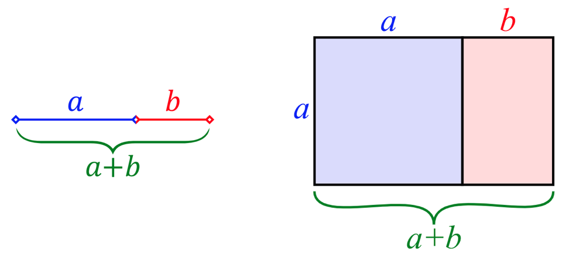
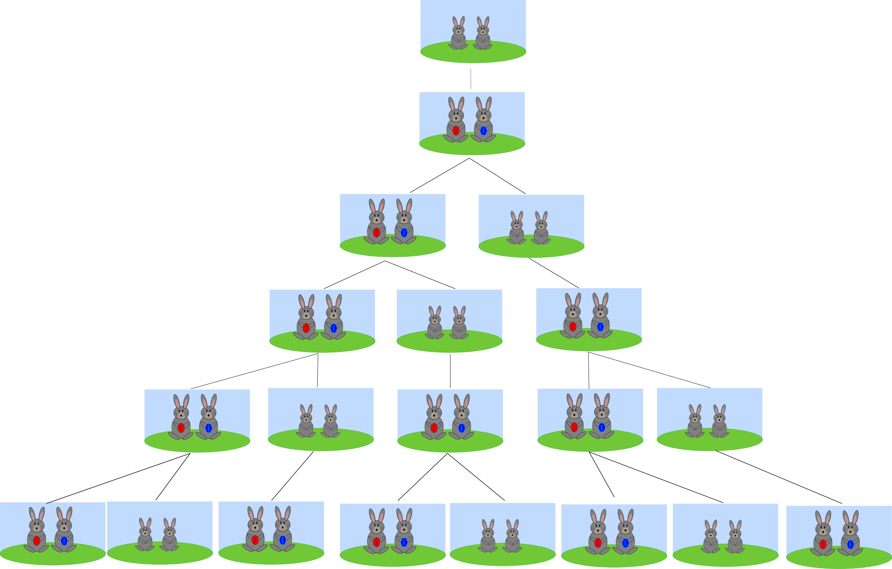
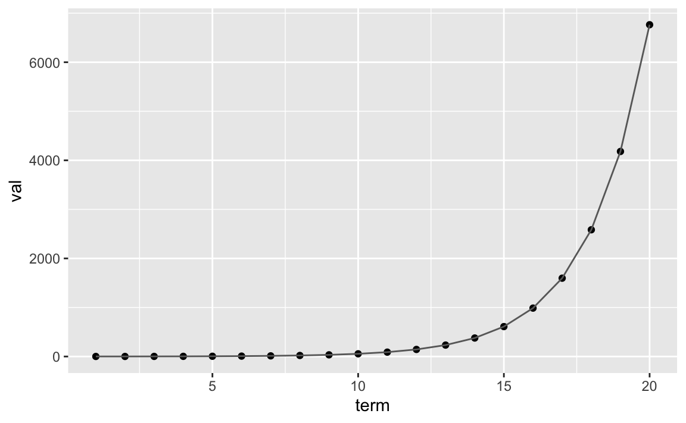
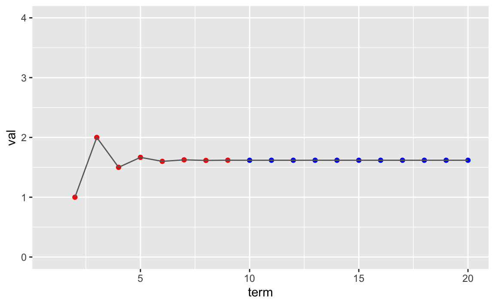
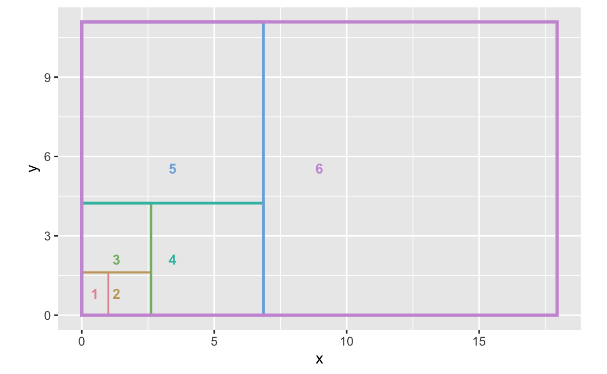
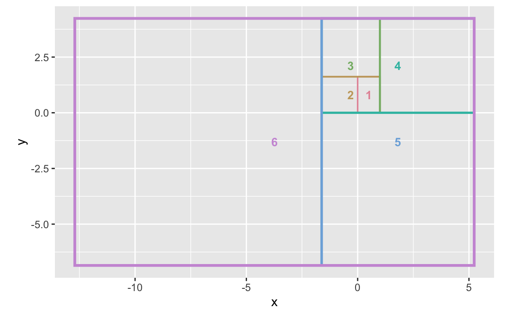
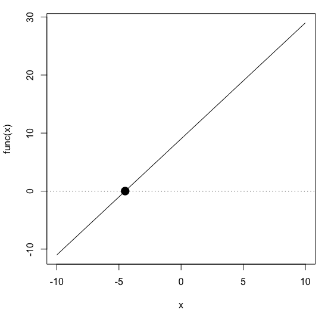

# 문자와 식  {#x-equation}

문자를 사용한 식으로 다양한 문제를 간결하고 명확하게 나타내고 문자를 사용한 식과 일차방정식의 풀이에 대하여 알아봅니다.

RStudio가 열려 있지 않으면 RStudio를 실행하고 메뉴에서 File >> Open Project…를 클릭하여 이전에 저장한 R 프로젝트 파일인 rmath01.Rproj을 찾아서 선택하고 Open 버튼을 클릭하여 이전에 작업하던 프로젝트 환경을 로딩합니다. 파일탐색기나  파인더에서 rmath01.Rproj 파일을 찾아서 더블 클릭하여도 RStudio가 실행되면서 작업하던 프로젝트 환경이 로딩됩니다. 프로젝트 환경이 로딩된 후에 RStudio 콘솔창에 ```getwd()```를 실행하여 작업 환경이 제대로 로딩되었는지 확인합니다. RStudio 환경이 잘 로딩되었으면, 이제 본격적으로 시작해 봅시다.


## 문자의 사용과 식의 계산 {#var-equation}

문자를 사용한 식을 어떻게 만들고 어떻게 풀어나가는 지에 대하여 알아보고, 일차식에 대하여 살펴봅니다. 

**\@ref(number-calc)장 수와 연산**에서 이미 살펴본 것과 같이, 자연수는 아래의 식과 같이 소수 (또는 소수의 거듭제곱)의 곱 형태로 분해될 수 있습니다. 

$$23 = {23}^{1}$$
$$24 = {2}^{3} \times {3}^{1}$$
$$252 = {2}^{2} \times {3}^{2} \times {7}^{1}$$
$$N = {P_1}^{r_1} \times {P_2}^{r_2} \times ⋯ \times {P_n}^{r_n}$$

$N$은 자연수, ${P_1}, {P_2}, ⋯, {P_n}$은 소인수 밑, ${r_1}, {r_2}, ⋯, {r_n}$은 거듭제곱의 지수를 나타냅니다. 소수 $23$을 위의 식에 대입하면 $23 = {23}^{1}$ 형태가 되므로, $N=23$, $n=1$, ${P_1}=23$, ${r_1}=1$이 됩니다. 합성수 $24$를 위의 식에 대입하면 $24 = {2}^{3} \times {3}^{1}$ 형태가 되므로, $N=24$, $n=2$, ${P_1}=2$, ${r_1}=3$, ${P_2}=3$, ${r_2}=1$이 됩니다. 

이와 같이 문자를 이용하면 숫자들 간의 관계를 하나의 간결한 식으로 나타낼 수 있으며, 자연수의 소인수분해는 ${P_1}, {P_2}, ⋯, {P_n}$과 ${r_1}, {r_2}, ⋯, {r_n}$을 찾아가는 과정입니다. 소인수분해 식 뿐만 아니라 다양한 사칙연산을 활용하여 숫자들 간의 관계를 아래와 같이 문자와 식으로 표현할 수 있습니다. 

- 밑변이 $a$이고 높이가 $h$인 삼각형의 넓이 $= \frac {a \times h}{2}$ 
- 현재 연도가 $x$일 때 20년 후의 연도 $= x + 20$
- 100개의 연필 중 $x$개 사용한 후 남은 연필의 개수 $= 100 - x$
- 유리수 $x$의 황금비율 $= 1.618 \times x$

이미 앞에서 다룬 소스코드에서 문자와 식을 많이 다룬 셈이지만 복잡한 형태로 사용된 부분이 많기 때문에, 문자와 식이 소스코드에서 어떻게 사용되는지 간단한 경우를 예로 들어서 다시 한번 살펴보겠습니다.


```r
y <- 1.618 * x  	#식이 성립하기 위해서는 먼저 x값을 입력해야 함 (임의 입력 후 추후 수정 가능)
## Error: object 'x' not found
```

```r
x <- 3				#자연수 3을 x라고 하고
y <- 1.618 * x  	#y값 구하는 식을 작성한 후,
y               	#y값 확인
```

```
## [1] 4.854
```

```r
x <- c(1,2,3,4,5)   #자연수 1,2,3,4,5를 가지는 벡터를 x라 하고
y <- 1.618 * x  	#y값 구하는 식을 작성한 후,
y               	#y값 확인
```

```
## [1] 1.618 3.236 4.854 6.472 8.090
```

```r
n <-20							 #20개 숫자 생성을 위해 20을 n이라 하고
a <- sample(1:10, n, replace=T)  #n개 임의의 자연수 벡터 a를 생성 (replace=T, 숫자 중복 허용)
b <- sample(1:10, n, replace=T)  #n개 임의의 자연수 벡터 b를 생성 (replace=T, 숫자 중복 허용)
area <- a*b                      #a, b를 양 변으로 하는 직사각형 넓이 구하는 식 작성
area							 #첫 번째 a값과 b값을 곱한 넓이, ..., n번째 a값과 b값을 곱한 넓이
```

```
##  [1] 27  9 40  2 42 25 40 42 81 90 50 21 45 63 45 18 72
## [18] 20 35 80
```

```r
#mutate() 함수와 %>% 연산자 사용을 위하여 dplyr 패키지 로딩
library(dplyr)
#a벡터와 b벡터를 컬럼으로 가지는 데이터 프레임 생성	
area_df <- data.frame(a,b)		 	
area_df <- area_df %>%
	#shape 컬럼 추가: 삼각형 't', 사각형 'r' 중에서 임의의 값을 가지도록 함
	mutate(shape=sample(c('t', 'r'), n, replace=T)) %>%
	#area 컬럼 추가: 사각형 (shape=='r')이면 a*b, 사각형이 아니면 a*b/2로 계산
	mutate(area=ifelse(shape=='r', a*b, a*b/2))
#area_df$area       #넓이값 확인
area_df[ ,"area"]	#넓이값 확인	
```

```
##  [1] 27.0  4.5 20.0  2.0 21.0 12.5 20.0 21.0 81.0 45.0
## [11] 25.0 10.5 22.5 63.0 45.0  9.0 72.0 20.0 35.0 80.0
```

R에서는 문자 (변수)에 숫자를 대입할 때, 하나의 숫자를 대입할 수도 있고 숫자 벡터를 대입할 수도 있습니다. 물론 문자나 문자열 (단어나 문장)을 변수에 대입할 수도 있습니다. 변수에 숫자를 대입하면 변수를 사용한 식의 결과도 숫자로, 변수에 벡터를 대입하면 변수를 사용한 식의 결과도 벡터가 됩니다. 

지금까지 문자를 사용한 식을 만들고 문자에 숫자를 대입하여 식의 값을 소스코드에서 어떻게 구해내는지 알아보았습니다. 문자 (변수)를 사용한 식의 계산에 초점을 맞추어, 위에서 언급한 숫자들 간의 관계 중에서 황금비율 (golden ratio, phi, $\phi$)에 대해서 조금 더 깊이 알아보도록 하겠습니다. 황금비율은 무엇인지, 황금비율을 가지는 숫자는 어떻게 찾아내고 시각화할 수 있는지 살펴봅시다. 

황금비율은 수학적으로 가장 아름답다고 여겨지는 비율로 약 $1:1.618$로 표현됩니다. 그림 \@ref(fig:golden-ratio-line-rectangle)에서와 같이 두 수가 $a > b > 0$을 만족하고 $\frac {a+b}{a} = \frac {a}{b}$의 관계를 가지면 두 수 $a$, $b$는 황금비율 ($a=1.618 \times b$)관계에 있다고 정의합니다. 

<div class="figure" style="text-align: center">

<p class="caption">(\#fig:golden-ratio-line-rectangle)두 선의 두 직사각형의 황금비율 관계 <font size="2">(출처 <https://en.wikipedia.org/wiki/Golden_ratio>)</font></p>
</div>

이 황금비율은 인체, 자연, 사진, 건축, 미술 등 모든 분야에서 찾아 볼 수 있습니다. 그림 \@ref(fig:golden-ratio-3)은 그리스 파르테논 (Parthenon) 신전, 레오나르도 다 빈치 (Leonardo da Vinci)가 그린 모나리자 (Mona Lisa), 현대의 사진 작품에서 발견되는 황금비율의 사례들을 보여줍니다. 

<div class="figure" style="text-align: center">

<p class="caption">(\#fig:golden-ratio-3)건축물, 미술품, 사진 작품에서 찾아볼 수 있는 황금비율 <font size="2">(출처 <https://www.geogebra.org/m/nmuaSXrK>)</font></p>
</div>

황금비율을 가지는 자연수들은 어떻게 찾을수 있을까요? $\frac {a+b}{a} = \frac {a}{b}$의 관계를 만족하는 두 자연수로 $55$, $34$가 있습니다.  $\frac {55+34}{55} = 1.618$이고 $\frac {55}{34} = 1.618$이기 때문에 황금비율 관계에 있습니다. $55+34$로 얻을 수 있는 $89$와 $55$도 황금비율이고 $89+55$로 얻을 수 있는 $144$와 $89$도 황금비율의 관계에 있습니다.

$$34{,} \; 55{,} \; 89{,} \; 144{,} \; \dots$$

이런 식으로 이전 두 숫자의 합으로 표현되는 무한히 진행되는 자연수를 얻어낼 수 있으며, 이러한 방법은 고대 인도인들에 의해 처음 고안되었습니다. 인도 밖에서는 이탈리아 수학자인 피보나치 (Fibonacci, R. 1170~1250)가 $1202$년에 출간한 수학책에서 처음 소개되었기 때문에, 이러한 숫자들을 피보나치의 수 (Fibonacci numbers)라고 부릅니다.

피보나치의 수는 아래와 같이 $1$, $1$로 부터 시작하여 이전 두 숫자의 합인 $1+1=2$, $1+2=3$, $2+3=5$, $3+5=8$,…로 이어집니다.

$$1 {,}  \; 1 {,}  \; 2{,} \; 3{,} \; 5{,} \; 8{,} \; 13{,} \; 21{,} \; 34{,} \; 55{,} \; 89{,} \; 144{,} \; \dots$$

피보나치는 이러한 숫자들을 토끼의 개체 수 증가를 예로 들어 설명하였습니다. 1) 한 쌍의 아기 토끼는 한 달 후 한 쌍의 어른 토끼가 됩니다. 2) 한 쌍의 어른 토끼는 한 달에 한번 한 쌍의 아기 토끼를 낳습니다. 3) 토끼들은 죽지 않습니다. 이 세가지 조건이 주어지면 토끼의 개체 수는 점점 증가합니다. 태어난 한 쌍의 아기 토끼는 한 달 후 어른 토끼가 되고 그 다음 달부터 한 달에 한번 한 쌍의 아기 토끼를 낳습니다. 아기 토끼 한 쌍에서 시작해서 한 달 후에는 어른 토끼 한 쌍이 되고, 두 달 후에는 어른 토끼 한 쌍과 아기 토끼 한 쌍이, 다섯 달 후에는 총 여덟 쌍의 토끼가 됩니다 (그림 \@ref(fig:FibonacciRabbit)).  
  
<div class="figure" style="text-align: center">

<p class="caption">(\#fig:FibonacciRabbit)토끼 개체 수를 이용한 피보나치 수의 설명 <font size="2">(출처 <https://en.wikipedia.org/wiki/Fibonacci_number>)</font></p>
</div>
  
20개의 피보나치 수를 소스코드로 구해보겠습니다. 처음에는 $1$, $1$로 시작하고 3번째 수부터는 이전 두 수의 합 (두 수를 수식의 문자 (변수)에 대입하여 계산)으로 구합니다.


```r
len <- 20               #생성할 피보나치 수의 개수 설정
term <- c(1:len)		#첫 번째 부터 스무 번째까지 순서를 매기는 벡터 생성 	
fibval <- numeric(len)  #20개의 피보나치 수를 가지는 벡터 생성 (초기값 0, 0을 20개 가지는 벡터)
fibval[1] <- 1      ##첫 번째 피보나치 수에 1을 대입
fibval[2] <- 1      #두 번째 피보나치 수에 1을 대입 
for (i in 3:len) {  #세 번째 피보나치 수 부터 20번째 피보나치 수까지 이전 두 수를 수식에 대입  
   fibval[i] <- fibval[i-1] + fibval[i-2]
} 
print(fibval)       #20개의 피보나치 수 계산 결과 확인
```

```
##  [1]    1    1    2    3    5    8   13   21   34   55
## [11]   89  144  233  377  610  987 1597 2584 4181 6765
```

아래의 소스코드는 ```fibval```벡터에 저장되어있는 $20$개의 피보나치 수의 크기 증가 패턴을 그래프로 표현한 것입니다. 열여덟번째 피보나치 수는 $2000$보다 큰 값을, 열아홉 번째 피보나치 수는 $4000$보다 큰 값을, 스무 번째 피보나치 수는 $6000$보다 큰 값을 가집니다. 피보나치 수는 이전 수의 $1.618$배로 증가하기 때문에 뒤로 갈수록 수의 증가 폭이 커지게 됩니다 (그림 \@ref(fig:Fibonacci-numbers-graph)).  


```r
library(ggplot2)
fib_df <- data.frame(term=1:len, val=fibval)
ggplot(fib_df, aes(x=term, y=val)) +        
   geom_point() + 
	geom_line(color='dimgray') 
```
  
<div class="figure" style="text-align: center">

<p class="caption">(\#fig:Fibonacci-numbers-graph)피보나치 수의 증가 패턴</p>
</div>

이렇게 구해진 피보나치 수를 이용해서 각 수의 이전 숫자와의 비율도 손쉽게 계산해 볼 수 있습니다. 첫 번째 수는 이전 수가 존재하지 않기 때문에 아래 소스코드와 같이 두 번째 수부터 ```for```루프를 이용하여 각 수의 비율을 구해냅니다. 이 또한 문자를 사용한 식에 문자 대신 수를 대입하여 식의 값을 구하는 과정을 거칩니다. 


```r
fibratio <- numeric(len-1)
fibratio[1] <- NA
for (i in 2:(len)) { 
   fibratio[i] <- fibval[i]/fibval[i-1] 
} 
```

```r
fib_ratio_df <- data.frame(term=1:length(fibratio), val=fibratio)
ggplot(fib_ratio_df, aes(x=term, y=val)) +        
   geom_point(color=ifelse(round(fibratio,3) == 1.618, 'blue', 'red') ) +
   geom_line(color='dimgray') +  
   ylim(0, 4) + 
   theme(legend.position = "none") 
```

구해진 비율을 그래프로 나타내면  그림 \@ref(fig:Fibonacci-golden-ratio-graph)와 같습니다. 비율의 수치가 오르락 내리락 하다가 열 번째 수부터 비율이 일정하게 나타납니다. 

<div class="figure" style="text-align: center">

<p class="caption">(\#fig:Fibonacci-golden-ratio-graph)각 피보나치 수의 증가 비율</p>
</div>

구해진 피보나치 수의 비율 중 마지막 수가 가장 황금비율에 가깝다고 보고 스무 번째 수의 비율을 확인해 보면 다음과 같습니다. 


```r
## 벡터의 마지막 값을 가져오는 다양한 방법들
#fibratio[length(fibratio)]
#tail(fibratio, n=1)
#dplyr::last(fibratio)
#fibratio[end(fibratio)[1]]
#rev(fibratio)[1]
golden_ratio <- fibratio[len-1] #(1+sqrt(5))/2
print(paste0('황금비율 = ', golden_ratio))
```

```
## [1] "황금비율 = 1.61803405572755"
```

```r
print(paste0('황금비율 (소숫점 세째자리까지) = ', round(golden_ratio, 3)))  #소수점 세째자리 까지만
```

```
## [1] "황금비율 (소숫점 세째자리까지) = 1.618"
```

이렇게 황금비율에서 피보나치 수를 거쳐 다시 황금비율로 돌아왔습니다. 황금비율을 가지고 그림 \@ref(fig:golden-ratio-3)에서 파르테논 신전 위에 그려졌던 황금비율 사각형들을 그리는 소스코드를 생성하여 보겠습니다. 여섯 개의 직사각형 양 변의 길이 값을 저장할 ```x```, ```y```벡터를 생성하고  ```i```번째 사각형의 작은 변의 길이를 ```i-1```번째 사각형 큰 변의 길이로, ```i```번째 사각형의 큰 변의 길이는 같은 사각형 작은 변의 $1.618$배로 설정합니다. 사각형의 두 변 벡터를 가지고 데이터 프레임을 생성한 후, ```ggplot```의 ```geom_rect```함수를 이용하여 사각형을 그립니다.    


```r
n <- 6
x <- numeric(n)
y <- numeric(n)
turn <- rep(c(1, 0), length.out = n)
x[1] <- 1
y[1] <- x[1] * golden_ratio
for (i in 2:n) {	
	if(turn[i] == 1) {
		x[i] = x[i-1]
		y[i] = x[i] * golden_ratio
	} else {
		y[i] = y[i-1]
		x[i] = y[i] * golden_ratio
	}
}
d=data.frame(x1=0, x2=x, y1=0, y2=y, r=1:n)
ggplot(data=d) + 
	scale_x_continuous(name="x") + 
	scale_y_continuous(name="y") +
	geom_rect(aes(xmin=x1, xmax=x2, ymin=y1, ymax=y2), 
		fill = 'NA', color = colorspace::rainbow_hcl(n), 
			size= 0.5 + 0.1 * (1:n), alpha= 0.5) +
	geom_text(aes(x=x1+(x2-x1)/2, y=y1+(y2-y1)/2, label=r), 
		color = colorspace::rainbow_hcl(n), size=3.5, fontface = "bold") +
	coord_fixed(ratio = 1)
```

작은 변의 길이가 $1$인 첫 번째 피보나치 사각형부터 큰 변의 길이가 $1 \times {1.618}^{6}$인 여섯 번째 피보나치 사각형까지를 그래프로 표현하면  그림 \@ref(fig:golden-ratio-rect1)과 같습니다. 그래프에 그려진 여섯 개의 사각형들의 배치가 그림 \@ref(fig:golden-ratio-3)의 그리스 파르테논 신전 위에 그려졌던 황금비율 사각형들과는 다릅니다. 위의 소스코드에는 사각형의 시작점을 한 점으로 일치시켰기 때문입니다. 파르테논 신전 위의 황금비율 사각형들과 같은 배치를 얻으려면 첫 번째 사각형을 기준으로 나선형 구조의 배치가 이루어져야 합니다. 


<div class="figure" style="text-align: center">

<p class="caption">(\#fig:golden-ratio-rect1)피보나치 사각형</p>
</div>

아래의 소스코드와 같이 각 사각형의 시작점을 이전 사각형으로 부터의 상대 거리로 계산해서 나선형으로 설정하면 원하는 그림을 얻을 수 있습니다. 아래 소스코드의 ```#### 피보나치 사각형 (나선형 배치) 로직 시작 ####```과 ```#### 피보나치 사각형 (나선형 배치) 로직 종료 ####```사이에 있는 소스코드가 사각형 나선형 배치 로직 부분인데, 이 부분은 이해하기 어려울 수 있습니다. 머리를 싸매고 이해하려 하지 말고 그냥 쿨하게 복사해서 붙여 넣으세요. 


```r
n <- 6
x1 <- numeric(n)
y1 <- numeric(n)
x2 <- numeric(n)
y2 <- numeric(n)
dx <- numeric(n)
dy <- numeric(n)
turn <- rep(c(1,2,3,4), length.out = n)
x2[1] <- 1
y2[1] <- x2[1] * golden_ratio
#### 피보나치 사각형 (나선형 배치) 로직 시작 ################
dx[1] <- x2[1] - x1[1]
dy[1] <- y2[1] - y1[1] 
for (i in 2:n) {	
	if(turn[i] %% 2 == 1) {
		dx[i] = dx[i-1]
		dy[i] = dx[i] * golden_ratio
	} else {
		dy[i] = dy[i-1]
		dx[i] = dy[i] * golden_ratio
	}
	if(turn[i] == 1) {
		x1[i] <- x1[i-1] 
		y1[i] <- y2[i-1] - dy[i]
	} else if(turn[i] == 2) {
		x1[i] <- x2[i-1] - dx[i]
		y1[i] <- y1[i-1]
	} else {
		x1[i] <- x1[i-1] 
		y1[i] <- y1[i-1]
	} 
	x2[i] <- x1[i] + dx[i]
	y2[i] <- y1[i] + dy[i]
}
#### 피보나치 사각형 (나선형 배치) 로직 종료 ################
d=data.frame(x1=x1, x2=x2, y1=y1, y2=y2, r=1:n)
saveRDS(d, 'Fibonacci_rectangle_df.rds')  #데이터 프레임 저장
#한번 저장한 후에는 현재 작업 디렉토리에서 데이터 파일 로딩
#d <- readRDS(file = "Fibonacci_rectangle_df.rds")
ggplot(d) + 
	scale_x_continuous(name="x") + 
	scale_y_continuous(name="y") +
	geom_rect(aes(xmin=x1, xmax=x2, ymin=y1, ymax=y2), 
		fill = 'NA', color = colorspace::rainbow_hcl(n), 
			size= 0.5 + 0.1 * (1:n), alpha=0.5) +
	geom_text(aes(x=x1+(x2-x1)/2, y=y1+(y2-y1)/2, label=r), 
		color = colorspace::rainbow_hcl(n), size=3.5, fontface = "bold") +
	coord_fixed(ratio = 1)
```

위의 피보나치 사각형 (나선형 배치) 소스코드를 이용하면  \@ref(fig:golden-ratio-rect2)과 같이 그리스 파르테논 신전 위에 그려졌던 황금비율 사각형들과는 동일한 피보나치 사각형을 그래프로 그려볼 수 있습니다. 

<div class="figure" style="text-align: center">

<p class="caption">(\#fig:golden-ratio-rect2)피보나치 사각형 (나선형 배치)</p>
</div>

지금까지 문자와 식의 표현이 소스코드에 어떻게 적용되는지 알아보았습니다. 소스코드 자체가 변수 선언과 식의 사용, 반복문과 함수 등을 통한 식의 계산을 포함하기 때문에, 문자를 사용한 식과 그 식의 계산은 이 책의 시작부터 별도의 설명 없이 반복적으로 다루어 진 내용이긴 합니다. 하지만, \@ref(var-equation)절에서는 좀 더 간단한 예를 들어서 문자에 숫자를 대입하고 식을 계산하는 소스코드들을 살펴보았습니다. 또한 그 과정에서 황금비율과 피보나치 수에 대해서도 알아보고 그리스 파르테논 신전의 구조와 일치하는 피보나치 사각형도 그려보았습니다. 

이제 일차식과 일차방정식의 뜻과 계산 방법에 대하여 알아봅시다.

## 일차식과 일차방정식

앞서 살펴본 것처럼 식에서는 문자와 수의 다양한 사칙연산이 가능합니다. 우리가 종이와 연필로 식을 계산할 때는 $1.618 \times x$와 같이 숫자와 문자의 곱 형태에서는 곱셈 기호를 생략하고 $1.618x$로, $y ÷ 1.618$와 같이 숫자와 문자의 나눗셈 형태에서는 $\frac{y}{1.618}$와 같이 분수의 형태로 나타내어 식을 좀 더 간단히 표현합니다. 하지만, 소스코드에서는 $1.618x$와 같은 곱셈 표현의 생략은 불가능하고 $1.618 \times x$는 ```1.618 * x```로 표현하고, $y ÷ 1.618$과 같은 나눗셈의 표현은 분수와 비슷한 형태인 ```y / 1.618```로 표현합니다.

$1.618x + 1$과 같이 숫자와 문자의 곱 또는 숫자의 합 형태로 표현되는 식의 경우, 합형태를 이루는 부분인 $1.618x$와 $1$을 **항**이라 부르고, $1$과 같이 숫자로만 이루어진 항을 **상수항** (항상 같은 수인 항)이라고 합니다. $1.618x$과 같이 문자가 포함된 항의 경우, 문자 $x$와 곱의 관계에 있는 $1.618$을 $x$의 **계수** (coefficient)라고 합니다. 또한, $1.618x + 1$과 같이 항이 두 개 이상인 식을 **다항식**이라 하고 $1.618x$와 같이 하나의 항으로 이루어진 식을 **단항식**이라고 합니다.

$-1.618x +y - 1$와 같이 뺄셈이 포함된 세 개의 항을 가진 다항식의 경우 $(-1.618x) +y + (-1)$와 같이 합 형태의 식으로 변환한 다음에 각 항을 설명할 수 있습니다. 이 식의 각 항은 $-1.618x$, $y$, $-1$이고 상수항은 $-1$입니다. $x$의 계수는 $-1.618$이고  $y$는 $1y$이므로 $y$의 계수는 $1$입니다.


$-1.6x^2 +3x - 1$식의 첫 항의 경우 $x$의 거듭제곱 형태로 되어있고 풀어서 쓰면 $-1.6 \times x \times x$와 같이 $x$가 두 번 곱해진 형태이므로 첫 항의 **차수**는 $2$입니다. 식에서 문자가 포함된 항들 중 가장 차수가 큰 항의 계수가 $2$인 식을 **이차식**이라고 하고, 식에서 문자가 포함된 항의 차수가 $1$인 경우 **일차식**이라고 합니다.

일차식의 계산은 **동류항** (문자와 차수가 같은 항과 상수항)을 모으고 사칙연산의 교환법칙, 결합법칙, 분배법칙 등을 이용하여 식을 단순화하는 방식으로 풀어나가게 됩니다.

식 $3a + 4 + 2a - 2$의 경우에 소스코드에서는 곱셈 기호 ```*```를 이용하여 ```3*a + 4 + 2*a - 2```와 같이 표현합니다. 식으로는 아래의 소스코드와 같이 표현됩니다.


```r
xs <- "2*a + 5 + 4*a - 1"  #문자열 생성
xexpr <- parse(text=xs)    	#문자열을 식으로 변환
#or 
xexpr <- expression(2*a + 5 + 4*a -1)  #식 직접 생성
print(xexpr[[1]])					   #표현식 안에 저장된 첫 번째 리스트값을 확인	
```

```
## 2 * a + 5 + 4 * a - 1
```

위의 일차다항식을 단순화를 하기 위해서 아래 소스코드와 같이 ```Deriv```패키지의 ```Simplify()```함수를 사용할 수 있습니다. 


```r
#install.packages("Deriv")
library(Deriv)
xexpr <- Simplify(xexpr)  #식 단순화		
print(xexpr)			  #식 확인		
```

```
## expression(4 + 6 * a)
```

```r
print(xexpr[[1]])		  #식에 저장된 첫 번째 리스트값을 확인	
```

```
## 4 + 6 * a
```

단순해 진 식은 ```4 + 6 * a```의 형태입니다. 이 식의 문자 (변수) ```a```에 숫자가 대입된다면 소스코드 차원에서 어떤 순서로 계산되는 지 확인해 봅시다. 
 

```r
myexpr <- xexpr[[1]]
myexpr[[1]]				#두 값을 더한다.
## `+`
myexpr[[2]]				#첫 번째 값
## [1] 4
myexpr[[3]]				#두 번째 값
## 6 * a
```

아래와 소스코드와 같이 식 ```4 + 6 * a```의 문자 ```a```에 숫자 $3$을 대입하고 식을 계산하여 값을 구해볼 수도 있습니다.


```r
a<-3		 #문자 a에 숫자 3을 대입	
eval(xexpr)  #식 4 + 6 * a을 이용하여 실제 계산 수행	
```

```
## [1] 22
```

두 개의 식의 값이 같다는 수학 기호인 등호 ($=$)로 묶어서 하나의 식으로 만든 식을 **등식**이라 하고, 등호의 왼쪽 식을 **좌변**, 오른쪽 식을 **우변**이라고 합니다. 좌변과 우변을 합하여 **양변**이라고 부릅니다.

등식 $x + 3 = 5$와 같이 문자 $x$를 포함하는 항이 있는 경우에 $x$의 값에 따라 이 등식은 참이 되기도 거짓이 되기도 합니다. 이러한 경우의 등식을 $x$에 대한 **방정식**이라 하고 $x$를 이 방정식의 **미지수**라고 합니다. 이 방정식이 참이 되도록 하는 미지수의 값을 이 방정식의 **해** 또는 **근**이라고 합니다. 

아래의 소스코드를 이용하여 방정식 $x + 3 = 5$의 미지수 $x$에 $1$부터 $5$까지 숫자를 대입해 보면서 방정식이 참이 되는지 거짓이 되는지 확인해 보도록 하겠습니다. 방정식 문자열로부터 등호를 기준으로 문자열을 이등분하여 각 양변 문자열을 구하고 난 후, 첫 번째 문자열을 좌변으로 두 번째 문자열을 우변으로 설정합니다. 새로운 데이터 프레임을 생성하고 ```for()```루프를 이용하여 네 개의 컬럼값을 가지는 레코드를 한 줄씩 추가합니다.


```r
#install.packages("stringr")
library(stringr)     #str_replace_all() 함수를 사용하기 위한 패키지 로딩
equation <- 'x+3=5'  #식
sides <- strsplit(equation, "=")  #등호로 양변을 구분
sides <- sides[[1]]  #양변
leftside <- sides[1] #좌변
rightside <-sides[2] #우변
x_df <- data.frame(x=integer(), left=integer(), right=integer(), equal=logical())
for (x in 1:5) {
	left<- str_replace_all(leftside, "[x]", as.character(x))  #좌변에 숫자 대입한 식
	right <- rightside                                        #우변은 상수 식
	leftvalue <- eval(parse(text=left))                       #좌변 계산
	rightvalue <- eval(parse(text=right))                     #우변 계산
	equal <- ifelse(leftvalue == rightvalue, TRUE, FALSE)     #좌변과 우변 값 비교
	x_df <- rbind( x_df, data.frame(x, left, right, equal))   #데이터 프레임에 한 줄 추가
}
x_df  #데이터 프레임 결과 확인         
```

```
##   x left right equal
## 1 1  1+3     5 FALSE
## 2 2  2+3     5  TRUE
## 3 3  3+3     5 FALSE
## 4 4  4+3     5 FALSE
## 5 5  5+3     5 FALSE
```

이렇게 구해진 데이터 프레임 ```x_df```로 부터 $x=2$일 때 이 방정식이 참이 되므로 $x=2$가 이 방정식의 해가 되는 것을 알 수 있습니다. 아래의 소스코드와 같이 ```kable```패키지를 이용하면 ```x_df```데이터 프레임을 우리가 웹페이지나 책에서 보는 표의 형태로 만들 수도 있습니다 (표 \@ref(tab:equation-x35)). 이 책에 나오는 대부분의 표들도 ```kable```패키지를 사용하여 만들어 졌습니다. 


```r
#install.packages("dplyr")
library(dplyr)
#install.packages("kableExtra")
library(kableExtra)
knitr::kable(
  x_df,
  col.names = c('x의 값', '좌변 x+3', '우변 5', '참/거짓'), #표 컬럼 이름 설정
  booktabs = TRUE, align = "c",                        #표 위치 설정
  caption = '방정식에 x값을 대입한 결과'             #표 제목 설정
) %>% kable_styling(full_width=FALSE,font_size=15)                #표 컬럼 간격 설정
```

<table class="table" style="font-size: 15px; width: auto !important; margin-left: auto; margin-right: auto;">
<caption style="font-size: initial !important;">(\#tab:equation-x35)방정식에 x값을 대입한 결과</caption>
 <thead>
  <tr>
   <th style="text-align:center;"> x의 값 </th>
   <th style="text-align:center;"> 좌변 x+3 </th>
   <th style="text-align:center;"> 우변 5 </th>
   <th style="text-align:center;"> 참/거짓 </th>
  </tr>
 </thead>
<tbody>
  <tr>
   <td style="text-align:center;"> 1 </td>
   <td style="text-align:center;"> 1+3 </td>
   <td style="text-align:center;"> 5 </td>
   <td style="text-align:center;"> FALSE </td>
  </tr>
  <tr>
   <td style="text-align:center;"> 2 </td>
   <td style="text-align:center;"> 2+3 </td>
   <td style="text-align:center;"> 5 </td>
   <td style="text-align:center;"> TRUE </td>
  </tr>
  <tr>
   <td style="text-align:center;"> 3 </td>
   <td style="text-align:center;"> 3+3 </td>
   <td style="text-align:center;"> 5 </td>
   <td style="text-align:center;"> FALSE </td>
  </tr>
  <tr>
   <td style="text-align:center;"> 4 </td>
   <td style="text-align:center;"> 4+3 </td>
   <td style="text-align:center;"> 5 </td>
   <td style="text-align:center;"> FALSE </td>
  </tr>
  <tr>
   <td style="text-align:center;"> 5 </td>
   <td style="text-align:center;"> 5+3 </td>
   <td style="text-align:center;"> 5 </td>
   <td style="text-align:center;"> FALSE </td>
  </tr>
</tbody>
</table>

등식의 양변에 같은 수를 더하거나 빼거나 곱하거나 0이 아닌 수로 나누어도 등식은 성립하기 때문에, 등식의 한 변에 있는 항을 부호를 바꾸어 다른 변으로 옮기는 방식 (이항)으로 식을 정리하고 동류항 끼리 정리하는 방식으로 식을 풀어나가게 됩니다. 우변의 모든 항을 좌변으로 옮겨서 $x$에 대한 일차식 $= 0$의 형식으로 표현한 방정식을 $x$에 대한 **일차방정식**이라고 합니다.    

연필과 종이로 일차방정식을 풀 때에는 미지수를 포함하는 항은 좌변으로 상수항은 우변으로 이항하고 동류항을 정리하는 방식으로 식을 풀어나가게 되지만, 소스코드 상에서는 우변의 모든 항을 좌변으로 옮겨서 $x$에 대한 일차식$ = 0$으로 표현한 일차방정식의 형태로 해를 구하게 됩니다.

등식 $3x + 10 = x + 1$이 주어진 경우, 아래의 소스코드를 이용하면 일차방정식 형태로 이항하고 해를 구해볼 수 있습니다. 표 \@ref(tab:equation-x35)에서 방정식에 $x$값을 1부터 5까지 대입해보면서 해를 구한 것과는 달리 아래 소스코드에서는 일차방정식과 미지수 $x$의 계수를 활용하여 해를 구합니다. 일차방정식 $ax + b$의 경우 미지수에 $0$을 대입한 결과는 $b$, 미지수 $x$의 계수는 $a$이므로 방정식의 해를 구하는 공식은 $- \frac{b}{a}$이며 아래 소스코드에서는  ```x <- - f(0)/df(0)```로 표현되어 있습니다. 소스코드의 ```x <- x0 - f(x0)/df(x0)``` 부분은 일반방정식의 수치해석 해법으로 사용되는 뉴튼 방법 (Newton's method)이기 때문에 반복문만 추가하면 높은 차수의 방정식 해를 구하는 데에도 사용할 수 있습니다. 하지만, 뉴튼 방법은 중등 수학 과정에서는 다루지 않으므로 나중에 배우겠구나 정도로 생각하고 넘어가면 됩니다. 


```r
library(Deriv)
library(stringr)     #str_replace_all() 함수를 사용하기 위한 패키지 로딩
equationString <- '3*x + 10 = x + 1'    #식 문자열
sides <- strsplit(equationString, "=")  #등호로 양변을 구분
sides <- sides[[1]]  #리스트의 첫 번째 공간에 저장되어있는 양변을 가져옴
leftside <- sides[1] #좌변
rightside <-sides[2] #우변
rightside <- paste('-(', rightside, ')')  #우변의 등호를 바꿈
leftside <- paste(leftside, rightside)    #우변을 좌변으로 이항
equation <- parse(text=leftside)    	  #문자열을 식으로 변환
F <- Simplify(equation)                   #식 단순화	
f <- function(x){ eval(F[[1]]) }          #일차방정식을 숫자 대입한 형태의 함수로 변환     
dF <-  D(F, "x")                          #일차방정식 미지수 x의 계수 얻기
df <- function(x){ eval(dF[[1]]) }  	  #계수는 상수이므로 dF와 df의 반환값은 같음	
x0 <- 0
x <- x0 - f(x0)/df(x0)					  #	
print(paste0('x0값이 ', x0, '일 때의 x값: ', x))
```

```
## [1] "x0값이 0일 때의 x값: -4.5"
```

```r
x0 <- 10
x <- x0 - f(x0)/df(x0)
print(paste0('x0값이 ', x0, '일 때의 x값: ', x))
```

```
## [1] "x0값이 10일 때의 x값: -4.5"
```

```r
x <- - f(0)/df(0)
print(paste0('x0값에 0을 대입하여 수식을 단순화 했을 때의 x값: ', x))
```

```
## [1] "x0값에 0을 대입하여 수식을 단순화 했을 때의 x값: -4.5"
```

위의 소스코드 중에서 ```df(0)```는 미지수의 계수이고,  ```f(0)```는 일차방정식의 상수항입니다. 미지수를 좌변으로 상수항을 우변으로 하는 등식인 $ax = b$ 형태로 표현한 후 ```solve(a, b)```함수를 이용해도 방정식의 해를 구할 수 있습니다.


```r
a <- df(0)
b <- -f(0)
solve(a, b)
```

위의 소스코드 중에서 ```F```는 미지수 $x$에 대한 일차방정식입니다. ```rootSolve```패키지를 이용하면 일차방정식의 해 뿐만 아니라 고차방정식 (비선형방정식)의 해도 구해볼 수 있습니다. 아래 소소코드를 한 줄 한 줄 실행해보면서 그림 \@ref(fig:rootSolve)과 같은 결과가 나오는지 확인해 보세요.


```r
#install.packages("rootSolve")
library(rootSolve)
F                 
func <- function(x){ eval(F[[1]]) } 
curve(func(x), -10, 10) 
abline(h = 0, lty = 3)                 #y=0인 직선을 그래프에 표시 
uni <- uniroot(func, c(-10, 10))$root  #해를 구함
points(uni, 0, pch = 16, cex = 2)      #해를 그래프에 표시
```

<div class="figure" style="text-align: center">

<p class="caption">(\#fig:rootSolve)rootSolve 패키지를 이용한 일차방정식의 해</p>
</div>

이번 장에서는 문자를 사용한 식, 일차식, 등식, 방정식, 일차방정식 등을 다루면서 황금비율과 피보나치 수, 피보나치 사각형에 대하여 알아보고 소스코드에서 일차방정식의 좌변, 우변, 이항, 숫자 대입, 해 구하기 등이 소스코드로 어떻게 구현되는지 알아보았습니다. 이제 **\@ref(coordinates-graph)장 좌표평면과 그래프**에 대하여 본격적으로 알아봅시다. 

