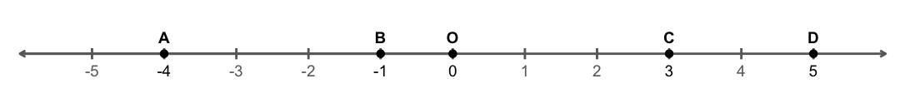
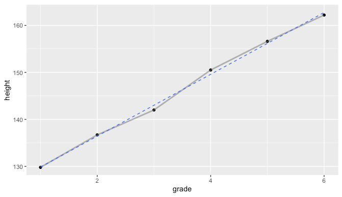
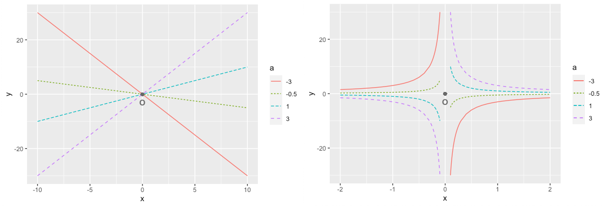

# 좌표평면과 그래프 {#coordinates-graph}

특정 위치를 나타내거나 두 문자 (변수)간의 관계를 시각적으로 표현하는데 유용한 좌표평면과 그래프에 대해서 알아봅니다.

RStudio가 열려 있지 않으면 RStudio를 실행하고 메뉴에서 File >> Open Project…를 클릭하여 이전에 저장한 R 프로젝트 파일인 rmath01.Rproj을 찾아서 선택하고 Open 버튼을 클릭하여 이전에 작업하던 프로젝트 환경을 로딩합니다. 파일탐색기나  파인더에서 rmath01.Rproj 파일을 찾아서 더블 클릭하여도 RStudio가 실행되면서 작업하던 프로젝트 환경이 로딩됩니다. 프로젝트 환경이 로딩된 후에 RStudio 콘솔창에 ```getwd()```를 실행하여 작업 환경이 제대로 로딩되었는지 확인합니다. RStudio 환경이 잘 로딩되었으면, 이제 본격적으로 시작해 봅시다.


## 순서쌍과 좌표 {#pair-coordinates}

직선 상에 대응하는 한 점을 대표하는 숫자를 그 점의 **좌표**라고 하고, 점들의 좌표를 기호로 표현할 수 있습니다. 직선 상의 다섯 개의 점 $A$, $B$, $O$, $C$, $D$의 각 좌표가 $-4$, $-1$, $0$, $3$, $5$라고 하면, 이를 기호로 $A(-4)$, $B(-1)$, $O(0)$, $C(3)$, $D(5)$ 와 같이 표현합니다. 이를 소스코드로 작성해보면 아래와 같습니다.


```r
#직선 상의 점들 이름과 좌표 벡터 생성
xtext <- c('A', 'B', 'O', 'C', 'D')  #점 이름 벡터
x <- c(-4, -1, 0, 3, 5)              #점 벡터      
#각 점의 좌표를 기호로 표현
coordinateVector <- paste0(xtext, '(', x, ')')           #점 이름과 좌표를 합한 벡터
coordinateString <- paste(paste0(coordinateVector,collapse=", ")) #문자열로 변형
print(paste('각 점의 좌표를 기호로 표현:', coordinateString))
```

```
## [1] "각 점의 좌표를 기호로 표현: A(-4), B(-1), O(0), C(3), D(5)"
```

이제, 위의 소스코드에서 생성된 ```xtext```, ```x```벡터를 이용하여 수직선 상에 점들을 그려보겠습니다. \@ref(prime-factor)절의 그림 \@ref(fig:numbers-ontheline)를 만드는데 사용된 소스코드를 조금 수정하고 세 단계로 나누어 작성된 아래의 소스코드를 이용하면 직선 위에 다섯 개의 점과 점들의 좌표를 그려볼 수 있습니다.

1. ```ggplot``` 그래프에 다섯 개의 점을 추가합니다.


```r
library(ggplot2)    #ggplot 그래프 생성을 위한 패키지 로딩
xaxis <- seq(-5,5)  #직선 벡터
p1 <- ggplot() +    #데이터 프레임 없이 각 그래프 요소에서 벡터를 사용하여 그래프 생성
  ylim(min(xaxis), max(xaxis)) +  #x축과 y축 폭을 동일하게 설정
  #각 점 추가 
  geom_point(aes(x=x, y=0), alpha=1.0, size=1.5, color='black') + #mycolor2 )  +
  #각 점 이름 추가
  geom_text(aes(x=x, y=0.3, label=xtext), color="black", size=3.5, fontface = "bold")
p1  #그래프 확인
```

2. ```ggplot``` 그래프에 필요 없는 축 정보 등을 보이지 않도록 설정합니다.


```r
p2 <- p1 + 
  #필요 없는 축 정보 등을 모두 보이지 않도록 설정 
  theme_void() 
p2  #그래프 확인       
```

3. ```ggplot``` 그래프에 직선과 좌표 눈금을 추가합니다.


```r
p3 <- p2 + 
  #직선 (좌표축) + 오른쪽 화살표 추가
  annotate("segment",x=min(xaxis)-1,xend=max(xaxis)+1, y=0, yend=0, 
  	size=0.5, color='dimgray', arrow=arrow(length=unit(0.2,"cm"))) +
  #직선 (좌표축) 왼쪽 화살표 추가
  annotate("segment",x=0,xend=min(xaxis)-1, y=0, yend=0, 
  	size=0.5, color='dimgray', arrow=arrow(length=unit(0.2,"cm"))) +
  #직선에 눈금 추가
  annotate("segment",x=xaxis,xend=xaxis, y=-0.1, yend=0.1, 
  	size=0.2, color=ifelse(xaxis %in% x, 'black', 'dimgray')) +
  #직선 눈금 밑에 좌표 추가
  geom_text(aes(x=xaxis, y=-0.3, label=xaxis), 
  	size=3.5, color=ifelse(xaxis %in% x, 'black', 'dimgray'))
p3  #그래프 확인
```

위의 소스코드에서 ```p1```, ```p2```, ```p3```를 구하는 과정을 거쳐서 그림 \@ref(fig:coordinates-1axis)이 생성되었습니다. RStudio의 콘솔창에서 ```p1```, ```p2```, ```p3```를 각각 실행해보며 그래프의 변화를 확인해 봅시다.

<div class="figure" style="text-align: center">

<p class="caption">(\#fig:coordinates-1axis)1차원 직선 위에 표현한 다섯 점의 좌표</p>
</div>

지금까지는 $x$축 하나의 좌표축 만을 이용한 직선 상의 좌표에 대하여 알아보았습니다. 두 개 또는 세 개의 좌표축이 각각 90도를 이루도록 배치하면 이차원 평면공간 또는 삼차원 입체공간의 좌표를 표현할 수 있습니다. 두 개의 좌표축 (가로축 $x$축, 세로축 $y$축)을 포함하는 이차원 평면공간을 좌표평면 (coordinate plane)이라고 합니다. 좌표평면 위에 존재하는 점은 두 개의 좌표축을 기준으로 하여 두 개의 좌표를 가지게 되며 이러한 두 개의 좌표를 순서를 정하여 쌍으로 표현한 것을 순서쌍 (ordered pair)이라고 합니다. 일반적으로, 좌표평면 상의 점 $A$의 좌표를 기호로 나타내면 $A(x_a, y_a)$와 같으며, 가로축인 $x$축의 좌표 $x_a$를 앞에, 세로축인 $y$축의 좌표 $y_a$를 뒤에 표시합니다. 

좌표평면은 프랑스의 철학자이자 수학자이자 과학자인 데카르트 (Descartes, R., 1596~1650)에 의해 처음 소개되었으며, 직교좌표계 (rectangular coordinate system) 또는 카테시안 좌표계 (Cartesian coordinate system)라고도 불립니다. 카테시안 좌표계라는 이유는 데카르트가 카테시우스 (Cartesius)라는 이름으로 불리었던 데서 비롯되었습니다. 데카르트는 "나는 생각한다. 그러므로 나는 존재한다."라는 철학 명제로도 유명합니다. 데카르트는 처음 저서에서 이 명제를 프랑스어로 썼지만 ("Je pense, donc je suis") 나중에는 다른 저서에서 라틴어로 된 명제인  "dubito, ergo cogito, ergo sum" ("나는 의심한다. 그러므로 나는 생각한다. 그러므로 나는 존재한다.")을 사용하였습니다. 이 라틴어 명제의 일부인 "cogito, ergo sum"가 인식론에서 중요하게 다루어지기 시작하면서 널리 알려졌으며, 오늘날에도 서양 철학의 근간을 이루는 중요한 명제 중의 하나로 평가됩니다.^[https://en.wikipedia.org/wiki/Cogito,_ergo_sum]

다시 본론으로 돌아와서, 좌표평면 이야기를 계속해 봅시다. 우리는 이미 \@ref(prime-factor)절의 그림 \@ref(fig:elevation-korea)를 생성하는 과정에서 좌표평면을 사용하였습니다. 그 때 사용한 단계 별 소스코드 중 두 번째 단계의 코드를 다시 기억해보면, 아래의 소스코드와 같이 ```ggplot2```패키지의 ```map_data()```함수를 이용하여 한반도 경위도 좌표를 가진 데이터 프레임을 생성하고 좌표평면으로 그려보는 내용이었습니다. 이전 소스코드에서 저장했던 데이터 파일들 (```korea_df.csv```, ```korea_sp.rds```)을 활용하여 좌표평면을 조금 더 자세히 알아봅시다. 먼저 아래 소스코드를 이용하여 한반도 지도를 좌표평면 위에 그려보고 제주도의 대략적인 위치를 살펴보세요. 
 

```r
#korea_df <- map_data(map = 'world',
#                   region = c('South Korea', 'North Korea'))
getwd()
korea_df <- read.csv ("korea_df.csv")  #현재 작업 디렉토리에서 데이터 파일 로딩
ggplot(data = korea_df, 
       mapping = aes(x = long, y = lat, group = group)) +
geom_polygon(fill = 'white', color = 'black') + 
coord_map() +
ylim(32.5, 43.5)
```
제주도의 $x$축 좌표는 $126$과 $127$사이에 $y$축 좌표는 $33$과 $34$사이에 있는 것을 알 수 있습니다. 대략적인 위치는 알 수 있지만 정확한 위치는 알 수 없습니다. ```leaflet```패키지를 이용하면 다양한 배경지도 (background map)를 이용하여 원하는 지역을 확대, 축소, 이동해 보면서 확인할 수 있습니다. 아래 소스코드와 같이 관련 패키지를 설치하고 패키지를 로딩한 다음 ```korea_sp.rds```를 좌표평면에 표현해 봅시다.


```r
#install.packages("leaflet")  #웹맵 패키지인 리플렛 설치
library(leaflet)              #웹맵 패키지인 리플렛 로딩
#install.packages("leafem")   #리플렛 추가패키지 설치
library(leafem)               #리플렛 추가패키지 로딩
korea_sp <- readRDS(file = "korea_sp.rds") #한반도 공간 다각형 파일 로딩
leaflet() %>% 
  setView(lng = 127, lat = 38, zoom = 8) %>% 
  addPolygons(data = korea_sp, fillColor = 'black', stroke = FALSE)   %>%
  addMouseCoordinates()
```
위의 소스코드를 실행한 후에, ```+```버튼과 ```-```버튼 그리고 마우스를 이용하여 그래프정보창 화면에 한반도 전체가 나오도록 화면을 움직여보세요. 그래프정보창 화면의  ```+```버튼 위쪽에 ```lon:```와 ```lat:``` 다음에 나오는 숫자는 각각 마우스 위치의 $x$좌표, $y$좌표를 나타냅니다. 이제, 제주도가 그래프정보창 화면에 가득 차도록 화면을 확대, 축소, 이동한 후에 한라산의 ($x$, $y$) 좌표를 찾아보세요. 현재 그래프 정보창에는 제주도와 바다의 경계 정보 밖에 주어지지 않았기 때문에 한라산의 좌표는 여전히 알 수 없습니다. 아래 소스코드와 같이 ```setView()``` 라인 밑에 파이프 연산자를 이용하여 ```addProviderTiles()``` 라인을 추가합니다. 


```r
leaflet() %>% 
  setView(lng = 127, lat = 38, zoom = 8) %>% 
  addProviderTiles("Stamen.TerrainBackground") %>%  #배경지도 추가
  addPolygons(data = korea_sp, fillColor = 'black', stroke = FALSE)   %>%
  addMouseCoordinates()
```

제주도가 그래프정보창 화면에 가득 차도록 화면을 확대, 축소, 이동한 후에 확인해보면, 제주도의 대략적인 지형 정보가 확인됩니다. 이제 마우스를 한라산 정상 위치에 놓고 한라산의 ($x$, $y$) 좌표를 찾아 소수점 둘 째짜리 까지 종이 메모장이나 컴퓨터 메모장에 적어두세요. RStudio의 스크립트창을 이용하여 좌표를 메모하거나 소스코드의 일부를 변경해 볼 수 있습니다. 메모한 한라산의 좌표값을 이용하여 ```setView()```함수의 입력값인 ```lng```, ```lat```값을 변경하고 위의 소스코드를 다시 실행하면 한라산이 그래프정보창의 중심에 위치하게 됩니다. ```setView()```함수의 세 번째 입력값인 ```zoom```값을 $9$나 $10$으로 크게 설정할수록 소스코드 실행 시 제주도가 화면에 크게 나타납니다. 

```setView()```함수의 세가지 입력값이 잘 설정되었으면 이제 제주도와 바다의 경계 부분을 유심히 살펴봅시다. ```korea_sp.rds```로 부터 그려진 제주도 경계 정보보다 ```Stamen.TerrainBackground```배경지도가 보여 주는 경계 정보가 더 자세하고 정확한 것을 알 수 있습니다. 이를 통하여 ```korea_sp.rds```에 저장된 좌표 정보는 한반도 전체를 대략적으로 보여주기 위해 단순화 된 좌표라고 추론해 볼 수 있습니다. 참고로, 이 단순화된 좌표정보를 대략적인 시각화에 사용하는 것은 문제가 되지 않으나 면적을 계산하거나 비율을 계산하는 등의 수치 연산에 사용하기에는 부적절합니다.

콘솔창에서 ```?addProviderTiles```를 실행하면 도움말창에 해당 함수의 설명 뿐만 아니라 입력값과 반환값 (출력값) 관련 정보도 조회할 수 있습니다. 도움말의 입력값 (argument) 항목의 ```provider```정보를 살펴보면 ```leaflet```패키지가 다양한 배경지도를 제공하고 있다는 것을 알 수 있습니다. 도움말에 제공된 링크 (<https://leaflet-extras.github.io/leaflet-providers/preview/>)에 들어가 보면 수십 가지의 배경지도를 확인해 볼 수 있습니다. 한라산이 중심이 되도록 ```setView()```함수의 입력값을 여러분이 직접 수정한 소스코드에서 ```addProviderTiles()```의 입력값을 ```OpenStreetMap.Mapnik```, ```Esri.WorldStreetMap```, ```Stamen.Watercolor```와 같이 변경하면서 배경지도가 변하는 것을 확인해보고, 그림 \@ref(fig:leaflet-jeju)의 배경지도와 비교해 보세요. 

<div class="figure" style="text-align: center">

<p class="caption">(\#fig:leaflet-jeju)한라산 좌표와 수채화풍 배경지도를 이용한 제주도 지역의 시각화</p>
</div>
위의 수채화 풍의 제주도 그림을 생성한 소스코드는 아래와 같습니다. 


```r
leaflet() %>% 
  setView(lng = 126.53, lat = 33.36, zoom = 10) %>% 
  addProviderTiles("Stamen.Watercolor") %>%  #배경지도 추가
  addPolygons(data = korea_sp, fillColor = 'black', stroke = FALSE)   %>%
  addMouseCoordinates()
```

지금까지는 ($x$, $y$) 좌표가 모두 양수인 한반도 지도를 예로 들어 좌표평면을 설명했습니다. 이제 좌표가 음수인 예를 살펴보기에 앞서, 먼저 좌표평면의 사분면에 대하여 알아보겠습니다. 좌표평면에서 두 좌표축이 수직으로 만나는 점을 원점 $O$이라고 합니다. 두 개의 좌표축은 원점을 기준으로 각각 양수 부분과 음수 부분, 총 $4$개의 부분으로 나누어집니다. 이 4개의 부분을 각각 제1사분면, 제2사분면, 제3사분면, 제4분면이라고 하며, 좌표평면에 존재하는 한 점 $a$의 좌표 ($x_a$, $y_a$)가 $x$축, $y$축, 또는 원점 $O$($0$, $0$) 위의 점이 아니라면  $a$의 좌표는 $4$개의 사분면들 (quadrants) 중 하나에 속하게 됩니다. 

\@ref(var-equation)절의 그림 \@ref(fig:golden-ratio-rect2)을 만드는데 사용되었던 소스코드를 재사용하여 피보나치 사각형 (나선형 배치)이 그려진 좌표평면의 위에 $x$축, $y$축, 원점$O$과 $4$개의 사분면 정보를 추가해 보겠습니다. 아래 소스코드의 ```p1```부분은 기존 소스코드로 부터 생성되었고 $x$축과 $y$축은 ```p2```부분과 ```p3```부분에, 원점$O$과 사분면의 위치는 ```p4```부분에 구현되었습니다. 그래프의 각 요소를 추가하기 위해서는 각 요소의 위치를 좌표로 설정해 주어야 하기 때문에 소스코드로 좌표평면을 다루면서 좀 더 좌표에 익숙해 지기 바랍니다. 아래 소스코드는 흐름 위주로 살펴보고 세부적으로 이해가 어려운 부분은 쿨하게 복붙하세요. 

1. 피보나치 사각형 데이터 프레임을 읽어 와서 그래프에 추가하고 필요 없는 배경요소를 제거합니다.


```r
#library(tidyverse)
#library(ggplot2)
rect_df <- readRDS(file = "Fibonacci_rectangle_df.rds")  #피보나치 사각형 파일 읽어오기
n <- nrow(rect_df)  #사각형의 개수
maxv = 13           #그래프의 표현할 공간확보
minv = -1 * maxv
p1 <- ggplot(rect_df) + 
  xlim(minv, maxv) + ylim(minv, maxv) +  #x축, y축 공간확보 
  coord_fixed(ratio = 1) +               #두축의 비율 설정 
  geom_rect(aes(xmin=x1, xmax=x2, ymin=y1, ymax=y2), 
    fill = colorspace::rainbow_hcl(n), color = colorspace::rainbow_hcl(n), 
      size= 0.2, alpha=0.2) +
  geom_text(aes(x=x1+(x2-x1)/2, y=y1+(y2-y1)/2, label=r), 
    color = colorspace::rainbow_hcl(n), size=3.5, fontface = "bold", alpha=0.9) +
  theme_void() #필요 없는 배경요소 제거
p1 #피보나치 사각형 확인
```

2. 그래프에서 한글 폰트를 사용할 수 있도록 환경을 설정합니다. 아래의 소스코드는 한 줄 한 줄 실행해 줍니다.


```r
#install.packages("extrafont")
library(extrafont)
mypattern <- "Myungjo|myungjo|Gothic|gothic|Nanum|nanum"     #한글 폰트 패턴
loadfonts()
```


```r
#한글 폰트 가져오기
#아래의 코드는 한 줄만 단독 실행, 실행 후 추가로 나오는 질문 #Continue?에 y를 입력하고 엔터
font_import(pattern = mypattern)
```


```r
library(stringr)
fonts()[str_detect(fonts(), mypattern)]     #폰트 리스트 확인
#위의 fonts() 리스트 중에서 하나를 선택하여 아래와 같이 입력 myfont에 입력
#myfont <- "HUIncludegothic 110"
myfont <- "AppleMyungjo"  #여러분의 컴퓨터 환경에 맞도록 변경하세요! 
#myfont <- "AppleGothic"
#myfont <- "NanumBarunGothic"
#한글 폰트를 사용하는 그래픽 요소에 폰트 설정 (family=myfont)
```

3. x축 정보를 그래프에 추가합니다.


```r
unit <- c(seq (-10, -2, 2), seq (2, 10, 2)) #x, y 축의 눈금 간격 설정
p2 <- p1 + 
  #x축 + 오른쪽 화살표 추가
  annotate("segment",x=minv,xend=maxv,y=0,yend=0, 
    size=0.5,color='black',arrow=arrow(length=unit(0.2,"cm"))) +
  #x축 이름 추가, 한글 폰트 사용
  annotate(geom="text",x=maxv,y=-0.7,label='x축',size=5,color="black",family=myfont) +
  #x축에 눈금 추가
  annotate("segment",x=unit,xend=unit,y=-0.2,yend=0.2,size=0.2,color='black') +
  #직선 눈금 밑에 좌표 추가
  annotate(geom="text",x=unit,y=-0.7,label=unit,size=5,color="black") 
p2  #x축 정보 확인  
```

4. y축 정보를 그래프에 추가합니다.


```r
p3 <- p2 + 
  #y축 + 위쪽 화살표 추가
  annotate("segment",x=0,xend=0,y=minv,yend=maxv, 
    size=0.5,color='black',arrow=arrow(length=unit(0.2,"cm"))) +
  #y축 이름 추가, 한글 폰트 사용
  annotate(geom="text",x=1,y=maxv,label='y축',size=5,color="black",family=myfont) +
  #y축에 눈금 추가
  annotate("segment",x=-0.2,xend=0.2,y=unit,yend=unit,size=0.2,color='black') +
  #직선 눈금 밑에 좌표 추가
  annotate(geom="text",x=-0.7,y=unit,label=unit,size=5,color="black")
p3  #y축 정보 확인
```

5. 원점과 각 사분면 정보를 그래프에 추가합니다.


```r
p4 <- p3 + 
  #원점 O 추가
  annotate(geom="text", x=-0.7, y=-0.7, label='O', size=5, color="black") +
  #제1사분면 정보추가, 한글 폰트 사용
  geom_label(x=7,y=7,label='제1사분면 (+,+)',family=myfont,label.padding=unit(1,"lines"),
    fill = 'lightblue1', color = 'black', size = 5) +
  #제2사분면 정보추가, 한글 폰트 사용
  geom_label(x=-7,y=7,label='제2사분면 (-,+)',family=myfont,label.padding=unit(1,"lines"),
    fill = 'thistle1', color = 'black', size = 5) +
  #제2사분면 정보추가, 한글 폰트 사용
  geom_label(x=-7,y=-7,label='제3사분면 (-,-)',family=myfont,label.padding=unit(1,"lines"),
    fill = 'peachpuff1', color = 'black', size = 5) +
    #제2사분면 정보추가, 한글 폰트 사용
  geom_label(x=7, y=-7,label='제4사분면 (+,-)',family=myfont,label.padding=unit(1,"lines"),
    fill = 'lightpink1', color = 'black', size = 5)
p4  #사분면 정보 확인
```

위의 다섯 단계를 거쳐서 그림 \@ref(fig:coordinates-plane)을 얻을 수 있었습니다. 흐린 색으로 피보나치 사각형들이 보이고 그 위에 $x$축, $y$축, 원점 그리고 제1사분면, 제2사분면, 제3사분면, 제4사분면의 영역이 구분되어 있습니다. 제1사분면에 속하는 점들의 $x$좌표와 $y$좌표는 모두 양수이고, 제3사분면에 속하는 점들의 $x$좌표와 $y$좌표는 모두 음수입니다. 

<div class="figure" style="text-align: center">

<p class="caption">(\#fig:coordinates-plane)피보나치 사각형과 좌표평면의 사분면</p>
</div>

이제 좌표평면의 $x$축과 $y$축에 숫자로 표현 가능한 양 (mass), 길이 (length), 시간 (time)을 대입하여 다양한 상황을 표현해 봅시다.
 
## 그래프

좌표평면에서는 $x$축과 $y$축을 이용하여 $x$와 $y$ 두 변수 사이의 관계를 점 또는 선 (직선이나 곡선, 선형이나 비선형)으로 그려볼 수 있으면 이러한 형태의 그림을 **그래프**라고 합니다. 이미 \@ref(var-equation)절에서 살펴본 것처럼, 피보나치 수를 가지고 그래프로 나타낼 때 $y$변수값이 무엇이 되는 가에 따라 곡선 그래프가 되기도 하고 (그림 \@ref(fig:Fibonacci-numbers-graph)) 오르락 내리락 하다가 직선이 되는 그래프가 되기도 합니다 (그림 \@ref(fig:Fibonacci-golden-ratio-graph)).  

milktea3의 초등학교 시절 키의 변화를 매년 측정한 기록을 가지고 그래프를 그려보고 이 그래프를 해석해 봅시다. 아래의 소스코드와 같이 측정한 기록을 가지고 연도, 학년, 키 벡터를 생성하고 이 세 개의 벡터를 컬럼으로 가지는 데이터 프레임을 생성합니다. 


```r
year <- 2014:2019  #연도
grade <- 1:6       #학년
height <- c(129.8, 136.7, 142, 150.5, 156.6, 162.2)  #학년 별 키  
h_df <- data.frame(year, grade, height)              #데이터 프레임 생성
```

생성된 데이터 프레임 ```h_df```의 각 행 (로우, row)은 각 관측치 (관측값, 측정값, observation, obs.)를 나타내고, 각 열 (컬럼, column, col.)은 전체 관측치의 특정 속성 또는 변수의 벡터값을 나타냅니다. 데이터 프레임의 행 (로우)과 열 (컬럼)의 개수와 컬럼별 데이터 타입, 어떤 데이터가 들어있는지 등을 확인하기 위하여 ```nrow()```, ```ncol()```, ```dim()```, ```str()```,  함수들을 사용할 수 있습니다. 아래의 소스코드를 실행해 보면서 각 함수의 차이를 파악해 보세요.


```r
nrow(h_df)  #number of rows; 데이터프레임 h_df의 행 (로우, row, 관측치, observation, obs.)의 개수
```

```
## [1] 6
```

```r
ncol(h_df)  #number of columns; 데이터프레임 h_df의 열(컬럼, column, col.)의 개수
```

```
## [1] 3
```

```r
dim(h_df)   #dimension of h_df; 데이터프레임 h_df의 차원 확인; 행 (로우, 관측치)과 열(컬럼, 변수)의 개수
```

```
## [1] 6 3
```

```r
str(h_df)   #데이터 프레임 h_df의 행과 열의 구조 (structure) 확인; 행과 열의 개수, 열의 데이터 타입
```

```
## 'data.frame':	6 obs. of  3 variables:
##  $ year  : int  2014 2015 2016 2017 2018 2019
##  $ grade : int  1 2 3 4 5 6
##  $ height: num  130 137 142 150 157 ...
```

데이터 프레임 ```h_df```의 정보를 표로 표현해 보겠습니다. 표로 표현하기 위하여 각 컬럼에 한글 이름을 주고 ```knitr```패키지를 이용하면 표 \@ref(tab:milktea3-height-table)과 같이 표를 그려볼 수 있습니다.


```r
library(dplyr)
library(kableExtra)
knitr::kable(
  h_df,
  col.names = c('연도', '학년', 'milktea3의 키 (cm)'),  #표 컬럼 이름 설정
  booktabs = TRUE, align = "c",          #표 위치 설정
  caption = '학년 별 키의 변화 테이블'          #표 제목 설정
) %>% kable_styling(full_width=FALSE,font_size=15)  #표 컬럼 간격 설정
```

<table class="table" style="font-size: 15px; width: auto !important; margin-left: auto; margin-right: auto;">
<caption style="font-size: initial !important;">(\#tab:milktea3-height-table)학년 별 키의 변화 테이블</caption>
 <thead>
  <tr>
   <th style="text-align:center;"> 연도 </th>
   <th style="text-align:center;"> 학년 </th>
   <th style="text-align:center;"> milktea3의 키 (cm) </th>
  </tr>
 </thead>
<tbody>
  <tr>
   <td style="text-align:center;"> 2014 </td>
   <td style="text-align:center;"> 1 </td>
   <td style="text-align:center;"> 129.8 </td>
  </tr>
  <tr>
   <td style="text-align:center;"> 2015 </td>
   <td style="text-align:center;"> 2 </td>
   <td style="text-align:center;"> 136.7 </td>
  </tr>
  <tr>
   <td style="text-align:center;"> 2016 </td>
   <td style="text-align:center;"> 3 </td>
   <td style="text-align:center;"> 142.0 </td>
  </tr>
  <tr>
   <td style="text-align:center;"> 2017 </td>
   <td style="text-align:center;"> 4 </td>
   <td style="text-align:center;"> 150.5 </td>
  </tr>
  <tr>
   <td style="text-align:center;"> 2018 </td>
   <td style="text-align:center;"> 5 </td>
   <td style="text-align:center;"> 156.6 </td>
  </tr>
  <tr>
   <td style="text-align:center;"> 2019 </td>
   <td style="text-align:center;"> 6 </td>
   <td style="text-align:center;"> 162.2 </td>
  </tr>
</tbody>
</table>

위의 소스코드로 생성된 데이터 프레임 ```h_df```의  세 개의 컬럼 중 학년 컬럼과 키 컬럼을 각각 그래프의 $x$, $y$변수로 하여 그래프를 그려보면 그림 \@ref(fig:milktea3-height-graph)와 같습니다. 각 점을 이어서 선 (회색 실선)을 그려보면 milktea3의 키 변화를 쉽게 확인할 수 있습니다. 그리고 ```ggplot()```그래프의 ()```geom_smooth(method = "lm")```함수를 이용하면 두 변수 ```(x=grade, y=height)```사이의 관계를 가장 잘 설명하는 $x$의 일차방정식을 직선 (파란 점선)으로 그려볼 수 있습니다. 

그려진 그래프를  바탕으로, milktea3는 초등학교 기간 동안 꾸준히 자란 것을 알 수 있습니다. 1학년 때 키와 6학년 때 키를 비교해보면 $30cm$이상 자랐으며 3학년 때에는 조금 덜 자랐고 4학년 때에는 조금 더 자랐다는 것을 알 수 있습니다. 실제 키의 변화를 나타낸 선 (실선)과 일차방정식 직선 (점선)을 비교해 보면 자라는 추세보다 조금 덜 자란 때와 조금 더 자란 때를 구별하는 데 도움이 됩니다.


```r
library(ggplot2)
ggplot(h_df, aes(x=grade, y=height)) +        
   geom_point() + 
   geom_line(color='dimgray', alpha=0.5, size=1) +
   geom_smooth(method = "lm", se = FALSE, size=0.5, linetype="dashed")
```

<div class="figure" style="text-align: center">

<p class="caption">(\#fig:milktea3-height-graph)학년 별 키의 변화 그래프</p>
</div>

각 학년 별로 얼마나 컸는지를 알아보기 위해 해당 연도 키를 전년도 키와 비교해 볼 수 있습니다. 두 값을 비교하는 방법은 뺄셈 연산으로 두 값의 차이 (변화량, difference)를 구하는 방법과 나눗셈 연산으로 두 값의  변화율 (percentage change)을 구하는 방식이 있습니다. 이번 연도 키를 $value_{new}$라 하고 전년도 키를 $value_{old}$이라 하면 두 값 사이의 차이 (변화량)와  변화율을 구하는 수식은 아래와 같습니다.

$${difference} = {{value}_{new}} - {{value}_{old}}$$
$${percentage}_{change} =  \frac{{value_{new}} - {value_{old}}}{\left\lvert {value}_{old} \right\rvert} \times 100 \%$$

위의 변화율의 경우에는 한 사람의 과거 키와 현재 키를 비교하는 것이기 때문에 과거 값을 기준으로 보아 분모로 삼았습니다. 그러나, 두 사람의 키를 비율로 비교할 경우, 어떤 사람의 키를 기준으로 삼아야 하는지 애매합니다. 이런 경우, 두 사람의 키의 평균을 분모로 삼아 비율을 계산하며 변화율과 구분하여 백분율 차이 (percentage difference)라고 하며, 구하는 수식은 아래와 같습니다. 

$${percentage}_{difference} = \left\lvert \frac{{{value}_{new}} - {{value}_{old}}} {({{value_{old}} + {value_{new}}}) / {2}} \right\rvert \times 100 \%$$

아래의 소스코드를 활용하여, milktea3의 학년 별 키의 변화량과 변화율 컬럼을 데이터 프레임에 추가하고, $2$학년부터 $6$학년까지의 키 변화량, 변화율 그래프로 그려보면 그림 \@ref(fig:milktea3-height-graph2)와 같습니다. 변화량 선 (실선)과 변화율 (점선)의 선의 변화 패턴은 $3$학년 때 감소하였다가 $4$학년 때 증가하고 $5$학년, $6$학년 때 다시 감소하는 경향을 보입니다. 두 선이 비슷한 변화 패턴을 가지지만, $4$학년 때 키의 변화량은 $9$cm이고 변화율은 약 $6 \%$로 다른 것을 알 수 있습니다. 변화량의 단위는 cm이고 변화율의 단위는 백분율 ($\%$)이기 때문에 서로 다른 두 $y$ 변수를 하나의 그래프에 그리기 위해서 두 개의 $y$축을 사용하였습니다. 변화량의 값은 왼쪽 $y$축을 기준으로 값 (cm)을 읽어야 하고 변화율의 값은 오른쪽 $y$축을 기준으로 값 ($\%$)을 읽어야 합니다. 이 그래프의 경우 두 $y$축의 숫자 눈금이 일치하지만, 두 $y$ 변수 값의 범위가 달라서 두 $y$축의 숫자 눈금이 다른 경우도 많습니다. 


```r
h_df$difference <- NA        #차이 (변화량) 벡터 생성
h_df$percentagechange <- NA  #변화율 벡터 생성
for (i in 2:nrow(h_df)) {      #두 개의 벡터 값 설정
   h_df$difference[i] <- (h_df$height[i] - h_df$height[i-1])
   h_df$percentagechange[i] <- 
      (h_df$height[i] - h_df$height[i-1]) / abs(h_df$height[i-1]) * 100
}
ggplot(h_df[-c(1),], aes(x=grade)) +  #1학년은 전년도 값이 없으므로 제외 
   geom_point(aes(y=difference)) +    #변화량 점
   geom_line(aes(y=difference, linetype='Difference'), color='dimgray') +  #변화량 선
   geom_point(aes(y=percentagechange)) +  #변화율 점
   geom_line(aes(y=percentagechange, linetype='Percentage Change'), color='dimgray') +
   scale_linetype_manual(values=c('solid', 'dashed')) +  #변화량은 실선으로 변화율은 점선으로 설정
   labs(x = "Grade", y = "Difference [cm]") +  #x축과 y축 제목 설정
   #변화율 변수를 위한 두 번째 y축 설정
   scale_y_continuous(sec.axis = sec_axis(~., name = "Percentage Change [%]")) + 
   #실선, 점선 범례 위치 이동 및 범례 제목 삭제
   theme(legend.position = c(0.8, 0.85), legend.title = element_blank())
```

<div class="figure" style="text-align: center">

<p class="caption">(\#fig:milktea3-height-graph2)연도 별 전년도와의 키 차이 (변화량과 변화율)</p>
</div>

지금까지 ($x$,$y$) 좌표를 이용한 그래프 표현에 대하여 알아보았습니다. 이제 두 변수들 간의 정비례, 반비례 관계에 대해서 알아봅시다.  

## 정비례와 반비례

seongcho가 팟캐스트를 들으면서 다섯 시간 동안 $1$시간에 $4km$씩 꾸준히 걷는다고 하면, 다섯 시간 후 우리는 표 \@ref(tab:milktea1-walking-table)와 같은 정보를 얻을 수 있습니다. 주어진 $x$ (시간)와 $y$ (거리) 정보를 기반으로 두 변수들 간의 관계를 알아보기 위하여 $y/x$ 컬럼과 $y*x$ 컬럼도 추가로 생성해 보았습니다. 표를 생성하는 데 사용된 소스코드는 아래와 같습니다. 


```r
library(dplyr)
library(kableExtra)
x <- 1:5                              #시간 벡터
y <- seq(from=4, by=4, length.out=5)  #거리 벡터
direct_a <- y/x                       #비례 상수 벡터
inverse_a <- y*x                      #반비례 상수 벡터 
walk_df <- data.frame(x, y, direct_a, inverse_a)  #데이터 프레임 생성
knitr::kable(
  walk_df,
  col.names = c('x (시간 h)', 'y (거리 km)', '비례상수 y/x', '반비례상수 x*y'),  #표 컬럼 이름 설정
  booktabs = TRUE, align = "c",          #표 위치 설정
  caption = '시간과 거리의 관계 테이블'          #표 제목 설정
) %>% kable_styling(full_width=FALSE,font_size=15)  #표 컬럼 간격 설정
```

<table class="table" style="font-size: 15px; width: auto !important; margin-left: auto; margin-right: auto;">
<caption style="font-size: initial !important;">(\#tab:milktea1-walking-table)시간과 거리의 관계 테이블</caption>
 <thead>
  <tr>
   <th style="text-align:center;"> x (시간 h) </th>
   <th style="text-align:center;"> y (거리 km) </th>
   <th style="text-align:center;"> 비례상수 y/x </th>
   <th style="text-align:center;"> 반비례상수 x*y </th>
  </tr>
 </thead>
<tbody>
  <tr>
   <td style="text-align:center;"> 1 </td>
   <td style="text-align:center;"> 4 </td>
   <td style="text-align:center;"> 4 </td>
   <td style="text-align:center;"> 4 </td>
  </tr>
  <tr>
   <td style="text-align:center;"> 2 </td>
   <td style="text-align:center;"> 8 </td>
   <td style="text-align:center;"> 4 </td>
   <td style="text-align:center;"> 16 </td>
  </tr>
  <tr>
   <td style="text-align:center;"> 3 </td>
   <td style="text-align:center;"> 12 </td>
   <td style="text-align:center;"> 4 </td>
   <td style="text-align:center;"> 36 </td>
  </tr>
  <tr>
   <td style="text-align:center;"> 4 </td>
   <td style="text-align:center;"> 16 </td>
   <td style="text-align:center;"> 4 </td>
   <td style="text-align:center;"> 64 </td>
  </tr>
  <tr>
   <td style="text-align:center;"> 5 </td>
   <td style="text-align:center;"> 20 </td>
   <td style="text-align:center;"> 4 </td>
   <td style="text-align:center;"> 100 </td>
  </tr>
</tbody>
</table>

위의 표에서 $y/x$ 컬럼값이 일정한 수인 $4$이기 때문에 $x$변수가 증가할 수록 $y$변수도 $4$배 만큼 증가하는 관계에 있고, 두 변수가 이러한 관계를 가질 때 정비례 (direct proportion) 관계가 있다고 하고 수식으로 표현하면 아래와 같습니다.  

$$y = ax \quad \Rightarrow \quad \frac{y}{x} = a \quad (a \neq 0)$$

만약 $y*x$ 컬럼값이 상수였다면, $x$변수가 증가할 수록 $y$변수가 감소하고 $x$변수가 감소할 수록 $y$변수가 증가하는 관계에 있고, 두 변수가 이러한 관계를 가질 때 반비례 (inverse proportion) 관계에 있다고 합니다. 위의 표의 경우에는 $y*x$ 컬럼값이 일정한 상수 값이 아니기 때문에 두 변수의 관계를 설명하지 못합니다. 따라서, 두 변수가 반비례 관계에 있지 않습니다.

seongcho가 $4km/h$의 속력으로 걸었을 때 $5$시간 걸려서 이동한 거리를 다음날에는 $10km/h$의 속력으로 뛰어서 $2$시간 걸렸고 그 다음날에는 자전거를 타고 $20km/h$의 속력으로 이동해서 $1$시간 걸렸다고 가정해 봅시다. 이 상황을 표로 표현해 보면 표 \@ref(tab:milktea1-speed-mode-table)과 같습니다. 주어진 $x$ (속력)와 $y$ (시간) 정보를 기반으로 두 변수들 간의 관계를 알아보기 위하여 $y/x$ 컬럼과 $y*x$ 컬럼도 추가로 생성해 보았습니다. 표를 생성하는 데 사용된 소스코드는 아래와 같습니다. 


```r
library(dplyr)
library(kableExtra)
day <- c(1:3)                               #일수 벡터
mode <- c('walking', 'running', 'cycling')  #이동 수단 벡터
x <- c(4, 10, 20)                           #속력 벡터
y <- c(5, 2, 1)                             #시간 벡터
direct_a <- y/x                             #비례 상수 벡터
inverse_a <- y*x                            #반비례 상수 벡터 
speed_mode_df <- data.frame(day, mode, x, y, direct_a, inverse_a)  #데이터 프레임 생성
knitr::kable(
  speed_mode_df,
  #표 컬럼 이름 설정
  col.names = c('일수 (day)','이동수단','x (속력 km/h)','y (시간 h)','비례상수 y/x','반비례상수 x*y'),  
  booktabs = TRUE, align = "c",          #표 위치 설정
  caption = '시간과 거리의 관계 테이블'          #표 제목 설정
) %>% kable_styling(full_width=FALSE,font_size=15)  #표 컬럼 간격 설정
```

<table class="table" style="font-size: 15px; width: auto !important; margin-left: auto; margin-right: auto;">
<caption style="font-size: initial !important;">(\#tab:milktea1-speed-mode-table)시간과 거리의 관계 테이블</caption>
 <thead>
  <tr>
   <th style="text-align:center;"> 일수 (day) </th>
   <th style="text-align:center;"> 이동수단 </th>
   <th style="text-align:center;"> x (속력 km/h) </th>
   <th style="text-align:center;"> y (시간 h) </th>
   <th style="text-align:center;"> 비례상수 y/x </th>
   <th style="text-align:center;"> 반비례상수 x*y </th>
  </tr>
 </thead>
<tbody>
  <tr>
   <td style="text-align:center;"> 1 </td>
   <td style="text-align:center;"> walking </td>
   <td style="text-align:center;"> 4 </td>
   <td style="text-align:center;"> 5 </td>
   <td style="text-align:center;"> 1.25 </td>
   <td style="text-align:center;"> 20 </td>
  </tr>
  <tr>
   <td style="text-align:center;"> 2 </td>
   <td style="text-align:center;"> running </td>
   <td style="text-align:center;"> 10 </td>
   <td style="text-align:center;"> 2 </td>
   <td style="text-align:center;"> 0.20 </td>
   <td style="text-align:center;"> 20 </td>
  </tr>
  <tr>
   <td style="text-align:center;"> 3 </td>
   <td style="text-align:center;"> cycling </td>
   <td style="text-align:center;"> 20 </td>
   <td style="text-align:center;"> 1 </td>
   <td style="text-align:center;"> 0.05 </td>
   <td style="text-align:center;"> 20 </td>
  </tr>
</tbody>
</table>

위의 표에서 $y/x$ 컬럼값은 일정한 수 (상수)를 가지지 못하는 반면 $y*x$ 컬럼값은 상수인 $20$이기 때문에 $x$변수의 증가 비율만큼 $y$변수의 비율은 감소하는 관계에 있고, 두 변수가 이러한 관계를 가질 때 반비례 관계가 있다고 하고 식으로 표현하면 아래와 같습니다.  

$$x \times y = a \quad \Rightarrow \quad y = \frac{a}{x} \quad (a \neq 0)$$


두 변수 간의 관계가 정비례인지 확인하는 함수 ```direct_func```, 반비례인지 확인하는 함수 ```inverse_func```, 그리고 두 개의 함수를 사용하여 결과를 화면에 출력하는 함수 ```print_relation```를 생성하고 위의 표 \@ref(tab:milktea1-walking-table)에 주어진 $x$ (시간)와 $y$ (거리) 변수의 관계와 표 \@ref(tab:milktea1-speed-mode-table)에 주어진 $x$ (속력)와 $y$ (시간) 변수의 관계가 각각 정비례인지 반비례인지 화면에 출력해 보았습니다. 이 작업에 사용된 소스코드는 아래와 같습니다. 


```r
direct_func <- function(x, y) {  #정비례 관계일 때 TRUE를 반환하는 함수 
  a <- y/x        #정비례 관계일 때의 a
  a <- unique(a)  #a가 일정한 수이면 한 개의 숫자가 중복되므로 한 개의 숫자가 됨
  if (length(a) == 1) return (TRUE) #a의 값이 한 개이면 정비례
  else return (FALSE)
}
inverse_func <- function(x, y) {  #반비례 관계일 때 TRUE를 반환하는 함수 
  a <- x*y        #반비례 관계일 때의 a
  a <- unique(a)  #a가 일정한 수이면 한 개의 숫자가 중복되므로 한 개의 숫자가 됨
  if (length(a) == 1) return (TRUE) #a의 값이 한 개이면 반비례
  else return (FALSE)
}
print_relation <- function(x,y) {
  if (direct_func(x,y)) { 
    print("x와 y는 정비례합니다.") 
    print(paste0('y = ', unique(y/x), 'x'))
  } else if (inverse_func(x,y)) { 
    print("x와 y는 반비례합니다.") 
    print(paste0('y = ', unique(x*y), '/x'))
  } else { 
    print("x와 y 사이의 관계를 알 수 없습니다.") 
  }
}
```


```r
x <- 1:5                              #시간 벡터
y <- seq(from=4, by=4, length.out=5)  #거리 벡터
print_relation(x,y)
```

```
## [1] "x와 y는 정비례합니다."
## [1] "y = 4x"
```

```r
x <- c(4, 10, 20)                      #속력 벡터
y <- c(5, 2, 1)                        #시간 벡터
print_relation(x,y)
```

```
## [1] "x와 y는 반비례합니다."
## [1] "y = 20/x"
```
이렇게 구해진 두 개의 식을 가지고 아래의 소스코드를 이용하여 그래프로 그려보면 그림 \@ref(fig:milktea1-graph2)와 같습니다.


```r
#정비례 그래프
x <- seq(1, 20, 1)
y <- 4 * x
ggplot() +  
   geom_point(aes(x=x, y=y)) + 
   geom_line(aes(x=x, y=y), color='dimgray')
```


```r
#반비례 그래프
x <- c(seq(0.1,0.3,0.02),seq(0.4,2,0.1))
y <- 20 / x
ggplot() +  
   #coord_fixed(ratio = 1) + 
   geom_point(aes(x=x, y=y)) + 
   geom_line(aes(x=x, y=y), color='dimgray')
```

<div class="figure" style="text-align: center">

<p class="caption">(\#fig:milktea1-graph2)시간과 거리의 정비례 그래프와 속력과 시간의 반비례 그래프</p>
</div>

위의 그림에서는 $x$변수가 양수인 경우만 그래프에 표현하였지만, $x$변수가 음수인 경우 또한 그래프로 그려볼 수 있습니다. 또한 정비례식 $y = ax$와 반비례식 $y = \frac{a}{x}$ 모두 $a$값에 따라 그래프 모양이 달라집니다. 아래의 소스코드를 이용하여 $a$값이 변할 때 정비례 그래프와 반비례 그래프의 모양이 어떻게 변하는데 확인해 볼 수 있습니다 (그림 \@ref(fig:proportion-a-graph)). ```a``` 값에 따른 선 그래프 그룹을 생성하기 위하여 ```factor()```함수로 인코딩하였기 때문에, ```factor(a)```값은 $4$개의 레벨 (Levels: -3 -0.5 1 3) 그룹을 가지게 됩니다. ```factor()```인코딩은 주로 문자 (문자열) 컬럼 벡터의 데이터를 인코딩할 때 주로 사용되지만, 특정 숫자 값이 반복 사용되는 패턴을 가지는 데이터에도 사용 가능합니다. 


```r
#정비례 그래프
x <- rep (c(-10:-1,1:10), time = 4)      #-10에서 10 사이의 x변수 값 
a <- rep (c(-3, -0.5, 1, 3), each = 20)  #4가지 a값
y <- a * x                               #정비례 관계의 y값 계산
direct_df <- data.frame(a, x, y)         #데이터 프레임 생성
ggplot(direct_df) +  
   geom_line(aes(x=x,y=y,color=factor(a),linetype=factor(a))) +
   geom_point(aes(x=0, y=0),color='dimgray') + 
   annotate(geom="text",x=0,y=-3,label='O',color="dimgray",fontface='bold') +
   labs(color='a',linetype='a')
```


```r
#반비례 그래프
x <- rep(c(seq(-2,-0.4,0.1),seq(-0.3,-0.1,0.01),seq(0.1,0.3,0.01),seq(0.4,2,0.1)),time=4)
a <- rep(c(-3, -0.5, 1, 3), each = 76)
y <- a / x                               #반비례 관계의 y값 계산 
direct_df <- data.frame(a, x, y)         #데이터 프레임 생성
ggplot(direct_df) +  
   #x=0일때는 식이 성립하지 않기 때문에 x > 0인 경우와 x < 0이 경우로 나누어서 선 그래프 생성 
   geom_line(aes(x= ifelse(x > 0, x, NA), y=y,color=factor(a),linetype=factor(a))) +
   geom_line(aes(x= ifelse(x < 0, x, NA), y=y,color=factor(a),linetype=factor(a))) +
   geom_point(aes(x=0, y=0),color='dimgray') + 
   annotate(geom="text",x=0,y=-3,label='O',color="dimgray",fontface='bold') + 
   labs(x='x', color='a',linetype='a')
```

<div class="figure" style="text-align: center">

<p class="caption">(\#fig:proportion-a-graph)a값에 따른 정비례 그래프와 반비례 그래프의 변화</p>
</div>

이번 장에서는 ($x$,$y$) 좌표를 이용하여 두 변수 간의 관계를 그래프로 그려보고, 두 변수들 간의 관계 식을 이용하여 정비례 관계에 있는지 반비례 관계에 있는지 알아보았습니다. 두 변수의 관계를 측정하거나 기록할 때는 표의 형태를 사용하고, 기록된 두 변수들 간의 관계는 식 (비례식, 반비례식)으로 표현하거나 그래프를 그려서 파악해 보았습니다. 이러한 각 과정들이 소스코드로 어떻게 구현되는지도 알아보았습니다. 이제 **\@ref(features-dimensions)장 도형의 기초**에 대하여 본격적으로 알아봅시다. 
