# 도형의 기초 {#features-dimensions}

점 (point), 선 (line), 면 (plane)이 이루는 도형과 여러 도형 위치 간의 관계, 그리고 평행선과 삼각형의 성질에 대하여 알아봅니다. 

RStudio가 열려 있지 않으면 RStudio를 실행하고 메뉴에서 File >> Open Project…를 클릭하여 이전에 저장한 R 프로젝트 파일인 rmath01.Rproj을 찾아서 선택하고 Open 버튼을 클릭하여 이전에 작업하던 프로젝트 환경을 로딩합니다. 파일탐색기나  파인더에서 rmath01.Rproj 파일을 찾아서 더블 클릭하여도 RStudio가 실행되면서 작업하던 프로젝트 환경이 로딩됩니다. 프로젝트 환경이 로딩된 후에 RStudio 콘솔창에 ```getwd()```를 실행하여 작업 환경이 제대로 로딩되었는지 확인합니다. RStudio 환경이 잘 로딩되었으면, 이제 본격적으로 시작해 봅시다.


## 기본 도형

점, 선, 면이 이루는 도형과 도형의 위치 관계 그리고 선들 간의 관계에 대하여 알아봅니다. 

### 점, 선, 면 {#point-line-area}

점과 선의 관계를 알아본 후에 선과 면의 관계를 알아봅니다. **선**은 무수히 많은 연속적인 **점**으로 이루어져 있습니다. 직선 상의 두 점 $A$, $B$ 사이에 점을 무수히 생성해 나가면 선이 생성됩니다. 다른 말로 하면, 점 $A$에서 움직이기 시작해서 점 $B$에서 멈추면 하나의 선이 생성됩니다. 두 점이 반드시 직선 상에 있어야 하는 것은 아니며, 좌표평면 상의 두 점 사이의 무수히 많은 연속적인 점들이 직선적인 움직임을 보여야 하는 것도 아닙니다. 

점과 선의 관계를 보여 주는 그래프를 생성하는 소스코드를 작성해 보면 아래와 같습니다. ```gganimate```패키지를 사용하면 ```ggplot()```로 그려진 그래프에 시간 프레임 (time frame) 개념을 추가하여 움직이는 그림을 생성할 수 있습니다. \@ref(pair-coordinates)절의 그림 \@ref(fig:coordinates-1axis)을 만드는데 사용된 소스코드를 조금 수정하고 여덟 단계로 나누어서 소스코드를 생성하였습니다. 전체 소스코드가 긴 것처럼 보이지만 단계 별로 나누어 보면 그렇게 복잡하거나 길지 않습니다. 각 단계 별 코드의 주석문을 참고하여 전체적인 흐름을 파악해보세요. 

1. 두 점의 이름과 좌표를 입력하고 두 점 사이에 무수히 많은 점의 좌표를 생성하고 데이터 프레임에 저장합니다. 


```r
#install.packages("gganimate") 
library(gganimate)    #ggplot 애니메이션을 위한 패키지 로딩
#두 점 정보 입력 (변경 가능)
xtext <- c('A', 'B')  #두 점 이름 벡터
x <- c(-5, 5)         #두 점 좌표 벡터
#각 점 좌표와 이름을 ggplot에서 이해하기 쉽게 변수 이름 설정
A <- x[1]             #첫 번째 점 좌표
B <- x[2]             #두 번째 점 좌표
Aname <- xtext[1]     #첫 번째 점 이름
Bname <- xtext[2]     #두 번째 점 이름
#점진적인 변화를 보여주기 위한 벡터와 데이터 프레임
xm <- seq(A, B, 0.1)          #A와 B 사이에 무수히 많은 점 좌표 생성
point_df <- data.frame(x=xm)  #xm 벡터를 컬럼으로 가지는 데이터 프레임, 컬럼명은 'x'
```

2. 그래프에 직선 축을 그리고 원점을 표시합니다.


```r
p1 <- ggplot(point_df) + #데이터 프레임 없이 각 그래프 요소에서 벡터를 사용하여 그래프 생성
  ylim(A, B) +  #x축과 y축 폭을 동일하게 설정
  #직선 (좌표축) + 오른쪽 화살표 추가
  annotate("segment",x=A-1,xend=B+1, y=0, yend=0, 
    size=0.5, color='dimgray', arrow=arrow(length=unit(0.2,"cm"))) +
  #왼쪽 화살표 추가
  annotate("segment",x=A-1,xend=A-1, y=0, yend=0, 
    size=0.5, color='dimgray',arrow=arrow(length=unit(0.2,"cm"))) +
  #원점 눈금 추가
  annotate("segment",x=0,xend=0,y=-0.1,yend=0.1,size=0.2,color='black') +
  #원점 좌표와 점 이름 'O' 추가
  annotate('text',x=0,y=c(-0.5,0.5),label=c('0','O'),size=5,color='black') 
p1  #그래프 확인
```

3. 그래프에 두 점 $A$, $B$를 빨간색 점으로 추가하고 두 점 사이의 공간에 선이 생성될 부분을 회색으로 표현합니다.


```r
p2 <- p1 + 
  #각 점의 좌표와 점 이름 추가
  annotate('text',x=c(A,B),y=c(-0.5,-0.5),label=c(A,B),size=5, color='black') +
  annotate('text',x=c(A,B),y=c(0.5,0.5),label=c(Aname,Bname),size=5, color='black') +
  #생성될 선의 윤각 추가
  annotate("segment", x=A,xend=B, y=0, yend=0, size=2, color='gray') +
  #두 점과 두 점의 눈금 추가
  annotate("pointrange",x=c(A,B),y=0,ymin=-0.2,ymax=0.2,colour='red',size=0.5) 
p2
```

4. 그래프의 기본 배경 정보를 제거합니다.


```r
p3 <- p2 + 
  #필요 없는 축 정보 등을 모두 보이지 않도록 설정 
  theme_void() 
p3  #그래프 확인
```

5. ```p3```에 점 $A$에서 부터 점 $B$ 방향으로 이동하면서 생성되는 점과 선들 중 하나의 예로 좌표가 $-3$인 경우를 추가로 그려봅니다. 


```r
p4 <- p3 + 
  annotate("segment",x=min(point_df$x),xend=-3,y=0,yend=0,size=2,color='black') +
  #geom_line(aes(x=xm,y=0), color='black', size=2) + 
  #각 점 추가 
  geom_point(x=-3, y=0,color='red',size=3) + 
  #각 점 이름 추가
  geom_text(x=-3, y=0.3, label=sprintf('%1.1f',-3), color="black") 
p4  #그래프 확인 
```

6. ```p3```으로 돌아와서, 점 $A$에서 부터 점 $B$ 방향으로 이동하면서 생성되는 무수히 많은 점과 선들을 추가합니다.


```r
p5 <- p3 + 
  annotate("segment",x=min(point_df$x),xend=point_df$x,y=0,yend=0,size=2,color='black') +
  #geom_line(aes(x=xm,y=0), color='black', size=2) + 
  #각 점 추가 
  geom_point(aes(x=x, y=0),color='red',size=3) + 
  #각 점 이름 추가
  geom_text(aes(x=x, y=0.3, label=sprintf('%1.1f',x)), color="black", size=4, fontface = "bold") 
p5  #그래프 확인 
```

7. 시간 프레임으로 사용할 숫자 벡터를 ```transition_time()```의 입력값으로 하여 실행하면 움직이는 그림이 생성됩니다. ```p5```생성 시 사용된 점들과 선들 추가 시 움직이는 그림을 생성하기 위해 시간 프레임 입력값과의 연관성이 이미 고려되었기 때문에  ```p5```의 무수히 많은 점과 선들은 특정 시간 프레임에서는 하나의 점과 선 (시작점부터 현재점까지의 연결선)으로 표현됩니다.


```r
p6 <- p5 +
  #동영상 생성을 위한 프레임 설정
  transition_time(point_df$x)
p6  
anim_save("point-to-line.gif") # 파일로 저장
```
8. 생성된 움직이는 그림은 직선 상의 움직이는 점을 표현한 것이기 때문에, 그림 파일의 윗부분과 아래부분에 여백이 많습니다. ```magick```패키지를 이용하여 저장된 그림파일에서 원하는 부분만 추출하여 새로운 그림 파일을 생성합니다.


```r
#install.packages("magick") 
library(magick)
line <- image_read("point-to-line.gif")
#"480x480" 크기의 영상 왼쪽 제일 위에서 시작해서 
#오른쪽으로 +0만큼 아래쪽으로 +190만큼 이동한 후 "480x100" 영상 생성
#결과적으로 gif 이미지의 위쪽 여백과 아래쪽 여백만 없앰
line2 <- image_crop(line, "480x100+0+190")
image_write(line2, "point-to-line2.gif")
```

위의 소스코드의 세부적인 함수 입력값 하나 하나까지 이해할 필요는 없습니다. 세부적인 함수의 입력값이 궁금한 경우 도움말을 참조할 수 있습니다. 예를 들어,  ```annotate()``` 함수의 여러 입력값에 대하여 궁금하다면 콘솔창에서 ```?annotate```를 입력하고 엔터를 누릅니다. RStudio의 그림정보창 (Plots)옆에 위치한 도움말창 (Help) 상단에 위치한 검색창에 ```annotate```를 입력하고 엔터를 눌려도 동일한 결과를 얻을 수 있습니다.

위의 여덟 단계를 거쳐서 그림 \@ref(fig:point-to-line2)이 생성되었습니다. RStudio의 콘솔창에서 ```p1```, ```p2```, ```p3```, ```p4```, ```p5```, ```p6```를 각각 실행해보며 그래프의 변화를 확인해 봅시다. 

<div class="figure" style="text-align: center">
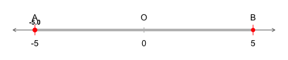
<p class="caption">(\#fig:point-to-line2)무수히 많은 점으로 이루어진 선</p>
</div>

```p5```생성 부분의 코드 첫 줄을  ```p5 <- p3 +```에서 ```p5 <- ggplot(point_df) + ylim(A, B) +```로 변경하고 ```p5```, ```p6```를 각각 다시 한번 실행하여 보면, ```p5```, ```p6``` 만으로 도 움직이는 그림을 만들 수 있습니다. ```p5```, ```p6```부분이 위의 소소코드의 핵심 부분으로, ```p1```, ```p2```, ```p3```, ```p4``` 부분은  생략할 수 있습니다. 데이터 시각화를 위한 소스코드 생성 시에는 ```p5```, ```p6```부분과 같은 핵심 부분에 집중하여 핵심 로직을 먼저 만들고 그 다음에 그래프를 꾸미는 부분들이 추가되는 순서로 코드를 작성하는 것이 좋습니다.

이제, 선과 면의 관계로 넘어가 봅시다. 선이 무수히 많은 연속적인 점으로 이루어져 있는 것처럼, **면**은 무수히 많은 연속적인 **선**으로 이루어져 있습니다. 평면 상의 두 선 $A$, $B$ 사이에 선을 무수히 생성해 나가면 면이 생성됩니다. 다른 말로 하면, 선 $A$에서 움직이기 시작해서 선 $B$에서 멈추면 하나의 면이 생성됩니다. 두 선이 반드시 같은 높이이거나 선이 움직일 때 직선적인 움직임을 보여야 하는 것도 아닙니다. 

선과 면의 관계를 보여 주는 그래프를 생성하기 위하여 위의 점과 선의 관계 그래프 생성에 사용한 소스코드를 수정하고 곡선적인 움직임을 보이는 경우까지 고려하여 일곱 단계로 나누어서 소스코드를 생성하였습니다. 각 단계 별 코드의 주석문을 참고하여 전체적인 흐름을 파악해보세요. 

1. 두 선의 이름과 좌표를 입력하고 두 선 사이에 움직임을 표현하는 함수 세 개 중 하나를 선택하여 무수히 많은 선의 $x$,$y$ 좌표를 생성합니다. 


```r
#install.packages("gganimate") 
library(gganimate)  #ggplot 애니메이션을 위한 패키지 로딩
#두선 정보 입력 (변경 가능)
linetext <- c('A','B')  #두선 이름 벡터
x <- c(1,10)            #두선 x좌표 벡터  
```

```r
#세 개의 함수 중 하나만 선택하여 실행 가능하도록 # 제거, 나머지 두 개는 주석 처리
func <- function(x) {return (rep(1,length(x)))}  #y=1
#func <- function(x) {return (0.5 * x)}          #y=0.5*x
#func <- function(x) {return (5 / x)}            #y=5/x
```

```r
 #각 선의 좌표와 이름을 ggplot에서 이해하기 쉽게 변수 이름 설정
x1 <- x[1]
x2 <- x[2]
dx <- x2 - x1            #입력된 두 x1, x2 좌표의 간격을 구함 
dy <- dx                 #dx를 이용하여 y1, y2 좌표 간격 설정
Aname <- linetext[1]     #첫 번째 점 이름
Bname <- linetext[2]     #두 번째 점 이름
#점진적인 변화를 보여주기 위한 벡터와 데이터 프레임
#무수히 많은 x 좌표 생성
xm <- seq(x1, x2, 0.1) #세 번째 입력값을 0.1에서 0.5나, 1로 변경하고 실행 결과 확인하기
y1 <-func(xm)  #생성된 x 좌표를 위의 함수에 적용하여 같은 수의 y1 좌표 생성
y2 <- y1 + dy  #생성된 y1 좌표와 dy를 이용하여 같은 수의 y2 좌표 생성 
```

2. 생성된 ```xm```, ```y1```, ```y2``` 좌표 벡터를 이용하여 특정 시간 프레임 ```i```의 선과 이전 시간 프레임 ```i-1```의 선으로 생성되는 면을 그려봅니다. 


```r
i = 10 
#i-1의 선 좌표 생성 A(xm[i-1], y1[i-1]), B(xm[i-1], y2[i-1])
#i의 선 좌표 생성 C(xm[i], y1[i]), D(xm[i], y2[i])
ggplot() + xlim(min(xm),max(xm)) +
  #위의 A,B,C,D 4개의 좌표를 꼭짓점으로 하는 사각형이 생성되도록 좌표 생성, A-B-D-C 순으로 
  geom_polygon(aes(x=c(xm[i-1],xm[i-1],xm[i],xm[i]), 
                   y=c(y1[i-1],y2[i-1],y2[i],y1[i])), 
               colour="lightblue", fill='lightblue') +
  #i-1의 선과 i의 선 생성
  annotate("segment",x=xm[i-1],xend=xm[i-1],y=y1[i-1],yend=y2[i-1],color='red',size=0.1) +
  annotate("segment",x=xm[i],xend=xm[i],y=y1[i],yend=y2[i],color='red',size=0.1) 
```

3. 생성된 ```xm```, ```y1```, ```y2``` 좌표 벡터와 위에서 테스트해 본 면 생성 로직을 이용하여 전체 시간 프레임을 포함하는 면 데이터 프레임을 생성하고 시각화 합니다. 


```r
poly_df <- data.frame(x=numeric(), y=numeric(), xm=numeric())
for (i in 2:length(xm)) {
  #데이터 프레임에 사각형 4개의 좌표를 4개의 행으로 추가 
  poly_df <- rbind(poly_df,data.frame(x=xm[i-1],y=y1[i-1],xm=xm[i]))  
  poly_df <- rbind(poly_df,data.frame(x=xm[i-1],y=y2[i-1],xm=xm[i]))  
  poly_df <- rbind(poly_df,data.frame(x=xm[i],y=y2[i],xm=xm[i]))  
  poly_df <- rbind(poly_df,data.frame(x=xm[i],y=y1[i],xm=xm[i]))   
}
p0 <- ggplot(poly_df) + 
  #각 시간 프레임별 면 생성
  geom_polygon(aes(x=x,y=y,group=xm), colour="lightblue", fill='white') +
  #전체 시간 프레임이 만들어내는 전체 면 생성 
  annotate("polygon",x=c(xm,rev(xm)),y=c(y2,rev(y1)),color='lightblue',size =2,fill=NA) +
   #두 선 추가
  annotate("segment",x=x, xend=x,y=c(y1[1],y1[length(y1)]),yend=c(y2[1],y2[length(y2)]),
    colour='red',size=0.5)
p0 #그래프 확인
```

4. 각 시간 프레임 별 면을 생성하는 로직이 완성되었습니다. 이제 본격적으로 그래프를 생성하고 $x$, $y$ 좌표 축을 그래프에 추가합니다.


```r
p1 <- ggplot(poly_df) + 
  xlim(ifelse(x1>0,0,x1-1), x2+1) +  #x축과 y축 폭을 동일하게 설정
  ylim(ifelse(min(y1)>0,0,min(y1)-1), max(y2)+1) +  #x축과 y축 폭을 동일하게 설정
  coord_fixed(ratio = 1) +
  #x축 선과 화살표 추가
  annotate("segment",x=ifelse(x1>0,0,x1-1),xend=x2+1, y=0, yend=0, 
    size=0.5, color='dimgray', arrow=arrow(length=unit(0.2,"cm"))) +
  #y축 선과 화살표 추가 
  annotate("segment",x=0,xend=0, y=ifelse(min(y1)>0,0,min(y1)-1), yend=max(y2)+1, 
    size=0.5, color='dimgray', arrow=arrow(length=unit(0.2,"cm"))) 
p1  #그래프 확인
```

5. 두 선과 두 선이 생성할 면의 윤각을 그래프에 추가합니다. 


```r
p2 <- p1 + 
  #생성될 면의 윤곽 추가
  annotate("polygon",x=c(xm,rev(xm)),y=c(y1,rev(y2)),color='gray',fill='gray',alpha=0.5) +
  #두 선 추가
  annotate("segment",x=x, xend=x,y=c(y1[1],y1[length(y1)]),yend=c(y2[1],y2[length(y2)]),
    colour='red',size=0.5) +
  #각 선의 x좌표와 점 이름 추가
  annotate('text',x=c(x1,x2),y=c(y1[1]-0.5,y1[length(y1)]-0.5),label=c(x1,x2),
    size=5,color='black') +
  annotate('text',x=c(x1,x2),y=c(y2[1]+0.5,y2[length(y2)]+0.5),label=c(Aname,Bname),
    size=5,color='black') 
p2
```
6. 각 시간 프레임 별 선과 면을 그래프에 추가합니다. 


```r
p3 <- p2 + 
  geom_polygon(aes(x=x,y=y,group=xm), color='lightblue', fill='lightblue') +
  #각 선 추가 
  annotate("segment",x=xm,xend=xm,y=y1,yend=y2,color='red',size=0.5) +
  #각 점 이름 추가
  geom_text(aes(x=xm, y=func(xm)-0.5, label=sprintf('%1.1f',xm)), 
    color="black", size=4, fontface = "bold") 
p3
```
7. 시간 프레임으로 사용할 숫자 벡터를 ```transition_reveal()```의 입력값으로 하여 실행하면 움직이는 그림이 생성됩니다. 


```r
p4 <- p3 +
  #동영상 생성을 위한 프레임 설정
  transition_reveal(xm)
p4  
anim_save("line-to-polygon1.gif") # Save as gif
```

위의 일곱 단계를 거쳐서 정사각형 모양의 도형이 완성되었습니다. $x$축을 따라 빨간색 직선이 이동하면서 정사각형의 모양을 그리게 되는데, 빨간색 직선의 아래 부분 끝점은 직선 그래프 $y = 1$를 따라 이동하게 됩니다. 

첫 번째 단계의 코드 중 ```func```부분을 아래와 같이 $y = 1$관련 라인은 주석문 처리하고 $y = 0.5 \times x$관련 라인은 주석문 해제하여 실행 가능하도록 변경하고 위의 일곱 단계를 처음 부터 다시 반복하면 평행사변형 모양의 도형을 얻을 수 있습니다. 이번에도, $x$축을 따라 빨간색 직선이 이동하면서 평행사변형 모양을 그리게 되는데, 빨간색 직선의 아래 부분 끝점은 직선 그래프 $y = 0.5 \times x$를 따라 이동하게 됩니다.


```r
#세 개의 함수 중 하나만 선택하여 실행 가능하도록 # 제거, 나머지 두 개는 주석 처리
#func <- function(x) {return (rep(1,length(x)))}  #y=1
func <- function(x) {return (0.5 * x)}            #y=0.5*x
#func <- function(x) {return (5 / x)}             #y=5/x
```

첫 번째 단계의 코드 중 ```func```부분을 아래와 같이 $y = 0.5 \times x$관련 라인은 다시 주석문 처리하고 $y = 5 / x$관련 라인은 주석문 해제하여 실행 가능하도록 변경하고 위의 일곱 단계를 처음 부터 또 다시 반복하면 곡선을 변으로 가지는 도형을 얻을 수 있습니다. 이번에도, $x$축을 따라 빨간색 직선이 이동하면서 도형을 그리게 되는데, 빨간색 직선의 아래 부분 끝점은 직선 그래프 $y = 5 / x$를 따라 곡선을 그리며 이동하게 됩니다.


```r
#세 개의 함수 중 하나만 선택하여 실행 가능하도록 # 제거, 나머지 두 개는 주석 처리
#func <- function(x) {return (rep(1,length(x)))}  #y=1
#func <- function(x) {return (0.5 * x)}           #y=0.5*x
func <- function(x) {return (5 / x)}              #y=5/x
```

이렇게 위의 일곱 단계를 세 번 반복하면 세 개의 다른 도형을 그리는 움직이는 그림을 생성할 수 있습니다 (그림 \@ref(fig:line-to-poly3)). 위의 일곱 번째 단계에서 시간 프레임을 사용하기 위하여 ```transition_time()```함수 대신 ```transition_reveal()```함수를 사용한 이유는 세 번째 도형의 곡면 부분을 그리는 움직임을 표현하기 위해서 입니다. 선이 곡선 위를 움직이는 경우, 효율적인 면 표현을 위하여 특정 시간 프레임```i```가 보여 주는 면을 생성할 때 전체면 (선 $A$부터 현재 움직이는 선이 만들어낸 면) 대신에 시간 프레임 ```i```의 선과 이전 시간 프레임 ```i-1```의 선이 만들어내는 면을 사용했습니다 (위의 두 번째 단계 참고). 이러한 경우, 특정 시간 프레임이 지나면 이전 시간 프레임에서 만들어 진 면을 모두 보여 주는 ```transition_reveal()```함수를 사용하여야 원하는 움직이는 그림을 만들어 낼 수 있습니다. 두 함수의 차이를 알고 싶으면 일곱 번째 단계의 ```p4 <- p3 + transition_reveal(xm)```부분을 ```p4 <- p3 + transition_time(xm)```로 변경하고 실행해 보세요. 


<div class="figure">
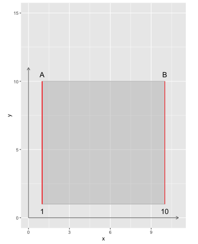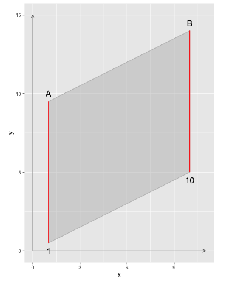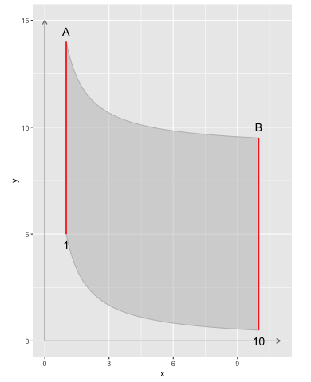
<p class="caption">(\#fig:line-to-poly3)무수히 많은 선으로 이루어진 면 (세가지 경우)</p>
</div>

이제 점으로 이루어진 선과 선으로 이루어진 면을 직접 그려봅시다. 아래의 소스코드와 같이 두 패키지 ```mapedit```와 ```mapview```를 설치하고 로딩한 후에 ```editMap(mapview())```를 실행하면 RStudio의 뷰어창에 지도 화면이 나타납니다. 확대 버튼과 축소 버튼 그리고 마우스를 이용하여 여러분의 집과 학교에 화면에 나타나도록 지도를 확대, 축소, 이동해 봅시다. 일단 아시아 대륙이 보일 때까지 화면을 축소합니다. 그 다음에 확대 버튼이나 마우스 더블 클릭을 이용하여 대한민국 지역을 확대하고 여러분이 살고 있는 시, 동으로 확대해 갑니다. 축소 버튼 밑부분에 있는 레이어 버튼을 이용하면 배경지도 (한글 지도, 위성영상 지도)를 바꾸어 볼 수 도 있습니다. 지도 영역을 여러분의 집과 학교가 나오도록 적절히 조정되었으면, 지도화면 왼쪽 부분에 있는 선, 다각형 그리기 버튼을 이용하여 등교길 (선)이나 학교 운동장 (다각형)을 도형으로 그려봅시다. 도형을 다 그린 후에는 Done 버튼을 눌러서 작업을 끝냅니다.


```r
#install.packages("mapedit")  #처음 패키지 사용 시 설치
library(mapedit)
#install.packages("mapview")  #처음 패키지 사용 시 설치
library(mapview)
myfeatures <- editMap(mapview())
```

아래 두 개의 소스코드 중 하나를 이용하여 위에서 그린 도형을 다시 지도 위에 그려 볼 수 있습니다. 두 개의 소스코드가 하는 일은 동일합니다. 


```r
mapview(sf::st_union(myfeatures$finished))
```


```r
library(dplyr)
library(sf)
myfeatures$finished %>%  #dplyr 패키지를 로딩하여 파이프라인 (%>%) 사용 가능
  st_union() %>%         #sf 패키지를 로딩하였으므로 sf::st_union() 대신 st_union()로 사용 가능
  mapview()
```

지금까지 무수히 많은 점이 생성하는 선과 무수히 많은 선이 생성하는 면에 대해서 알아보았습니다. 이제 두 개의 다른 도형이 서로 교차하는 지점에 생성되는 도형에 대해서 알아봅시다.

점, 선, 면으로 이루어진 두 도형이 서로 교차하면서 생기는 점, 선, 면을 각각 **교점** (intersection point), **교선** (intersection line), **교면** (intersection area)이라고 합니다. ```sf```패키지의 ```st_intersection()```함수를 이용하면 두 도형에 교차되는 지점에 대한 정보를 구해볼 수 있을 뿐만 아니라 교차 지점 정보 그 자체도 도형으로 표현할 수 있기 때문에 교점, 교선, 교면을 그래프에 그려볼 수 있습니다. 도형과 도형의 교차 관계를 점과 선이 교차, 선과 선의 교차, 선과 면의 교차, 면과 면의 교차로 나누어 살펴보겠습니다.


먼저, 점과 선이 만나서 생기는 교점을 구해보겠습니다. 아래 소스코드와 같이 $1$개의 직선 ```l```과 $8$개의 점들 ```A8```을 생성하고 직선과 점들이 교차하는 지점 ```i```를 구해보면 $3$개의 교점이 생성되는 것을 알 수 있습니다.  


```r
library(sf)
#선 l의 꼭짓점 좌표 cbind(c(x1,x2),c(y1,y1)))
l <- st_linestring(cbind(c(0,10),c(0,0)))
#8개 점들 A8의 좌표 cbind(c(x1,x2,x3,x4,x5,x6,x7,x8),c(y1,y2,y3,y4,y5,y6,y7,y8))
A8 <- st_multipoint(cbind(c(0,1,2,4,6,7,9,10),c(1,0,1,-1,1,0,0,1)))
#l과 a8 사이의 교차 부분 도형 생성 
i <- st_intersection(l,A8)
i  #3개의 교점 정보 확인
## MULTIPOINT ((1 0), (7 0), (9 0))
```

아래의 소스코드와 같이 ```sf```패키지의 ```plot()```함수를 이용하면 직선 ```l```과 점들 ```A8```, 그리고 교점 ```i```의 상대적 위치를 그림으로 표현해 볼 수 있습니다. 


```r
opar <- par(mfrow = c(1, 2)) #두 개의 그림을 옆으로 나란히
#왼쪽 그림: 교점 추가 전
plot(l, ylim = c(-2,2)) #선 a는 검은색
plot(A8, add = TRUE, pch = 19, col='red') #점들은 빨간색
#오른쪽 그림: 교점 추가 후
plot(l, ylim = c(-2,2))
plot(a8, add = TRUE, pch = 19, col='red')
plot(i, add = TRUE, pch = 19, col = 'green') #교점은 녹색
```

그림 \@ref(fig:point-line-intersection)의 오른쪽 부분은 직선 ```l```과 점들 ```A8```의 상대적 위치를 보여주고, 왼쪽 부분은 직선 ```l```과 점들 ```A8```의 교점 ```i```의 위치를 보여 줍니다. $8$개의 점들 중에서 왼쪽에서 두 번째 점 ```A8[2, ]```, 여섯 번째 점 ```A8[6, ]```, 일곱 번째 점 ```A8[7, ]```만 직선 ```l```과 만납니다. 

<div class="figure" style="text-align: center">
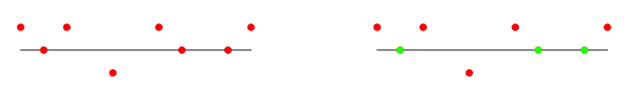
<p class="caption">(\#fig:point-line-intersection)점과 선이 만나서 생기는 교점</p>
</div>

두 번째로 선과 선이 만나서 생기는 교점과 교선을 구해보겠습니다. 위에서 사용한 직선  ```l```과 $8$개의 점들 ```A8```을 이어서 생성된 꺽은선 ```m```, 그리고 두 선의 교차 부분  ```i```를 구해보면 $3$개의 교점과 $1$개의 교선이 생성되는 것을 알 수 있습니다.  


```r
library(sf)
#선 l의 꼭짓점 좌표 cbind(c(x1,x2),c(y1,y1)))
l <- st_linestring(cbind(c(0,10),c(0,0)))
#선 m의 꼭짓점 좌표 cbind(c(x1,x2,x3,x4,x5,x6,x7,x8),c(y1,y2,y3,y4,y5,y6,y7,y8))
m <- st_linestring(cbind(c(0,1,2,4,6,7,9,10),c(1,0,1,-1,1,0,0,1)))
#l과 m 사이의 교차 부분 도형 생성 
i <- st_intersection(l,m)
i #3개의 교점과 1개의 교면 정보 확인
## GEOMETRYCOLLECTION (POINT (1 0), POINT (3 0), POINT (5 0), LINESTRING (7 0, 9 0))
```

아래의 소스코드를 이용하면 그림 \@ref(fig:line-line-intersection)와 같이 두 선의 교차 부분을 그림으로 표현해 볼 수 있습니다. 


```r
opar <- par(mfrow = c(1, 2)) #두 개의 그림을 옆으로 나란히
#왼쪽 그림: 교점과 교선 추가 전
plot(l, ylim = c(-2,2))
plot(m, add = TRUE, pch = 19, col='red')
#오른쪽 그림: 교점과 교선 추가 후
plot(l, ylim = c(-2,2))
plot(m, add = TRUE, pch = 19, col='red')
plot(i, add = TRUE, pch = 19, col = 'green', lwd = 2)
```

<div class="figure" style="text-align: center">
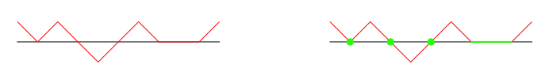
<p class="caption">(\#fig:line-line-intersection)선과 선이 만나서 생기는 교점과 교선</p>
</div>

세 번째로 선과 면이 만나서 생기는 교점과 교선을 구해보겠습니다. 위의 직선 ```l```을 한 변으로 하는 사각형 면 ```P```와 꺽은선 ```m```의 교차 부분 ```i```를 구해보면 $1$개의 교점과 $2$개의 교선이 생성되는 것을 알 수 있습니다. 


```r
library(sf)
#사각형 면 P의 꼭짓점 좌표 list(cbind(c(x1,x2,x3,x4,x1),c(y1,y2,y3,y4,y1)
P <- st_polygon(list(cbind(c(0,10,10,0,0),c(0,0,-2,-2,0))))
#선 m의 꼭짓점 좌표 cbind(c(x1,x2,x3,x4,x5,x6,x7,x8),c(y1,y2,y3,y4,y5,y6,y7,y8))
m <- st_linestring(cbind(c(0,1,2,4,6,7,9,10),c(1,0,1,-1,1,0,0,1)))
#P와 m 사이의 교차 부분 도형 생성 
i <- st_intersection(P,m)
i #1개의 교점과 두 개의 교선 정보 확인
## GEOMETRYCOLLECTION (POINT (1 0), LINESTRING (7 0, 9 0), LINESTRING (3 0, 4 -1, 5 0))
```

아래의 소스코드를 이용하면 한 개의 사각형 면과 한 개의 꺽은선이 교차하는 부분에 생성되는 교점과 교선을 그림으로 표현해 볼 수 있습니다 (그림 \@ref(fig:line-polygon-intersection)).


```r
opar <- par(mfrow = c(1, 2)) #두 개의 그림을 옆으로 나란히
#왼쪽 그림: 교점과 교선 추가 전
plot(P, ylim = c(-2,2))
plot(m, add = TRUE, pch = 19, col='red')
#오른쪽 그림: 교점과 교선 추가 후
plot(P, ylim = c(-2,2))
plot(m, add = TRUE, pch = 19, col='red')
plot(i, add = TRUE, pch = 19, col = 'green', lwd = 2)
```

<div class="figure" style="text-align: center">
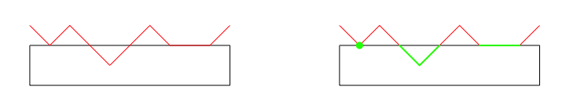
<p class="caption">(\#fig:line-polygon-intersection)선과 면이 만나서 생기는 교점과 교선</p>
</div>

네 번째로 면과 면이 만나서 생기는 교점과 교선, 그리고 교면을 구해보겠습니다. 직사각형 면  ```P```와 꺽은선 ```m```을 한 변으로 하는 다각형 면 ```Q```의 교차 부분  ```i```를 구해보면 $1$개의 교점과 $1$개의 교선, 그리고 $1$개의 교면이 생성되는 것을 알 수 있습니다.  


```r
library(sf)
#사각형 면 P의 꼭짓점 좌표 list(cbind(c(x1,x2,x3,x4,x1),c(y1,y2,y3,y4,y1)
P <- st_polygon(list(cbind(c(0,10,10,0,0),c(0,0,-2,-2,0))))
#다각형 면 Q의 꼭짓점 좌표 cbind(c(x1,x2,x3,...,x8,x9,x10,x1),c(y1,y2,y3,...,y8,y9,y10,y1))
Q <- st_polygon(list(cbind(c(0,1,2,4,6,7,9,10,10,0,0),c(1,0,1,-1,1,0,0,1,2,2,1))))
#P와 Q 사이의 교차 부분 도형 생성 
i <- st_intersection(P,Q)
i  #1개의 교점, 1개의 교선, 1개의 교면 정보 확인
## GEOMETRYCOLLECTION (POINT (1 0), LINESTRING (7 0, 9 0), POLYGON ((3 0, 5 0, 4 -1, 3 0)))
```

아래의 소스코드를 이용하면 한 개의 사각형 면과 한 개의 다각형 면이 교차하는 부분에 생성되는 교점과 교선, 그리고 교면을 그림으로 표현해 볼 수 있습니다 (그림 \@ref(fig:polygon-polygon-intersection)).


```r
#왼쪽 그림: 교점, 교선, 교면 추가 전
plot(P, ylim = c(-3,3))
plot(Q, add = TRUE, pch = 19, border='red')
#오른쪽 그림: 교점, 교선, 교면 추가 후
plot(P, ylim = c(-3,3))
plot(Q, add = TRUE, pch = 19, border='red')
plot(i, add = TRUE, pch = 19, col = 'green', border = 'green', lwd = 2)
```

<div class="figure" style="text-align: center">
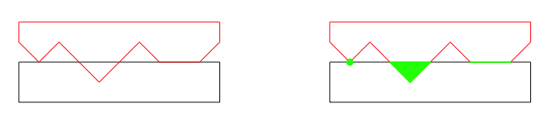
<p class="caption">(\#fig:polygon-polygon-intersection)면과 면이 만나서 생기는 교점과 교선, 그리고 교면</p>
</div>

이전의 소스코드에서는 ```ggplot()```패키지에 익숙해지기 위해서 간단한 그래프를 그릴 때에도  ```ggplot()```를 사용해왔지만, 위의 교점, 교선, 교면 소스코드에서 살펴본 것처럼 간단한 그래프를 그려볼 때에는 ```plot()```를 사용할 수 있습니다. 콘솔창에 ```?plot```을 입력하고 실행하면 도움말창에 ```plot()```함수를 포함하는 두 개의 패키지 정보가 아래와 같이 나타납니다.

1. ```plot sf object in package sf```: ```sf```패키지에서는 점 (```st_point```), 점들 (```st_multipoint```), 선 (```st_linestring```), 면 (```st_polygon```) 등의 공간 도형 객체 (```sf objects```)들을 ```plot()```함수의 입력값으로 직접 사용할 수 있습니다. 
1. ```Generic X-Y Plotting in package graphics```: R이 제공하는 기본 패키지인 ```graphics```에서는 $x$, $y$ 좌표로 이루어진 점과 선 등의 정보들을 ```plot()```함수의 입력값으로 사용하여 간단히 그래프를 그려볼 수 있습니다. 예를 들어, 두 점 ($2$,$0$)과 ($6$,$0$)을 그래프에 추가할 경우 첫 번째 입력값은 ```c(2,6)```, 두 번째 입력값은 ```c(0,0)```이 됩니다. 


직선의 개념을 **직선**(straight line, line), **반직선** (half-line, ray), **선분** (line segment)으로 세분화하기 위하여 R의 기본 패키지인 ```graphics```에서 제공하는 ```plot()```함수를 이용하여 점 $A$와 $B$ 사이는 지나는 직선을 그린 다음, 이를 기준으로 반직선과 선분의 개념을 설명해 보겠습니다.

서로 다른 두 점 $A$($2$,$0$)와 $B$($6$,$0$)를 지나는 직선을 끝없이 연장한 직선 $l$을 그리는 소스코드는 아래와 같습니다. 두 점 $A$와 $B$를 넘어서 끝없이 곧게 이어지는 직선을 유한한 공간에 그림으로 표현하기 위해서 직선의 시작점과 끝점의 좌표는 ($0$,$0$)와 ($8$,$0$)로 잡았습니다 (그림 \@ref(fig:line-segment)의 직선 $l$). 직선 $l$을 기호로 나타내면 $\overleftrightarrow{AB}$ 입니다. 이때 아래의 공식이 성립합니다.

$$l = \overleftrightarrow{AB} = \overleftrightarrow{BA}$$


```r
opar <- par(mfrow = c(1, 1)) #한번에 한 개의 그림만
#opar <- par(mfrow = c(1, 4)) #네 개의 그림을 옆으로 나란히
#library(graphics)  #기본 함수라서 로딩하지 않아도 자동으로 로딩됨
#(0,0) 좌표와 (8,0)좌표를 이용하여 선을 생성, "l" : 라인 타입, 축 정보 없이
plot(c(0,8),c(0,0),type="l",xlim=c(-0.5,8),ylim =c(-2,2),axes=FALSE,xlab='',ylab='')
#점(2,0)과 점(6,0) 위치에 점 추가, pch=19: 포인트 심볼, 파란색
points(c(2,6),c(0,0),pch=19,col='blue')
#'l'은 (-0.5,0) 위치에 이탤릭체로 추가, 'A'은 (2,-0.5) 위치에 추가 , 'B'는 (6,-0.5) 위치에 추가 
text(c(-0.5,2,6), c(0,-0.5,-0.5),c(expression(italic('l')),'A','B'))
```

점 $A$에서 시작하여 점 $B$ 쪽으로 끝없이 곧게 연장한 선 $m$을 반직선이라고 부르고 기호로는 $\overrightarrow{AB}$ 로 나타냅니다. 반대로 점 $B$에서 시작하여 점 $A$ 쪽으로 끝없이 곧게 연장한 선 $n$ 또한 반직선이라고 부르고 기호로는 $\overrightarrow{BA}$ 로 나타냅니다. 두 반직선 $m$과 $n$은 시작점과 연장 방향이 서로 다르기 때문에 아래의 공식이 성립합니다.

$$m = \overleftrightarrow{AB}, \quad n = \overrightarrow{BA}, \quad m \neq n, \quad \overleftrightarrow{AB} \neq \overrightarrow{BA}$$


아래의 소스코드를 이용하여 그림 \@ref(fig:line-segment)의 반직선 $m$과 반직선 $n$을 그려볼 수 있습니다.


```r
#(2,0) 좌표와 (8,0)좌표를 이용하여 선을 생성, "l": 라인 타입, 축 정보 없이
plot(c(2,8),c(0,0),type="l",xlim=c(-0.5,8),ylim =c(-2,2),axes=FALSE,xlab='',ylab='')
#점(2,0)과 점(6,0) 위치에 점 추가, pch=19: 포인트 심볼, 파란색
points(c(2,6),c(0,0),pch=19,col='blue')
#'m'은 (-0.5,0) 위치에 이탤릭체로 추가, 'A'은 (2,-0.5) 위치에 추가 , 'B'는 (6,-0.5) 위치에 추가 
text(c(1.5,2,6), c(0,-0.5,-0.5),c(expression(italic('m')),'A','B'))
```


```r
#(0,0) 좌표와 (6,0)좌표를 이용하여 선을 생성, "l": 라인 타입, 축 정보 없이
plot(c(0,6),c(0,0),type="l",xlim=c(-0.5,8),ylim =c(-2,2),axes=FALSE,xlab='',ylab='')
#점(2,0)과 점(6,0) 위치에 점 추가, pch=19: 포인트 심볼, 파란색
points(c(2,6),c(0,0),pch=19,col='blue')
#'n'은 (-0.5,0) 위치에 이탤릭체로 추가, 'A'은 (2,-0.5) 위치에 추가 , 'B'는 (6,-0.5) 위치에 추가 
text(c(-0.5,2,6), c(0,-0.5,-0.5),c(expression(italic('n')),'A','B'))
```

직선과 반직선이 끝없이 연장되는 것과는 달리, 점 $A$에서 $B$ 까지 의 유한한 선 $o$를 선분이라고 하며 기호로는 $\overline{AB}$ 와 같이 나타냅니다. 선분의 시작점과 끝점을 서로 바꾸어도 동일한 선분이 생성되기 때문에 아래와 같이 공식이 성립합니다.

$$o = \overline{AB} = \overline{BA}$$

두 점을 시작점, 끝점으로 하는 선은 곡선, 꺽은선 등 무수히 많을 수 있지만 두 점을 지나는 선 중에 가장 거리가 짧은 선은 선분 $\overline{AB}$ 이며 아래의 소스코드로 그려볼 수 있습니다 (그림 \@ref(fig:line-segment)의 선분 $o$). 두 점 $A$($2$,$0$)와 $B$($6$,$0$)의 단위가 $cm$일 경우 선분 $o$의 길이는 $4cm$가 되며 $\overline{AB} = 4cm$ 와 같이 나타냅니다. 선분의 기호는 선분의 길이를 나타낼 때에도 많이 사용되기 때문에 선분 $\overline{AB}$와 $\overline{CD}$의 길이가 동일할 때에도 $\overline{AB} = \overline{CD}$ 와 같이 나타냅니다.


```r
#(2,0) 좌표와 (6,0)좌표를 이용하여 선을 생성, "l": 라인 타입, 축 정보 없이
plot(c(2,6),c(0,0),type="l",xlim=c(-0.5,8),ylim =c(-2,2),axes=FALSE,xlab='',ylab='')
#그림에 점(2,0)과 점(6,0) 위치에 점 추가, pch=19: 포인트 심볼, 파란색
points(c(2,6),c(0,0),pch=19,col='blue')
#'o'는 (-0.5,0) 위치에 이탤릭체로 추가, 'A'은 (2,-0.5) 위치에 추가 , 'B'는 (6,-0.5) 위치에 추가 
text(c(1.5,2,6), c(0,-0.5,-0.5),c(expression(italic('o')),'A','B'))
```

<div class="figure" style="text-align: center">
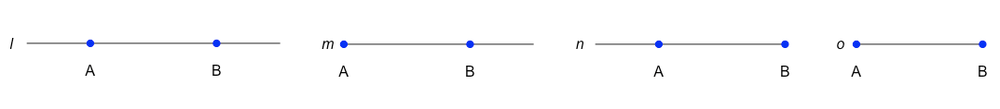
<p class="caption">(\#fig:line-segment)직선 $l$, 반직선 $m$과 $n$, 그리고 선분 $o$</p>
</div>

선분 $AB$를 반으로 나누는 지점을 $M$이라 하면 선분 $AM$의 거리와 선분 $BM$의 거리는 같고 아래와 같은 공식이 성립합니다.

 $$\overline{AM} = \overline{BM} = \frac{1}{2} \overline{AB}$$ 


선분 $AB$의 중점 $M$을 그림으로 표현해보기 위하여 그림 \@ref(fig:line-segment)의 선분 $o$를 그리는 소스코드에 거리를 표현하는 점선과 거리가 동일하다는 기호를 추가하면 아래와 같습니다. 이 소스코드를 실행하여 그림 \@ref(fig:mid-point)와 같은 결과가 나오는지 확인해보세요. 


```r
#(2,0) 좌표와 (6,0)좌표를 이용하여 선을 생성, "l": 라인 타입, 축 정보 없이
plot(c(2,6),c(0,0),type="l",xlim=c(-0.5,8),ylim =c(-2,2),axes=FALSE,xlab='',ylab='')
#그림에 점(2,0)과 점(6,0) 위치에 점 추가, pch=19: 포인트 심볼, 파란색
points(c(2,4,6),c(0,0,0),pch=19,col=c('blue','green','blue'))
#'o'는 (-0.5,0) 위치에 이탤릭체로 추가, 'A'은 (2,-0.5) 위치에 추가 , 'B'는 (6,-0.5) 위치에 추가 
text(c(1.5,2,4,6), c(0,-0.3,-0.3,-0.3),c(expression(italic('o')),'A','M','B'))
#선분 AM의 거리 표시 점선 
s1   <- smooth.spline(c(2,2.5,3.5,4),c(0,0.15,0.15,0), spar = 0.2)
x1  <- seq(2,4,by=0.1)
lines(predict(s1, x1),lty=3,col='dimgray')  #lty=3, line type = 점선
#선분 BM의 거리 표시 점선 
s2   <- smooth.spline(c(4,4.5,5.5,6),c(0,0.15,0.15,0), spar = 0.2)
x2  <- seq(4,6,by=0.1)
lines(predict(s2, x2),lty=3,col='dimgray')  #lty=3, line type = 점선
#선분 AM과 선분 BM의 거리가 동일하다는 기호 표현
text(c(3,5), c(0.2,0.2),c('||','||'),cex=0.7)
```

<div class="figure" style="text-align: center">
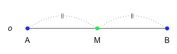
<p class="caption">(\#fig:mid-point)선분 $AB$의 중점 $M$</p>
</div>

위의 그림에서 선분의 거리 표시 점선을 생성하는 곡선 좌표를 얻기 위하여 ```predict(s1, x1)```과 ```predict(s2, x2)```를 사용하였습니다. 그래프를 그려본 후에 콘솔창에 ```predict()```부분을 실행하여 결과값을 확인하고 ```lines(predict(s1, x1),lty=3,col='dimgray')```부분을 ```lines(s1,lty=3,col='dimgray')```로 변경하여 다시 실행해 보면서, ```s1```이 그리는 점선과 ```predict(s1, x1)```이 그리는 점선의 차이점을 찾아보세요. 특정 부분의 소스코드가 이해가 되지 않을 때에는 그 부분의 코드가 어떤 결과를 만들어내는 지만 알고 넘어가도 충분합니다. 코드 한 줄 한 줄이 어떤 결과를 만들어내는지 이해하는 것은 전체 소스코드의 흐름을 이해하는데 큰 도움을 줍니다. 소스코드의 일부분은 완벽히 이해했지만 전체 코드의 흐름을 파악하지 못했다면 나무만 보고 숲은 보지 못한 것과 같습니다.


### 각의 성질 {#angle-characteristics}

이제 두 선이 만드는 각 (angle)과 관련된 다양한 개념들에 대해서 알아보겠습니다. 

한 점 $O$에서 시작하는 두 반직선 $OA$와 $OB$가 이루는 각 $AOB$를 기호로 $\angle AOB$, $\angle BOA$, 또는 $\angle O$와 같이 나타냅니다. 아래 소스코드와 같이 점 $A$($1$,$0$), $O$($0$,$0$), $B$($0.8$,$1.5$)의 좌표를 이용하여 $\angle AOB$의 크기도 구해보고 그림으로 그려보았습니다. 그림 \@ref(fig:line-segment-angle)에서 볼 수 있듯이 **각의 크기**를 나타낼 때에는 $\angle a$로 표현하기도 합니다. 두 반직선의 시작점인 점 $O$를 **각의 꼭짓점**이라고 하고 두 반직선 $OA$와 $OB$를 **각의 변**이라고 합니다. 아래 소스코드에서 각의 크기는 $OB$와 $x$축이 이루는 각인 ```a_angle2```와 $OA$와 $x$축이 이루는 각인 ```a_angle1```의 차로 구하였습니다. 두 반직선의 각도 크기를 한번에 구하는 공식도 있으나 ```DrawArc()```함수에 호(arc)를 그리기 시작하는 각도와 끝나는 각도를 입력값으로 넣어 주어야 하기 때문입니다. 각의 크기를 구하는 공식 부분의 코드가 ```DrawArc()```함수에 어떻게 사용되는지 정도만 파악하고 복붙해서 콘솔창에 실행해 보세요. 


```r
#install.packages("DescTools") #패키지를 처음 사용할 때 설치
library(DescTools)  #DrawArc()함수를 위한 패키지 로딩
#점 A, O, B의 좌표
A <- c(1,0)
O <- c(0,0)
B <- c(0.8,1.5)
#반직선 OA와 OB를 그래프에 그리기
plot(c(A[1]*1.3,O[1],B[1]*1.3),c(A[2]*1.3,O[2],B[2]*1.3),type="l",
  xlim=c(-0.5,2),ylim=c(-0.5,2),axes=FALSE,xlab="",ylab="")
#점 A, B 추가
points(c(A[1],B[1]),c(A[2],B[2]),pch=19,col='blue',cex=1)
#텍스트 'A', 'O', 'B' 추가
text(c(A[1],O[1]-0.1,B[1]),c(A[2]-0.2,O[2],B[2]+0.25),c('A','O','B'),cex=1)
#각도 계산
#a_angle= acos((x2%*%x1)/(sqrt(x2%*%x2)*sqrt(x1%*%x1))) #두 반직선의 각도
a_angle1 <- atan2(A[2],A[1])      #반직선 OA와 x축과의 각도
a_angle2 <- atan2(B[2],B[1])      #반직선 OB와 x축과의 각도
a_angle <- a_angle2 - a_angle1    #두 각도 차이를 이용한 두 반직선의 각도 구하기
a_angle_degree <- a_angle*180/pi  #radian 각도를 degree(°)로 변환
#theta.1 부터 theta.2 까지 각도 선호 그리기
DrawArc(x=0,y=0,rx=0.2,theta.1=a_angle1,theta.2=a_angle2,col='blue')
#DrawArc(x=0,y=0,rx=0.3,theta.1=a_angle2,theta.2=a_angle1,col='red')
#텍스트 'a' 추가
text(0.25,0.15,expression(italic('a')),cex=1)
#text(0.4,0.15,paste0(sprintf('%1.1f',a_angle_degree),'°'),cex=1)
print(paste0('두 반직선 OA와 OB로 이루어진 각 A0B의 크기는 ', sprintf('%1.1f',a_angle_degree),'°입니다.'))
## "두 반직선 OA와 OB로 이루어진 각 A0B의 크기는 61.9°입니다."
```

<div class="figure" style="text-align: center">

<p class="caption">(\#fig:line-segment-angle)각 $AOB$ $M$</p>
</div>

점$O$를 중심으로 각 $AOB$를 이루는 두 변이 서로 반대 방향을 향하고 직선을 이룰 때, 각 $AOB$를 **평각** (straight angle)이라고 하고 평각의 크기는 $180°$입니다. 평각의 크기의 절반 ($\frac{1}{2}$)인 $90°$의 크기를 가지는 각을 **직각** (right angle)이라고 합니다. 아래의 소스코드를 이용하여 그림 \@ref(fig:straight-angle)와 같이 평각을 그려보세요.


```r
#점 A, O, B의 좌표
A <- c(-1,0)
O <- c(0,0)
B <- c(1,0)
#반직선 OA와 OB를 그래프에 그리기
plot(c(A[1]*1.3,O[1],B[1]*1.3),c(A[2]*1.3,O[2],B[2]*1.3),type="l",
  xlim=c(-2,2),ylim=c(-0.5,2),axes=FALSE,xlab="",ylab="")
#점 A, O, B 추가
points(c(A[1],O[1],B[1]),c(A[2],O[2],B[2]),pch=19,col=c('blue','green','blue'),cex=1)
#텍스트 'A', 'O', 'B' 추가
text(c(A[1],O[1],B[1]),c(A[2]-0.2,O[2]-0.2,B[2]-0.2),c('A','O','B'),cex=1)
#각도 계산
#a_angle= acos((x2%*%x1)/(sqrt(x2%*%x2)*sqrt(x1%*%x1))) #두 반직선의 각도
a_angle1 <- atan2(A[2],A[1])      #반직선 OA와 x축과의 각도
a_angle2 <- atan2(B[2],B[1])      #반직선 OB와 x축과의 각도
a_angle <- a_angle1 - a_angle2    #두 각도 차이를 이용한 두 반직선의 각도 구하기
a_angle_degree <- a_angle*180/pi  #radian 각도를 degree(°)로 변환
#theta.1 부터 theta.2 까지 각도 선호 그리기
DrawArc(x=0,y=0,rx=0.3,theta.1=a_angle2,theta.2=a_angle1,col='blue')
#DrawArc(x=0,y=0,rx=0.4,theta.1=a_angle1,theta.2=a_angle2,col='red')
#각의 크기 텍스트로 추가
text(-0.35,0.35,paste0(sprintf('%1.0f',a_angle_degree),'°'),cex=1,col='blue')
```

<div class="figure" style="text-align: center">
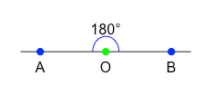
<p class="caption">(\#fig:straight-angle)평각</p>
</div>

그림정보창에 평각 그림이 그려진 상태에서, 아래의 소스코드를 추가로 실행하면 직각의 그림이 추가로 그려 집니다.


```r
#점 P의 좌표
P <- c(0,1)
#직각
lines(c(O[1],P[1]),c(O[2],P[2]),lty=1,col='dimgray')
#직각 기호
lines(c(0,0.15,0.15),c(0.15,0.15,0),lty=1,col='dimgray')
#각도 계산
a_angle1 <- atan2(P[2],P[1])      #반직선 OA와 x축과의 각도
a_angle2 <- atan2(B[2],B[1])      #반직선 OB와 x축과의 각도
a_angle <- a_angle1 - a_angle2    #두 각도 차이를 이용한 두 반직선의 각도 구하기
a_angle_degree <- a_angle*180/pi  #radian 각도를 degree(°)로 변환
#각의 크기 텍스트로 추가
text(0.45,0.2,paste0(sprintf('%1.0f',a_angle_degree),'°'),cex=1,col='dimgray')
```

여러분이 그려낸 평각과 직각 그림에서도 볼 수 있듯이 평각과 직각은 크기는 각각 $180°$, $90°$입니다. 그리고, 직각보다 크기가 작은 각을 **예각** (acute angle), 직각보다 크기가 큰 각을 **둔각** (obtuse angle)이라고 합니다. 아래의 소스코드를 이용하여 예각인 $\angle APB$와 둔각인 $\angle COD$를 그려볼 수 있습니다 (그림 \@ref(fig:acute-obtuse-angle)).


```r
#예각을 그리기 위한 점 A, P, B의 좌표
A <- c(-2,0.2)
P <- c(-1,0)
B <- c(-1.2,1)
#반직선 PA와 PB를 그래프에 그리기
plot(c(A[1],P[1],B[1]),c(A[2],P[2],B[2]),type="l",
  axes=FALSE,xlim=c(-2,2),ylim=c(-0.5,2),xlab="",ylab="")
#각도 계산
#a_angle= acos((x2%*%x1)/(sqrt(x2%*%x2)*sqrt(x1%*%x1))) #두 반직선의 각도
a_angle1 <- atan2(A[2]-P[2],A[1]-P[1])  #반직선 PA와 x축과의 각도 atan2(y,x)
a_angle2 <- atan2(B[2]-P[2],B[1]-P[1])  #반직선 PB와 x축과의 각도 atan2(y,x)
a_angle <- a_angle1 - a_angle2    #두 각도 차이를 이용한 두 반직선의 각도 구하기
a_angle_degree <- a_angle*180/pi  #radian 각도를 degree(°)로 변환
#점 P를 중심으로 theta.1 부터 theta.2 까지 각도 선호 그리기
DrawArc(x=P[1],y=P[2],rx=0.3,theta.1=a_angle2,theta.2=a_angle1,col='blue')
#각의 크기 텍스트로 추가
text(-1.45,0.25,paste0(sprintf('%1.0f',a_angle_degree),'°'),cex=1,col='blue')
```


```r
#둔각을 그리기 위한 점 C, O, D의 좌표
C <- c(1,0)
O <- c(0,0)
D <- c(-0.2,1)

#옵션1: 반직선 OC와 OD를 그래프에 그리기, 기존 그래프에 둔각의 변 추가
lines(c(C[1],O[1],D[1]),c(C[2],O[2],D[2])) 
#옵션2: 반직선 OC와 OD를 그래프에 그리기, 새로운 그래프 그리기 시작
#plot(c(C[1],O[1],D[1]),c(C[2],O[2],D[2]),type="l",
#  axes=F,xlim=c(-2,2),ylim=c(-0.5,2),xlab="",ylab="")

#각도 계산
#a_angle= acos((x2%*%x1)/(sqrt(x2%*%x2)*sqrt(x1%*%x1))) #두 반직선의 각도
b_angle1 <- atan2(C[2]-O[2],C[1]-O[1])  #반직선 OC와 x축과의 각도 atan2(y,x)
b_angle2 <- atan2(D[2]-O[2],D[1]-O[1])  #반직선 OD와 x축과의 각도 atan2(y,x)
b_angle <- b_angle2 - b_angle1    #두 각도 차이를 이용한 두 반직선의 각도 구하기
b_angle_degree <- b_angle*180/pi  #radian 각도를 degree(°)로 변환
#점 O를 중심으로 theta.1 부터 theta.2 까지 각도 선호 그리기
DrawArc(x=O[1],y=O[2],rx=0.3,theta.1=b_angle1,theta.2=b_angle2,col='blue')
#각의 크기 텍스트로 추가
text(0.45,0.25,paste0(sprintf('%1.0f',b_angle_degree),'°'),cex=1,col='blue')
```

<div class="figure" style="text-align: center">
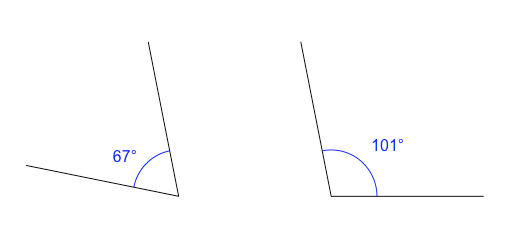
<p class="caption">(\#fig:acute-obtuse-angle)예각과 둔각</p>
</div>

두 직선 $\overline{AB}$와 $\overline{CD}$가 한 점에서 만나면 네 개의 각이 생성되고 이 각들 간의 관계를 알아보기 위해 여섯 단계로 구분된 아래의 소스코드를 이용하여 그림을 그려보겠습니다. 

1. 각도 계산 및 각호 그리기가 여러 번 반복되기 때문에 이를 위한 함수 ```my_draw_arc()```를 생성합니다. 함수를 생성할 때 특정 입력값이 주어지지 않은 경우에 사용할 기본값을 설정할 수 있습니다. 아래의 함수의 경우 $8$개의 입력값 중 $3$개의 입력값에 기본값이 설정되었습니다.


```r
library(DescTools)  #DrawArc()함수를 위한 패키지 로딩
my_draw_arc <- function(p1,po,p2,r,color,lty=1,lwd=1,over=0) {
  #각도 계산
  angle1 <- atan2(p1[2]-po[2],p1[1]-po[1])  #선분1과 x축과의 각도 atan2(y,x)
  angle2 <- atan2(p2[2]-po[2],p2[1]-po[1])  #선분2와 x축과의 각도 atan2(y,x)
  if(angle1 <0) angle1 = angle1 + 2*pi  #각도가 음수로 표현되는 경우 양수로 변경
  if(angle2 <0) angle2 = angle2 + 2*pi  #각도가 음수로 표현되는 경우 양수로 변경
  angle <- angle2 - angle1              #두 각도 차이를 이용한 두 반직선의 각도 구하기
  if(angle <0) angle = angle + 2*pi     #각도가 음수로 표현되는 경우 양수로 변경
  angle_degree <- angle*180/pi  #radian 각도를 degree(°)로 변환
  #점 P를 중심으로 theta.1 부터 theta.2 까지 각도 선호 그리기
  over <- over *pi/180 #degree(°) 각도를 radian 각도로 변환
  DrawArc(x=po[1],y=po[2],rx=r,theta.1=angle1-over,theta.2=angle2+over,
    col=color,lty=lty,lwd=lwd)
  print(paste0('angle = ',sprintf('%1.0f',angle_degree),'°'))
  return (c(angle1*180/pi, angle2*180/pi, angle_degree)) #계산 결과값이 필요한 경우에만 사용
}
```

2. 두 직선의 교각을 그리기 위한 점 $A$, $B$, $C$, $D$와 원점 $O$의 좌표를 입력합니다.


```r
A <- c(-2,-1.5)
B <- c(2,1.5)
C <- c(-2,1.5)
D <- c(2,-1.5)
O <- c(0,0)
```

3. 선분 $AB$와 $CD$를 그래프에 그립니다.


```r
plot(c(A[1],B[1]),c(A[2],B[2]),type="l",
  axes=FALSE,xlim=c(-2,2),ylim=c(-2,2),xlab="",ylab="")
lines(c(C[1],D[1]),c(C[2],D[2])) 
```

4. ```my_draw_arc()``` 함수를 이용하여 네 개의 교각의 각호를 그립니다. 함수의 입력값이 여러 개인 경우 입력값의 이름을 사용하지 않으면 함수를 선언할 때의 순서를 그대로 따라야 합니다. 함수를 사용할 때  ```입력값이름=입력값```의 형식으로 입력값을 주면 함수를 선언할 때의 순서를 따르지 않고 입력값 들을 사용할 수 있습니다. 그리고, 함수 선언 시에 기본값이 주어진 입력값은, 함수 사용 시에 생략하여도 주어진 기본값이 자동으로 사용되어 집니다. 아래 소스코드의 주석문 부분을 참고하세요. 


```r
#my_draw_arc(po=O,p1=C,p2=A,color='blue',r=0.3,over=0,lty=1,lwd=1)
#my_draw_arc(p1=C,po=O,p2=A,r=0.3,color='blue',lty=1,lwd=1,over=0) 
my_draw_arc(C,O,A,0.3,'blue')
my_draw_arc(A,O,D,0.2,'red')
my_draw_arc(D,O,B,0.3,'blue')
my_draw_arc(B,O,C,0.2,'red')
```

5. 네 개의 각 이름 $a$,$b$,$c$,$d$를 추가합니다.


```r
text(O[1]-0.4,O[2],expression(italic('a')),cex=1,col='blue')
text(O[1],O[2]-0.4,expression(italic('b')),cex=1,col='red')
text(O[1]+0.4,O[2],expression(italic('c')),cex=1,col='blue')
text(O[1],O[2]+0.4,expression(italic('d')),cex=1,col='red')
```

6. 두 개의 평각을 추가로 그립니다.


```r
my_draw_arc(C,O,D,0.7,'gray')
my_draw_arc(A,O,B,0.8,'gray')
text(O[1]-1.0,O[2],'180°',cex=1,col='gray')
text(O[1],O[2]-1.0,'180°',cex=1,col='gray')
```

두 직선 또는 선분이 서로 교차하는 지점에 생기는 네 각  $\angle a$, $\angle b$, $\angle c$, $\angle d$를 **교각** (angle of intersection)이라고 합니다 (그림 \@ref(fig:vertical-angle)). 교각 중에서 서로 마주 보는 두 각 $\angle a$와 $\angle c$를 **맞꼭지각** (vertical angle, vertically oopposite angle)이라 하고 두 각의 크기는 같습니다. 이를 수식으로 확인해보면, $\angle a = 180° - \angle b, \quad \angle c = 180° - \angle b$이므로 $\angle a = \angle c$임을 알 수 있습니다. 서로 맞꼭지각인 두 각 $\angle b$와 $\angle d$도 수식으로 확인해 보면, $\angle d = 180° - \angle c, \quad \angle b = 180° - \angle c$이므로 $\angle b = \angle d$임을 알 수 있습니다.

<div class="figure" style="text-align: center">
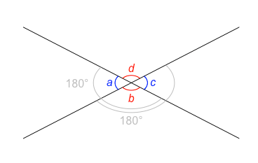
<p class="caption">(\#fig:vertical-angle)맞꼭지각</p>
</div>

두 직선이 교차해서 생기는 교각이 직각일 경우 두 직선은 **직교** (수직으로 교차, orthogonality)한다고 하고 기호로는 $\overleftrightarrow{AB} \perp \overleftrightarrow{CD}$로 나타냅니다. 두 직선이 직교할 경우 한 직선을 다른 직선의 **수선**이라고 합니다. 아래의 소스코드를 이용하여 두 직선이 직교하는 그림을 그려볼 수 있습니다 (그림 \@ref(fig:line-orthogonality)).


```r
A <- c(-2,0)
B <- c(2,0)
C <- c(0,2)
D <- c(0,-2)
#두 직선 추가
plot(c(A[1]*1.3,B[1]*1.3),c(A[2]*1.3,B[2]*1.3),type="l",
  axes=FALSE,xlim=c(-3,3),ylim=c(-3,3),xlab="",ylab="")
lines(c(C[1]*1.3,D[1]*1.3),c(C[2]*1.3,D[2]*1.3)) 
#점 A, B, C, D 추가
points(c(A[1],B[1],C[1],D[1]),c(A[2],B[2],C[2],D[2]),pch=19,col='blue')
#텍스트 'A', B', 'C', 'D' 추가
text(c(A[1],B[1],C[1]+0.3,D[1]+0.3),c(A[2]+0.4,B[2]+0.4,C[2],D[2]),c('A','B','C','D'))
#직각 기호
lines(c(0,0.2,0.2),c(0.2,0.2,0),lty=1,col='dimgray')
```

<div class="figure" style="text-align: center">
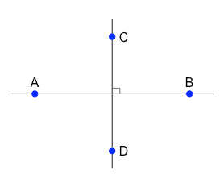
<p class="caption">(\#fig:line-orthogonality)두 직선의 직교 관계</p>
</div>

선분 $AB$의 중점 $M$을 지나고 선분에 수직인 직선 $l$을 선분 $AB$의 **수직이등분선** (perpendicular bisector)이라고 하고 기호로는 $\overline{AB} \perp l$로 표현합니다. 또한, 선분 $AM$과 선분 $BM$의 길이는 같고 기호로는 $\overline{AM} = \overline{BM}$와 같이 나타냅니다. 아래의 소스코드로 선분 $AB$의 수직이등분선 $l$을 그려볼 수 있습니다 (그림 \@ref(fig:perpendicular-bisector)).


```r
#세미콜론 (;)으로 구분해서 여러 라인을 한 라인에 표현
A <- c(-2,0); B <- c(2,0); C <- c(0,2); D <- c(0,-2)
#두 직선 추가
plot(c(A[1],B[1]),c(A[2],B[2]),type="l",
  axes=FALSE,xlim=c(-3,3),ylim=c(-3,3),xlab="",ylab="")
lines(c(C[1],D[1]),c(C[2],D[2])) 
#점 A, B 추가
points(c(A[1],B[1]),c(A[2],B[2]),pch=19,col='blue')
#텍스트 'A', B', 'M', 'l' 추가
text(c(A[1],B[1],0.3,C[1]),c(A[2]-0.4,B[2]-0.4,-0.3,C[2]+0.3),
  c('A','B','M',expression(italic('l'))))
#직각 기호
lines(c(0,0.2,0.2),c(0.2,0.2,0),lty=1,col='gray')
#등거리 기호
text(c(A[1]/2,B[1]/2),c(A[2],B[2]),c('||','||'),cex=0.7,col='gray')
```

<div class="figure" style="text-align: center">
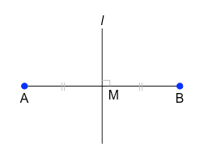
<p class="caption">(\#fig:perpendicular-bisector)선분 AB의 수직이등분선 $l$</p>
</div>

직선 $l$ 위에 있지 않은 점 $P$에서 직선 $l$에 수선을 그려 생긴 교점 $H$을 점 $P$에서 직선 $l$에 내린 **수선의 발** (foot of perpendicular)이라고 합니다. 점 $P$와 교점 $H$가 만드는 선분 $PH$는 점 $P$와 직선 $l$위의 점을 잇는 선분 중에서 가장 짧기 때문에 선분 $PH$의 길이를 점 $P$와 직선 $l$사이의 거리라고 합니다. 수선의 발  $H$와 점 $P$와 직선 $l$사이의 거리 (perpendicular distance)는 아래의 소소코드로 그려볼 수 있습니다 (그림 \@ref(fig:perpendicular-distance)).


```r
#세미콜론 (;)으로 구분해서 여러 라인을 한 라인에 표현
A <- c(-2,0); B <- c(2,0); P <- c(0,2); H <- c(0,0)
#두 직선 추가
plot(c(A[1],B[1]),c(A[2],B[2]),type="l",
  axes=FALSE,xlim=c(-3,3),ylim=c(-1,3),xlab="",ylab="")
lines(c(P[1],H[1]),c(P[2],H[2])) 
#점 P 추가
points(c(P[1]),c(P[2]),pch=19,col='blue')
#텍스트 'l', P', H' 추가
text(c(A[1]-0.4,P[1],H[1]),c(A[2],P[2]+0.3,H[2]-0.3),
  c(expression(italic('l')),'P','H'))
#직각 기호
lines(c(0,-0.2,-0.2),c(0.2,0.2,0),lty=1,col='dimgray')
#선분 PH의 거리 표시 점선, 위에서 만든 my_draw_arc() 함수 이용
my_draw_arc(H,c(-2,1),P,sqrt(5),'dimgray',lty=3)
```

<div class="figure" style="text-align: center">
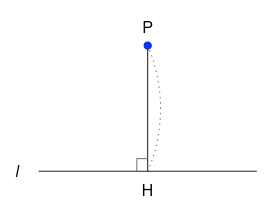
<p class="caption">(\#fig:perpendicular-distance)수선의 발과 점 P와 직선 $l$사이의 거리</p>
</div>

지금까지 두 선이 만드는 다양한 각의 형태인 예각, 직각, 둔각, 평각, 교각, 맞꼭지각, 직교, 수선 등의 개념을 살펴보았습니다. 이제 점, 직선, 평면의 위치 관계에 대해서 알아봅시다.

### 점, 직선, 평면의 위치 관계


\@ref(point-line-area)절에서 이미 점, 선, 면의 교점과 교선에 대해서 잠깐 다루었던 걸 떠올려보면서, 점, 직선, 평면의 위치 관계에 대해서 자세히 알아봅시다.

 
점과 직선의 위치 관계에는 아래와 같이 두 가지로 나뉩니다 (그림 \@ref(fig:point-line-relation)).

1. 점이 직선 위에 있다.
1. 점이 직선 위에 있지 않다.

<div class="figure" style="text-align: center">

<p class="caption">(\#fig:point-line-relation)점과 직선의 위치 관계</p>
</div>

점과 직선의 두 가지 위치 관계를 그림으로 그려보기 위하여 그림 \@ref(fig:point-line-intersection)에 사용하였던 소스코드를 아래와 같이 간단히 정리하였습니다.


```r
library(sf)
#선 l
l <- st_linestring(cbind(c(0,10),c(0,0)))
#점 A, B
A <- st_point(c(5,0)); B <- st_point(c(5,2))
#두 개의 그림을 옆으로 나란히
opar <- par(mfrow = c(1, 2)) 
# 1. 점이 직선 위에 있다.
plot(l, xlim=c(-1,10),ylim =c(-2,2))
plot(A, add = TRUE, pch = 19, col='blue') #점들은 파란색
text(-0.5,0, expression(italic('l')))
# 2. 점이 직선 위에 있지 않다.
plot(l, xlim=c(-1,10),ylim =c(-2,2))
plot(B, add = TRUE, pch = 19, col='blue')
text(-0.5,0, expression(italic('l')))
#원래 설정으로 돌아가기, 한 번에 한 개의 그림만
opar <- par(mfrow = c(1, 1)) 
```

```st_intersection()```함수를 이용하여 점과 직선의 위치 관계를 확인 해 볼 수도 있습니다.


```r
i1 <- st_intersection(l,A)
i1  #교차 정보 확인
i2 <- st_intersection(l,B)
i2  #교차 정보 확인
```

한 평면 위에서 두 직선의 위치 관계는 아래와 같이 세가지로 나뉩니다 (그림 \@ref(fig:line-line-relation)).

1. 두 직선이 일치한다.
1. 두 직선이 한 점에서 만난다.
1. 두 직선이 평행하다.


<div class="figure" style="text-align: center">
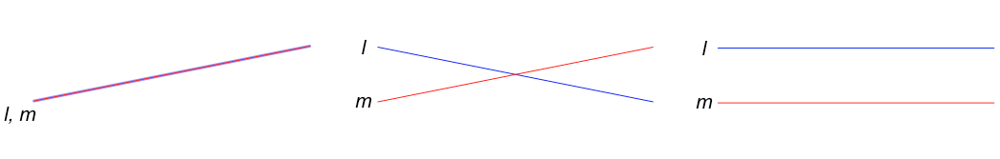
<p class="caption">(\#fig:line-line-relation)두 직선의 위치 관계</p>
</div>

두 직선의 세가지 위치 관계를 그림으로 그려보기 위하여 아래의 소스코드를 생성하였습니다. 두 직선이 일치하는 경우, 선 $l$을 반투명으로 표현하기 위해 ```scales```패키지의 ```alpha('blue',0.5)```함수가 사용되었습니다. 선 $l$과 선 $m$의 이름을 추가할 때에 ```text()```함수를 두 번 사용할 수도 있고, 입력값을 벡터 처리하여 한번 만 사용할 수도 있습니다.


```r
opar <- par(mfrow = c(1, 3))  #세 개의 그림을 옆으로 나란히
library(sf)
library(scales)
# 1. 두 직선이 일치한다.
l1 <- st_linestring(cbind(c(0,10),c(0,2)))
m1 <- st_linestring(cbind(c(0,10),c(0,2)))
plot(l1, col=alpha('blue',0.5), lwd=3, xlim=c(-1,10),ylim =c(-1,2))
plot(m1, col ='red', add = TRUE)
text(-0.5,-0.5, expression(italic('l, m')),cex=2)
# 2. 두 직선이 한 점에서 만난다.
l2 <- st_linestring(cbind(c(0,10),c(2,0)))
m2 <- st_linestring(cbind(c(0,10),c(0,2)))
plot(l2, col='blue', xlim=c(-1,10),ylim =c(-1,2))
plot(m2, col ='red', add = TRUE)
text(-0.5, 2, expression(italic('l')),cex=2)
text(-0.5, 0, expression(italic('m')),cex=2)
# 3. 두 직선이 평행하다.
l3 <- st_linestring(cbind(c(0,10),c(2,2)))
m3 <- st_linestring(cbind(c(0,10),c(0,0)))
plot(l3, col='blue', xlim=c(-1,10),ylim =c(-1,2))
plot(m3, col ='red', add = TRUE)
text(c(-0.5,-0.5),c(2,0),c(expression(italic('l')),expression(italic('m'))),cex=2)
#원래 설정으로 돌아가기, 한 번에 한 개의 그림만
opar <- par(mfrow = c(1, 1)) 
```

```st_intersection()```함수를 이용하여 한 평면 위에 존재하는 두 직선의 위치 관계를 확인 해 볼 수도 있습니다.


```r
i1 <- st_intersection(l1,m1)
i1  #교차 정보 확인
i2 <- st_intersection(l2,m2)
i2  #교차 정보 확인
i3 <- st_intersection(l3,m3)
i3  #교차 정보 확인
```

두 직선 $l$, $m$이 한 평면 위에 있고 두 직선의 교점이나 교선이 없는 경우 두 선은 서로 만나지 않으며 이러한 경우 두 직선이 평행 (parallel)하다고 하고 기호로는 $l ⫽ m$ 와 같이 표현합니다. 무한히 연장되는 두 직선 $n$, $o$ 사이에 교점이나 교선이 없고 서로 평행하지도 않는 경우 두 직선은 한 평면 위에 있지 않고 꼬인 위치 (skew position)에 있다고 합니다. 아래의 소스코드를 이용하여 한 평면 위에 존재하는 직선 (파란색)과 꼬인 위치에 있는 직선 (빨간색)을 그려 볼 수 있습니다 (그림 \@ref(fig:skew-lines)).

맥킨토시 환경 (Mac OS)을 사용하는 경우, ```rgl```패키지의 그래프 그리기 함수들이 XQuartz를 기반으로 구현되었기 때문에 Mac에 XQuartz를 설치한 후에 ```rgl```패키지를 로딩하여야 정상 작동합니다. <https://www.xquartz.org/>에서 ```XQuartz-2.7.11.dmg```를 다운로드한 후에, 다운로드 폴더에서 ```dmg``` 파일을 더블 클릭하여 설치 파일을 엽니다. ```XQuartz.pkg```가 보이면 이를 다시 더블 클릭하여 해당 패키지를 Mac에 설치해 줍니다. 설치가 완료된 후에, Mac을 로그아웃하고 다시 로그인 한 후에 아래 소스코드를 실행합니다.


```r
#install.packages("rgl") 
library(rgl) #plot3d() 함수를 사용하기 위한 패키지 로딩
#x,y,z 좌표를 가지는 직선 l,m
l4 <- st_linestring(cbind(c(-5,5),c(0,0),c(0,0)))
m4 <- st_linestring(cbind(c(0,0),c(2,2),c(-10,5)))
#직선 l 3차원 공간에 그리기
plot3d(l4,type='l',lwd=2,col='blue',
  axes=FALSE,xlim=c(-10,10),ylim =c(-10,10),zlim =c(-10,10),xlab='',ylab='',zlab='')
  #axes=F,xlim=c(-6,6),ylim =c(-1,2),zlim =c(-10,5),xlab='',ylab='',zlab='')
#직선 m 3차원 공간에 그리기
plot3d(m4,type='l',lwd=2,col='red', add = TRUE)
#직선 l이 속한 평면 P, z=0인 평면, xy 평면
planes3d(0,0,1,0,col='gray100',alpha=0.9) 
#교차 정보 확인
i4 <- st_intersection(l4,m4)
i4  
```

<div class="figure" style="text-align: center">
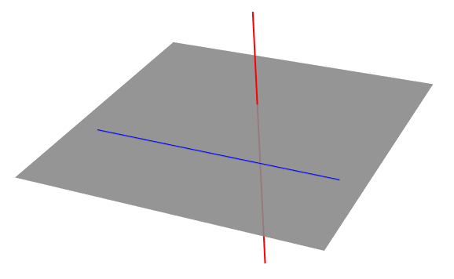
<p class="caption">(\#fig:skew-lines)꼬인 위치에 있는 두 직선</p>
</div>

삼차원 공간에서 직선과 평면 사이의 위치 관계는 아래와 같이 세 가지로 나뉩니다. 

1. 직선이 평면에 포함된다. 
1. 직선과 평면이 한 점에서 만난다. 
1. 직선과 평면이 평행하다. 

직선이 평면에 포함되는 경우와 직선이 평면과 한 점에서 만나는 경우는 위의 그림 \@ref(fig:skew-lines)에서 확인할 수 있습니다. 

그림의 직선 $m$ (빨간색)의 경우, 직선과 평면이 한 점에서 만나는 다양한 경우 중에서 직선 $m$과 평면 $P$가 서로 수직인 경우를 보여주고 있습니다. 이러한 경우 직선 $m$과 평면 $P$는 직교한다고 하고 기호로는 $m \perp P$와 같이 나타냅니다. 직선 $m$과 평면 $P$가 만나는 점을 $O$라고 할 때, 평면 $P$와 서로 수직인 직선 $m$은 점 $O$를 지나는 평면 위의 모든 직선들과도 서로 수직인 관계를 가집니다. 

그림 \@ref(fig:skew-lines)의 소스코드를 실행하여 그림창이 열려있는 상태에서 아래의 소스코드를 추가로 콘솔창에 입력하고 실행하면 점 $O$를 지나는 평면 위의 직선 네 개를 추가로 그려볼 수 있습니다.


```r
n1 <- st_linestring(cbind(c(-1,1),c(1,3),c(0,0)))
plot3d(n1,type='l',lwd=2,col='green', add = TRUE)
n2 <- st_linestring(cbind(c(-1,1),c(3,1),c(0,0)))
plot3d(n2,type='l',lwd=2,col='green', add = TRUE)
n3 <- st_linestring(cbind(c(-1,1),c(2,2),c(0,0)))
plot3d(n3,type='l',lwd=2,col='green', add = TRUE)
n4 <- st_linestring(cbind(c(0,0),c(1,3),c(0,0)))
plot3d(n4,type='l',lwd=2,col='green', add = TRUE)
```

직선과 평면이 평행한 위치 관계를 그림으로 그려보기 위하여 아래의 소스코드를 생성하였습니다 (그림 \@ref(fig:line-plane-parallel)). 직선 $l$과 평면 $P$가 평행할 때, 기호로 $l ⫽ P$와 같이 나타냅니다.


```r
library(sf)  #직선 도형을 위한 패키지 로딩
library(rgl) #plot3d() 함수를 사용하기 위한 패키지 로딩
#x,y,z 좌표를 가지는 직선 l
l <- st_linestring(cbind(c(-5,5),c(0,0),c(3,3)))
#직선 l 3차원 공간에 그리기
plot3d(l,type='l',lwd=2,col='blue',
  axes=FALSE,xlim=c(-6,6),ylim =c(-6,6),zlim =c(-6,6),xlab='',ylab='',zlab='')
#직선 l가 평행인 평면 P, z=0인 평면, xy 평면
planes3d(0,0,1,0,col='gray100',alpha=0.9) 
```

<div class="figure" style="text-align: center">
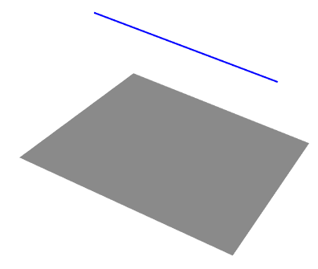
<p class="caption">(\#fig:line-plane-parallel)평면과 평행한 직선</p>
</div>

직선을 생성하기 위해서 두 점의 좌표를 ```st_linestring()```함수에 입력값으로 넣어야 하는데 주로 ```cbind()```를 사용하였으나, 아래의 소스코드와 같이 ```rbind ()```를 사용하여도 동일한 결과를 얻을 수 있습니다.


```r
#x 벡터, y 벡터, z 벡터 컬럼들을 합침  
cbind(c(-5,5),c(0,0),c(3,3))
#(x,y,z) 좌표를 가지는 각 행들을 합침
rbind(c(-5,0,3),c(5,0,3))
```

### 평행선의 성질 {#parallel-characteristics}

지금까지 두 개의 도형들 간의 위치 관계에 대하여 알아보았습니다. 이제 두 직선이 다른 한 직선과 만나서 만드는 교각의 성질에 대해서 살펴봅시다. 

한 평면 위에서 두 직선 $l$, $m$이 다른 한 직선 $n$과 만나면 여덟 개의 각이 생깁니다. 아래의 소스코드를 이용하여 그림을 먼저 그린 후에, 그림을 이용하여 여덟 개의 각들이 가지는 관계를 설명해 보겠습니다. 

1. 세 직선 $l$, $m$, $n$과 두 교점 $O$, $P$의 좌표를 입력합니다.


```r
A <- c(0,2); B <- c(10,4)  #직선 l
C <- c(0,0); D <- c(10,0)  #직선 m
E <- c(4,6); F <- c(7,-3)  #직선 n
O <- c(5,3)  #직선 l과 직선 n의 교점
P <- c(6,0)  #직선 m과 직선 n의 교점
```

2. 직선 $l$, $m$, $n$을 그래프에 그립니다.


```r
plot(c(A[1],B[1]),c(A[2],B[2]),type="l",
  axes=FALSE,xlim=c(-5,10),ylim=c(-5,10),xlab="",ylab="")
lines(c(C[1],D[1]),c(C[2],D[2])) 
lines(c(E[1],F[1]),c(E[2],F[2])) 
```

3. 위에서 그림 \@ref(fig:vertical-angle)을 그리는데 사용되었던 ```my_draw_arc()```함수를 이용하여 여덟 개 교각의 각호를 그립니다.


```r
my_draw_arc(E,O,A,0.5,'blue')   #각 a
my_draw_arc(A,O,F,0.6,'red')    #각 b
my_draw_arc(F,O,B,0.5,'green')  #각 c
my_draw_arc(B,O,E,0.6,'gray')   #각 d
my_draw_arc(E,P,C,0.5,'blue')   #각 e
my_draw_arc(C,P,F,0.6,'red')    #각 f
my_draw_arc(F,P,D,0.5,'green')  #각 g
my_draw_arc(D,P,E,0.6,'gray')   #각 h
```

4. 여덟 개의 각이름 $a$,$b$,$c$,$d$,$e$,$f$,$g$,$h$와 세 개의 직선 이름 $l$,$m$,$n$을 추가합니다. 아래와 같이 두 개의 다른 함수를 생성하였습니다.  ```my_text1()```함수는 두 직선의 교점에서 생성되는 교각의 이름을 그래프에 추가하기 위해서 작성되었습니다. ```my_text2()```함수는 벡터 형태의 입력값을 이용하도록 작성되었기 때문에, 교점 $O$, $P$를 위한 코드가 한 줄에 작성되었습니다. 뿐만 아니라, 직선의 이름을 추가하는 데에도 사용되었습니다. 둘 중에 하나를 선택해서 사용하세요.


```r
library(rlang)  #expr()안에서 변수를 사용하기 위한 패키지 로딩
my_text1 <- function(p,ptext,shift,color,size=1) {
  text(p[1]-shift,p[2]+shift,expr(italic(!!ptext[1])),col=color[1],cex=size)
  text(p[1]-shift,p[2]-shift,expr(italic(!!ptext[2])),col=color[2],cex=size)
  text(p[1]+shift,p[2]-shift,expr(italic(!!ptext[3])),col=color[3],cex=size)
  text(p[1]+shift,p[2]+shift,expr(italic(!!ptext[4])),col=color[4],cex=size)
}
my_text1(O,ptext=c('a','b','c','d'),shift=0.7,color=c('blue','red','green','gray'))
my_text1(P,ptext=c('e','f','g','h'),shift=0.7,color=c('blue','red','green','gray'))
text(A[1]-0.5,A[2],expr(italic('l')))
text(C[1]-0.5,C[2],expr(italic('m')))
text(E[1]-0.25,E[2]+0.5,expr(italic('n')))
```


```r
library(rlang)  #expr()안에서 변수를 사용하기 위한 패키지 로딩
my_text2 <- function(p,ptext,dx,dy,color,size=1,useItalic=TRUE) {
  for(i in 1:length(ptext)) {
    myp=p[[i]]
    if(useItalic) text(myp[1]+dx[i],myp[2]+dy[i],
        expr(italic(!!ptext[i])),col=color[i],cex=size)
    else text(myp[1]+dx[i],myp[2]+dy[i],ptext[i],col=color[i],cex=size)
  }
}
my_text2(list(O,O,O,O,P,P,P,P),ptext=c('a','b','c','d','e','f','g','h'),
  dx=rep(c(-0.7,-0.7,0.7,0.7),2),dy=rep(c(0.7,-0.7,-0.7,0.7),2),
  color=rep(c('blue','red','green','dimgray'),2))
my_text2(list(A,C,E),ptext=c('l','m','n'),
  dx=c(-0.5,-0.5,-0.25),dy=c(0,0,0.5),color=rep('black',3))
```

그림 \@ref(fig:corresponding-angles)와 같이 두 직선 $l$, $m$과 또 하나의 직선 $n$이 만나서 생기는 여덟 개의 각을 그려보면, 여덟 개의 각들 중 두 개의 각은 서로 상대적으로 같은 위치에 놓이게 됩니다. 이때, $\angle a$와 $\angle e$, $\angle b$와 $\angle f$, $\angle c$와 $\angle g$, $\angle d$와 $\angle h$와 같이 상대적으로 같은 위치에 있는 각을 각각 서로 **동위각** (corresponding angle)이라고 합니다. 또한, $\angle b$와 $\angle h$, $\angle c$와 $\angle e$와 같이 엇갈린 위치에서 서로 마주보는 각을 각각 서로 **엇각** (alternative angle)이라고 합니다.


<div class="figure" style="text-align: center">
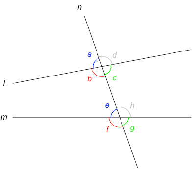
<p class="caption">(\#fig:corresponding-angles)동위각과 엇각</p>
</div>

위의 두 직선 $l$, $m$이 평행한 경우의 동위각과 엇각을 살펴보기 위해 아래의 소스코드를 이용하여 그림을 그려봅시다.


```r
# 1. 세 직선 $l$, $m$, $n$과 두 교점 $O$, $P$의 좌표를 입력합니다.
A <- c(0,2); B <- c(10,2)  #직선 l
C <- c(0,0); D <- c(10,0)  #직선 m
E <- c(4,4); F <- c(7,-2)  #직선 n
O <- c(5,2)  #직선 l과 직선 n의 교점
P <- c(6,0)  #직선 m과 직선 n의 교점
# 2. 직선 $l$, $m$, $n$을 그래프에 그립니다.
plot(c(A[1],B[1]),c(A[2],B[2]),type="l",
  axes=FALSE,xlim=c(-5,10),ylim=c(-5,10),xlab="",ylab="")
lines(c(C[1],D[1]),c(C[2],D[2])) 
lines(c(E[1],F[1]),c(E[2],F[2])) 
# 3. my_draw_arc() 함수를 이용하여 세 개의 교각의 각호를 그립니다.
my_draw_arc(F,O,B,0.5,'green')  #각 a
my_draw_arc(F,P,D,0.5,'green')  #각 b
my_draw_arc(E,P,C,0.5,'blue')   #각 c
# 4. my_text2() 함수를 이용하여 각 이름 $a$,$b$,$c$와 직선 이름 $l$,$m$을 추가합니다. 
my_text2(list(O,P,P),ptext=c('a','b','c'),dx=c(0.7,0.7,-0.7),dy=c(-0.7,-0.7,0.7),
  color=c('green','green','blue'))
my_text2(list(A,C),ptext=c('l','m'),dx=c(-0.5,-0.5),dy=c(0,0),color=rep('black',2))
```

그림 \@ref(fig:parallel-angles)에서 볼 수 있듯이, 두 직선 $l$, $m$이 평행하면 다른 한 직선과 만나서 생기는 동위각 $\angle a$와 $\angle b$의 크기는 서로 같으며, 평행선과 동위각은 다음과 같은 성질이 있습니다.

1. 두 직선이 평행하면 동위각의 크기는 서로 같다.
1. 동위각의 크기가 같으면 두 직선은 평행하다.

$l ⫽ m$이면 $\angle a$와 $\angle b$는 동위각이므로 $\angle a = \angle b$이고, $\angle b$와 $\angle c$는 맞꼭지각이므로 $\angle b = \angle c$입니다. 따라서, 엇각인 $\angle a$와$\angle c$의 크기도 같으며 ( $\angle a = \angle c$), 평행선과 엇각은 다음과 같은 성질이 있습니다.

1. 두 직선이 평행하면 엇각의 크기는 서로 같다.
1. 엇각의 크기가 같으면 두 직선은 평행하다.

<div class="figure" style="text-align: center">
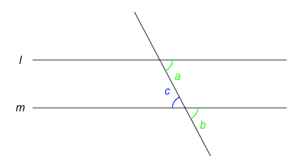
<p class="caption">(\#fig:parallel-angles)평행선과 동위각, 평행선과 엇각</p>
</div>

지금까지 점, 직선, 평면을 이해하고 이 도형들 사이의 위치 관계에 대하여 알아보았습니다. 또한, 두 반직선 또는 직선이 만드는  각의 성질과 평행선의 성질에 대해서도 알아보았습니다. 이제, 작도와 합동에 대하여 살펴봅시다.


## 작도와 합동


간단한 도형과 삼각형을 작도 (construction)하여 보고 삼각형의 합동조건 (conditions of congruence)에 대하여 알아봅니다. 

### 간단한 도형의 작도

눈금이 없는 자 (ruler)와 컴퍼스 (compass)만을 이용하여 도형을 그리는 것을 **작도**라고 합니다. 자는 두 점을 연결하는 선분, 반직선, 직선을 그리는데 사용하고, 컴퍼스는 원을 그리거나 주어진 선분의 길이를 재어서 옮기는데 사용합니다. 

먼저, 선분 AB와 길이가 같은 선분 CD를 그려보겠습니다. 소스코드로 그림을 그리는 일은 눈금이 없는 자와 컴퍼스로 작도하는 것과는 다르지만, 작도하는 순서와 비슷한 그림이 나오도록 아래와 순서로 소스코드를 실행해 봅시다. 

1. 도형을 그리는 데 필요한 패키지들을 로딩하고, 선분 $AB$를 그립니다.


```r
library(sf)         #공간 도형을 사용하기 위한 패키지 로딩
library(DescTools)  #DrawArc()함수를 위한 패키지 로딩
library(scales)     #color의 입력값에 alpha를 직접 사용하기 위한 패키지 로딩 
A <- c(0,2); B <- c(5,2)  
#선분 AB 추가
plot(c(A[1],B[1]),c(A[2],B[2]),type="l",
  axes=FALSE,xlim=c(-2,7),ylim=c(-2,4),xlab="",ylab="")
#점 A,B 추가
points(c(A[1],B[1]),c(A[2],B[2]),pch=19,col='black')
```

2. 직선 $l$을 그리고 그 위에 한 점 $C$를 추가합니다.


```r
#직선 l 추가
C <- c(0,0)
abline(h=C[2], col=alpha('blue',0.3))
#점 C 추가
points(c(C[1]),c(C[2]),pch=19,col='blue')
```

3. 선분 $AB$의 길이를 구합니다.


```r
#선분 AB의 거리 측정
length_AB <- st_distance(st_point(A), st_point(B))
```

4. 점 $C$를 중심으로 반지름 (radius)의 길이가 $\overline{AB}$인 원을 그립니다. 


```r
#점 C를 중심으로 반지름의 길이가 선분 AB인 원을 그려 직선 l과의 교점 D를 구함
DrawArc(x=C[1],y=C[2],rx=length_AB,theta.1=-20/180*pi,theta.2=20/180*pi,
  col=alpha('red',0.5))
```

5. 그리진 원과 직선 $l$의 교점을 $D$라고 하면, 이제 여러분은 교점 $D$의 위치를 눈으로 확인할 수 있습니다. 하지만, 선분 $CD$을 소스코드로 그리기 위해서는 교점 $D$의 좌표 정보가 필요합니다. 교점 $D$의 좌표를 구한 후, 선분 $CD$를 그립니다. 교점 $D$의 좌표를 구하기 위해서 아래와 같이 두 개의 함수가 만들어졌습니다. ```getPoint1()```함수는 직선과 원의 교점을 구하는 방식으로 작성되었고, ```getPoint2()```함수는 한 점에서의 거리와 각도를 이용하여 좌표를 구하는 방식으로 작성되었습니다. 둘 중에 하나를 선택해서 사용하세요. 


```r
#직선과 원의 작도를 이용한 함수 (교점구하기)
getPoint1 <- function(P, length, angle_degree, times=5,draw=TRUE) {
  myline <- st_linestring(cbind(c(P[1],P[1]+length*times*cos(angle_degree*pi/180)),
    c(P[2],P[2]+length*times*sin(angle_degree*pi/180))))
  myarc = st_cast(st_buffer(st_point(P), length),"LINESTRING")
  mypoint <- st_intersection(myline,myarc)
  return (mypoint)
}
D <- getPoint1(C, length_AB, 0)
points(c(D[1]),c(D[2]),pch=19,col='dimgray')
lines(c(C[1],D[1]),c(C[2],D[2]),lwd=2,col='dimgray')
```


```r
#한 점에서의 거리와 각도를 이용하여 좌표를 구하는 함수 (삼각함수)
getPoint2 <- function(P, length, angle_degree, draw=TRUE) {
  mypoint <- c(P[1]+length*cos(angle_degree*pi/180),
               P[2]+length*sin(angle_degree*pi/180))
  return (mypoint)
}
D <- getPoint2(P=C, length_AB, 0)
points(c(D[1]),c(D[2]),pch=19,col='green')
lines(c(C[1],D[1]),c(C[2],D[2]),lwd=2,col='green')
```

위의 다섯 단계를 거쳐서 그림 \@ref(fig:construction-line-CD)이 생성되었습니다. 

<div class="figure" style="text-align: center">
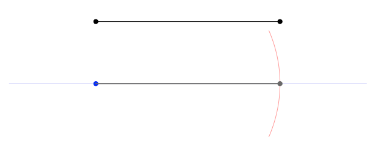
<p class="caption">(\#fig:construction-line-CD)선분 AB와 길이가 같은 선분 CD</p>
</div>

이제, 선분 $AB$를 점 $B$의 방향으로 연장하여 길이가 선분 $AB$의 $2$배인 선분 $BC$를 그려봅시다. 아래 소스코드의 주석문을 참고하여 한 줄 한 줄 실행해보세요.


```r
A <- c(0,2); B <- c(5,2)  
#선분 AB 추가
plot(c(A[1],B[1]),c(A[2],B[2]),type="l",
  axes=FASLE,xlim=c(-2,17),ylim=c(-2,6),xlab="",ylab="")
#점 A,B 추가
points(c(A[1],B[1]),c(A[2],B[2]),pch=19,col='black')
#직선 l 추가
abline(h=A[2], col=alpha('blue',0.5))
#선분 AB의 거리 측정
length_AB <- st_distance(st_point(A), st_point(B))
#점 C를 중심으로 반지름의 길이가 선분 AB의 2배인 원을 그려 직선 l과의 교점 C를 구함
DrawArc(x=B[1],y=B[2],rx=length_AB*2,theta.1=-15/180*pi,theta.2=15/180*pi,
  col=alpha('red',0.5))
#점 C 추가
C <- getPoint1(B, length_AB*2, 0)
points(C[1],C[2],pch=19,col='dimgray')
#선분 BC 추가
lines(c(B[1],C[1]),c(B[2],C[2]),col='dimgray')
```

위의 소스코드를 실행해서 원하는 결과가 나왔을 경우, 선분 $AB$를 추가하는 plot()함수의 ```axes``` 입력값을 ```FALSE```로 변경해주고 난 후에(```axes=FALSE```), 다시 소스코드를 실행하면 그림 \@ref(fig:construction-line-ABtimes2)과 같이 좌표축 없는 그림을 그려볼 수 있습니다.


<div class="figure" style="text-align: center">
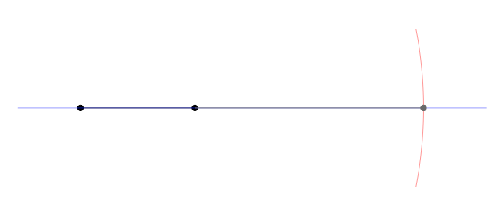
<p class="caption">(\#fig:construction-line-ABtimes2)길이가 선분 AB 길이의 2배인 선분 BC</p>
</div>

선분 $AB$와 선분 $CD$를 이용하여 길이가 $\overline{AB}$ + $\overline{CD}$인 선분 $EF$도 그려봅시다. 다섯 단계로 구분된 아래의 소스코드를 각 단계 별로 실행하면서 결과를 확인해 보세요. 

1. 선분 $AB$와 선분 $CD$를 추가합니다.


```r
A <- c(1,4); B <- c(5,4)  
C <- c(0,2); D <- c(6,2)
#점 A,B와 선분 AB 추가
plot(c(A[1],B[1]),c(A[2],B[2]),type="l",
  axes=FALSE,xlim=c(-2,15),ylim=c(-2,15),xlab="",ylab="")
points(c(A[1],B[1]),c(A[2],B[2]),pch=19,col='black')
my_text2(list(A,B),ptext=c('A','B'),dx=c(0,0),dy=c(-0.7,-0.7),
  color=c('black','black'))
#점 C,D와 선분 CD 추가
lines(c(C[1],D[1]),c(C[2],D[2])) 
points(c(C[1],D[1]),c(C[2],D[2]),pch=19,col='black')
my_text2(list(C,D),ptext=c('C','D'),dx=c(0,0),dy=c(-0.7,-0.7),
  color=c('black','black'),useItalic=FALSE)
```

2. 직선 $l$을 그리고 그 위에 한 점 $E$를 추가합니다.


```r
E <- c(0,0)
#직선 l 추가
abline(h=E[2], col=alpha("blue",0.3))
#점 E 추가
points(E[1],E[2],pch=19,col='dimgray')
```

3. 점 $E$로 부터 선분 $AB$의 거리를 반지름으로 하는 원을 그려 직선 $l$과의 교점 $G$를 구합니다.


```r
length_AB <- st_distance(st_point(A), st_point(B))
DrawArc(x=E[1],y=E[2],rx=length_AB,theta.1=-20/180*pi,theta.2=20/180*pi,
  col=alpha('red',0.5))
G <- getPoint1(E, length_AB, 0)
points(G[1],G[2],pch=19,col=alpha('dimgray',0.5))
```

4. 점 $G$로 부터 선분 $CD$의 거리를 반지름으로 하는 원을 그려 직선 $l$과의 교점 $F$를 구합니다. 


```r
length_CD <- st_distance(st_point(C), st_point(D))
DrawArc(x=G[1],y=G[2],rx=length_CD,theta.1=-20/180*pi,theta.2=20/180*pi,
  col=alpha('red',0.5))
F <- getPoint1(G, length_CD, 0)
points(F[1],F[2],pch=19,col='dimgray')
```

5. 점 $E$와 점 $F$ 사이를 잇는 선분 $EF$를 추가합니다.


```r
lines(c(E[1],F[1]),c(E[2],F[2]),lwd=2,col='dimgray')
my_text2(list(E,G,F),ptext=c('E','G','F'),dx=c(0,0,0),dy=c(-0.7,-0.7,-0.7),
  color=c('black','gray','black'),useItalic=FALSE)
```

위의 소스코드를 단계 별로 실행하면 그림 \@ref(fig:construction-line-EF)와 같은 그림을 그려볼 수 있습니다.  

<div class="figure" style="text-align: center">
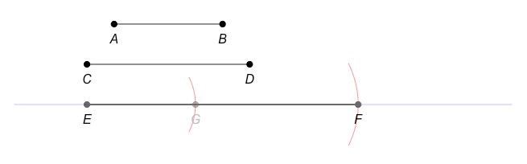
<p class="caption">(\#fig:construction-line-EF)길이가 선분 AB + 선분 CD인 선분 EF</p>
</div>

위에서 선분의 거리를 이용한 작도가 가능한 것처럼, 두 선분이 이루는 각을 이용한 작도 또한 가능합니다. 아래의 소스코드를 이용하여 주어진 두 선분이 이루는 각과 동일한 크기를 가지는 각을 그려보도록 합시다.

1. 각 $O$와 동일한 각을 가지는 각 $A$를 그리기 위하여 점 $A$를 지나는 선분을 추가합니다.


```r
O <- c(0,0); A <- c(10,0);
#점 A,B 추가
plot(c(O[1],A[1]),c(O[2],A[2]),type="p",pch=19,cex=0.7,
  axes=FALSE,xlim=c(-3,20),ylim=c(-3,20),xlab="",ylab="")
#직선 l 추가
abline(h=O[2], col=alpha("blue",0.3))
#선분 OM0 추가
angle <- 45  #각도 degree
M0 <- getPoint1(O, 8, angle)
lines(c(O[1],M0[1]),c(O[2],M0[2])) 
#선분 ON0 추가
N0 <- getPoint1(O, 8, 0)
lines(c(O[1],N0[1]),c(O[2],N0[2])) 
#선분 AB0 추가
B0 <- getPoint1(A, 8, 0)
lines(c(A[1],B0[1]),c(A[2],B0[2])) 
my_text2(list(O,A),ptext=c('O','A'),dx=c(0,0),dy=c(-1,-1),
  color=c('black','black'),useItalic=FALSE)
```

2. 점 $O$를 중심으로 하는 원을 그려 각 $O$의 두 변과의 교점 $M$, $N$을 추가합니다.


```r
length <- 3
DrawArc(x=O[1],y=O[2],rx=length,theta.1=-30/180*pi,theta.2=(angle+30)/180*pi,
  col=alpha('red',0.5))
M <- getPoint1(O, length, angle)
points(M[1],M[2],pch=19,col='gray',cex=0.7)
N <- getPoint1(O, length, 0)
points(N[1],N[2],pch=19,col='gray',cex=0.7)
my_text2(list(M,N),ptext=c('M','N'),dx=c(0,0),dy=c(1,-1),
  color=c('gray','gray'),useItalic=FALSE)
```

3. 점 $A$를 중심으로 반지름의 길이가 선분 $ON$인 원을 그려 주어진 반직선과의 교점 $B$를 추가합니다.


```r
length_ON <- st_distance(st_point(O), st_point(N))
DrawArc(x=A[1],y=A[2],rx=length_ON,theta.1=-30/180*pi,theta.2=(angle+30)/180*pi,
  col=alpha('red',0.5))
B <- getPoint1(A, length_ON, 0)
points(B[1],B[2],pch=19,col='gray',cex=0.7)
```

4. 선분 $MN$의 길이를 구합니다.


```r
length_MN <- st_distance(st_point(M), st_point(N))
angle_MNO <- 90 + angle/2
DrawArc(x=N[1],y=N[2],rx=length_MN,theta.1=(angle_MNO-30)/180*pi,
  theta.2=(angle_MNO+30)/180*pi,col=alpha('red',0.5))
```

5. 점 $B$를 중심으로 반지름의 길이가 선분 $MN$인 원을 그려 두 번째 단계에서 그린 원과의 교점 $C$를 추가합니다.


```r
DrawArc(x=B[1],y=B[2],rx=length_MN,theta.1=(angle_MNO-30)/180*pi,
  theta.2=(angle_MNO+30)/180*pi,col=alpha('red',0.5))
C <- getPoint1(A, length_ON, angle)
points(C[1],C[2],pch=19,col='gray',cex=0.7)
my_text2(list(B,C),ptext=c('B','C'),dx=c(0,0),dy=c(-1,1),
  color=c('gray','gray'),useItalic=FALSE)
```

6. 두 점 $A$와 $C$를 잇는 반직선을 그려서 각 $O$와 동일한 각 $A$를 구합니다.


```r
C0 <- getPoint1(A, 8, angle)
lines(c(A[1],C0[1]),c(A[2],C0[2]),col='dimgray') 
```

위의 소스코드를 단계 별로 실행하면 그림 \@ref(fig:construction-same-angle)가 생성됩니다. 

<div class="figure" style="text-align: center">
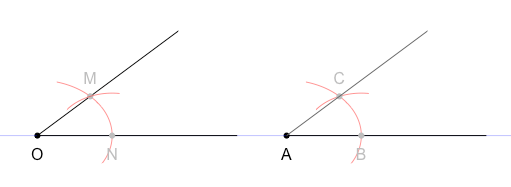
<p class="caption">(\#fig:construction-same-angle)각 O와 크기가 같은 각 A</p>
</div>

위의 소스코드의 각 $O$의 크기를 ```angle <- 45```에서 ```angle <- 115```로 변경하고 소스코드를 단계 별로 다시 실행해 보세요. 

이제 앞에서 배운 평행선에서의 동위각 성질을 이용하여 점 $P$를 지나고 직선 $l$에 평행한 직선을 그려보도록 하겠습니다. 일곱 단계로 작성된 아래의 소스코드를 단계 별로 실행해보면서 결과를 확인해 보세요.

1. 점 $A$, $B$를 지나는 직선 $l$과 점 $P$를 추가합니다.


```r
A <- c(3,2); B <- c(7,1)  
P <- c(5,6)
#점 A, B 추가
plot(c(A[1],B[1]),c(A[2],B[2]),type="p",pch=19,cex=0.7,col=alpha('dimgray',0.5),
  axes=FALSE,xlim=c(-1,10),ylim=c(-1,10),xlab="",ylab="")
my_text2(list(A,B),ptext=c('A','B'),
  dx=c(0,0),dy=c(-0.5,-0.5),color=rep(alpha('dimgray',0.5),2),useItalic=FALSE)
#점 A, B를 지나는 직선 l 구함; lm(y좌표 벡터 ~ x좌표 벡터)
l <- lm(c(A[2],B[2])~c(A[1],B[1]))
#직선 l의 일차방정식 y=a+bx
la <- as.numeric(l[[1]][1])
lb <- as.numeric(l[[1]][2])
getly <- function(lx) {return (la + lb*lx)}
#직선 l 추가
abline(l)
#점 P 추가
points(P[1],P[2],pch=19,col='black',cex=0.7)
my_text2(list(P),ptext=c('P'),dx=c(0),dy=c(0.5),color='black',useItalic=FALSE)
```

2. 점 $P$를 지나고 직선 $l$과 만나는 직선을 그립니다.


```r
#직선을 그리기 위하여 직선 l 위의 점 C 생성
cx <- 2; cy <- getly(cx)
C <- c(cx,cy)
#점 C 추가
points(C[1],C[2],pch=19,col=alpha('blue',0.5),cex=0.7)
my_text2(list(C),ptext=c('C'),dx=c(0),dy=c(-0.5),
  color=alpha('blue',0.5),useItalic=FALSE)
#점 P, C를 지나는 직선 m 구함; lm(y좌표 벡터 ~ x좌표 벡터)
m <- lm(c(P[2],C[2])~c(P[1],C[1]))
#직선 m 추가
abline(m,col=alpha('blue',0.5))
```

3. 점 $C$를 중심으로 하는 원을 그려 각 $C$의 윗변 교점 $D$와 아랫변 교점 $E$를 추가합니다.


```r
length <- 2
angle_C_vector <- my_draw_arc(B,C,P,r=length,color=alpha('red',0.5),over=20)
D <- getPoint1(C, length, angle_C_vector[2])
points(D[1],D[2],pch=19,col=alpha('red',0.5),cex=0.7)
E <- getPoint1(C, length, angle_C_vector[1])
points(E[1],E[2],pch=19,col=alpha('red',0.5),cex=0.7)
my_text2(list(D,E),ptext=c('D','E'),
  dx=c(0,0),dy=c(-0.5,-0.5),color=rep(alpha('red',0.5),2),useItalic=FALSE)
```

4. 점 $P$를 중심으로 반지름의 길이가 선분 $CD$인 원을 그려 주어진 직선과의 교점 $F$를 추가합니다.


```r
length_CD <- st_distance(st_point(C), st_point(D))
DrawArc(x=P[1],y=P[2],rx=length_CD,theta.1=(angle_C_vector[1]-20)/180*pi,
  theta.2=(angle_C_vector[2]+20)/180*pi,col=alpha('red',0.5))
F <- getPoint1(P, length_CD, angle_C_vector[2])
points(F[1],F[2],pch=19,col=alpha('red',0.5),cex=0.7)
my_text2(list(F),ptext=c('F'),dx=c(0),dy=c(0.5),
  color=alpha('red',0.5),useItalic=FALSE)
```

5. 선분 $DE$의 길이를 구합니다.


```r
length_DE <- st_distance(st_point(D), st_point(E))
angle_DE <- -1 * (90 - angle_C_vector[2] + angle_C_vector[3]/2)
DrawArc(x=D[1],y=D[2],rx=length_DE,theta.1=(angle_DE-30)/180*pi,
  theta.2=(angle_DE+30)/180*pi,col=alpha('red',0.5))
```

6. 점 $F$를 중심으로 선분 $DE$의 길이를 반지름으로 하는 원을 그려 두 번째 단계에서 그린 원과의 교점 $Q$를 추가합니다.


```r
DrawArc(x=F[1],y=F[2],rx=length_DE,theta.1=(angle_DE-30)/180*pi,
  theta.2=(angle_DE+30)/180*pi,col=alpha('red',0.5))
Q <- getPoint1(F, length_DE, angle_DE)
points(Q[1],Q[2],pch=19,col='black',cex=0.7)
my_text2(list(Q),ptext=c('Q'),dx=c(0),dy=c(0.5),color='black',useItalic=FALSE)
```

7. 두 점 $P$와 $Q$를 잇는 직선 $n$을 그려서 점 $A$와 점 $B$를 지나는 직선 $l$과 평행한 직선을 구합니다.


```r
n <- lm(c(P[2],Q[2])~c(P[1],Q[1]))
abline(n)
```

위의 소스코드를 단계 별로 실행하면 그림 \@ref(fig:construction-parallel)이 생성됩니다. 

<div class="figure" style="text-align: center">
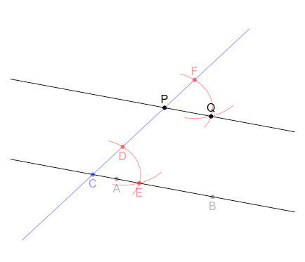
<p class="caption">(\#fig:construction-parallel)점 P를 지나고 직선 l과 평행한 직선</p>
</div>

지금까지 직선의 길이과 각을 이용한 각도에 대하여 알아보았습니다. 이제 삼각형의 작도로 넘어가 봅시다.


### 삼각형의 작도


삼각형 $ABC$를 기호로 $\triangle ABC$로 나타내고, $\angle A$와 마주 보는 변 $BC$를 $\angle A$의 **대변** (opposite side, opposite edge)이라 하고 $\angle A$를 변 $BC$의 **대각** (opposite angle)이라고 합니다. 이를 아래의 소스코드를 이용하여 그려보면 그림 \@ref(fig:triangle-angle-side)과 같습니다.


```r
A <- c(2,5); B <- c(0,0); C <- c(5,1)
#선분 AB, 선분 BC, 선분 CA 추가
plot(c(A[1],B[1]),c(A[2],B[2]),type="l",
  axes=FALSE,xlim=c(-2,7),ylim=c(-2,7),xlab="",ylab="")
lines(c(B[1],C[1]),c(B[2],C[2]),col='blue') 
lines(c(C[1],A[1]),c(C[2],A[2])) 
#점 A, B C 추가
points(c(A[1],B[1],C[1]),c(A[2],B[2],C[2]),pch=19,col=c('red','blue','blue'),cex=0.7)
my_text2(list(A,B,C),ptext=c('A','B','C'),
  dx=c(0,-0.5,0.5),dy=c(0.5,0,0),color=c('red','blue','blue'),useItalic=FALSE)
#각 A의 호 추가
my_draw_arc(B,A,C,0.7,'red')
```

<div class="figure" style="text-align: center">
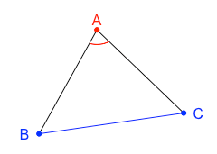
<p class="caption">(\#fig:triangle-angle-side)각 A의 대변 BC, 변 BC의 대각 A</p>
</div>

$\triangle ABC$에서 $\angle A$, $\angle B$, $\angle C$의 대변의 길이를 $a$, $b$, $c$로 나타내 볼 수 있습니다. 아래의 소스코드를 실행하면, 그림 \@ref(fig:triangle-angle-side)에서 그린 $\triangle ABC$의 세 대변의 길이 $a$, $b$, $c$를 그려볼 수 있습니다. 

소스코드 중 ```get_center_mid_point(p1,p2,r)```함수가 사용되었는데, 이 함수는 두 점 $p1$, $p2$를 지나는 원의 중심 좌표 ($x4$,$y4$)와 두 점의 중간 지점 ($x0$,$y0$)을 반환합니다. 함수의 반환값 (리턴값)은 함수 작성자의 필요에 따라 다양한 값을 가질 수 있습니다. 이 함수의 리턴값은 $4$개의 숫자값을 가진 벡터로 이루어져 있으며, 첫 두 값은  두 점 $p1$, $p2$를 지나는 원의 중심점 좌표 ($x4$,$y4$)를, 마지막 두 값은 두 점 $p1$, $p2$의 중간 지점($x0$,$y0$)을 반환하게 됩니다. 예를 들어, ```a <- get_center_mid_point(B,C,5)```와 같은 코드가 실행되면, ```a```는 $4$개의 숫자를 가지는 벡터를 리턴받게 되고, 두 점 $B$, $C$를 지나는 원의 중심점 좌표는 ```c(a[1],a[2])```, 두 점 $B$, $C$의 중간 지점의 좌표는 ```c(a[3],a[4])```와 같은 방식으로 얻을 수 있습니다.


```r
library(DescTools)  #DrawArc()함수를 위한 패키지 로딩
#두 점 p1, p2를 지나는 원의 중심 좌표 (x4,y4)와 두 점의 중간 지점 (x0,y0)을 구하는 함수
get_center_mid_point <- function(p1,p2,r) {
  xa <- 1/2*(p2[1]-p1[1]); ya <- 1/2 *(p2[2]-p1[2])
  x0 <- p1[1]+xa; y0 <- p1[2]+ya
  a <- sqrt(xa*xa + ya*ya); b <- sqrt(r*r - a*a)
  #x3 <- x0 + b*ya/a; y3 <- y0 - b*xa/a
  x4 <- x0 - b*ya/a; y4 <- y0 + b*xa/a
  #두 점을 지나는 원의 중심점과 두 점의 중간점을 반환함
  return (c(x4,y4,x0,y0))
}
#삼각형의 세 대변의 (x4,y4)와 (x0,y0)을 구함
a <- get_center_mid_point(B,C,5)
b <- get_center_mid_point(C,A,5)
c <- get_center_mid_point(A,B,5)
#두 점을 지나는 원의 중심 좌표를 이용하여 변의 길이 호를 추가 
my_draw_arc(B,c(a[1],a[2]),C,5,'black',lty=3)
my_draw_arc(C,c(b[1],b[2]),A,5,'black',lty=3)
my_draw_arc(A,c(c[1],c[2]),B,5,'black',lty=3)
#두 점의 중간 점 좌표를 이용하여 변의 길이 이름 a, b, c 추가 
my_text2(list(c(a[3],a[4]),c(b[3],b[4]),c(c[3],c[4])),ptext=c('a','b','c'),
  dx=c(0.5,1,-1),dy=c(-1,0.5,0.5),color=rep('black',3))
```

하나의 삼각형은 세 변의 길이와 세 각의 크기를 가집니다. 삼각형의 총 여섯 가지 특성 중에서 다음과 같이 특정한 세가지 특성 정보가 주어지면 그 삼각형을 작도해 볼 수 있습니다. 

1. 세 변의 길이가 주어질 때 (그림 \@ref(fig:triangle-three-sides))

<div class="figure" style="text-align: center">
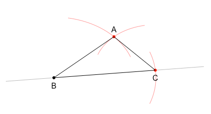
<p class="caption">(\#fig:triangle-three-sides)세 변의 길이가 주어질 때</p>
</div>


```r
a_length <- 5; b_length <- 3; c_length <- 4

# 1. 길이가 a인 선분 BC를 작도한다.
#점 B 추가
B <- c(0,0);
plot(c(B[1]),c(B[2]),type="p",pch=19,cex=0.7,col='black',
  axes=FALSE,xlim=c(-2,7),ylim=c(-2,7),xlab="",ylab="")
DrawArc(x=B[1],y=B[2],rx=a_length,theta.1=-20/180*pi,
  theta.2=20/180*pi,col=alpha('red',0.5))
#점 B와 C를 지나는 직선 l의 일차방정식 y = 0 + 0.1 * x
la <- 0; lb <- 0.1 #ly = la + lb * lx
get_ly <- function(lx) { return (la + lb*lx)}
lx <- 7; ly <- get_ly(lx)
#직선 l 추가
abline(a=la,b=lb,col=alpha('dimgray',0.5))
#직선 l의 각도 구하기
angle_l <- atan2(ly,lx) * 180 / pi
#점 C 추가
C <- getPoint1(B, a_length, angle_l)
points(C[1],C[2],pch=19,col='red',cex=0.7)
#선분 BC 추가
lines(c(B[1],C[1]),c(B[2],C[2])) 
my_text2(list(B,C),ptext=c('B','C'),
  dx=c(0,0),dy=c(-0.5,-0.5),color=rep('black',2),useItalic=FALSE)

# 2. 점 B를 중심으로 반지름의 길이가 c인 원을 그린다.
DrawArc(x=B[1],y=B[2],rx=c_length,theta.1=20/180*pi,
  theta.2=80/180*pi,col=alpha('red',0.5))

# 3. 점 C를 중심으로 반지름의 길이가 b인 원을 그린다.
DrawArc(x=C[1],y=C[2],rx=b_length,theta.1=100/180*pi,
  theta.2=160/180*pi,col=alpha('red',0.5))

# 4. #2와 #3에서 그린 두 원의 교점을 A라고 한다.
arc_C = st_cast(st_buffer(st_point(C), b_length),"LINESTRING")
arc_B = st_cast(st_buffer(st_point(B), c_length),"LINESTRING")
point_A <- st_intersection(arc_C,arc_B)
A <- c(point_A[1,1],point_A[1,2])
points(A[1],A[2],pch=19,col='red',cex=0.7)
my_text2(list(A),ptext=c('A'),
  dx=c(0),dy=c(0.5),color='black',useItalic=FALSE)

# 5. 길이가 c인 선분 AB와 길이가 b인 선분 AC를 작도한다.
#선분 AB 추가
lines(c(A[1],B[1]),c(A[2],B[2])) 
#선분 AC 추가
lines(c(A[1],C[1]),c(A[2],C[2])) 
```


2. 두 변의 길이와 그 끼인각의 크기가 주어질 때  (그림 \@ref(fig:triangle-two-sides))

<div class="figure" style="text-align: center">
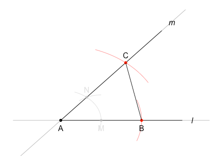
<p class="caption">(\#fig:triangle-two-sides)두 변의 길이와 그 끼인각의 크기가 주어질 때</p>
</div>


```r
A_angle <- 50; b_length <- 5; c_length <- 4

# 1. 각 A를 이루는 두 개의 반직선을 작도한다.
#점 A 추가
A <- c(0,0);
plot(c(A[1]),c(A[2]),type="p",pch=19,cex=0.7,col='black',
  axes=FALSE,xlim=c(-2,7),ylim=c(-2,7),xlab="",ylab="")
my_text2(list(A),ptext='A',dx=0,dy=-0.5,color='black',useItalic=FALSE)
#직선 l 추가, y = a + b*x
la <- 0; lb <- 0
get_ly <- function(lx) {return (0)}
abline(a=la,b=lb,col=alpha('dimgray',0.5))
#반직선 AP 추가
lx <- 6; ly <- get_ly(lx); P <- c(lx,ly)
lines(c(A[1],P[1]),c(A[2],P[2])) 
#직선 m 추가, y = a + b*x
ma <- 0; mb <- tan(A_angle*pi/180)
get_my <- function(mx) {return (ma + mb*mx)}
abline(a=ma,b=mb,col=alpha('dimgray',0.5))
#반직선 AQ 추가
mx <- 5; my <- get_my(mx); Q <- c(mx,my)
lines(c(A[1],Q[1]),c(A[2],Q[2])) 
my_text2(list(P,Q),ptext=c('l','m'),dx=c(0.5,0.5),dy=c(0,0.5),
  color=rep('black',2))
 
# 2. 주어진 각도를 작도하여 확인한다 (생략 가능). 
#점A에서 반지름 2인 원 추가
A_r <- 2
DrawArc(x=A[1],y=A[2],rx=A_r,theta.1=-20/180*pi,
  theta.2=(A_angle+20)/180*pi,col=alpha('gray',0.5))
#각 변과 원을 이용하여 교점 M과 N의 좌표를 구함  
l_line <- st_linestring(cbind(c(A[1],P[1]),c(A[2],P[2])))
m_line <- st_linestring(cbind(c(A[1],Q[1]),c(A[2],Q[2])))
A_arc = st_cast(st_buffer(st_point(A), A_r),"LINESTRING")
M_point <- st_intersection(l_line,A_arc)
N_point <- st_intersection(m_line,A_arc)
M <- c(M_point[1],M_point[2])
N <- c(N_point[1],N_point[2])
#교점 M과 N 추가
points(M[1],M[2],pch=19,col=alpha('gray',0.5),cex=0.7)
my_text2(list(M),ptext='M',dx=0,dy=-0.5,color=alpha('gray',0.5),useItalic=FALSE)
points(N[1],N[2],pch=19,col=alpha('gray',0.5),cex=0.7)
my_text2(list(N),ptext='N',dx=0,dy=0.5,color=alpha('gray',0.5),useItalic=FALSE)
#선분 MN의 거리 측정
length_MN <- st_distance(st_point(M), st_point(N))
#점 M를 중심으로 반지름의 길이가 선분 MN인 원을 그림
DrawArc(x=M[1],y=M[2],rx=length_MN,theta.1=90/180*pi,theta.2=130/180*pi,
  col=alpha('gray',0.5))

# 3. 점 A를 중심으로 반지름의 길이가 c인 원을 그려 각 A의 한 변과의 교점을 B라고 한다.
DrawArc(x=A[1],y=A[2],rx=c_length,theta.1=-20/180*pi,
  theta.2=20/180*pi,col=alpha('red',0.5))
B <- getPoint1(A, c_length, 0)
points(B[1],B[2],pch=19,col='red',cex=0.7)
my_text2(list(B),ptext='B',dx=0,dy=-0.5,color='black',useItalic=FALSE)

# 4. 점 A를 중심으로 반지름의 길이가 b인 원을 그려 각 A의 다른 한 변과의 교점을 C라고 한다.
DrawArc(x=A[1],y=A[2],rx=b_length,theta.1=(A_angle-20)/180*pi,
  theta.2=(A_angle+20)/180*pi,col=alpha('red',0.5))
C <- getPoint1(A, b_length, A_angle)
points(C[1],C[2],pch=19,col='red',cex=0.7)
my_text2(list(C),ptext='C',dx=0,dy=0.5,color='black',useItalic=FALSE)

# 5. 두 점 B와 C를 이어서 만든 삼각형 ABC를 완성한다.
lines(c(B[1],C[1]),c(B[2],C[2])) 
```


3. 한 변의 길이와 그 양 끝 각의 크기가 주어질 때 (그림 \@ref(fig:triangle-one-side))

<div class="figure" style="text-align: center">
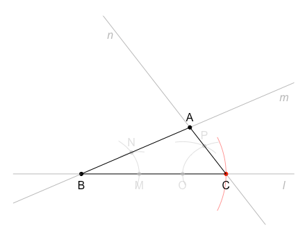
<p class="caption">(\#fig:triangle-one-side)한 변의 길이와 그 양 끝 각의 크기가 주어질 때</p>
</div>


```r
a_length <- 5; B_angle <- 30; C_angle <- 60

# 1. 길이가 a인 선분 BC를 작도한다.
#점 B 추가
B <- c(0,0);
plot(c(B[1]),c(B[2]),type="p",pch=19,cex=0.7,col='black',
  axes=FALSE,xlim=c(-2,7),ylim=c(-2,7),xlab="",ylab="")
DrawArc(x=B[1],y=B[2],rx=a_length,theta.1=-20/180*pi,
  theta.2=20/180*pi,col=alpha('red',0.5))
#점 B와 C를 지나는 직선 l의 일차방정식 y = a + b*x
la <- 0; lb <- 0  #ly = la + lb * lx
get_ly <- function(lx) { return (la + lb*lx)}
lx <- 7; ly <- get_ly(lx)
#직선 l 추가
abline(a=la,b=lb,col=alpha('dimgray',0.5))
my_text2(list(c(lx,ly)),ptext='l',dx=0,dy=-0.5,color=alpha('dimgray',0.5))
#직선 l의 각도 구하기
angle_l <- atan2(ly,lx) * 180 / pi
#점 C 추가
C <- getPoint1(B, a_length, angle_l)
points(C[1],C[2],pch=19,col='red',cex=0.7)
#선분 BC 추가
lines(c(B[1],C[1]),c(B[2],C[2])) 
my_text2(list(B,C),ptext=c('B','C'),
  dx=c(0,0),dy=c(-0.5,-0.5),color=rep('black',2),useItalic=FALSE)

# 2. 각 B를 위한 직선 m을 작도한다.
#각 B를 위한 직선 m의 일차방정식, y = a + b*x
ma <- 0; mb <- tan(B_angle*pi/180)  #my = ma + mb*mx
get_my <- function(mx) {return (ma + mb*mx)}
mx <- 7; my <- get_my(mx)
abline(a=ma,b=mb,col=alpha('dimgray',0.5))
my_text2(list(c(mx,my)),ptext='m',dx=0,dy=-0.5,color=alpha('dimgray',0.5))

# 3. 각 B를 작도하여 확인한다 (생략 가능). 
#점B에서 반지름 2인 원 추가
B_r <- 2
DrawArc(x=B[1],y=B[2],rx=B_r,theta.1=-20/180*pi,
  theta.2=(B_angle+20)/180*pi,col=alpha('gray',0.5))
#각 변과 원을 이용하여 교점 M과 N의 좌표를 구함  
l_line <- st_linestring(cbind(c(B[1],lx),c(B[2],ly)))
m_line <- st_linestring(cbind(c(B[1],mx),c(B[2],my)))
B_arc = st_cast(st_buffer(st_point(B), B_r),"LINESTRING")
M_point <- st_intersection(l_line,B_arc)
N_point <- st_intersection(m_line,B_arc)
M <- c(M_point[1],M_point[2])
N <- c(N_point[1],N_point[2])
#교점 M과 N 추가
points(M[1],M[2],pch=19,col=alpha('gray',0.5),cex=0.7)
my_text2(list(M),ptext='M',dx=0,dy=-0.5,color=alpha('gray',0.5),useItalic=FALSE)
points(N[1],N[2],pch=19,col=alpha('gray',0.5),cex=0.7)
my_text2(list(N),ptext='N',dx=0,dy=0.5,color=alpha('gray',0.5),useItalic=FALSE)
#선분 MN의 거리 측정
length_MN <- st_distance(st_point(M), st_point(N))
#점 M를 중심으로 반지름의 길이가 선분 MN인 원을 그림
DrawArc(x=M[1],y=M[2],rx=length_MN,theta.1=80/180*pi,theta.2=130/180*pi,
  col=alpha('gray',0.5))

# 4. 각 C를 위한 직선 n을 작도한다.
#각 C를 위한 직선 n의 일차방정식, y = a + b*x
C_angle <- 180 - C_angle  #반대 방향으로 작도하므로
nb <- tan(C_angle*pi/180)  #ny = na + nb*nx
na <- C[2] - nb * C[1]     #na = ny - nb*nx 
get_ny <- function(nx) {return (na + nb*nx)}
nx <- 1; ny <- get_ny(nx)
abline(a=na,b=nb,col=alpha('dimgray',0.5))
my_text2(list(c(nx,ny)),ptext='n',dx=0,dy=-0.5,color=alpha('dimgray',0.5))

# 5. 각 C를 작도하여 확인한다 (생략 가능). 
#점C에서 반지름 2인 원 추가
C_r <- 1.5
DrawArc(x=C[1],y=C[2],rx=C_r,theta.1=(C_angle-20)/180*pi,
  theta.2=(180+20)/180*pi,col=alpha('gray',0.5))
#각 변과 원을 이용하여 교점 O과 P의 좌표를 구함  
l_line2 <- st_linestring(cbind(c(C[1],B[1]),c(C[2],B[2])))
n_line <- st_linestring(cbind(c(C[1],nx),c(C[2],ny)))
C_arc = st_cast(st_buffer(st_point(C), C_r),"LINESTRING")
O_point <- st_intersection(l_line2,C_arc)
P_point <- st_intersection(n_line,C_arc)
O <- c(O_point[1],O_point[2])
P <- c(P_point[1],P_point[2])
#교점 O와 P 추가
points(O[1],O[2],pch=19,col=alpha('gray',0.5),cex=0.7)
my_text2(list(O),ptext='O',dx=0,dy=-0.5,color=alpha('gray',0.5),useItalic=FALSE)
points(P[1],P[2],pch=19,col=alpha('gray',0.5),cex=0.7)
my_text2(list(P),ptext='P',dx=0,dy=0.5,color=alpha('gray',0.5),useItalic=FALSE)
#선분 OP의 거리 측정
length_OP <- st_distance(st_point(O), st_point(P))
#점 O를 중심으로 반지름의 길이가 선분 OP인 원을 그림
DrawArc(x=O[1],y=O[2],rx=length_OP,theta.1=40/180*pi,theta.2=100/180*pi,
  col=alpha('gray',0.5))

# 6. 두 반직선의 교점을 A라고 한다.
m_line <- st_linestring(cbind(c(B[1],mx),c(B[2],my)))
n_line <- st_linestring(cbind(c(C[1],nx),c(C[2],ny)))
A_point <- st_intersection(m_line,n_line)
A <- c(A_point[1],A_point[2])
points(A[1],A[2],pch=19,col='black',cex=0.7)
my_text2(list(A),ptext='A',dx=0,dy=0.5,color='black',useItalic=FALSE)

# 7. 선분 AB와 선분 AC를 작도한다.
#선분 AB 추가
lines(c(A[1],B[1]),c(A[2],B[2])) 
#선분 AC 추가
lines(c(A[1],C[1]),c(A[2],C[2])) 
```

### 삼각형의 합동 조건

두 개의 도형이 모양 (shape)과 크기 (size)가 같아서 완전히 겹쳐질 때 서로 **합동** (congruence) 이라고 합니다. 두 개의 삼각형을 똑같은 조건으로 작도하였을 경우, 두 삼각형은 모양과 크기가 같기 때문에 두 삼각형은 합동입니다. 아래의 소스코드를 이용하여 모양과 크기가 같은 $\triangle ABC$와 $\triangle DEF$를 그려볼 수 있습니다 (그림 \@ref(fig:triangle-congruence)).


```r
#점 A, B, C의 좌표
A <- c(3,3); B <- c(0,0); C <- c(4,0)
#점 D, E, F의 좌표
D <- c(9,3); E <- c(6,0); F <- c(10,0)
#선분 AB, 선분 BC, 선분 CA 추가
plot(c(A[1],B[1]),c(A[2],B[2]),type="l",
  axes=FALSE,xlim=c(-1,11),ylim=c(-1,11),xlab="",ylab="")
lines(c(B[1],C[1]),c(B[2],C[2])) 
lines(c(C[1],A[1]),c(C[2],A[2])) 
my_text2(list(A,B,C),ptext=c('A','B','C'),dx=c(0,0,0),dy=c(0.5,-0.5,-0.5),
  color=rep('black',3),useItalic=FALSE)
#선분 DE, 선분 EF, 선분 FD 추가
lines(c(D[1],E[1]),c(D[2],E[2]))
lines(c(E[1],F[1]),c(E[2],F[2])) 
lines(c(F[1],D[1]),c(F[2],D[2])) 
my_text2(list(D,E,F),ptext=c('D','E','F'),dx=c(0,0,0),dy=c(0.5,-0.5,-0.5),
  color=rep('black',3),useItalic=FALSE)
#각 기호 추가
my_draw_arc(B,A,C,0.5,'red'); my_draw_arc(E,D,F,0.5,'red')
my_draw_arc(C,B,A,0.5,'green'); my_draw_arc(F,E,D,0.5,'green')
my_draw_arc(A,C,B,0.5,'blue'); my_draw_arc(D,F,E,0.5,'blue')
#변 기호 추가
my_text2(list(c((A[1]+B[1])/2,(A[2]+B[2])/2),c((D[1]+E[1])/2,(D[2]+E[2])/2),
              c((B[1]+C[1])/2,(B[2]+C[2])/2),c((E[1]+F[1])/2,(E[2]+F[2])/2),
              c((C[1]+A[1])/2,(C[2]+A[2])/2),c((F[1]+D[1])/2,(F[2]+D[2])/2)),
  ptext=rep(c('|','||','o'),each=2),
  dx=rep(0,6),dy=rep(0,6),color=rep('black',6),useItalic=FALSE)
```

<div class="figure" style="text-align: center">
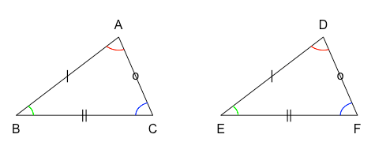
<p class="caption">(\#fig:triangle-congruence)서로 합동인 삼각형 ABC$와 삼각형 DEF</p>
</div>

$\triangle ABC$와 $\triangle DEF$가 아래 세가지 조건 중 하나를 만족시킬 때, 두 삼각형은 서로 합동이라고 하고, 기호로는 $\triangle ABC \equiv \triangle DEF$와 같이 나타냅니다. S는 변 (Side), A는 각 (Angle)을 의미합니다. 

1. 대응하는 세 변의 길이가 각각 같을 때 (SSS 합동)

$$\overline{AB} = \overline{DE}, \quad \overline{BC} = \overline{EF}, \quad \overline{CA} = \overline{FD}$$

2. 대응하는 두 변의 길이가 각각 같고, 그 끼인각의 크기가 같을 때 (SAS 합동)

$$\overline{AB} = \overline{DE}, \quad \angle B  = \angle E, \quad \overline{BC} = \overline{EF}$$

3. 대응하는 한 변의 길이가 같고, 그 양 끝 각의 크기가 각각 같을 때 (ASA 합동)

$$\angle B  = \angle E, \quad \overline{BC} = \overline{EF}, \quad \angle C  = \angle F$$

이번 장에서는 점, 선, 면에 대해서 알아보고, 점, 직선, 평면의 위치 관계도 살펴보았습니다. 각, 평행선, 삼각형의 성질을 알아보고 직접 그려보았습니다. 이러한 각 과정들이 소스코드로 어떻게 구현되는지도 알아보았습니다. 이제 **\@ref(features-characteristics)장 도형의 성질**에 대하여 본격적으로 알아봅시다. 
