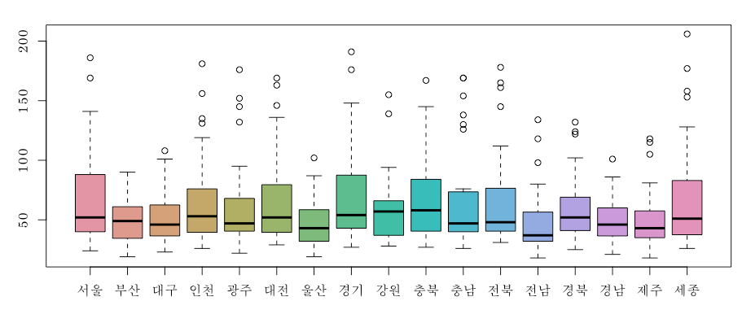
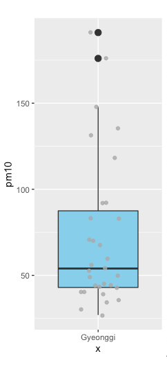
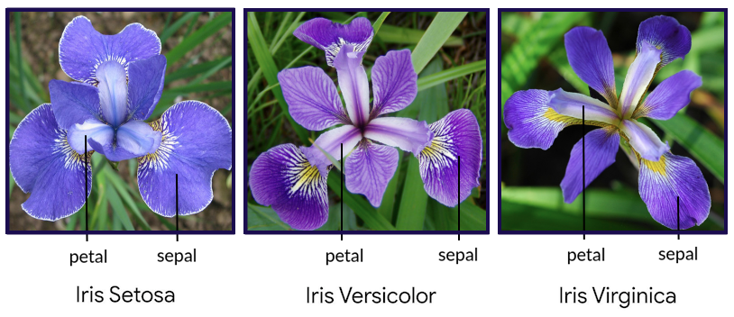
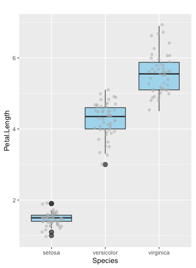
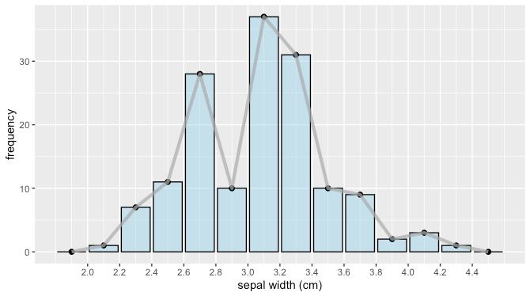
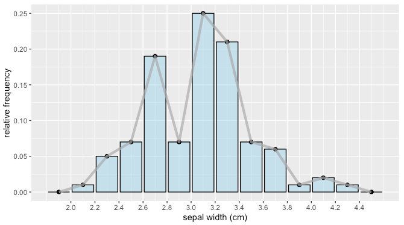
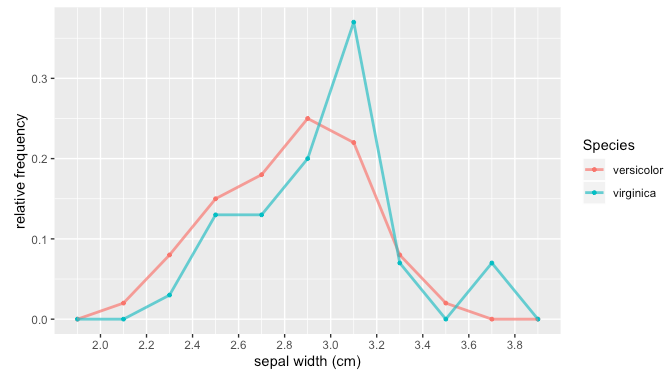

# 통계 {#statistics}

어떤 현상을 파악하거나 중요한 결정을 할 때에는 근거가 되는 자료가 필요합니다. 경제, 사회, 의학, 과학 등 다양한 분야에서 자료가 수집, 정리, 해석되어 여러 현상을 파악하고 중요한 의사 결정의 근거로 사용되고 있습니다. 자료의 수집 방법, 정리 방법, 해석 방법에 대하여 알아봅니다. 

RStudio가 열려 있지 않으면 RStudio를 실행하고 메뉴에서 File >> Open Project…를 클릭하여 이전에 저장한 R 프로젝트 파일인 rmath01.Rproj을 찾아서 선택하고 Open 버튼을 클릭하여 이전에 작업하던 프로젝트 환경을 로딩합니다. 파일탐색기나  파인더에서 rmath01.Rproj 파일을 찾아서 더블 클릭하여도 RStudio가 실행되면서 작업하던 프로젝트 환경이 로딩됩니다. 프로젝트 환경이 로딩된 후에 RStudio 콘솔창에 ```getwd()```를 실행하여 작업 환경이 제대로 로딩되었는지 확인합니다. RStudio 환경이 잘 로딩되었으면, 이제 본격적으로 시작해 봅시다.

## 대푯값과 그림 상자

최근 미세먼지가 가장 심했던 $2019$년 $3$월의 일별 미세먼지 $PM_{10}$ 농도 자료 (데이터)를 이용하여 평균 (mean), 중앙값 (median) 등의 대푯값 (representative value)들을 확인하고 데이터의 분포를 상자 그림 (박스 플롯, box plot)으로 그려봅시다.

변수 (variable)가 숫자를 값으로 취하는 반면, **변량 (variate)**은 일별 미세먼지 농도와 같이 양을 값으로 취합니다. 따라서, 일별 미세먼지 농도 값을 변량이라고 하고 $2019$년 $3$월의 데이터는 $31$개의 변량을 가집니다.

$PM_{10}$ (particulate matter $10 micrometers$)은  지름이 $10 \mu m$ 이하인 미세먼지를, $PM_{2.5}$ (particulate matter $2.5 micrometers$)는 지름이 $2.5 \mu m$ 이하인 초미세먼지를 말합니다. $1 \mu m$는 $1 \times {10}^{-6}m$의 크기이기 때문에, $10 \mu m = \frac{10}{1000000} m = 0.00001 m = 0.001cm = 0.01mm$이고 $2.5 \mu m = 0.0025 mm$입니다.

$$1 km = 1 \times {10}^{3}m = 1 \times 1000 m$$
$$1 cm = 1 \times {10}^{-2}m = \frac{1}{100} m$$
$$1 mm = 1 \times {10}^{-3}m = \frac{1}{1000} m$$
$$1  \mu m = 1 \times {10}^{-6}m = \frac{1}{1000000} m = \frac{1}{1000} mm$$

이제, $2019$년 $3$월 시도별 미세먼지 농도 엑셀 파일을 다운로드해 봅시다. <https://www.airkorea.or.kr> >> 실시간 자료조회 >> 시도별 대기정보 >> 시도별 대기정보($PM_{10}$) >> 월별 $2019$년 $3$월 >> 검색 클릭 >> 엑셀 클릭의 순서로 엑셀 파일을 다운로드할 수 있습니다. 엑셀 파일을 다운로드한 후, 파일명을 ```sidoAirInfo.xls```에서 ```pm10.xls```로 변경하여 사용합니다. <https://www.airkorea.or.kr>에서 $2019$년 $3$월의 미세먼지 현황 데이터를 검색할 수 없다면 <https://rebrand.ly/201903pm10xls>에서 다운로드한 후, 파일명을 ```pm10.xls```로 변경하여 사용하세요.

다운로드한 엑셀 파일을 현재 작업 디렉토리로 이동합니다. 탐색기나 파인더에서 작업 디렉토리에 있는 rmath01.Rproj 파일을 더블클릭하여 RStudio를 실행합니다. RStudio의 콘솔창에서 ```getwd()```를 실행하여 현재 작업 디렉토리를 확인하고, ```pm10.xls```파일을 현재 작업 디렉토리로 옮깁니다.

엑셀 파일을 읽어서 티블 (tibble) 데이터 객체를 생성합니다. 티블은 ```tidyverse```패키지가 제공하는 데이터 객체 형태로 데이터 프레임과 유사하지만 좀 더 편리한 기능을 추가한 형태로 생각하면 됩니다. 티블을 데이터 프레임 처럼 사용하여도 무방하고, 티블을 데이터 프레임의 형태로 변환하여 사용하여도 됩니다.


```r
#엑셀파일을 읽어오기 위하여 아래 둘 중 하나의 패키지를 로딩합니다.
library(tidyverse)
library(readxl)
#엑셀 파일을 읽어서 티블 생성
#엑셀의 4번째행부터 35번째행까지 데이터가 존재
#4번째행은 컬럼명, 5번째행부터 35번째까지 31개행의 데이터가 존재함
pm10_tbl <- read_excel('pm10.xls', sheet = 1, range = cell_rows(4:35))
pm10_tbl
```

각 컬럼 벡터는 미세먼지 $PM_{10}$ 농도 변량을 벡터값으로 가지므로, 변량의 통계를 얻기 위해서는 컬럼의 데이터 형태가 숫자이어야만 합니다. 엑셀 파일로 부터 생성한 티블의 컬럼들이 모두 문자값을 가지는 것을 확인한 후, 각 시도 별 미세먼지 값을 가지는 컬럼들을 문자값에서 숫자값을 가지도록 변경합니다.


```r
str(pm10_tbl) #티블의 컬럼 구조 확인
#숫자값을 가진 컬럼을 숫자컬럼으로 변경
pm10_tbl <- pm10_tbl %>%
    mutate_all(type.convert) %>%
    mutate_if(is.numeric, as.numeric) 
str(pm10_tbl) #티블의 컬럼 구조 다시 확인
colnames(pm10_tbl) #티블의 컬럼명 확인
```

티블 ```pm10_tbl```의 경우 엑셀에서 $31$행의 데이터를 불러 들였기 때문에 ```NA``` (not assigned) 값을 가진 행이 존재하지 않습니다. 하지만, 월 데이터가 $31$행보다 적은데 $31$행의 데이터를 불러들인 경우에는 ```NA```값을 가지는 행들이 존재하게 됩니다. 이런 경우 아래의 소스코드를 이용하여  ```NA```값을 가진 행을 제거할 수 있습니다. 물론, ```read_excel()```을 이용하여 엑셀을 불러들일 때, ```range``` 입력값을 정확히 하여 처음부터 불필요한 행이 없도록 티블 (데이터 프레임)을 생성하는 것이 가장 좋습니다.


```r
dim(pm10_tbl)   #티블의 행과 열의 개수 확인
tail(pm10_tbl)  #티블의 마지막 6행 값을 확인
pm10_tbl <- na.omit(pm10_tbl)  #NA값을 가지는 행을 제거
dim(pm10_tbl)   #티블의 행과 열의 개수 다시 확인
tail(pm10_tbl)  #티블의 마지막 6행 값을 다시 확인
```

티블에 저장된 시도별 일 데이터의 평균, 중앙값, 최소값 (min), 최대값 (max) 등의 대푯값들을 확인하고 상자 그림 (박스 플롯, box plot)을 그려봅시다. 

중앙값은 전체 변량을 작은 수에서 큰 수로 정렬했을 때 가운데에 위치하는 값입니다. $1$,$2$,$3$,$4$,$5$의 평균과 중앙값은 둘 다 $3$으로 평균과 중앙값의 차이가 느껴지지 않지만, $1$,$2$,$3$,$4$,$500$의 경우에는 평균은 $102$이고 중앙값은 여전히 $3$입니다. 평균과 중앙값의 차이가 크다는 것은 변량의 분포가 한 쪽에 치우쳐 있거나 다른 변량과 차이가 큰 변량이 존재한다는 것을 의미합니다. $1$,$2$,$3$,$4$와 같이 변량의 개수가 짝수인 경우에는 가운데 두 값 ($2$,$3$)의 가운데 값인 $2.5$가 중앙값이 됩니다.

상자 그림은 상자 수염 그림 (box-and-whisker plot)이라고도 합니다. 박스의 내부에 있는 짙은 가로줄 (```➖```)은 각 시도의 중앙값 (중위수, $\frac{1}{2}$분위수)을, 박스의 상단은 $\frac{3}{4}$분위수, 박스의 하단은 $\frac{1}{4}$분위수를 나타내며, 박스는 중앙값을 기준으로 $\frac{1}{4}$분위수로 부터 $\frac{3}{4}$분위수 까지의 데이터 범위를 보여줍니다. 박스 위와 아래에 있는 세로줄 (```|```)은 수염 (whisker) 부분으로 각각 최대값 (최대값 예상치)과 최소값 (최소값 예상치)까지의 범위를 나타냅니다. 상단 수염과 하단 수염의 바깥 부분에 존재 하는 원모양 (```○```)은 데이터의 예상 범위를 많이 벗어난 아주 작은 값이나 아주 큰 값을 나타낸 것으로 이상치(극단치, 이상점, outlier)라고 부릅니다. 

대부분의 시도들에서 상자가 중앙값 윗부분이 아랫부분보다 더 길고, 상단 수염이 하단 수염보다 더 길게 뻗어있고 상단 수염 위에 이상치 (극단치)도 가지고 있을 뿐 아니라 실외 할동을 자제할 것을 권고하는 기준인 미세먼지 농도 $81 \mu g/{m}^3$이상인 날들도 많았음을 알 수 있습니다 (그림 \@ref(fig:pm10-sido-2019-03)). 


```r
colnames(pm10_tbl)
color <- colorspace::rainbow_hcl(17)   #색상 벡터 생성
```

```r
### 한글 폰트 로딩 시작 #######################################
#4.1절 순서쌍과 좌표를 참고하여 피보나치 사각형 그래프에서 사용한 한글 폰트를 확인하고 아래 myfont 부분을 환경에 맞게 변경
myfont <- "AppleMyungjo"  #여러분의 컴퓨터 환경에 맞도록 변경하세요! 
par(family=myfont)        #한글 폰트 로딩 
### 한글 폰트 로딩 종료 #######################################
```


```r
summary(pm10_tbl[,-c(1)]) #시도 별 평균, 최소값, 최대값, 중앙값 (중위수, 1/2분위수), 1/4분위수, 3/4분위수 확인
boxplot(pm10_tbl[,-c(1)],col=color) #날짜 컬럼을 제외한 모든 컬럼의 박스 플롯 그리기
```

<div class="figure" style="text-align: center">

<p class="caption">(\#fig:pm10-sido-2019-03)$18$개 시도 별 미세먼지 농도 (2019년 3월) 데이터의 박스 플롯</p>
</div>

한국 기준에 따르면 미세먼지 $PM_{10}$ 농도가 $81 \mu g/{m}^3$이상이면 나쁨, $151 \mu g/{m}^3$이상이면 매우 나쁨으로 구분되고, 세계보건기구 (World Health Organization, WHO)의 기준에 따르면 $51 \mu g/{m}^3$이상이면 나쁨, $76 \mu g/{m}^3$이상이면 상당히 나쁨, $101 \mu g/{m}^3$이상이면 매우 나쁨, $151 \mu g/{m}^3$이상이면 최악으로 구분됩니다. 

이제 여러분이 살고 있는 시도의 데이터에 집중해 봅시다. 아래 코드의 ```colnames(pm10_df)```를 이용하여 여러분이 살고 있는 시도의 컬럼이 몇 번째인지를 확인하고 해당 시도의 자료를 선택하고 박스 플롯을 그려보고 대표값들을 화면에 출력합니다. 아래의 소스코드에서는 경기도 컬럼을 선택하였습니다.


```r
pm10_df <- data.frame(pm10_tbl)  #티블을 데이터 프레임으로 변환
colnames(pm10_df)  #컬럼 이름들을 확인한 후에 날짜 컬럼과 여러분이 살고 있는 시도 컬럼만 선택합니다.
pm10_df2 <-  pm10_df[,c(1,9)]  #날짜와 경기도 컬럼만 선택
colnames(pm10_df2) <- c('date','pm10')
str(pm10_df2) #날짜가 Factor로 되어있는 걸 확인 
pm10_df2 <- pm10_df2 %>%
	mutate_if(is.factor, as.character)  #Factor로 인코딩되어있는 컬럼을 문자형으로 변경
dim(pm10_df2)
head(pm10_df2)
pm10_df2$pm10
boxplot(pm10_df2$pm10,col='skyblue')
summary(pm10_df2$pm10
```

```ggplot()```으로도 박스 플롯을 그려볼 수도 있습니다. 필요에 따라 박스 플롯과 각 변량을 동시에 그려볼 수 도 있습니다.


```r
library(ggplot2)
ggplot(pm10_df2,aes("Gyeonggi",pm10)) + geom_boxplot(fill='skyblue') 
```


```r
ggplot(pm10_df2,aes("Gyeonggi",pm10)) + 
	geom_boxplot(fill='skyblue',outlier.size = 3) +     #극단치는 검은색 큰 원
	geom_jitter(width = 0.2, col='darkgray',alpha=0.8)  #각 변량은 회색 원
```

대표값들 중 평균과 중앙값의 차이가 크다는 것은 크게 치우친 값이 포함되어 있다는 뜻이고, 값의 치우침은 박스 플롯으로도 확인할 수 있습니다. 경기도의 경우, $2019$년 $3$월의 미세먼지 $PM_{10}$ 농도가 $150 \mu g/{m}^3$을 훨씬 초과하는 변량도 $2$개나 포함되어 있습니다. $\frac{3}{4}$분위수가 $87.5$이므로 전체 $31$개의 변량 중 $87.5$를 초과하는 변량의 개수도 전체 개수의 $\frac{1}{4}$인 $8$개나 됩니다 (그림 \@ref(fig:pm10-gyeonggi-2019-03)).


```r
   Min. 1st Qu.  Median    Mean 3rd Qu.    Max. 
  27.00   43.00   54.00   72.42   87.50  191.00 
```

<div class="figure" style="text-align: center">

<p class="caption">(\#fig:pm10-gyeonggi-2019-03)경기도 미세먼지 농도 (2019년 3월) 박스 플롯과 $31$개의 변량</p>
</div>

## 줄기와 잎 그림과 도수분포표


```r
head(pm10_df2)
tail(pm10_df2)
pm10_df3 <- pm10_df2 %>% 
	arrange(pm10,date) %>%  #pm10 컬럼의 변량이 작은 값부터 큰 값 순서로 정렬 (sorting) 
	# x %/% 10: 10으로 나눈 몫 = 십의 자리, x %% 10: 10으로 나눈 나머지 = 일의 자리
	mutate(tens = pm10 %/% 10, ones = pm10 %% 10) #십의 자리 컬럼, 일의 자리 컬럼 생성
head(pm10_df3)
saveRDS(pm10_df3, 'pm10_df3.rds') #pm10_df3 데이터 프레임을 rds로 저장
pm10_df3$pm10
```

변량을 십의 자리 (줄기)와 일의 자리 (잎)로 구분하여 변량의 분포 상태를 쉽게 파악할 수 있도록 그림으로 정리하는 나타낸 것을 **줄기와 잎 그림**이라고 합니다. 미세먼지 농도 데이터의 줄기와 잎 그림을 그리기 위하여 십의 자리 컬럼으로 그룹을 생성하고 그룹 별 일의 자리 컬럼을 가지는 데이터 프레임을 얻고 이를 이용하여 줄기 벡터와 잎 벡터를 생성할 수 있습니다. 그런 다음에, 두 벡터를 컬럼으로 하는 데이터 프레임을 얻을 수 있습니다. 아래의 소스코드로 생성된 두 데이터 프레임 ```stem_leaf_df```와 ```stem_leaf_df2```의 데이터를 콘솔창에서 확인하고 차이점을 생각해 보세요.


```r
library(tidyverse)
pm10_df3 <- readRDS(file = "pm10_df3.rds")
pm10_tens_list <- pm10_df3 %>% 
	  select(tens,ones) %>%  #십의 자리 컬럼과 일의 자리 컬럼만 선택
	  group_by(tens) %>%     #십의 자리 컬럼으로 그룹을 생성
	  group_map(~ .x)        #그룹 별로 일의 자리 컬럼을 가지는 티블 (데이터 프레임) 생성
#head(pm10_tens_list)  
stem <- unique(pm10_df3$tens) #줄기 벡터 생성
leaf <- c()                   #잎 벡터 초기화
for (i in 1:length(stem)) {
	leaf <- c(leaf, paste(pm10_tens_list[[i]]$ones,collapse=" "))
}

#잎이 있는 줄기만 행으로 존재하는 데이터 프레임 생성
stem_leaf_df <- data.frame(stem=stem,leaf=leaf)
#잎의 유무와 관계없이 모든 줄기를 가지는 벡터를 컬럼으로 가지는 데이터 프레임 생성
stem_all_df <- data.frame(stem=seq(min(stem),max(stem),by=1))
#stem_all_df 데이터 프레임을 기준으로 stem_leaf_df를 붙임
stem_leaf_df2 <-  stem_all_df %>% left_join(stem_leaf_df,by="stem")
#stem_leaf_df2 <-  left_join(stem_all_df, stem_leaf_df,by="stem")
```

위의 소스코드를 실행할 때 에러가 발생하면, 아래와 같이 ```select()```함수 부분 코드를 확인해보세요. 


```r
pm10_df3 %>% 
	  select(tens,ones)
```

아래 소스코드는 ```dplyr```패키지의 ```select()```함수를 이용하여 데이터 프레임에서 특정 컬럼 만을 가지는 부분 집합을 추출하는 역활을 합니다. 이 부분이 정상적으로 실행되지 않는 이유는 ```select()```함수가 ```plotly```패키지에도 존재하기 때문에 어떤 패키지에서 ```select()```함수를 가져다 써야 하는지 명확하지 않아서 입니다. 그런 상황이 발생하면, 아래와 같이 함수를 사용할 때 패키지명을 앞에 붙여 어떤 패키지의 함수를 쓰는지 명확하게 해주거나, 사용하지 않는 패키지를 언로딩한 후에 사용하면 됩니다. 


```r
pm10_df3 %>% 
	  dplyr::select(tens,ones)  #dplyr 패키지의 select() 함수를 사용
```


```r
detach("package:plotly", unload=TRUE) #plotly 패키지를 언로딩 (unloading)한 후에 select()함수 사용
pm10_df3 %>% 
	  select(tens,ones)
```

다시 본론으로 돌아와서, 미세먼지 농도 $31$개의 변량들과 ```stem_leaf_df2```로 생성한 줄기와 잎 그림 (표 \@ref(tab:pm10-stem-leaf-table))을 비교해보세요. 줄기와 잎 그림으로 부터, 십의 자리가 $3$, $4$, $5$인 변량이 $16$개로 가장 많으며, 십의 자리가 $10$, $12$, $15$, $16$, $18$인 변량은 존재하지 않는다는 것을 알 수 있습니다.


```
##  [1]  27  30  34  36  39  40  40  43  43  44  44  45  49
## [14]  50  53  54  56  60  68  70  71  83  83  92  92 118
## [27] 131 135 148 176 191
```

<table class="table" style="font-size: 15px; width: auto !important; margin-left: auto; margin-right: auto;">
<caption style="font-size: initial !important;">(\#tab:pm10-stem-leaf-table)줄기 (십의 자리)와 잎 (일의 자리) 그림</caption>
 <thead>
  <tr>
   <th style="text-align:center;"> 줄기 </th>
   <th style="text-align:center;border-right:1px solid;border-right:double lightgrey;"> 잎 </th>
   <th style="text-align:center;"> 줄기 </th>
   <th style="text-align:center;"> 잎 </th>
  </tr>
 </thead>
<tbody>
  <tr>
   <td style="text-align:center;"> 2 </td>
   <td style="text-align:center;width: 10em; border-right:1px solid;border-right:double lightgrey;"> 7 </td>
   <td style="text-align:center;"> 11 </td>
   <td style="text-align:center;width: 10em; "> 8 </td>
  </tr>
  <tr>
   <td style="text-align:center;"> 3 </td>
   <td style="text-align:center;width: 10em; border-right:1px solid;border-right:double lightgrey;"> 0 4 6 9 </td>
   <td style="text-align:center;"> 12 </td>
   <td style="text-align:center;width: 10em; ">  </td>
  </tr>
  <tr>
   <td style="text-align:center;"> 4 </td>
   <td style="text-align:center;width: 10em; border-right:1px solid;border-right:double lightgrey;"> 0 0 3 3 4 4 5 9 </td>
   <td style="text-align:center;"> 13 </td>
   <td style="text-align:center;width: 10em; "> 1 5 </td>
  </tr>
  <tr>
   <td style="text-align:center;"> 5 </td>
   <td style="text-align:center;width: 10em; border-right:1px solid;border-right:double lightgrey;"> 0 3 4 6 </td>
   <td style="text-align:center;"> 14 </td>
   <td style="text-align:center;width: 10em; "> 8 </td>
  </tr>
  <tr>
   <td style="text-align:center;"> 6 </td>
   <td style="text-align:center;width: 10em; border-right:1px solid;border-right:double lightgrey;"> 0 8 </td>
   <td style="text-align:center;"> 15 </td>
   <td style="text-align:center;width: 10em; ">  </td>
  </tr>
  <tr>
   <td style="text-align:center;"> 7 </td>
   <td style="text-align:center;width: 10em; border-right:1px solid;border-right:double lightgrey;"> 0 1 </td>
   <td style="text-align:center;"> 16 </td>
   <td style="text-align:center;width: 10em; ">  </td>
  </tr>
  <tr>
   <td style="text-align:center;"> 8 </td>
   <td style="text-align:center;width: 10em; border-right:1px solid;border-right:double lightgrey;"> 3 3 </td>
   <td style="text-align:center;"> 17 </td>
   <td style="text-align:center;width: 10em; "> 6 </td>
  </tr>
  <tr>
   <td style="text-align:center;"> 9 </td>
   <td style="text-align:center;width: 10em; border-right:1px solid;border-right:double lightgrey;"> 2 2 </td>
   <td style="text-align:center;"> 18 </td>
   <td style="text-align:center;width: 10em; ">  </td>
  </tr>
  <tr>
   <td style="text-align:center;"> 10 </td>
   <td style="text-align:center;width: 10em; border-right:1px solid;border-right:double lightgrey;">  </td>
   <td style="text-align:center;"> 19 </td>
   <td style="text-align:center;width: 10em; "> 1 </td>
  </tr>
</tbody>
</table>

지금까지 미세먼지 농도 데이터를 충분히 소개한 것 같습니다. 이제 아이리스 (iris, 붓꽃) 데이터를 이용하여 통계의 다른 개념들을 익혀보도록 합시다. 아이리스 데이터는 로날드 피셔 (Ronald Fisher, 1890~1962)가 아이리스의 종별 분류 (classification) 연구를 위해 작성하여 소개한 이후로 지금까지 통계 분야와 데이터 과학 분야에서 널리 사용되고 있습니다. 로날드 피셔는 영국의 통계학자, 유전학자, 진화 생물학자로 현대 통계학의 기초를 확립한 인물입니다^[<https://en.wikipedia.org/wiki/Ronald_Fisher>]. 

아이리스 데이터는 아이리스의 $3$가지 종(setosa, versicolor, virginica)에 대해 꽃받침 (sepal)과 꽃잎 (petal)의 길이 (length)와 너비 (width)를 정리한 데이터로, R에도 기본으로 내장되어 있습니다 (그림 \@ref(fig:iris-3species), 그림 \@ref(fig:iris-sepal-petal)). 

<div class="figure" style="text-align: center">

<p class="caption">(\#fig:iris-3species)아이리스 3종 <font size="2">(출처 <https://thegoodpython.com/iris-dataset>)</font></p>
</div>

<div class="figure" style="text-align: center">

<p class="caption">(\#fig:iris-sepal-petal)아이리스 꽃받침과 꽃잎의 길이와 너비 <font size="2">(출처 <https://rebrand.ly/integratedots-iris>)</font></p>
</div>

아이리스 데이터는 다섯 개의 컬럼을 가지고 있고 $150$행으로 구성되어있기 때문에 이해하기가 쉽고 크기도 작아서 통계의 기본 개념을 설명할 때 널리 사용됩니다 (표 \@ref(tab:iris-cols-table)).

<table class="table" style="font-size: 15px; width: auto !important; margin-left: auto; margin-right: auto;">
<caption style="font-size: initial !important;">(\#tab:iris-cols-table)iris 데이터의 컬럼 정보</caption>
 <thead>
  <tr>
   <th style="text-align:center;"> 컬럼명 </th>
   <th style="text-align:center;"> 의미 </th>
   <th style="text-align:center;"> 데이터 타입 </th>
  </tr>
 </thead>
<tbody>
  <tr>
   <td style="text-align:center;"> Species </td>
   <td style="text-align:center;"> 붓꽃의 종 </td>
   <td style="text-align:center;"> Factor </td>
  </tr>
  <tr>
   <td style="text-align:center;"> Sepal.Width </td>
   <td style="text-align:center;"> 꽃받침의 너비 </td>
   <td style="text-align:center;"> Number </td>
  </tr>
  <tr>
   <td style="text-align:center;"> Sepal.Length </td>
   <td style="text-align:center;"> 꽃받침의 길이 </td>
   <td style="text-align:center;"> Number </td>
  </tr>
  <tr>
   <td style="text-align:center;"> Petal.Width </td>
   <td style="text-align:center;"> 꽃잎의 너비 </td>
   <td style="text-align:center;"> Number </td>
  </tr>
  <tr>
   <td style="text-align:center;"> Petal.Length </td>
   <td style="text-align:center;"> 꽃잎의 길이 </td>
   <td style="text-align:center;"> Number </td>
  </tr>
</tbody>
</table>

아이리스 데이터의 종 (```Species```) 컬럼값은 ```setosa```, ```versicolor```, ```virginica``` 세 가지로 구분되고, 컬럼의 데이터 타입은 ```factor```입니다. 팩터 (factor) 데이터 타입은 몇 개 안되는 문자, 문자열, 숫자 값이 여러 차례 반복되는 경우 저장 및 검색의 효율을 높이기 위하여 코드화된 형태로 변환 (인코딩)하여 처리하는 데이터 형태입니다. ```iris``` 데이터의 경우, 종 (```Species```) 컬럼 벡터의 각 값은 $3$개의 레벨 ($3$ levels: "setosa", "versicolor", "virginica")중 하나의 값을 가지므로 내부적으로 각각 $1$, $2$, $3$으로 저장되고 처리됩니다. 아래의 소스코드를 한 줄 씩 차례대로 실행하면서 종 컬럼 벡터가 저장되어 있는 ```factor```데이터 타입을 익히도록 하세요. 


```r
library(datasets)           
data(iris)                  #아이리스 데이터 로딩
length(iris$Species)        #전체 150개의 데이터
summary(iris$Species)       #setosa 50개, versicolor 50개, virginica 50개
str(iris$Species)           #setosa, versicolor, virginica는 각각 1, 2, 3으로 코드화되어서 저장됨
iris$Species[1:10]          #1번째 값 부터 10번째 값은 모두 setosa
str(iris$Species[1:10])     #setosa는 내부적으로 1로 저장되거나 처리됨 
iris$Species[51:60]         #51번째 값 부터 60번째 값은 모두 versicolor
str(iris$Species[51:60])    #versicolor는 내부적으로 2로 저장되거나 처리됨 
iris$Species[101:110]       #101번째 값 부터 110번째 값은 모두 virginica
str(iris$Species[101:110])  #virginica는 내부적으로 3으로 저장되거나 처리됨 
```

팩터 데이터 타입은 필요에 따라 ```as.character()```함수를 이용하여 문자 (문자열) 데이터 타입으로 변환하여 처리할 수 있습니다. 아래의 소스코드를 이용하여 데이터 타입을 팩터에서 문자로 변경하고 변경 여부를 확인해 보세요.


```r
iris$Species[1:10] %>% as.character()
iris$Species[1:10] %>% as.character() %>% str()
```

위에서 $18$개 시도의 미세먼지 농도를 박스 플롯을 그려서 비교했던 것 처럼, 아이리스의 종별 꽃잎 길이 분포를 비교해 볼 수 있습니다. 아래의 소스코드로 생성된 그림 \@ref(fig:iris-3species-boxplot)로 부터, setosa의 꽃잎 길이는 약 $1cm$ ~ $2cm$사이에, versicolor의 꽃잎 길이는 약 $3cm$ ~ $5cm$사이에, virginica의 꽃잎 길이는 약 $4.5cm$ ~ $7cm$사이에 분포해 있다는 것을 알 수 있습니다.


```r
ggplot(iris, aes(x = Species, y = Petal.Length)) + 
  geom_boxplot(fill='skyblue',outlier.size=3,alpha=0.8) + 
  geom_jitter(width = 0.2, col='darkgray',alpha=0.5)   
```

<div class="figure" style="text-align: center">

<p class="caption">(\#fig:iris-3species-boxplot)아이리스 3종의 꽃잎 길이 박스 플롯</p>
</div>

아이리스 꽃잎 길이 (```Petal.Length```) 컬럼의 변량은 종별로 큰 차이가 있었습니다. 이번에는 아이리스 꽃받침 너비 (```Sepal.Width```) 컬럼의 변량 분포를 살펴보겠습니다. 아래의 소스코드로 박스 플롯을 그려보면, 꽃받침 너비 변량은 꽃잎 길이 만큼 종별로 큰 차이는 보이지는 않습니다.  


```r
ggplot(iris, aes(x = Species, y = Sepal.Width)) + 
  geom_boxplot(fill='skyblue',outlier.size=3,alpha=0.8) + 
  geom_jitter(width = 0.2, col='darkgray',alpha=0.5)  
```

아이리스 꽃받침 너비 (```Sepal.Width```) 변량의 대푯값을 살펴보면, 최소값은 $2cm$이고 최대값은 $4.4cm$입니다. 


```r
dim(iris)                  #아이리스 데이터의 행렬 크기 (행개수,컬럼개수) 확인
head(iris)                 #아이리스 데이터의 앞부분 행 확인
tail(iris)                 #아이리스 데이터의 뒷부분 행 확인
summary(iris)              #아이리스 전체 컬럼 변량의 대푯값 확인
summary(iris$Sepal.Width)  #꽃받침 너비 컬럼 변량의 대푯값 확인
```
꽃받침 너비 (```Sepal.Width```) 변량의 최대값과 최소값의 차이는 $2.4cm$입니다. 이 변량을 여러개의 구간으로 구분하여 정리하면 변량의 분포를 쉽게 파악할 수 있습니다. 꽃받침 너비 변량을 $0.2cm$간격으로 $12$개의 구간으로 구분하였을 때, 이 변량은 $12$개의 **계급 (class)**을 가지게 되며 **계급의 크기 (class interval)**은 $0.2$가 됩니다. 이때, 각 계급에 속하는 변량의 수를 **도수 (frequency)**라고 하고, 각 계급별 도수 분포를 표로 표현한 것을 **도수분포표 (frequency distribution table)**라고 합니다.

아래의 소스코드와 같이 ```cut()```함수를 이용하면 꽃받침 너비 변량을 $12$계급으로 나누어 볼 수 있습니다. ```cut()```함수의 ```right```입력값이 ```FALSE```인 경우 계급 범위의 오른쪽 값을 포함하지 않기 때문에, 첫번째 계급의 범위는 ```[2,2.2)```로 표현되며 이는 $2$ 이상 $2.2$ 미만을 의미합니다. 반대로, ```cut()```함수의 ```right```입력값이 ```TRUE```인 경우 계급 범위의 오른쪽 값을 포함하게 되므로, 첫번째 계급의 범위는 ```(2,2.2]```로 표현되며 이는 $2$ 초과 $2.2$ 이하를 의미합니다. 아래의 소스코드에서는 ```right```입력값은 ```FALSE```로 설정하였습니다.


```r
sort(unique(cut(iris$Sepal.Width, breaks = 12,right=FALSE)))
```
위의 코드를 ```dplyr```패키지의 파이프라인 (```%>%```)로 나타내면 아래와 같습니다.


```r
iris$Sepal.Width %>%      #꽃받침 너비 컬럼 벡터를
	cut(breaks = 12,right=FALSE) %>%  #12개의 계급으로 구분한 다음 
	unique() %>%          #중복된 값을 제거하고 유니크한 계급값을
	sort()                #작은값에서 큰값으로 정렬
```

각 계급 별 도수를 파악하기 위하여 ```group_by()```함수를 이용하여 같은 계급의 변량을 그룹화한 후, ```count()```함수를 이용하여 각 계급 그룹의 도수를 구할 수 있습니다. 


```r
iris %>% 
	group_by(class = cut(Sepal.Width, breaks = 12,right=FALSE)) %>%
	count()
```

아래와 같이 한글 계급명 컬럼을 추가로 생성하면, 계급의 구간을 한글로 표현할 수 있습니다 (표 \@ref(tab:iris-frequency-distribution-table)).


```r
library(tidyr)
iris %>% 
	mutate(class = cut(Sepal.Width,breaks=12,right=FALSE)) %>%  #꽃받침 길이를 12개의 계급으로 구분한 컬럼 생성 
	mutate(classname = gsub("\\[|\\)", "", class)) %>%          #class컬럼에서 '['와 ')'를 제거한 컬럼 생성
	separate(classname, into=c("from", "to"),sep =',') %>%      #계급 구간 시작값 컬럼과 마지막값 컬럼 생성
	mutate(from = format(as.numeric(from), nsmall = 1)) %>%     #시작값을 소수점 첫 째 자리까지 가지는 문자로 변환
	mutate(to = format(as.numeric(to), nsmall = 1)) %>%         #마지막값을 소수점 첫 째 짜리까지 가지는 문자로 변환 
	mutate(classname = paste0(from,'이상 ~ ',to,'미만')) %>%      #계급 한글 이름 컬럼 생성
	group_by(classname) %>%                                     #계급 한글 이름 컬럼으로 그룹화
	count()                                                     #계급별 도수
```

<table class="table" style="font-size: 15px; width: auto !important; margin-left: auto; margin-right: auto;">
<caption style="font-size: initial !important;">(\#tab:iris-frequency-distribution-table)아이리스 꽃받침 너비 변량의 도수분포표</caption>
 <thead>
  <tr>
   <th style="text-align:center;"> 계급 </th>
   <th style="text-align:center;"> 도수 </th>
  </tr>
 </thead>
<tbody>
  <tr>
   <td style="text-align:center;width: 15em; "> 2.0이상 ~ 2.2미만 </td>
   <td style="text-align:center;width: 8em; "> 1 </td>
  </tr>
  <tr>
   <td style="text-align:center;width: 15em; "> 2.2이상 ~ 2.4미만 </td>
   <td style="text-align:center;width: 8em; "> 7 </td>
  </tr>
  <tr>
   <td style="text-align:center;width: 15em; "> 2.4이상 ~ 2.6미만 </td>
   <td style="text-align:center;width: 8em; "> 11 </td>
  </tr>
  <tr>
   <td style="text-align:center;width: 15em; "> 2.6이상 ~ 2.8미만 </td>
   <td style="text-align:center;width: 8em; "> 28 </td>
  </tr>
  <tr>
   <td style="text-align:center;width: 15em; "> 2.8이상 ~ 3.0미만 </td>
   <td style="text-align:center;width: 8em; "> 10 </td>
  </tr>
  <tr>
   <td style="text-align:center;width: 15em; "> 3.0이상 ~ 3.2미만 </td>
   <td style="text-align:center;width: 8em; "> 37 </td>
  </tr>
  <tr>
   <td style="text-align:center;width: 15em; "> 3.2이상 ~ 3.4미만 </td>
   <td style="text-align:center;width: 8em; "> 31 </td>
  </tr>
  <tr>
   <td style="text-align:center;width: 15em; "> 3.4이상 ~ 3.6미만 </td>
   <td style="text-align:center;width: 8em; "> 10 </td>
  </tr>
  <tr>
   <td style="text-align:center;width: 15em; "> 3.6이상 ~ 3.8미만 </td>
   <td style="text-align:center;width: 8em; "> 9 </td>
  </tr>
  <tr>
   <td style="text-align:center;width: 15em; "> 3.8이상 ~ 4.0미만 </td>
   <td style="text-align:center;width: 8em; "> 2 </td>
  </tr>
  <tr>
   <td style="text-align:center;width: 15em; "> 4.0이상 ~ 4.2미만 </td>
   <td style="text-align:center;width: 8em; "> 3 </td>
  </tr>
  <tr>
   <td style="text-align:center;width: 15em; "> 4.2이상 ~ 4.4미만 </td>
   <td style="text-align:center;width: 8em; "> 1 </td>
  </tr>
</tbody>
</table>

위의 도수분포표에서 알 수 있는 아이리스 꽃받침 너비 $150$개 변량의 분포 특징은 아래와 같습니다.

- $3.0cm$이상 ~ $3.2cm$미만 계급인 아이리스가	$37$개로 가장 많다.
- $2.0cm$이상 ~ $2.2cm$미만 계급과 $4.2cm$이상 ~ $4.4cm$미만 계급이 각각 $1$개로 가장 적다.
- $2.6cm$이상 ~ $3.4cm$미만에 걸친 $4$개의 계급에 전체 변량의 $\frac{2}{3}$이상이 속해 있다.

## 히스토그램과 도수분포다각형

도수분포표의 계급의 구간값을 $x$값으로 도수를 $y$값으로 하여 계급 별 도수를 막대 (직사각형) 그래프로 나타낸 것을 *히스토그램 (histogram)*이라고 합니다. 히스토그램의 각 계급 별 막대 (직사각형)의 높이와 넓이는 계급의 도수에 비례하므로, 히스토그램을 이용하면 각 계급 별 도수를 한 눈에 파악할 수 있습니다.

막대 그래프 대신 계급의 중앙값을 $x$값으로 도수를 $y$값으로 하는 선 그래프로 나타낸 것을 도수분포다각형 (frequency polygon)이라고 합니다. 도수분포다각형을 이용하면 전체 데이터의 분포 뿐만 아니라 계급 별 도수의 증가/감소 패턴, 특정 계급에의 치우침 등도 쉽게 파악할 수 있습니다. 

데이터 프레임 ```iris```를 이용하여 히스토그램과 도수분포다각형을 그려볼 수 있습니다. 아래의 소스코드는 세 단계 (도수분포표 데이터 프레임 생성, 필요한 컬럼 추가, ```ggplot()```을 이용한 히스토그램과 도수분포다각형 그리기)로 나누어져 있습니다. 

1. 데이터 프레임 ```iris```로 부터 계급 (```class```) 컬럼과 도수 (```frequency```) 컬럼을 가지는 도수분포표 데이터 프레임 ```sepal_width_frequency_df```를 생성합니다.


```r
sepal_width_frequency_df <- iris %>% 
	group_by(class = cut(Sepal.Width, breaks = 12,right=FALSE)) %>%  #12개의 계급으로 그룹화
	count() %>%                                     #계급의 도수 (변량의 개수)
	as.data.frame() %>%                             #그룹핑 결과를 데이터 프레임으로 변환 
	mutate_if(is.factor, as.character) %>% 			#Factor로 인코딩되어있는 컬럼을 문자형으로 변경
	select(class,frequency=n)                       #class 컬럼과 frequency 컬럼만 가지도록 함
sepal_width_frequency_df
```

2. 도수분포표 데이터 프레임 ```sepal_width_frequency_df```에 계급 구간 시작값 컬럼 (```from```), 계급 구간 마지막값 컬럼 (```to```), 계급 한글이름 컬럼 (```classname```), 계급의 중앙값 컬럼 (```class_mark```)을 추가하고 다른 이름의 데이터 프레임 ```sepal_width_frequency_df2```로 저장합니다. 계급의 중앙값 (class mark)은 계급 구간의 시작값과 마지막값의 중앙값을 의미합니다. 


```r
sepal_width_frequency_df2 <- sepal_width_frequency_df %>% 
	mutate(classname = gsub("\\[|\\)", "", class)) %>%        #class컬럼에서 '['와 ')'를 제거한 컬럼 생성
	separate(classname, into=c("from", "to"),sep =',') %>%    #계급 구간 시작값 컬럼과 마지막값 컬럼 생성
	mutate(from = format(as.numeric(from), nsmall = 1)) %>%   #시작값을 소수점 첫 째 자리까지 가지는 문자로 변환
	mutate(to = format(as.numeric(to), nsmall = 1)) %>%       #마지막값을 소수점 첫 째 짜리까지 가지는 문자로 변환 
	mutate(classname = paste0(from,'이상 ~ ',to,'미만')) %>%    #계급 한글 이름 컬럼 생성
	mutate(class_mark = (as.numeric(from)+as.numeric(to))/2)  #계급의 중앙값 컬럼 생성
sepal_width_frequency_df2
```

3. 데이터 프레임 ```sepal_width_frequency_df2```에서 계급중앙값 (```class_mark```) 컬럼과 도수 (```frequency```)컬럼만 가지는 새로운 데이터 프레임 ```mydf2```을 생성한 후에, 도수분포다각형의 시작점과 끝점을 위한 행을 추가합니다. 그런 다음, ```ggplot()```의 ```geom_bar()```를 이용하여 히스토그램을, ```geom_point()```을 이용하여 계급의 중앙값을, ```geom_line()```을 이용하여 도수분포다각형을 그립니다 (그림 \@ref(fig:sepal-width-frequency)). 


```r
mydf2 <- sepal_width_frequency_df2 %>% 
	select(class_mark,frequency) %>%  #그래프를 그리는데 필요한 계급의 중앙값과 도수 컬럼만 선택
	rbind(c(1.9,0), c(4.5,0)) %>%     #도수분포다각형의 시작점과 끝점을 위한 행 추가     
	arrange(class_mark)               #계급의 중앙값으로 정렬 
ggplot(data=mydf2, aes(x=class_mark,y=frequency)) +
	geom_bar(stat="identity", position="dodge", orientation = 'x', 
		fill='skyblue',col='black',alpha=0.4) +    #히스토그램
	scale_x_continuous(breaks=seq(2.0,4.4,length=13)) +  #x축 눈금 간격
	xlab('sepal width (cm)') +                           #x축 제목
	geom_point(size=2) +                                 #계급의 중앙값 
	geom_line(lty=1,lwd=1.5,col='darkgray',alpha=0.7)    #도수분포다각형
```

<div class="figure" style="text-align: center">

<p class="caption">(\#fig:sepal-width-frequency)아이리스 꽃받침 너비 히스토그램과 도수분포다각형</p>
</div>

```hist()```함수나 ```ggplot()```의 ```geom_histogram()```, ```geom_freqpoly()```를 이용하면 ```iris``` 데이터 프레임으로 부터 직접 도수분포표나 도수분포 다각형을 그려볼 수 있습니다. 아래의 소스코드를 참고하세요. ```hist()```함수의 ```breaks``` 입력값이나 ```geom_histogram```()함수나 ```geom_freqpoly()```함수의 ```binwidth``` 입력값 또는 ```bins``` 입력값이 주어지지 않아도 해당 함수가 자동으로 계급 구간을 계산하여 그래프를 그려냅니다.


```r
#hist(iris$Sepal.Width, breaks=12, right=FALSE, col=scales::alpha('skyblue',0.4))
hist(iris$Sepal.Width, right=FALSE, col=scales::alpha('skyblue',0.4))
```


```r
ggplot(data=iris, aes(x=Sepal.Width)) + 
	geom_histogram(bins=15,closed='left',fill="skyblue",color="black",alpha=0.4)
```


```r
ggplot(data=iris, aes(x=Sepal.Width)) + 
	geom_freqpoly(bins=15,closed='left',lty=1,lwd=1.5,col='darkgray',alpha=0.7)	
```


```r
#ggplot(data=iris, aes(x=Sepal.Width)) + 
#	geom_histogram(binwidth=0.2,closed='left',
#		fill="skyblue",color="black",alpha=0.4) +
#	geom_freqpoly(binwidth=0.2,closed='left',
#		lty=1,lwd=1.5,col='darkgray',alpha=0.7)
ggplot(data=iris, aes(x=Sepal.Width)) + 
	geom_histogram(bins=15,closed='left',fill="skyblue",color="black",alpha=0.4) +
	geom_freqpoly(bins=15,closed='left',lty=1,lwd=1.5,col='darkgray',alpha=0.7)	
```

## 상대도수

도수분포표를 이용하면 각 계급의 도수를 한눈에 파악할 수 있지만, 각 계급의 도수가 전체에서 차지하는 비율을 알기는 쉽지 않습니다. 각 계급의 도수가 전체에서 차지하는 비율을 알기 위하여, 각 계급의 도수를 도수의 총합으로 나눈 값을 **상대도수 (relative frequency)**라고 하고 아래와 같은 식으로 표현할 수 있습니다.

$$( \small 어떤 \: 계급의 \: 상대도수 \normalsize ) = \frac {( \small 그 \: 계급의 \: 도수 \normalsize )} {( \small 도수의 \: 총합 \normalsize )}$$

상대도수 구하는 식을 도수분포표 데이터 프레임 ```sepal_width_frequency_df2```의 도수 (```frequency```) 컬럼에 적용하면 아래의 소스코드와 같이 상대도수 (```relative_frequency```) 컬럼을 생성할 수 있습니다.


```r
sepal_width_frequency_df3 <- sepal_width_frequency_df2 %>% 
	mutate(relative_frequency = round(frequency / sum(frequency),2))
```

구해진 상대도수 데이터 프레임 ```sepal_width_frequency_df3```의 계급 한글이름 (```classname```) 컬럼과 상대도수 (```relative_frequency```) 컬럼을 이용하면 아래의 소스코드와 같이 상대도수의 분포표 뿐만 아니라 히스토그램와 도수분포다각형도 그려볼 수 있습니다 (표 \@ref(tab:iris-relative-frequency-table), 그림 \@ref(fig:sepal-width-relative-frequency)). 


```r
library(dplyr)
library(kableExtra)
knitr::kable(
  sepal_width_frequency_df3 %>% select(classname, relative_frequency),
  col.names = c('계급','상대도수'),                     #표 컬럼 이름 설정
  booktabs = TRUE, align = "c",                   #표 위치 설정
  caption = '아이리스 꽃받침 너비 변량의 상대도수 분포표') %>%   #표 제목 설정
kable_styling(full_width=FALSE,font_size=15) %>%  #표 컬럼 간격 설정
column_spec(1, width="15em") %>%  #첫 번째 컬럼 넓이 설정
column_spec(2, width="8em")       #두 번째 컬럼 넓이 설정
```

<table class="table" style="font-size: 15px; width: auto !important; margin-left: auto; margin-right: auto;">
<caption style="font-size: initial !important;">(\#tab:iris-relative-frequency-table)아이리스 꽃받침 너비 변량의 상대도수 분포표</caption>
 <thead>
  <tr>
   <th style="text-align:center;"> 계급 </th>
   <th style="text-align:center;"> 상대도수 </th>
  </tr>
 </thead>
<tbody>
  <tr>
   <td style="text-align:center;width: 15em; "> 2.0이상 ~ 2.2미만 </td>
   <td style="text-align:center;width: 8em; "> 0.01 </td>
  </tr>
  <tr>
   <td style="text-align:center;width: 15em; "> 2.2이상 ~ 2.4미만 </td>
   <td style="text-align:center;width: 8em; "> 0.05 </td>
  </tr>
  <tr>
   <td style="text-align:center;width: 15em; "> 2.4이상 ~ 2.6미만 </td>
   <td style="text-align:center;width: 8em; "> 0.07 </td>
  </tr>
  <tr>
   <td style="text-align:center;width: 15em; "> 2.6이상 ~ 2.8미만 </td>
   <td style="text-align:center;width: 8em; "> 0.19 </td>
  </tr>
  <tr>
   <td style="text-align:center;width: 15em; "> 2.8이상 ~ 3.0미만 </td>
   <td style="text-align:center;width: 8em; "> 0.07 </td>
  </tr>
  <tr>
   <td style="text-align:center;width: 15em; "> 3.0이상 ~ 3.2미만 </td>
   <td style="text-align:center;width: 8em; "> 0.25 </td>
  </tr>
  <tr>
   <td style="text-align:center;width: 15em; "> 3.2이상 ~ 3.4미만 </td>
   <td style="text-align:center;width: 8em; "> 0.21 </td>
  </tr>
  <tr>
   <td style="text-align:center;width: 15em; "> 3.4이상 ~ 3.6미만 </td>
   <td style="text-align:center;width: 8em; "> 0.07 </td>
  </tr>
  <tr>
   <td style="text-align:center;width: 15em; "> 3.6이상 ~ 3.8미만 </td>
   <td style="text-align:center;width: 8em; "> 0.06 </td>
  </tr>
  <tr>
   <td style="text-align:center;width: 15em; "> 3.8이상 ~ 4.0미만 </td>
   <td style="text-align:center;width: 8em; "> 0.01 </td>
  </tr>
  <tr>
   <td style="text-align:center;width: 15em; "> 4.0이상 ~ 4.2미만 </td>
   <td style="text-align:center;width: 8em; "> 0.02 </td>
  </tr>
  <tr>
   <td style="text-align:center;width: 15em; "> 4.2이상 ~ 4.4미만 </td>
   <td style="text-align:center;width: 8em; "> 0.01 </td>
  </tr>
</tbody>
</table>


```r
mydf3 <- sepal_width_frequency_df3 %>% 
	select(class_mark,relative_frequency) %>%  #그래프를 그리는데 필요한 계급의 중앙값과 상대도수 컬럼만 선택
	rbind(c(1.9,0), c(4.5,0)) %>%     		   #도수분포다각형의 시작점과 끝점을 위한 행 추가     
	arrange(class_mark)                        #계급의 중앙값으로 정렬 
ggplot(data=mydf3, 
		aes(x=class_mark,y=relative_frequency)) +  					#x: 계급중앙값, y: 상대도수
	geom_bar(position="dodge", stat="identity",                     #막대 그래프, 히스토그램
		fill='skyblue',col='black',alpha=0.4) +
	scale_x_continuous(breaks=seq(2.0,4.4,length=13)) +             #x축 눈금값 
	xlab('sepal width (cm)') +                                      #x축 제목 
	ylab('relative frequency') +                                    #y축 제목
	geom_point(size=2) +                                            #점 그래프, 계급의 중앙값
	geom_line(aes(group=1),lty=1,lwd=1.5,col='darkgray',alpha=0.7)  #선 그래프, 도수분포다각형
```

<div class="figure" style="text-align: center">

<p class="caption">(\#fig:sepal-width-relative-frequency)아이리스 꽃받침 너비 상대도수</p>
</div>

상대도수는 각 계급의 비율을 나타낸 것이기 때문에, 전체 데이터의 개수가 다른 두 개의 데이터를 비교할 때 특히 유용합니다. 데이터 프레임 ```iris```의 ```versicolor``` 종 데이터 중에서 임의로 $40$개를 추출하고, ```virginica``` 종 데이터 중에서 임의로 $30$개를 추출하여 데이터의 개수가 다른 두 종 그룹의 데이터 프레임을 생성합니다. 꽃받침 너비의 최소값과 최대값은 각각 $2.0$, $3.8$로 $0.2$의 구간을 가지는 $9$개의 계급으로 나누어 볼 수 있습니다.


```r
set.seed(1001)  #샘플을 추출할 때 임의(랜덤)로 추출하게 되는데, 똑같은 상황을 재현하고 싶은 경우에는 set.seed() 이용
versicolor40 <- sample_n(subset(iris, Species =='versicolor'), 40)  #versicolor 종 40개 행 데이터 추출
set.seed(1002)  #샘플을 추출할 때 임의(랜덤)로 추출하게 되는데, 똑같은 상황을 재현하고 싶은 경우에는 set.seed() 이용
virginica30 <- sample_n(subset(iris, Species =='virginica'), 30)    #virginica 종 30개 행 데이터 추출
iris70 <- rbind(versicolor40,virginica30)                           #두 데이터 프레임을 합쳐서 총 70개 행 생성 

summary(iris70)								 #iris70 데이터 프레임의 컬럼별 대푯값 확인
summary(iris70$Species)						 #factor 컬럼에 사용하지 않는 레벨이 있는 것을 확인
iris70$Species <- droplevels(iris70)$Species #factor 컬럼에서 사용하지 않는 레벨 제거
summary(iris70$Species)						 #factor 컬럼에서 사용하지 않는 레벨이 제거되었는지 확인
summary(iris70$Sepal.Width)				     #꽃받침 너비의 최소값과 최대값 확인
```

위에서 데이터 프레임 ```iris```를 이용하여 히스토그램과 도수분포다각형을 그려본 로직을 그대로 ```iris70```에 적용하면, 상대도수의 분포표와 히스토그램, 도수분포다각형을 그려볼 수 있습니다. 아래의 소스코드는 $4$단계 (상대도수 데이터 프레임 생성, 필요한 컬럼 추가, 상대도수 분포표 그리기, ```ggplot()```을 이용한 히스토그램과 도수분포다각형 그리기)로 나누어져 있습니다. 

1. 데이터 프레임 ```iris70```로 부터 계급 (```class```) 컬럼과 상대도수 (```relative_frequency```) 컬럼을 가지는 상대도수 분포표 데이터 프레임 ```sepal_width_relative_frequency_df```를 생성합니다. 도수가 없는 계급도 유지하기 위하여 ```group_by()```함수에 ```.drop = FALSE```입력값을 추가하였습니다. 그리고, 종별 각 계급의 상대도수 ```relative_frequency```를 구하기 위하여 ```ave()```함수를 이용하여 종별 도수 총합 ```species_sum```를 구합니다. 


```r
sepal_width_relative_frequency_df <- iris70 %>% 
	group_by(Species, 
			class = cut(Sepal.Width, breaks = 9,right=FALSE),
			.drop = FALSE) %>%  #종별로 9개의 계급으로 그룹화, 도수가 없는 계급도 유지
	count() %>%                                     #계급의 도수 (변량의 개수)
	as.data.frame() %>%                             #종별, 계급별 그룹핑 결과를 데이터 프레임으로 변환 
	mutate_if(is.factor, as.character) %>% 			#Factor로 인코딩되어있는 컬럼을 문자형으로 변경
	mutate(frequency=n, species_sum = ave(frequency, Species, FUN=sum)) %>%  #도수와 종별 도수 총합 컬럼 생성
	mutate(relative_frequency = round(frequency / species_sum,2)) %>%        #상대도수 컬럼 생성 
	select(class, Species, class, relative_frequency)
sepal_width_relative_frequency_df
```

2. 상대도수의 분포표 데이터 프레임 ```sepal_width_relative_frequency_df```에 계급 구간 시작값 컬럼 (```from```), 계급 구간 마지막값 컬럼 (```to```), 계급 한글이름 컬럼 (```classname```), 계급의 중앙값 컬럼 (```class_mark```)을 추가하고 다른 이름의 데이터 프레임 ```sepal_width_relative_frequency_df2```으로 저장합니다. 


```r
sepal_width_relative_frequency_df2 <- sepal_width_relative_frequency_df %>% 
	mutate(classname = gsub("\\[|\\)", "", class)) %>%        #class컬럼에서 '['와 ')'를 제거한 컬럼 생성
	separate(classname, into=c("from", "to"),sep =',') %>%    #계급 구간 시작값 컬럼과 마지막값 컬럼 생성
	mutate(from = format(as.numeric(from), nsmall = 1)) %>%   #시작값을 소수점 첫 째 자리까지 가지는 문자로 변환
	mutate(to = format(as.numeric(to), nsmall = 1)) %>%       #마지막값을 소수점 첫 째 짜리까지 가지는 문자로 변환 
	mutate(classname = paste0(from,'이상 ~ ',to,'미만')) %>%    #계급 한글 이름 컬럼 생성
	mutate(class_mark = (as.numeric(from)+as.numeric(to))/2)  #계급의 중앙값 컬럼 생성
sepal_width_relative_frequency_df2
```

3. ```spread()```함수를 이용하여 종별 상대도수 (```versicolor``` 상대도수, ```virginica``` 상대도수)를 컬럼으로 가지는 새로운 데이터프레임 ```spread_df```를 생성하고 테이블로 나타냅니다 (표 \@ref(tab:sepal-width-2species-relative-frequency-table)). 


```r
library(dplyr)
library(tidyr)
library(kableExtra)
spread_df <- sepal_width_relative_frequency_df2 %>% 
	select(classname, Species, relative_frequency) %>%  #계급, 종, 상대도수 컬럼만 남김
	spread(Species, relative_frequency)  #종 별 상대도수 (versicolor 상대도수, virginica 상대도수)를 컬럼으로 표현
knitr::kable(
  spread_df,
  col.names = c('계급','versicolor 상대도수', 'virginica 상대도수'),                     #표 컬럼 이름 설정
  booktabs = TRUE, align = "c",                   #표 위치 설정
  caption = 'Versicolor와 Virginica의 꽃받침 너비 상대도수 분포표') %>%   #표 제목 설정
kable_styling(full_width=FALSE,font_size=15)  #표 컬럼 간격 설정
```

<table class="table" style="font-size: 15px; width: auto !important; margin-left: auto; margin-right: auto;">
<caption style="font-size: initial !important;">(\#tab:sepal-width-2species-relative-frequency-table)Versicolor와 Virginica의 꽃받침 너비 상대도수 분포표</caption>
 <thead>
  <tr>
   <th style="text-align:center;"> 계급 </th>
   <th style="text-align:center;"> versicolor 상대도수 </th>
   <th style="text-align:center;"> virginica 상대도수 </th>
  </tr>
 </thead>
<tbody>
  <tr>
   <td style="text-align:center;"> 2.0이상 ~ 2.2미만 </td>
   <td style="text-align:center;"> 0.02 </td>
   <td style="text-align:center;"> 0.00 </td>
  </tr>
  <tr>
   <td style="text-align:center;"> 2.2이상 ~ 2.4미만 </td>
   <td style="text-align:center;"> 0.08 </td>
   <td style="text-align:center;"> 0.03 </td>
  </tr>
  <tr>
   <td style="text-align:center;"> 2.4이상 ~ 2.6미만 </td>
   <td style="text-align:center;"> 0.15 </td>
   <td style="text-align:center;"> 0.13 </td>
  </tr>
  <tr>
   <td style="text-align:center;"> 2.6이상 ~ 2.8미만 </td>
   <td style="text-align:center;"> 0.18 </td>
   <td style="text-align:center;"> 0.13 </td>
  </tr>
  <tr>
   <td style="text-align:center;"> 2.8이상 ~ 3.0미만 </td>
   <td style="text-align:center;"> 0.25 </td>
   <td style="text-align:center;"> 0.20 </td>
  </tr>
  <tr>
   <td style="text-align:center;"> 3.0이상 ~ 3.2미만 </td>
   <td style="text-align:center;"> 0.22 </td>
   <td style="text-align:center;"> 0.37 </td>
  </tr>
  <tr>
   <td style="text-align:center;"> 3.2이상 ~ 3.4미만 </td>
   <td style="text-align:center;"> 0.08 </td>
   <td style="text-align:center;"> 0.07 </td>
  </tr>
  <tr>
   <td style="text-align:center;"> 3.4이상 ~ 3.6미만 </td>
   <td style="text-align:center;"> 0.02 </td>
   <td style="text-align:center;"> 0.00 </td>
  </tr>
  <tr>
   <td style="text-align:center;"> 3.6이상 ~ 3.8미만 </td>
   <td style="text-align:center;"> 0.00 </td>
   <td style="text-align:center;"> 0.07 </td>
  </tr>
</tbody>
</table>

4. 데이터 프레임 ```sepal_width_relative_frequency_df2```에서 종 (```Species```) 컬럼, 계급중앙값 (```class_mark```) 컬럼, 도수 (```frequency```)컬럼만 가지는 새로운 데이터 프레임 ```mydf2```을 생성한 후에, 종별 도수분포다각형의 시작점과 끝점을 추가하기 위하여 총 4행을 데이터 프레임에 추가합니다. 그런 다음, ```ggplot()```의 ```geom_point()```을 이용하여 계급의 중앙값을, ```geom_line()```을 이용하여 도수분포다각형을 그립니다 (그림 \@ref(fig:sepal-width-2species-relative-frequency)). 


```r
mydf2 <- sepal_width_relative_frequency_df2 %>% 
	select(Species,class_mark,relative_frequency) %>%  #그래프를 그리는데 필요한 종, 계급 중앙값, 상대도수 컬럼만 선택
	#도수분포다각형의 종별 시작점과 끝점 4개값을 컬럼 별 (종, 계급중앙값, 상대도수)로 추가 
	rbind(data.frame(Species=rep(c('versicolor','virginica'),each=2), 
					 class_mark=rep(c(1.9,3.9),2), 
					 relative_frequency=rep(0,4))) %>% 
	arrange(Species,class_mark)                              #종과 계급의 중앙값으로 정렬 
ggplot(data=mydf2, 
	aes(x=class_mark,y=relative_frequency,group=Species,color=Species)) +  #x:계급,y:상대도수,종 그룹을 색으로 표현
	geom_point(size=1) +                                 #계급의 중앙값
	geom_line(lty=1,lwd=1.0,alpha=0.7) + 			     #도수분포다각형
	scale_x_continuous(breaks=seq(2.0,3.8,length=10)) +  #x축 눈금 간격
	xlab('sepal width (cm)') +                           #x축 제목
	ylab('relative frequency')                           #y축 제목
```

<div class="figure" style="text-align: center">

<p class="caption">(\#fig:sepal-width-2species-relative-frequency)아이리스 versicolor와 virginica의 꽃받침 너비 상대도수 도수분포다각형</p>
</div>

위의 그림과 같이 상대도수를 이용한 도수분포다각형을 그리면 도수의 총합이 다른 두 개의 데이터 그룹 (```versicolor``` $40$개, ```virginica``` $30$개)의 계급 별 비율을 쉽게 비교할 수 있습니다.


## 데이터 분석 심화 - 머신 러닝

인공 지능 (Artificial Intelligence, AI)의 한 분야인, 머신 러닝(machine learning, 기계 학습)은 컴퓨터에 데이터와 데이터의 특성을 파악할 수 있는 학습 알고리즘 또는 학습 모델을 미리 입력하고 컴퓨터 스스로 데이터의 특성을 파악하는 규칙을 찾아내도록 하는 방법으로, 주로 통계적인 접근 방법이 사용됩니다. 다른 말로 하면, 머신 러닝이란 컴퓨터에게 특정 입력값과 결과값을 포함하는 데이터를 주고 입력값으로 부터 결과값을 얻어내는 알고리즘이나 모델을 생성하도록 컴퓨터를 학습시키고 훈련시키는 방법입니다. 

앞에서 이미 살펴본 것처럼, 함수는 입력값을 가지고 특정 공식 또는 계산을 수행한 후에 결과값을 반환합니다. 아래 소스코드의 ```add()```함수는 입력값 ```a```와 ```b```를 더한 값을 반환합니다. 따라서, ```c```의 결과값은 $3$이 됩니다. 알고리즘이나 모델도 함수와 비슷한 개념이라고 생각하면 됩니다. 


```r
add <- function (a, b) { 
	result <- a + b
	return (result)
}
c <- add(1,2)
```

컴퓨터가 데이터를 분석하고 특성 규칙을 찾아낸 후, 새로운 데이터가 입력되었을 때 이미 알아낸 규칙에 따라 데이터를 특정 그룹으로 분류해 내거나 최적의 해법을 제시하는 일련의 과정은 인간의 추론 방식과 매우 유사합니다. 뿐만 아니라, 컴퓨터의 계산 능력은 인간보다 훨씬 빠르고 정확하므로 머신 러닝은 다양한 분야 (문자 인식, 얼굴 인식, 음성 인식, 정보 검색 및 검색 엔진, 유전자 분석, 질병 진단, 애니메이션, 가상 현실, 무인 자동차 경로 탐색 등)에 적용되고 있습니다. 머신 러닝을 이용한 데이터 분석 과정을 각 단계별 나누어 보면 아래와 같습니다. 

1. 데이터 전처리 (preprocessing)
1. 훈련 데이터셋 (training dataset)과 테스트 데이터셋 (testing dataset) 생성
1. 데이터 탐색 (탐색적 데이터 분석, exploratory data analysis) 
1. 데이터 시각화 (dataset visualization)
1. 훈련 데이터셋을 이용한 알고리즘/모델 생성 및 성능 평가 (algorithm/model building and evaluation)
1. 테스트 데이터셋을 이용한 알고리즘/모델 검증 (verification)

위의 $6$단계의 머신 러닝 과정을 거치면 우리 실생활에 도움이 되도록 컴퓨터를 훈련시킬 수 있습니다. 예를 들면, 여러분이 수신한 이메일이 스팸인지 아닌지 구분할 수 있도록 컴퓨터를 훈련시킬 수 있습니다. 

위에서 살펴본 아이리스 데이터의 $4$개 컬럼 (꽃잎 길이, 꽃잎 너비, 꽃받침 길이, 꽃받침 너비) 속성을 입력값으로 컴퓨터를 훈련시켜 새롭게 관측된 아이리스의 $4$개 속성 (꽃잎 길이, 꽃잎 너비, 꽃받침 길이, 꽃받침 너비)이 입력되었을 때 어떤 종인지를 예측하는 알고리즘/모델을 만들수 도 있습니다.

위의 머신 러닝 $6$단계를 이용하여 아이리스 $4$개 컬럼 (꽃잎 길이, 꽃잎 너비, 꽃받침 길이, 꽃받침 너비) 속성을 입력값으로 하여 어떤 종인지를 예측하는 결과값을 제공하는 알고리즘/모델을 만들어 봅시다. 이를 위해서, 데이터의 처리와 시각화를 위한 ```tidyverse``` 패키지와 R의 중요 머신 러닝 패키지 중 하나인 ```caret```패키지를 로딩합니다. ```caret```패키지 (Classification And REgression Training)는 R의 중요 머신 러닝 패키지 중 하나로, 데이터 시각화, 데이터 샘플 추출, 학습 모델 검증, 학습 모델 비교 기능을 제공할 뿐 아니라 수백 개의 머신 러닝 알고리즘을 포함하고 있습니다. 


```r
#install.packages("tidyverse")
library(tidyverse)
#install.packages("caret")
library(caret)
```

이제 본격적으로 아이리스 데이터를 이용하여 아이리스 종별 예측 모델을 생성해 봅시다. 

### 데이터 전처리

아이리스 데이터는 작은 데이터셋이기도 하고 이미 잘 정리되어있기 때문에 데이터 전처리 과정을 생략할 수 있지만, 대부분 실생활에서 접하게 되는 데이터들은 반드시 분석 전에 데이터를 살펴보고 데이터 자체의 오류나 문제를 미리 해결하는 전처리 과정을 거쳐야 합니다. 

데이터 전처리 과정을 통하여 비어있는 불완전한 (incomplete) 속성, 잘못 입력된 에러 (error) 또는 잡음 (noisy) 또는 극단치 (outlier), 두 관련 변량들 간의 모순된 (inconsistent) 속성 등을 처리해 주어야 합니다. 모델링 결과의 질은 입력 데이터에의 질에 영향을 받기 때문에 입력 데이터의 질을 높이고 모델에 필요한 입력 데이터의 구조와 형식으로 변경하는 작업을 거쳐야 본격적인 데이터 분석 과정으로 넘어가게 됩니다. 

### 훈련 데이터셋과 테스트 데이터셋

데이터의 각 컬럼 (column, 열)은 하나의 변량이고 컬럼 벡터는 그 변량값들을 담고 있습니다. 반면, 데이터의 각 로우 (row, 행)은 하나의 관측값 (측정값, observation)을 의미합니다. 아이리스 데이터의 $150$개 행은 $150$개의 아이리스를 각각 관측하고 기록한 결과입니다.

머신 러닝에서는, 컴퓨터에 데이터와 학습 알고리즘 또는 학습 모델을 입력하면 컴퓨터가 스스로 알고리즘 (또는 모델)을 훈련시키고 데이터의 특성을 파악하는 규칙을 찾아냅니다. 그 다음에, 새로운 데이터를 훈련된 알고리즘 (또는 모델)에 적용하여 알고리즘 (모델)이 얼마나 정확하게 작동하는지 평가하고 테스트하는 과정을 반드시 거쳐야 합니다. 

훈련된 알고리즘이 훈련에 사용된 데이터에서 정확하게 작동한다고 해서 그 알고리즘이 다른 데이터에서도 반드시 정확하게 작동하는 것은 아닙니다. 훈련된 알고리즘을 새로운 데이터에 적용했을 때 정확하게 작동하지 않는다면 훈련된 알고리즘을 다른 데이터에 사용하는 것은 의미가 없습니다. 따라서, 훈련된 알고리즘이 새로운 데이터에서도 잘 작동하는지 확인하는 테스트 과정이 필요합니다. 테스트 과정에서는 훈련된 알고리즘이 다른 새로운 데이터 (일반 데이터, 훈련에 사용하지 않은 데이터, 외부 데이터)에 적용했을 때 얼마나 정확한 지, 얼마 만큼의 오차 (error, 에러)가 발생하는 지를 측정 (추정)하게 되며, 일반화 오차 (generalization error) 또는 외부 샘플 오차 (out-of-sample error)의 추정값 (estimation)이 테스트의 결과가 됩니다. 일반화 오차의 추정값이 적을 수록, 훈련된 알고리즘 (모델)이 이전에 본 적이 없는 새로운 샘플 데이터에서 잘 작동할 확률이 높습니다.

따라서, 처음부터 데이터를 훈련을 위한 데이터셋 (dataset)과 테스트를 위한 데이터셋으로 나눈 후에, 훈련 데이터셋은 알고리즘 (또는 모델)을 훈련시키는데 사용하고 테스트 데이터셋은 훈련된 알고리즘의 정확성을 평가하고 테스트하는데 사용하게 됩니다. 보통 전체 데이터의 $80 \%$를 훈련용으로 사용하고 $20 \%$를 테스트용으로 사용합니다. 

위에서 언급한 것처럼 아이리스의 종별 분류를 위하여, 아이리스 $150$개의 관측값 ($150$개의 행)의 $80 \%$를 훈련 데이터셋으로 나머지 $20 \%$를 테스트 데이터셋으로 나눕니다.


```r
#아이리스 종 컬럼을 기준으로 전체 데이터의 80%를 임의로 추출하기 위하여 데이터 행 번호를 얻습니다. 
index <- createDataPartition(iris$Species, p=0.80, list=FALSE)
#전체 데이터 80%의 행 번호를 이용하여 훈련 데이터셋을 구합니다.
trainset <- iris[index,]
#훈련 데이터셋에 사용된 행 번호를 제외한 나머지 행 번호로 테스트 데이터셋을 구합니다.
testset <- iris[-index,]
```

훈련 데이터셋은 모델을 생성하고 훈련시키는데 사용하는 데이터로 모델이 이미 알고 있는 데이터입니다. 아이리스 종 분류에 머신 러닝을 사용한다는 것은 분류 오차가 발생 비율이 작아지도록 모델을 훈련시킨다는 뜻입니다. 모델은 훈련 데이터셋을 통하여 데이터를 이해하고 적절한 모델을 선택하고 모델 파라메터를 결정합니다.

테스트 데이터셋은 모델의 훈련과 튜닝에 사용되지 않은 데이터이므로, 이를 이용하여 모델에 새로운 아이리스 데이터가 주어졌을 때 얼마나 종을 잘 분류해 내는지를 검증합니다. 모델의 훈련, 튜닝, 최적화에 사용하지 않은 데이터를 이용하여 모델의 성능을 검증하고 오류 발생 비율을 추정하는 과정을 거친 후에야, 훈련된 모델의 분류 정확도와 신뢰도에 대해서 말할 수 있습니다.

이제, 데이터 분석을 위한 데이터 준비가 끝났으니 탐색적 데이터 분석을 진행해 봅시다. 박스 플롯도 그려보고 대푯값이나 데이터 분포를 그려보는 이유는 데이터를 한 눈에 파악하고 좀 더 깊이 이해하기 위해서 입니다.

### 데이터 탐색

경험있는 데이터 과학자들은 데이터의 탐색 과정을 통하여 데이터를 이해하고, 데이터가 원하는 목적에 부합되는지, 원하는 결과를 얻기 위해서는 어떤 모델을 사용하여야 하는지 등에 대하여 생각하며 다음 데이터 분석 단계를 준비하게 됩니다. 

데이터 탐색은 데이터의 구조를 파악하고 통계적 대푯값이나 그래프를 이용하여 데이터의 컬럼별 패턴이나 연관성을 이해하는 과정입니다. 가장 먼저 파악하여야 할 내용은 데이터의 구조, 양, 통계적 대푯값 등입니다. 아래의 소스코드로 데이터의 내용을 파악해 보세요.


```r
dim(trainset)          #훈련 데이터셋의 차원 정보 (행의 개수, 열의 개수)
```

```
## [1] 120   5
```

```r
str(trainset)      #훈련 데이터셋의 각 컬럼의 명칭, 데이터 타입, 데이터 일부 확인
```

```
## 'data.frame':	120 obs. of  5 variables:
##  $ Sepal.Length: num  5.1 4.9 4.7 4.6 5 5.4 4.6 4.4 4.9 5.4 ...
##  $ Sepal.Width : num  3.5 3 3.2 3.1 3.6 3.9 3.4 2.9 3.1 3.7 ...
##  $ Petal.Length: num  1.4 1.4 1.3 1.5 1.4 1.7 1.4 1.4 1.5 1.5 ...
##  $ Petal.Width : num  0.2 0.2 0.2 0.2 0.2 0.4 0.3 0.2 0.1 0.2 ...
##  $ Species     : Factor w/ 3 levels "setosa","versicolor",..: 1 1 1 1 1 1 1 1 1 1 ...
```

```r
sapply(trainset,class) #훈련 데이터셋의 각 컬럼별 데이터 타입을 확인하는 또 다른 방법
```

```
## Sepal.Length  Sepal.Width Petal.Length  Petal.Width 
##    "numeric"    "numeric"    "numeric"    "numeric" 
##      Species 
##     "factor"
```

```r
levels(trainset$Species)  #종 컬럼은 팩터형으로 데이터 타입이므로 몇 개의 레벨 그룹을 가지는지 확인
```

```
## [1] "setosa"     "versicolor" "virginica"
```


```r
head(trainset)     #훈련 데이터셋의 첫 부분 데이터 확인
```

```
##   Sepal.Length Sepal.Width Petal.Length Petal.Width
## 1          5.1         3.5          1.4         0.2
## 2          4.9         3.0          1.4         0.2
## 3          4.7         3.2          1.3         0.2
## 4          4.6         3.1          1.5         0.2
## 5          5.0         3.6          1.4         0.2
## 6          5.4         3.9          1.7         0.4
##   Species
## 1  setosa
## 2  setosa
## 3  setosa
## 4  setosa
## 5  setosa
## 6  setosa
```

```r
tail(trainset)     #훈련 데이터셋의 끝 부분 데이터 확인
```

```
##     Sepal.Length Sepal.Width Petal.Length Petal.Width
## 143          5.8         2.7          5.1         1.9
## 145          6.7         3.3          5.7         2.5
## 146          6.7         3.0          5.2         2.3
## 147          6.3         2.5          5.0         1.9
## 148          6.5         3.0          5.2         2.0
## 149          6.2         3.4          5.4         2.3
##       Species
## 143 virginica
## 145 virginica
## 146 virginica
## 147 virginica
## 148 virginica
## 149 virginica
```

```r
summary(trainset)  #훈련 데이터셋의 각 컬럼별 통계적 대푯값 확인
```

```
##   Sepal.Length   Sepal.Width    Petal.Length 
##  Min.   :4.40   Min.   :2.00   Min.   :1.00  
##  1st Qu.:5.10   1st Qu.:2.80   1st Qu.:1.50  
##  Median :5.80   Median :3.00   Median :4.40  
##  Mean   :5.87   Mean   :3.05   Mean   :3.77  
##  3rd Qu.:6.40   3rd Qu.:3.30   3rd Qu.:5.10  
##  Max.   :7.90   Max.   :4.20   Max.   :6.90  
##   Petal.Width         Species  
##  Min.   :0.10   setosa    :40  
##  1st Qu.:0.30   versicolor:40  
##  Median :1.30   virginica :40  
##  Mean   :1.21                  
##  3rd Qu.:1.82                  
##  Max.   :2.50
```

데이터의 구조와 양, 통계적 대푯값 등을 확인해 본 후에, 훈련 데이터셋의 종별 도수분포, 상대도수분포, 백분율을 구해볼 수 있습니다. 아래 소스코드를 실행하여 각 종별 도수분포 (40), 상대도수분포 (0.33), 백분율 (33%)이 동일한 것을 확인해 볼 수 있습니다.  


```r
relative_frequency <-prop.table(table(trainset$Species)) 
cbind(freq = table(trainset$Species), 
	  relative_frequency = relative_frequency, 
	  percentage = relative_frequency * 100)
```

```
##            freq relative_frequency percentage
## setosa       40             0.3333      33.33
## versicolor   40             0.3333      33.33
## virginica    40             0.3333      33.33
```

### 데이터 시각화 

대략적인 데이터의 구조와 통계값을 확인한 후에, ```ggplot2```패키지를 이용하여 다양한 그래프를 그려보면서 데이터의 종별, 컬럼별 특성을 파악합니다.

1. 아래 소스코드의 ```i``` 값을 $1$, $2$, $3$, $4$로 바꿔 가면서 각 컬럼의 박스 플롯을 그려본 후에, $4$개 컬럼의 박스 플롯을 한꺼번에 그려봅니다.


```r
i <- 1  #1, 2, 3, or 4
## i번째 컬럼을 이용한 박스 플롯
box <- ggplot(data=trainset, aes_string(x='Species', y=names(trainset)[i])) +
    geom_boxplot(aes(fill=Species)) + 
    ylab(names(trainset)[i]) +
    ggtitle(paste0("Boxplot of ", names(trainset)[i])) +
    stat_summary(fun=mean, geom="point", shape=5, size=3) 
print(box)
```


```r
#install.packages("gridExtra")
library(gridExtra)
boxlist <- list()  #probability density list
for(i in c(1:4)) {
	boxlist[[i]] <- ggplot(data=trainset, aes_string(x='Species', y=names(trainset)[i])) +
					    geom_boxplot(aes(fill=Species)) + 
					    ylab(names(trainset)[i]) +
					    stat_summary(fun=mean, geom="point", shape=5, size=3) 
}
grid.arrange(boxlist[[1]],boxlist[[2]],boxlist[[3]],boxlist[[4]], nrow = 2)
```

2. 아래 소스코드의 ```i``` 값을 $1$, $2$, $3$, $4$로 바꿔 가면서 각 컬럼별 히스토그램을 그려본 후에, $4$개 컬럼의 히스토그램을 한꺼번에 그려봅니다.


```r
#install.packages("ggthemes")
library(ggthemes)
i <- 1 ##1, 2, 3, or 4
## i번째 컬럼을 이용한 히스토그램
histogram <- ggplot(data=trainset, aes_string(x=names(trainset)[i])) +
	    geom_histogram(binwidth=0.2, color="black", aes(fill=Species)) + 
	    xlab(names(trainset)[i]) +  
	    ylab("Frequency") + 
	    ggtitle(paste0("Histogram of ", names(trainset)[i])) # + theme_economist()
print(histogram)	
```


```r
histlist <- list()  #probability density list
for(i in 1:4) {
	## i번째 컬럼을 이용한 히스토그램
	histlist[[i]] <- ggplot(data=trainset, aes_string(x=names(trainset)[i])) +
		    geom_histogram(binwidth=0.2, color="black", aes(fill=Species)) + 
		    xlab(names(trainset)[i]) +  
		    ylab("Frequency") #+ theme_economist()
}
grid.arrange(histlist[[1]],histlist[[2]],histlist[[3]],histlist[[4]], nrow = 2)
```

3. 훈련 데이터셋의 종별 꽃받침 길이와 꽃잎 길이를 각 각 $x$, $y$축으로 하여 상호 관계와 경향 (trend)을 직선으로 표현합니다.


```r
qplot(Sepal.Length, Petal.Length, data=trainset, color=Species, shape=Species) 
```


```r
g <- ggplot(data=trainset, aes(x = Sepal.Length, y = Petal.Length))
gpoint <- g + geom_point(aes(color=Species, shape=Species))
gpoint 
```


```r
g <- ggplot(data=trainset, aes(x = Sepal.Length, y = Petal.Length))
gpoint <- g + geom_point(aes(color=Species, shape=Species))
gpoint +  geom_smooth(method="lm")
```


```r
## Faceting: Producing multiple charts in one plot
facet <- ggplot(data=trainset, aes(x=Sepal.Length, y=Petal.Length, color=Species))+
    geom_point(aes(shape=Species), size=1.5) + 
    geom_smooth(method="lm") +
    xlab("Sepal Length") +
    ylab("Petal Length") +
    ggtitle("Faceting") #+ theme_economist() +
    facet_grid(. ~ Species) # Along rows
print(facet)
```

4. 아래 소스코드의 ```i``` 값을 $1$, $2$, $3$, $4$로 바꿔 가면서 각 종별, 컬럼별 확률 밀도 곡선을 그려본 후에, $4$개 컬럼의 확률 밀도 곡선을 한꺼번에 그려봅니다.각 계급별 확률 밀도는 각 계급별 상대 도수를 계급 구간으로 나눈 값으로, 각 계급별 확률 밀도를 곡선으로 연결하면 확률 밀도 곡선이 됩니다. 각 계급별 상대 도수의 합이 $1$인 것처럼, 확률 밀도 곡선과 $x$축이 만드는 도형의 면적도 $1$이 됩니다. 


```r
i <- 1 ##1, 2, 3, or 4
## i번째 컬럼을 이용한 히스토그램
ggplot(trainset, aes_string(x = names(trainset)[i], fill = 'Species')) + 
  geom_density(alpha = 0.5) +
  xlab(names(trainset)[i]) 
```


```r
pdlist <- list()  #probability density list
for(i in 1:4) {
	pdlist[[i]] <- ggplot(trainset, aes_string(x = names(trainset)[i], fill = 'Species')) + 
  						geom_density(alpha = 0.5) +
  						xlab(names(trainset)[i]) 
}
grid.arrange(pdlist[[1]],pdlist[[2]],pdlist[[3]],pdlist[[4]], nrow = 2)
```

종별 컬럼별 분포 특성을 파악하기 위하여 ```caret```패키지가 제공하는 ```featurePlot()```함수를 이용할 수도 있습니다. 

1. 훈련 데이터셋의 입력값 컬럼들 (꽃받침 길이, 꽃받침 너비, 꽃잎 길이, 꽃잎 너비)을 ```x```, 출력값 컬럼 (종)을 ```y```로 구분합니다.


```r
x <- trainset[,1:4]  #input
y <- trainset[ ,5]   #output
```

2. 종별 컬럼 값의 분포와 박스 플롯을 그립니다.


```r
featurePlot(x, y, "strip", jitter = TRUE)
```

3. 네 개의 컬럼을 두 컬럼 (변량) 조합 별로 구분한 후, 두 컬럼 (변량)을 각 각 $x$, $y$축으로 하여 그래프를 그려 두 컬럼(변량) 간의 상호 관계 (interaction)를 파악합니다. 또 한, 타원 (ellipse)을 이용하여 종 별, 입력 변량 조합 별 상호 관계의 경향을 시각화 합니다. 


```r
featurePlot(x, y, "pairs", auto.key=list(columns = 3))  
```


```r
install.packages('ellipse')
library(ellipse)
featurePlot(x, y, "ellipse", auto.key=list(columns = 3)) 
```

4. 종 별 확률 밀도 곡선을 그립니다.


```r
scales<-list(x = list(relation = "free"), y = list(relation = "free"))
featurePlot(x = x, y = y, plot = "density", 
	scales = scales, auto.key=list(columns = 3))
```

### 알고리즘/모델 생성 및 평가

이제 여러분은 데이터의 통계적 대푯값을 파악하고 다양한 그래프를 이용한 시각적 분석을 통하여 아이리스 훈련 데이터셋의 컬럼별 (변량별, 속성별) 관계를 어느 정도 파악했습니다. 파악된 정보를 바탕으로, 머신 러닝을 이용해서 풀어야 할 문제/질문 (problem/question)이 명확히 제시되어야 해결책/해답 (solution/answer)을 예측하는 모델을 생성할 수 있습니다. 해결해야 할 문제와 모델의 입력값/출력값을 다시 한번 정리하면 아래와 같습니다.

- 문제/질문: 주어진 데이터셋의 꽃받침 길이, 꽃받침 너비, 꽃잎 길이, 꽃잎 너비 속성을 이용하여 각 관측치가 ```setosa```, ```versicolor```, ```virginica``` 중에 어떤 종에 속하는지 알 수 있을까?
- 모델의 입력값: 훈련 데이터셋의 첫 번째 컬럼부터 네 번째 컬럼 까지의 속성들 (꽃받침 길이, 꽃받침 너비, 꽃잎 길이, 꽃잎 너비)
- 모델의 출력값: 훈련 데이터셋의 다섯 번째 컬럼 (종)의 $3$가지 레벨 (```setosa```, ```versicolor```, ```virginica```) 중 하나의 값을 반환

훈련 데이터셋을 이용하여 여러 개의 모델을 생성한 후에 각 모델의 출력값과 훈련 데이터셋의 종별 컬럼값을 비교해서 가장 좋은 예측 결과를 내는 모델을 선택합니다. 이를 위하여 아래의 $3$단계를 거칩니다.

1. 훈련 데이터셋을 여러 모델에 사용하기 위한 준비 (서브셋 생성, 반복훈련 횟수 설정, 모델의 유효성 측정 수단 설정)
1. 다섯 개의 모델을 생성하고 각 모델의 유효성을 검증 
1. 각 모델의 정확도를 비교하고 최적 모델을 선택

#### 훈련 데이터셋을 여러 알고리즘/모델에 사용하기 위한 준비

머신 러닝 모델은 제공된 훈련 데이터셋을 이용하여 내부 설정 변수 (모형 매개변수, 모델 파라메터, model parameter)를 스스로 추정해 냅니다. 하지만 알고리즘/모델의 결과는 훈련 데이터셋에 영향을 받지 않는 외부 설정 변수 (모델을 튜닝하고 최적화하는 설정값, 모델 하이퍼 파라메터, model hyperparameter) 또는 선택된 모델의 특성에 따라 많은 영향을 받습니다. 모델의 외부 설정변수 (하이퍼파라메터)를 검증하거나 여러 모델들을 생성하고 각 모델의 유효성을 검증하기 위해 훈련 데이터셋의 일부를 검증 데이터셋 (validation dataset)으로 활용하기도 합니다. 

훈련 데이터셋으로 부터 랜덤으로 $10$개의 	부분 집합 (서브셋, subset)으로 구분하고 각 모델을 $9$개의 서브셋의 조합으로 훈련시키고 나머지 $1$개의 서브셋으로 검증하는 10개의 서브셋을 이용한 교차 유효성 확인 (10-fold cross-validation) 기법을 사용합니다. 각 모델 별로 좀 더 정확한 결과를 얻기 위하여 랜덤으로 $10$개의 서브셋 조합을 바꿔 가면서 훈련과 검증을 $10$번 반복하게 됩니다. 

반복 훈련을 통하여 생성된 각 모델을 평가하기 위하여 아래와 같은 식으로 정확도 (accuracy)를 평가합니다. 예를 들어, $100$개의 데이터를 모델에 입력하여 $95$개의 데이터가 정확한 결과를 반환했을 때, 이 모델은 $95$%의 정확도를 가집니다. 

$$\small 정확도 \normalsize = \small \frac{정확하게 \: 예측된 \:  결과의 \: 개수}{전체 \: 결과의 \: 개수} \normalsize \times 100 \%$$

아래의 소스코드를 이용하여 각 모델 별로 훈련 데이터셋을 $10$개의 서브셋으로 나누고 $10$번 반복 훈련하도록 설정합니다. 그리고, 각 모델의 유효성을 평가하는데 각 모델의 정확도를 이용하도록 설정합니다.


```r
#10개의 서브셋으로 3번 반복 훈련, repeated 10-fold cross validation
control <- trainControl(method = "cv", number = 10) 
metric <- "Accuracy"
```

#### 다섯 개의 알고리즘/모델을 생성하고 각 알고리즘/모델의 유효성을 검증

알고리즘/모델을 생성하고 유효성 검증을 거치기 전에는 어떤 알고리즘/모델이 주어진 문제/질문에 가장 적합한 해결책이 될 것인지 알 수가 없습니다. 하지만, 데이터 시각화에서 보았던 여러 그래프 중의 일부가 종별로 직선형 패턴을 보였던 것을 기억해 보면, 선형 패턴을 이용하는 알고리즘/모델이 좋은 결과를 보일 것으로 기대해 볼 수 있습니다.

아래와 같이 다섯 개의 알고리즘/모델이 생성되고 평가되었습니다. 단순 선형 알고리즘과 비선형 알고리즘이 생성되었고, 같은 서브셋을 사용하여 훈련시키고 결과를 비교하기 위하여 동일한 랜덤 시드 ```set.seed(7)```가 사용되었습니다. 각 알고리즘/모델에 대한 설명이나 궁금한 점은 인터넷 검색을 통해 해결할 수 있습니다.

- 단순 선형 알고리즘: Linear Discriminant Analysis (LDA)
- 비선형 알고리즘: Classification and Regression Trees (CART)
- 비선형 알고리즘: k-Nearest Neighbors (kNN)
- 복잡 비선형 알고리즘: Support Vector Machines (SVM) with a linear kernel
- 복잡 비선형 알고리즘: Random Forest (RF)

아래의 소스코드를 이용하여 다섯 개의 알고리즘/모델을 생성합니다.


```r
# Linear Discriminant Analysis (LDA)  
set.seed(7)
fit.lda <- train(Species~., data=trainset, method="lda", metric=metric, trControl=control)
```


```r
# Classification and Regression Trees (CART)
set.seed(7)
fit.cart <- train(Species~., data=trainset, method="rpart", metric=metric, trControl=control)
```


```r
# k-Nearest Neighbors (kNN)
set.seed(7)
fit.knn <- train(Species~., data=trainset, method="knn", metric=metric, trControl=control)
```


```r
# Support Vector Machines (SVM)
set.seed(7)
fit.svm <- train(Species~., data=trainset, method="svmRadial", metric=metric, trControl=control)
```


```r
# Random Forest (RF)
set.seed(7)
fit.rf <- train(Species~., data=trainset, method="rf", metric=metric, trControl=control)
```

#### 최적 알고리즘/모델 선택

다섯 개의 알고리즘/모델이 생성되었고, 각 알고리즘/모델 생성 시에 해당 알고리즘/모델의 정확도도 측정되었습니다. 아래의 소스코드와 같이, 다섯 알고리즘/모델의 결과를 리스트로 생성하고 ```resamples()```함수에 입력값으로 이용하여 각 알고리즘/모델의 정확도를 비교해 볼 수 있습니다. 


```r
# Summarize model accuracy for each model
results <- resamples(list(lda=fit.lda,cart=fit.cart, knn=fit.knn, svm=fit.svm, rf=fit.rf))
summary(results)
```

```resamples()```함수를 이용하여 다섯 알고리즘/모델의 정확도 (accuracy)뿐만 아니라 카파 (Kappa) 통계량도 비교해 볼 수 있습니다. 각 알고리즘/모델은 $10$개의 서브셋으로 $10$번 교차 유효성 확인 절차를 거쳤기 때문에 $10$개의 정확도 값이 나오고 이를 이용한 정확도 통계량과 카파 (Kappa) 통계량을 구할 수 있습니다. 

정확도 통계량은 검증 데이터셋 만을 이용하여 계산해 내는 반면, 카파 통계량은 모델의 훈련 데이터셋으로 구해낸 기대 정확도와 검증 데이터셋으로 구해낸 실제 정확도를 연산하여 구해냅니다. Kappa 통계량을 수식으로 나타내면 아래와 같습니다.

$$Kappa = \frac{\small 실제 \: 정확도 \normalsize = \small 기대 \: 정확도 \normalsize}{1 - \small 기대 \: 정확도 \normalsize}$$

평균 정확도와 평균 Kappa 값이 $1$에 가깝고 최소값과 최대값의 차이가 작을수록 모델의 예측값이 정확하다는 것을 의미합니다. 아래의 소스코드와 같이 ```dotplot()```함수를 이용하면, 각 알고리즘/모델 정확도의 평균, 최대값, 최소값을 그래프로 그려볼 수 있습니다.  


```r
dotplot(results)
```

```summary(results)```결과와 ```dotplot(results)```그래프에서 확인할 수 있는 것 처럼, LDA 알고리즘의 정확도가 다섯 알고리즘 중 가장 높으므로 아이리스 종 분류를 위한 최적의 알고리즘으로 LDA 알고리즘을 선택할 수 있습니다.

아래의 소스코드로 LDA 알고리즘의 요약 정보를 확인하면, $120$의 행을 가지는 훈련 데이터셋을 입력값으로 하여 $10$개 서브셋을 이용한 교차 유효성 확인 기법 ($10$-fold cross validation)을 사용하여 이 알고리즘이 생성되었음을 알 수 있습니다. 뿐만 아니라, 알고리즘의 정확도가 $97.5$%라는 것도 알 수 있습니다.  


```r
print(fit.lda)
```

### 알고리즘/모델 검증

아이리스 종 분류를 위한 최적의 알고리즘으로 선택된 LDA 알고리즘을 훈련시키는데 사용되지 않은 테스트 데이터셋을 알고리즘에 적용하여 정확도를 산출함으로써 알고리즘을 최종 검증합니다. 알고리즘 생성과 전혀 상관없는 데이터셋 (테스트 데이터셋)으로 알고리즘의 정확도을 계산하여, 새로운 데이터셋을 사용할 때 알고리즘이 얼마나 높은 정확도를 보이는지를 계산해 보는 것입니다. 

선택된 LDA 알고리즘에 테스트 데이터셋을 입력값으로 사용하여 얻은 종 예측 결과 벡터와 테스트 데이터셋의 종 컬럼 벡터 비교하여 알고리즘의 예측 정확도를 측정할 수 있습니다. 아래의 소스코드를 이용하여 LDA 알고리즘에 테스트 데이터셋을 입력하여 정확도를 검증해 볼 수 있습니다. ```confusionMatrix()```를 통하여 LDA 알고리즘이 $30$개의 테스트 데이터셋의 종 분류에 $100$%의 정확도를 보이는 것을 알 수 있습니다. 이는 알고리즘 유효성 검증 시의 정확도인 $97.5$% 보다 높은 정확도를 보이는 것으로, 생성된 알고리즘이 알고리즘 생성에 사용되지 않은 새로운 데이터를 입력값으로 사용할 때에도 잘 작동한다는 것을 보여줍니다.


```r
predictions <- predict(fit.lda, testset)
confusionMatrix(predictions, testset$Species)
```

이번 장에서는 통계적 대푯값과 박스 플롯, 도수분포표, 히스토그램, 도수분포다각형,  상대도수, 확률밀도곡선 등과 같은 통계의 기본 개념에 대해서 살펴보았습니다. 또한, 아이리스 데이터를 이용한  데이터 탐색, 데이터 시각화, 머신 러닝을 이용한 종 분류 예측도 다루어 보았습니다. 

