# 도형의 성질 {#features-characteristics}

평면도형이나 입체도형에서 성립하는 각, 넓이, 부피와 관련된 성질을 알아봅니다.

RStudio가 열려 있지 않으면 RStudio를 실행하고 메뉴에서 File >> Open Project…를 클릭하여 이전에 저장한 R 프로젝트 파일인 rmath01.Rproj을 찾아서 선택하고 Open 버튼을 클릭하여 이전에 작업하던 프로젝트 환경을 로딩합니다. 파일탐색기나  파인더에서 rmath01.Rproj 파일을 찾아서 더블 클릭하여도 RStudio가 실행되면서 작업하던 프로젝트 환경이 로딩됩니다. 프로젝트 환경이 로딩된 후에 RStudio 콘솔창에 ```getwd()```를 실행하여 작업 환경이 제대로 로딩되었는지 확인합니다. RStudio 환경이 잘 로딩되었으면, 이제 본격적으로 시작해 봅시다.

## 평면도형의 성질

다각형, 원, 부채꼴과 같은 평면도형 (plane figure)의 성질에 대하여 알아봅니다.

### 다각형의 대각선

삼각형, 사각형, 오각형, 육각형, 칠각형 등과 같이 여러 개의 선분으로 둘러싸인 평면도형을 **다각형** (polygon)이라고 하고, 선분의 개수가 $3$개, $4$개, $5$개, $6$개, $7$개, $…$, $n$개인 다각형을 각각 삼각형, 사각형, 오각형, 육각형, 칠각형, $…$, $n$각형이라고 합니다. 

꼭짓점이 $4$개 이상인 다각형은 서로 이웃하지 않는 꼭짓점을 가지게 되고 이 두 꼭짓점을 이은 선분을 **대각선** (diagonal or diagonal line)이라고 합니다. 아래의 소스코드를 이용하여 삼각형, 사각형, 오각형, 육각형의 대각선을 그려볼 수 있습니다. 

1. 오각형의 대각선을 하나 그립니다.


```r
library(sf)
A <- c(2,5); B <- c(6,8); C <- c(10,4); D <- c(8,0); E <- c(5,0)
#점 A, B, C, D, E를 꼭짓점으로 하는 오각형
pentagon <- st_polygon(list(cbind(c(A[1],B[1],C[1],D[1],E[1],A[1]),
                                  c(A[2],B[2],C[2],D[2],E[2],A[2]))))
plot(pentagon,col='lightgray')
line_segment_AC <- st_linestring(cbind(c(A[1],C[1]),c(A[2],C[2])))
plot(line_segment_AC,add=TRUE,col='darkblue',lty=2)
```

2. 대각선을 그리는 ```fn_add_diagonal()```함수를 이용하여 오각형의 나머지 대각선도 전부 그립니다. 


```r
fn_add_diagonal <- function(p1, p2, color='black',linetype=2,linewidth=1) {
  a_line_segment <- st_linestring(cbind(c(p1[1],p2[1]),c(p1[2],p2[2])))
  plot(a_line_segment,add=TRUE,col=color,lty=linetype,lwd=linewidth)
}
fn_add_diagonal(A,D,color='blue')
fn_add_diagonal(B,D,color='dimgray')
fn_add_diagonal(B,E,color='purple')
fn_add_diagonal(C,E,color='darkgreen')
```

3. 오각형의 다섯 개의 꼭짓점 중에서 네 개 만을 이용하여 사각형을 그리고 사각형의 대각선을 그립니다. 


```r
#점 A, B, C, D를 꼭짓점으로 하는 사각형
rectangle <- st_polygon(list(cbind(c(A[1],B[1],C[1],D[1],A[1]),
                                   c(A[2],B[2],C[2],D[2],A[2]))))
plot(rectangle,col='lightgray')
fn_add_diagonal(A,C,color='blue')
fn_add_diagonal(B,D,color='dimgray')
```

4. 삼각형을 그려보면 각 꼭짓점이 서로 이웃하므로 대각선을 그릴 수 없다는 걸 확인할 수 있습니다.


```r
#점 A, B, C를 꼭짓점으로 하는 삼각형
triangle <- st_polygon(list(cbind(c(A[1],B[1],C[1],A[1]),c(A[2],B[2],C[2],A[2]))))
plot(triangle,col='lightgray')
```

5. 오각형의 꼭짓점에 한 점을 추가하여 육각형을 생성하고 대각선을 그립니다. 


```r
F <- c(2,2)
#점 A, B, C, D, E, F를 꼭짓점으로 하는 육각형
hexagon <- st_polygon(list(cbind(c(A[1],B[1],C[1],D[1],E[1],F[1],A[1]),
                                 c(A[2],B[2],C[2],D[2],E[2],F[2],A[2]))))
plot(hexagon,col='lightgray')
fn_add_diagonal(A,C,color='darkblue')
fn_add_diagonal(A,D,color='blue')
fn_add_diagonal(A,E,color='darkorange')
fn_add_diagonal(B,D,color='dimgray')
fn_add_diagonal(B,E,color='purple')
fn_add_diagonal(B,F,color='brown')
fn_add_diagonal(C,E,color='darkgreen')
fn_add_diagonal(C,F,color='darkviolet')
fn_add_diagonal(D,F,color='violet')
```

각 꼭짓점에서 그을 수 있는 대각선의 개수는 삼각형의 경우 $0$개, 사각형의 경우 $1$개, 오각형의 경우 $2$개, 육각형의 경우 $3$개입니다 (그림 \@ref(fig:polygon-diagonal)). $n$각형의 각 꼭짓점에서 그을 수 있는 대각선의 개수는 $n - 3$이고, $n$각형의 모든 꼭짓점에서 그을 수 있는 대각선의 개수는 $n(n-3)$가 됩니다. 이 중에서 양 끝 꼭짓점에서 중복되는 대각선을 제외하면 $n$각형의 실제 대각선의 개수는 $\frac{n(n-3)}{2}$입니다.

<div class="figure" style="text-align: center">
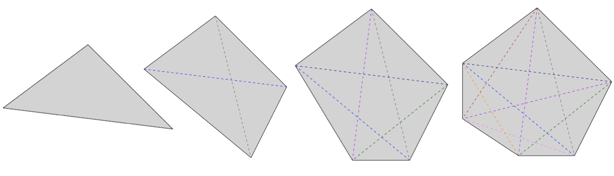
<p class="caption">(\#fig:polygon-diagonal)다각형의 대각선</p>
</div>

대각선의 개수를 구하는 공식 $\frac{n(n-3)}{2}$을 이용하면 표 \@ref(tab:sides-diagonals-table)과 같은 정보를 얻을 수 있습니다. 표를 생성하는 데 사용된 소스코드는 아래와 같습니다. 


```r
library(dplyr)
library(kableExtra)
sides <- 3:20                            
diagonals <- sides*(sides-3)/2
#diagonal_df <- data.frame(sides,diagonals)  #두 개의 컬럼을 가지는 세로로 긴 데이터 프레임 생성
diagonal_df2 <- data.frame(sides[1:9],diagonals[1:9],
                       sides[10:18],diagonals[10:18])  #네 개의 컬럼을 가지는 데이터 프레임 생성
knitr::kable(
  diagonal_df2,
  col.names = rep(c('변의 개수 (n각형)', '대각선의 개수'),2),  #표 컬럼 이름 설정
  booktabs = TRUE, align = "c",           #표 위치 설정
  caption = 'n각형의 대각선의 개수') %>%       #표 제목 설정
kable_styling(full_width=FALSE,font_size=15) %>%     #표 컬럼 간격 설정
column_spec(2, border_right=TRUE, include_thead=TRUE, 
  extra_css="border-right:double lightgrey;")
```

<table class="table" style="font-size: 15px; width: auto !important; margin-left: auto; margin-right: auto;">
<caption style="font-size: initial !important;">(\#tab:sides-diagonals-table)n각형의 대각선의 개수</caption>
 <thead>
  <tr>
   <th style="text-align:center;"> 변의 개수 (n각형) </th>
   <th style="text-align:center;border-right:1px solid;border-right:double lightgrey;"> 대각선의 개수 </th>
   <th style="text-align:center;"> 변의 개수 (n각형) </th>
   <th style="text-align:center;"> 대각선의 개수 </th>
  </tr>
 </thead>
<tbody>
  <tr>
   <td style="text-align:center;"> 3 </td>
   <td style="text-align:center;border-right:1px solid;border-right:double lightgrey;"> 0 </td>
   <td style="text-align:center;"> 12 </td>
   <td style="text-align:center;"> 54 </td>
  </tr>
  <tr>
   <td style="text-align:center;"> 4 </td>
   <td style="text-align:center;border-right:1px solid;border-right:double lightgrey;"> 2 </td>
   <td style="text-align:center;"> 13 </td>
   <td style="text-align:center;"> 65 </td>
  </tr>
  <tr>
   <td style="text-align:center;"> 5 </td>
   <td style="text-align:center;border-right:1px solid;border-right:double lightgrey;"> 5 </td>
   <td style="text-align:center;"> 14 </td>
   <td style="text-align:center;"> 77 </td>
  </tr>
  <tr>
   <td style="text-align:center;"> 6 </td>
   <td style="text-align:center;border-right:1px solid;border-right:double lightgrey;"> 9 </td>
   <td style="text-align:center;"> 15 </td>
   <td style="text-align:center;"> 90 </td>
  </tr>
  <tr>
   <td style="text-align:center;"> 7 </td>
   <td style="text-align:center;border-right:1px solid;border-right:double lightgrey;"> 14 </td>
   <td style="text-align:center;"> 16 </td>
   <td style="text-align:center;"> 104 </td>
  </tr>
  <tr>
   <td style="text-align:center;"> 8 </td>
   <td style="text-align:center;border-right:1px solid;border-right:double lightgrey;"> 20 </td>
   <td style="text-align:center;"> 17 </td>
   <td style="text-align:center;"> 119 </td>
  </tr>
  <tr>
   <td style="text-align:center;"> 9 </td>
   <td style="text-align:center;border-right:1px solid;border-right:double lightgrey;"> 27 </td>
   <td style="text-align:center;"> 18 </td>
   <td style="text-align:center;"> 135 </td>
  </tr>
  <tr>
   <td style="text-align:center;"> 10 </td>
   <td style="text-align:center;border-right:1px solid;border-right:double lightgrey;"> 35 </td>
   <td style="text-align:center;"> 19 </td>
   <td style="text-align:center;"> 152 </td>
  </tr>
  <tr>
   <td style="text-align:center;"> 11 </td>
   <td style="text-align:center;border-right:1px solid;border-right:double lightgrey;"> 44 </td>
   <td style="text-align:center;"> 20 </td>
   <td style="text-align:center;"> 170 </td>
  </tr>
</tbody>
</table>

### 다각형의 내각과 외각

다각형에서 이웃한 두 변으로 이루어지는 내부의 각을 그 다각형의 **내각** (internal angle, interior angle)이라고 합니다.


 **\@ref(angle-characteristics)절 각의 성질**에서 생성한 ```my_draw_arc()```함수를 이용하여 아래와 같이 삼각형, 사각형, 오각형, 육각형의 내각을 그려봅시다.

1. ```my_draw_arc()```함수의 이름을 ```fn_add_diagonal()```와 같은 패턴인 ```fn_draw_arc()```로 변경하고 실행하여 R 환경에 함수를 로딩합니다.


```r
library(DescTools)  #DrawArc()함수를 위한 패키지 로딩
my_draw_arc <- function(p1,po,p2,r,color,lty=1,lwd=1,over=0) {
  #각도 계산
  angle1 <- atan2(p1[2]-po[2],p1[1]-po[1])  #선분1과 x축과의 각도 atan2(y,x)
  angle2 <- atan2(p2[2]-po[2],p2[1]-po[1])  #선분2와 x축과의 각도 atan2(y,x)
  if(angle1 <0) angle1 = angle1 + 2*pi  #각도가 음수로 표현되는 경우 양수로 변경
  if(angle2 <0) angle2 = angle2 + 2*pi  #각도가 음수로 표현되는 경우 양수로 변경
  angle <- angle2 - angle1              #두 각도 차이를 이용한 두 반직선의 각도 구하기
  if(angle <0) angle = angle + 2*pi     #각도가 음수로 표현되는 경우 양수로 변경
  angle_degree <- angle*180/pi  #radian 각도를 degree(°)로 변환
  #점 P를 중심으로 theta.1 부터 theta.2 까지 각도 선호 그리기
  over <- over *pi/180 #degree(°) 각도를 radian 각도로 변환
  DrawArc(x=po[1],y=po[2],rx=r,theta.1=angle1-over,theta.2=angle2+over,
    col=color,lty=lty,lwd=lwd)
  print(paste0('angle = ',sprintf('%1.0f',angle_degree),'°'))
  return (c(angle1*180/pi, angle2*180/pi, angle_degree)) #계산 결과값이 필요한 경우에만 사용
}
fn_draw_arc <- my_draw_arc
```

2. 삼각형의 내각의 크기의 합은 $180° \times 1 = 180°$을 확인합니다.


```r
library(sf)
library(scales)
A <- c(2,5); B <- c(6,8); C <- c(10,4); D <- c(8,0); E <- c(5,0); F <- c(2,2)
triangle <- st_polygon(list(cbind(c(A[1],B[1],C[1],A[1]),c(A[2],B[2],C[2],A[2]))))
plot(triangle,col=alpha('red',0.1),border='dimgray')
fn_draw_arc(C,A,B,1,'red')
fn_draw_arc(A,B,C,1,'red')
fn_draw_arc(B,C,A,1,'red')
```

3. 사각형의 내각의 크기의 합은 $180° \times 2 = 360°$을 확인합니다.


```r
triangle1 <- st_polygon(list(cbind(c(A[1],B[1],D[1],A[1]),c(A[2],B[2],D[2],A[2]))))
plot(triangle1,col=alpha('red',0.1),border='dimgray',xlim=c(A[1],C[1]),ylim=c(D[2],B[2]))
B2 <- c(B[1]+0.1,B[2]); C2 <- c(C[1]+0.1,C[2]); D2 <- c(D[1]+0.1,D[2])
triangle2 <- st_polygon(list(cbind(c(B2[1],C2[1],D2[1],B2[1]),c(B2[2],C2[2],D2[2],B2[2]))))
plot(triangle2,col=alpha('blue',0.1),,border='dimgray',add=TRUE)
fn_draw_arc(D,A,B,1,'red')
fn_draw_arc(A,B,D,1,'red')
fn_draw_arc(B,D,A,1,'red')
fn_draw_arc(D2,B2,C2,1,'blue')
fn_draw_arc(B2,C2,D2,1,'blue')
fn_draw_arc(C2,D2,B2,1,'blue')
```

4. 오각형의 내각의 크기의 합은 $180° \times 3 = 540°$을 확인합니다.


```r
triangle1 <- st_polygon(list(cbind(c(A[1],B[1],E[1],A[1]),c(A[2],B[2],E[2],A[2]))))
plot(triangle1,col=alpha('red',0.1),border='dimgray',xlim=c(A[1],C[1]),ylim=c(E[2],B[2]))
B2 <- c(B[1]+0.1,B[2]); D2 <- c(D[1]+0.1,D[2]); E2 <- c(E[1]+0.1,E[2])
triangle2 <- st_polygon(list(cbind(c(B2[1],D2[1],E2[1],B2[1]),c(B2[2],D2[2],E2[2],B2[2]))))
plot(triangle2,col=alpha('blue',0.1),,border='dimgray',add=TRUE)
B3 <- c(B[1]+0.2,B[2]); C3 <- c(C[1]+0.2,C[2]); D3 <- c(D[1]+0.2,D[2])
triangle3 <- st_polygon(list(cbind(c(B3[1],C3[1],D3[1],B3[1]),c(B3[2],C3[2],D3[2],B3[2]))))
plot(triangle3,col=alpha('green',0.1),,border='dimgray',add=TRUE)
fn_draw_arc(E,A,B,1,'red')
fn_draw_arc(A,B,E,1,'red')
fn_draw_arc(B,E,A,1,'red')
fn_draw_arc(E2,B2,D2,1,'blue')
fn_draw_arc(B2,D2,E2,1,'blue')
fn_draw_arc(D2,E2,B2,1,'blue')
fn_draw_arc(D3,B3,C3,1,'green')
fn_draw_arc(B3,C3,D3,1,'green')
fn_draw_arc(C3,D3,B3,1,'green')
```

5. 육각형의 내각 크기의 합이 $180° \times 4 = 720°$인 것을 확인합니다. ```fn_draw_arc()```함수의 입력값은 좌표, 좌표, 좌표, 숫자, 문자열과 같이 서로 다른 다섯 개의 데이터 객체로 이루어져 있습니다. 육각형을 $4$개의 삼각형으로 나누고 각 삼각형의 내각을 표현하기 위해서 ```fn_draw_arc()```함수를 $12$번 사용하고, 각 함수는 $5$개의 입력값을 사용하였습니다. 각 입력값의 데이터 객체를 유지하기 위하여 벡터 대신에 리스트를 사용하였습니다. ```li <- list(F,A,B,1,'red')```와 같이 리스트를 생성하면 ```li[[1]]```, ```li[[5]]```와 같이 리스트의 각 객체에 접근할 수 있습니다. 아래의 코드에서는, $12 \times 5$ 크기의 $2$차원 리스트 (리스트의 리스트)를 생성한 후, ```for```루프를 이용하여 ```fn_draw_arc()```함수를 반복 호출하는 형식으로 내각을 그렸습니다. 


```r
triangle1 <- st_polygon(list(cbind(c(A[1],B[1],F[1],A[1]),c(A[2],B[2],F[2],A[2]))))
plot(triangle1,col=alpha('red',0.1),border='dimgray',xlim=c(F[1],C[1]),ylim=c(E[2],B[2]))
B2 <- c(B[1]+0.1,B[2]); E2 <- c(E[1]+0.1,E[2]); F2 <- c(F[1]+0.1,F[2])
triangle2 <- st_polygon(list(cbind(c(B2[1],E2[1],F2[1],B2[1]),c(B2[2],E2[2],F2[2],B2[2]))))
plot(triangle2,col=alpha('blue',0.1),,border='dimgray',add=TRUE)
B3 <- c(B[1]+0.2,B[2]); D3 <- c(D[1]+0.2,D[2]); E3 <- c(E[1]+0.2,E[2])
triangle3 <- st_polygon(list(cbind(c(B3[1],D3[1],E3[1],B3[1]),c(B3[2],D3[2],E3[2],B3[2]))))
plot(triangle3,col=alpha('green',0.1),,border='dimgray',add=TRUE)
B4 <- c(B[1]+0.3,B[2]); C4 <- c(C[1]+0.3,C[2]); D4 <- c(D[1]+0.3,D[2])
triangle4 <- st_polygon(list(cbind(c(B4[1],C4[1],D4[1],B4[1]),c(B4[2],C4[2],D4[2],B4[2]))))
plot(triangle4,col=alpha('orange',0.1),,border='dimgray',add=TRUE)
#fn_draw_arc()의 5개의 입력값을 12번 반복하기 위한 12x5 크기의 2차원 리스트 생성 
input_list <- list(list(F,A,B,1,'red'), list(A,B,F,1,'red'), list(B,F,A,1,'red'), 
  list(F2,B2,E2,1,'blue'), list(B2,E2,F2,1,'blue'), list(E2,F2,B2,1,'blue'),
     list(E3,B3,D3,1,'green'), list(B3,D3,E3,1,'green'), list(D3,E3,B3,1,'green'),
     list(D4,B4,C4,1,'orange'), list(B4,C4,D4,1,'orange'), list(C4,D4,B4,1,'orange'))
for(i in 1:length(input_list)) {
    li <- input_list[[i]]  #li[[1]] = input_list[[i]][[1]]
    fn_draw_arc(li[[1]],li[[2]],li[[3]],li[[4]],li[[5]])
}
```

한 꼭짓점에서 그은 대각선은 사각형, 오각형, 육각형을 각각 $2$개, $3$개, $4$개의 삼각형으로 나눕니다 (그림 \@ref(fig:polygon-internal-angle)). 삼각형의 내각의 크기의 합은 $180°$이므로 $n$각형의 내각의 크기의 합은 $180° \times (n-2)$입니다.

<div class="figure" style="text-align: center">
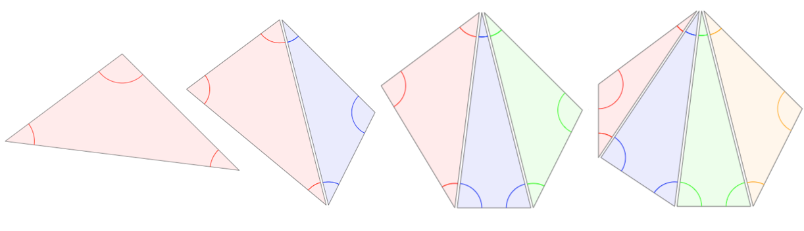
<p class="caption">(\#fig:polygon-internal-angle)다각형의 내각의 크기의 합</p>
</div>

다각형에서 한 내각의 꼭짓점에서 한 변과 그 변에 이웃한 변의 연장선이 이루는 각을 그 내각의 *외각* (exterior angle)이라고 합니다. 다각형에서 한 내각의 외각은 두 개이지만 서로 크기가 같은 맞꼭지각이므로 둘 중 하나만 생각하면 됩니다 (그림 \@ref(fig:polygon-exterior-angle)).

<div class="figure" style="text-align: center">
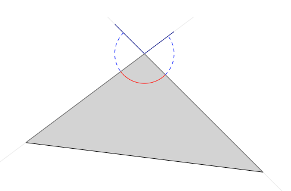
<p class="caption">(\#fig:polygon-exterior-angle)삼각형의 내각과 외각</p>
</div>

아래의 소스코드를 이용하면, 삼각형의 내각 (빨간색 실선)과 외각 (파란색 점선)을 그려볼 수 있습니다. 


```r
# 1. 점 A, B, C를 꼭짓점으로 하는 삼각형을 그립니다.
triangle <- st_polygon(list(cbind(c(A[1],B[1],C[1],A[1]),c(A[2],B[2],C[2],A[2]))))
plot(triangle,col='lightgray',xlim=c(A[1]-1,C[1]+1),ylim=c(C[2]-1,B[2]+1))
# 2. 두 점 p1, p2을 지나는 선분의 연장선의 두 끝점 벡터를 구하는 함수를 생성합니다. 시작점 c(x1,y1), 끝점 c(x2,y2)
fn_get_two_extension_points <- function (p1,p2,fromExt=TRUE,toExt=TRUE) {
  #점 p1, p2를 지나는 직선 ext_line 구함; lm(y좌표 벡터 ~ x좌표 벡터)
  ext_line <- lm(c(p1[2],p2[2])~c(p1[1],p2[1]))
  #직선 ext_line의 일차방정식 y=a+bx
  a <- as.numeric(ext_line[[1]][1]); b <- as.numeric(ext_line[[1]][2])
  #직선 ext_line 추가
  abline(ext_line,col=alpha('lightgray',0.5))
  x1 <- p1[1]-1; y1 <- a + b*x1
  x2 <- p2[1]+1; y2 <- a + b*x2
  if(fromExt) lines(c(x1,p1[1]),c(y1,p1[2]),col='darkblue')
  if(toExt) lines(c(p2[1],x2),c(p2[2],y2),col='darkblue')  
  return (c(x1,y1,x2,y2))
}
# 3. 변 AB와 변BC의 연장선 시작점, 끝점 좌표를 얻고 시작점 방향 연장선과 끝점 방향 연장선을 그립니다.
AB_extension <- fn_get_two_extension_points(A,B,fromExt=FALSE,toExt=TRUE)
BC_extension <- fn_get_two_extension_points(B,C,fromExt=TRUE,toExt=FALSE)
# 4. 내각을 그립니다.
fn_draw_arc(A,B,C,1,'red')
# 5. 변 AB 연장선의 끝점 좌표을 얻고 외각을 그립니다. 
AB_to <- c(AB_extension[3],AB_extension[4])
fn_draw_arc(C,B,AB_to,1,'blue',lty=2)
# 6. 변 BC 연장선의 시작점 좌표를 얻고 외각을 그립니다. 
BC_from <- c(BC_extension[1],BC_extension[2])
fn_draw_arc(BC_from,B,A,1,'blue',lty=2)
```

이제, 오각형의 외각을 그려보고 $n$각형의 외각의 크기의 합을 구하는 방법을 알아봅시다. 

1. 점 $A$, $B$, $C$, $D$, $E$를 꼭짓점으로 하는 오각형을 그립니다.


```r
pentagon <- st_polygon(list(cbind(c(A[1],B[1],C[1],D[1],E[1],A[1]),
                                  c(A[2],B[2],C[2],D[2],E[2],A[2]))))
plot(pentagon,col='lightgray',xlim=c(A[1]-1,C[1]+1),ylim=c(D[2]-1,B[2]+1))
```

2. **\@ref(parallel-characteristics)절 평행선의 성질**에서 생성한 ```my_text2()```함수를 이용하여 꼭짓점의 이름을 추가합니다. ```my_text2()```함수의 이름을 ```fn_draw_arc()```와 같은 패턴인 ```fn_draw_text()```로 변경하고 실행하여 R 환경에 함수를 로딩합니다.


```r
library(rlang)  #expr()안에서 변수를 사용하기 위한 패키지 로딩
my_text2 <- function(p,ptext,dx,dy,color,size=1,useItalic=TRUE) {
  for(i in 1:length(ptext)) {
    myp=p[[i]]
    if(useItalic) text(myp[1]+dx[i],myp[2]+dy[i],
        expr(italic(!!ptext[i])),col=color[i],cex=size)
    else text(myp[1]+dx[i],myp[2]+dy[i],ptext[i],col=color[i],cex=size)
  }
}
fn_draw_text <- my_text2
```

3. ```fn_draw_text()```를 이용하여 꼭짓점 $A$, $B$, $C$, $D$, $E$의 이름을 추가합니다.


```r
fn_draw_text(list(A,B,C,D,E),ptext=c('A','B','C','D','E'),
  dx=c(-0.5,0,0.5,0,0),dy=c(0,0.5,0,-0.5,-0.5),
  color=rep('black',5),useItalic=FALSE)
```

4. 각 변의 연장선 시작점, 끝점 좌표를 얻고 한쪽 방향 연장선만 그립니다. 


```r
AB_extension <- fn_get_two_extension_points(A,B,fromExt=TRUE,toExt=FALSE)
BC_extension <- fn_get_two_extension_points(B,C,fromExt=TRUE,toExt=FALSE)
DC_extension <- fn_get_two_extension_points(D,C,fromExt=FALSE,toExt=TRUE)
ED_extension <- fn_get_two_extension_points(E,D,fromExt=FALSE,toExt=TRUE)
AE_extension <- fn_get_two_extension_points(A,E,fromExt=FALSE,toExt=TRUE)
```

5. 내각은 빨간색 실선으로 외각은 파란색 점선으로 그립니다.


```r
fn_draw_arc(E,A,B,1,'red')
fn_draw_arc(c(AB_extension[1],AB_extension[2]),A,E,1,'blue',lty=2)
fn_draw_arc(A,B,C,1,'red')
fn_draw_arc(c(BC_extension[1],BC_extension[2]),B,A,1,'blue',lty=2)
fn_draw_arc(B,C,D,1,'red')
fn_draw_arc(c(DC_extension[3],DC_extension[4]),C,B,1,'blue',lty=2)
fn_draw_arc(C,D,E,1,'red')
fn_draw_arc(c(ED_extension[3],ED_extension[4]),D,C,1,'blue',lty=2)
fn_draw_arc(D,E,A,1,'red')
fn_draw_arc(c(AE_extension[3],AE_extension[4]),E,D,1,'blue',lty=2)
```

$n$각형에서 외각의 크기의 합은 각 꼭짓점과 연장선이 이루는 평각 ($180°$)의 합에서 내각의 크기의 합을 빼는 방법으로 구할 수 있습니다 (그림 \@ref(fig:polygon-exterior-angle-sum)). $n$각형에서 외각의 크기의 합은 아래의 식으로 설명할 수 있으며, 다각형의 모양과 변의 개수에 관계없이 다각형의 외각의 크기의 합은 $360°$로 일정합니다.

$$\small (외각의 \: 크기의 \: 합) \normalsize = 180° \times n - \small (내각의 \: 크기의 \: 합) \normalsize = 180° \times n - 180° \times (n - 2) = 360°$$

<div class="figure" style="text-align: center">
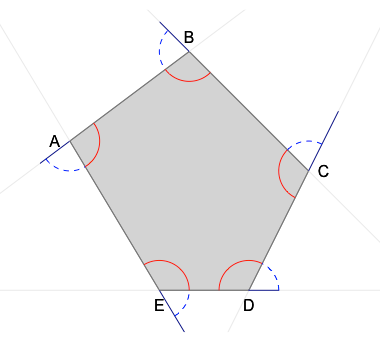
<p class="caption">(\#fig:polygon-exterior-angle-sum)다각형의 외각의 크기의 합</p>
</div>
 
또한, 삼각형의 한 외각의 크기는 그와 이웃하지 않는 두 내각의 크기의 합과 같습니다 (그림 \@ref(fig:triangle-internal-exterior)). 삼각형의 한 꼭짓점에서 내각과 외각의 크기의 합은 $180°$ ($\angle BCD + \angle C = 180°$)이고, 세 내각의 크기의 합도 $180°$ ($\angle A + \angle B + \angle C = 180°$)이기 때문에 $\angle BCD = \angle A + \angle B$이 성립합니다.

<div class="figure" style="text-align: center">
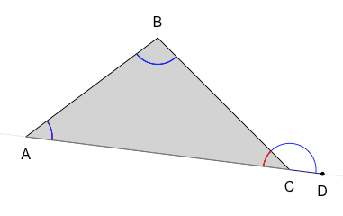
<p class="caption">(\#fig:triangle-internal-exterior)삼각형의 한 외각의 크기와 이웃하는 않는 두 내각의 크기의 합</p>
</div>

위의 그림은 아래의 소스코드를 이용하여 그려졌습니다.


```r
# 1. 점 A, B, C를 꼭짓점으로 하는 삼각형을 그립니다.
triangle <- st_polygon(list(cbind(c(A[1],B[1],C[1],A[1]),c(A[2],B[2],C[2],A[2]))))
plot(triangle,col='lightgray',xlim=c(A[1]-1,C[1]+1),ylim=c(C[2]-1,B[2]+1))
# 2. 변BC의 연장선 시작점, 끝점 좌표를 얻고 끝점 방향 연장선을 그립니다.
AC_extension <- fn_get_two_extension_points(A,C,fromExt=FALSE,toExt=TRUE)
# 3. 변BC의 연장선 상의 점 D를 그립니다. 
D <- c(AC_extension[3],AC_extension[4])
points(D[1],D[2],pch=19,col='black',cex=0.5)
# 4. 각 꼭짓점의 이름을 추가합니다.
fn_draw_text(list(A,B,C,D),ptext=c('A','B','C','D'),
  dx=c(0,0,0,0),dy=c(-0.5,0.5,-0.5,-0.5),
  color=rep('black',4),useItalic=FALSE)
# 5. 내각을 그립니다.
fn_draw_arc(C,A,B,0.8,'blue')
fn_draw_arc(A,B,C,0.8,'blue')
fn_draw_arc(B,C,A,0.8,'red')
# 6. 외각을 그립니다. 
fn_draw_arc(D,C,B,0.8,'blue')
```

### 원과 부채꼴

호 (arc), 현 (chord), 부채꼴 (sector), 중심각 (central angle), 할선 (secant line), 활꼴 (segment, segment of a circle, cresent)에 대하여 알아봅시다.

원 $O$ 위에 두 점 $A$, $B$를 잡으면 원의 둘레는 두 부분으로 나뉘게 되는데 이 두 부분을 각각 **호**라고 합니다 (그림 \@ref(fig:circle-arc-chord)). 양 끝점이 $A$, $B$인 호 $AB$를 기호로 $\small \overparen {AB}$로 나타내고, $\small \overparen {AB} = \overparen {BA}$가 성립합니다. 보통 $\small \overparen {AB}$는 작은 쪽의 호를 나타내고 큰 쪽의 호를 나타낼 때에는 큰 호 위에 한 점 $C$를 잡아 $\small \overparen {ACB}$와 같이 나타냅니다. 그리고, 원 위의 두 점 $A$, $B$를 이은 선분을 **현**이라 하고, 현 $AB$라고 부릅니다. 현이 원의 중심을 지나는 경우 현의 길이는 그 원의 지름 (diameter)이 됩니다. 그림에서는 작은 호는 파란색, 큰 호는 녹색, 현은 빨간색으로 표현되었으며, 아래의 소스코드로 그려볼 수 있습니다.

<div class="figure" style="text-align: center">
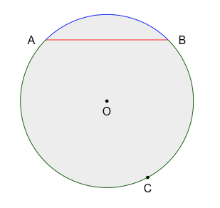
<p class="caption">(\#fig:circle-arc-chord)원의 호와 현</p>
</div>


```r
#점 A, B, O의 좌표
A <- c(-3,3); B <- c(3,3); O <- c(0,0)
#원의 반지름
r <- sqrt(A[1]*A[1] + A[2]*A[2])
#원 추가
circle_O <- st_buffer(st_point(O), r)
plot(circle_O,col=alpha('gray',0.3),border=alpha('gray',0.3),
  xlim=c(O[1]-r-1,O[1]+r+1),ylim=c(O[2]-r-1,O[2]+r+1))
#원의 중심점 추가
points(O[1],O[2],pch=19,col='black',cex=0.5)
fn_draw_text(list(O),ptext=c('O'),dx=c(0),dy=c(-0.5),color=c('black'),useItalic=FALSE)
#현 AB 추가
lines(c(A[1],B[1]),c(A[2],B[2]),col='red',lwd=1)
fn_draw_text(list(A,B),ptext=c('A','B'),dx=c(-0.7,0.7),dy=c(0,0),
  color=rep('black',2),useItalic=FALSE)
#호 AB 추가
fn_draw_arc(B,O,A,r,'blue',lwd=1)
#점 C 추가
Cx <- 2; Cy <- -1*sqrt(r*r-Cx*Cx); C <- c(Cx,Cy)
points(C[1],C[2],pch=19,col='black',cex=0.5)
fn_draw_text(list(C),ptext=c('C'),dx=c(0),dy=c(-0.5),color=c('black'),useItalic=FALSE)
#호 ACB 추가
fn_draw_arc(A,O,B,r,'darkgreen',lwd=1)
```

원 $O$에서 두 반지름 $OA$, $OB$와 $\small \overparen {AB}$로 이루어진 부채 모양의 도형을 **부채꼴** $AOB$라고 하고, $\angle AOB$를 부채꼴 $AOB$의 **중심각** 또는 호 $AB$의 중심각이라고 합니다 (그림 \@ref(fig:circle-sector-segment)). 그리고, 원 $O$와 직선 $l$이 서로 다른 두 점 $C$, $D$에서 만날 때, 직선 $l$을 원 $O$의 **할선**이라고 하고, 현 $CD$와 $\small \overparen {CD}$로 이루어진 활 모양의 도형을 **활꼴**이라고 합니다. 그림에서는 부채꼴은 파란색, 부채꼴의 중심각은 빨간색, 할선과 활꼴은 녹색으로 표현되었으며, 아래의 소스코드로 그려볼 수 있습니다.

<div class="figure" style="text-align: center">
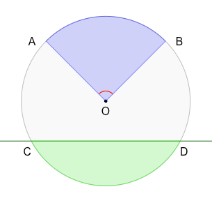
<p class="caption">(\#fig:circle-sector-segment)부채꼴과 활꼴</p>
</div>


```r
#점 A, B, O의 좌표
A <- c(-3,3); B <- c(3,3); O <- c(0,0)
#원의 반지름
r <- sqrt(A[1]*A[1] + A[2]*A[2])
#원 추가
circle_O <- st_buffer(st_point(O), r)
plot(circle_O,col=alpha('gray',0.1),border=alpha('gray',1),
  xlim=c(O[1]-r-1,O[1]+r+1),ylim=c(O[2]-r-1,O[2]+r+1))
#원의 중심점 추가
points(O[1],O[2],pch=19,col='black',cex=0.5)
fn_draw_text(list(O),ptext=c('O'),dx=c(0),dy=c(-0.5),color=c('black'),useItalic=FALSE)
#부채꼴 추가
DrawCircle(O[1],O[2],r.out=r,theta.1=atan2(B[2],B[1]),theta.2=atan2(A[2],A[1]),
  col=alpha('blue',0.2),border=alpha('blue',0.5))
fn_draw_text(list(A,B),ptext=c('A','B'),dx=c(-0.7,0.7),dy=c(0,0),
  color=rep('black',2),useItalic=FALSE)
#중심각 추가
fn_draw_arc(B,O,A,0.5,'red')
#점 C, D와 두 점을 지나는 할선 추가
y <- -2; Cx <- -1*sqrt (r*r-y*y); Dx <- -1*Cx; C <- c(Cx,y); D <- c(Dx,y)
l <- lm(c(C[2],D[2])~c(C[1],D[1]))
abline(l,col=alpha('darkgreen',1))
fn_draw_text(list(C,D),ptext=c('C','D'),dx=c(-0.2,0.2),dy=c(-0.5,-0.5),
  color=rep('black',2),useItalic=FALSE)
fn_draw_text(list(c(O[1]-r-1,y)),ptext=c('l'),dx=-1,dy=-0.5,color='darkgreen')
#활꼴 추가
rect_CD <- st_polygon(list(cbind(c(C[1],D[1],D[1],C[1],C[1]),
                                 c(C[2],D[2],D[2]-r,C[2]-r,C[2]))))
i <- st_intersection(circle_O,rect_CD)
plot(i,col=alpha('green',0.2),border=alpha('green',0.5),add=TRUE)
```

### 부채꼴의 넓이와 호의 길이

한 원에서 두 부채꼴의 중심각이 같으면, 두 부채꼴의 넓이와 호의 길이도 각각 같습니다 (그림 \@ref(fig:sector-same-angle)). 또한, 두 부채꼴의 넓이와 호의 길이가 각각 같으면 두 부채꼴의 중심각의 크기도 같습니다. 아래의 소스코드를 이용하면 중심각이 $45°$인 두 부채꼴 중 한 부채꼴을 엔터를 클릭할 때마다 $15°$씩 회전시켜 두 부채꼴을 중첩시킨 다음, 두 부채꼴의 중심각, 호의 길이, 넓이를 비교해 볼 수 있습니다.

<div class="figure" style="text-align: center">
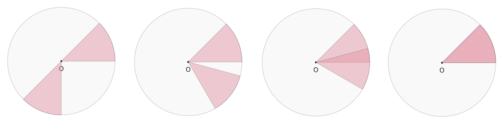
<p class="caption">(\#fig:sector-same-angle)중심각이 같은 두 부채꼴의 호의 길이과 넓이</p>
</div>


```r
O <- c(0,0); r <- 5        #원의 중심점과 반지름 정보 
angle1 <- 0; angle2 <- 45  #부채꼴 중심각 정보
circle_O <- st_buffer(st_point(O), r) #원 생성
color <- colorspace::rainbow_hcl(7)   #색상 벡터 생성
angle_shift <- 225
#엔터를 눌러서 부채꼴을 움직여 중심각이 같은 또 하나의 부채꼴을 중첩시켜 두 부채꼴의 넓이와 호의 길이가 각각 같음을 확인
for (i in 1:10) {
  #원 추가
  plot(circle_O,col=alpha('gray',0.1),border=alpha('gray',1),
    xlim=c(O[1]-r-1,O[1]+r+1),ylim=c(O[2]-r-1,O[2]+r+1))
  #원의 중심점 추가
  points(O[1],O[2],pch=19,col='black',cex=0.5)
  fn_draw_text(list(O),ptext=c('O'),dx=c(0),dy=c(-0.7),color=c('black'),useItalic=FALSE)
  #부채꼴1을 추가
  DrawCircle(O[1],O[2],r.out=r,theta.1=angle1*pi/180,theta.2=angle2*pi/180,
      col=alpha(color[1],0.5),border=alpha('dimgray',0.5))
  #부채꼴2을 angle_shift 만큼 회전
  DrawCircle(O[1],O[2],r.out=r,theta.1=(angle1+angle_shift)*pi/180,
    theta.2=(angle2+angle_shift)*pi/180,
    col=alpha(color[1],0.5),border=alpha('dimgray',0.5))
  #두 부채꼴이 완전히 중첩되면 루프문을 종료
  if((angle1+angle_shift) %% 360 == 0) {
    print("두 부채꼴의 중심각이 같으면, 두 부채꼴의 넓이와 호의 길이도 각각 같습니다.")
    break  #루프문을 멈춤
  }
  #angle_shift를 15°씩 증가시킴
  angle_shift <- angle_shift + 15 
  #사용자가 엔터를 누르면 다음 루프로 넘어감
  readline(prompt=paste0('중심각이 ',angle2,"°인 부채꼴을 회전시키려면 [enter]를 누르세요."))
}
```

부채꼴의 중심각이 변할 때 부채꼴의 호의 길이와 넓이는 어떻게 변할까요? 그림 \@ref(fig:sector-direct-proportion)에서 확인할 수 있는 것 처럼, 부채꼴의 중심각이 반으로 줄어들 수록 호의 길이와 부채꼴의 넓이가 각각 반으로 줄어듭니다. 아래의 소스코드를 실행하여 부채꼴의 중심각이 변할 때 호의 길이와 넓이가 어떻게 변하는지 직접 실행해보세요.

<div class="figure" style="text-align: center">
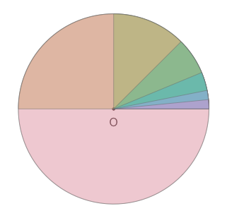
<p class="caption">(\#fig:sector-direct-proportion)한 원에서 부채꼴의 중심각과 호의 길이, 중심각과 넓이와의 정비례 관계</p>
</div>


```r
O <- c(0,0); r <- 5         #원의 중심점과 반지름 정보 
angle1 <- 0; angle2 <- 360  #부채꼴 중심각 정보
#원 추가
circle_O <- st_buffer(st_point(O), r)
plot(circle_O,col=alpha('gray',0.1),border=alpha('gray',1),
  xlim=c(O[1]-r-1,O[1]+r+1),ylim=c(O[2]-r-1,O[2]+r+1))
#원의 중심점 추가
points(O[1],O[2],pch=19,col='black',cex=0.5)
fn_draw_text(list(O),ptext=c('O'),dx=c(0),dy=c(-0.7),color=c('black'),useItalic=FALSE)
#색상 벡터 생성
color <- colorspace::rainbow_hcl(7)  
#엔터를 눌러서 현재 중심각의 1/2인 중심각을 가지는 부채꼴 그리기
for (i in 1:7) {
  DrawCircle(O[1],O[2],r.out=r,theta.1=angle1*pi/180,theta.2=angle2*pi/180,
    col=alpha(color[i],0.5),border=alpha('dimgray',0.5))
  #중심각을 현재 중심각의 1/2로 변경 
  angle2 <- angle2/2
  #사용자가 엔터를 누르면 다음 루프로 넘어감
  if (i < 7) readline(prompt=paste0('중심각이 ',angle2,'°인 부채꼴을 그려보려면 [enter]를 누르세요.'))
}
```

부채꼴의 중심각이 두배 씩 증가하는 경우를 확인하기 위해서는, 위의 소스코드 두 번째 줄에 있는 ```angle2 <- 360```를 ```angle2 <- 45/8```로, ```for``` 루프 안의 ```angle2 <- angle2/2```를 ```angle2 <- angle2*2```로 변경하고 소스코드를 실행해 보면 됩니다. 

이를 위해서 RStudio 메뉴에서 File >> New File >> R Script를 클릭하여 새로운 R 스크립트 편집창을 엽니다. 그 다음에, 위의 소스코드를 복사하여 새로 열린 RStudio의 
 R 스크립트 편집창에 붙여 넣습니다. 그런 다음에 R 스크립트 편집창의 소스코드 중에서 위에서 언급한 두 부분 (소스코드 두 번째줄에 있는 ```angle2 <- 360```를 ```angle2 <- 45/8```로, ```for``` 루프 안의 ```angle2 <- angle2/2```를 ```angle2 <- angle2*2```로)을 변경하고 실행해보면 엔터키를 누를 때마다 부채꼴의 중심각이 두 배씩 증가하는 것을 볼 수 있습니다.

 부채꼴의 중심각이 두 배 증가할 때마다 호의 길이와 부채꼴의 넓이가 각각 두 배로 증가하는 것을 확인할 수 있습니다. 따라서, 반지름이 동일한 원에서 부채꼴의 호의 길이와 중심각의 크기는 정비례하고, 부채꼴의 호의 길이와 부채꼴의 넓이도 정비례한다는 것을 알 수 있습니다.

부채꼴의 중심각과 호의 길이, 또는 부채꼴의 중심각과 넓이 사의의 정비례 관계를 이용하면, 두 부채꼴의 중심각과 한 부채꼴의 호의 길이만 주어졌을 때, 나머지 한 부채꼴의 호의 길이를 구할 수 있습니다. 두 부채꼴의 성질을 이용하여 아래와 같이 함수를 생성하고, 주어진 문제를 푸는데 사용할 수 있습니다.


```r
#비례식을 이용하여 부채꼴의 미지수를 구하는 함수, A:B = C:D
fn_get_unknown_of_a_sector_using_proportions <- function (A,B,C,D,unknown) {
  #A:B = C:D, A*D = B*C
  if(unknown == 'A') { result <- B*C/D         #A = B*C/D
  } else if(unknown == 'B') { result <- A*D/C  #B = A*D/C
  } else if(unknown == 'C') { result <- A*D/B  #C = A*D/B
  } else if(unknown == 'D') { result <- B*C/A  #D = B*C/A
  }
  return (result)
}
```

위의 함수의 ```if()```문과 ```else if()```문을 ```switch-case```문의 형태로 변경하면 아래와 같습니다. 함수의 입력값, 계산 로직, 리턴값이 동일하기 때문에 함수의 이름을 동일하게 사용하였습니다. 둘 중의 하나를 선택하여 사용하면 됩니다.


```r
#비례식을 이용하여 부채꼴의 미지수를 구하는 함수, A:B = C:D
fn_get_unknown_of_a_sector_using_proportions <- function (A,B,C,D,unknown) {
  #A:B = C:D, A*D = B*C
  result <- switch(unknown,
       'A' = B*C/D,  #if(unknown == 'A') result <- B*C/D
       'B' = A*D/C,  #if(unknown == 'B') result <- A*D/C
       'C' = A*D/B,  #if(unknown == 'C') result <- A*D/B
       'D' = B*C/A)  #if(unknown == 'D') result <- B*C/A
  return (result)
}
```

한 원에서 중심각이 $120°$인 부채꼴의 호의 길이가 $6 \: cm$이고 중심각이 $80°$인 부채꼴의 호의 길이가 $x \: cm$라고 할 때, ```fn_get_unknown_of_a_sector_using_proportions()```함수를 이용하여 아래와 같이 $x$의 값을 구할 수 있습니다. 


```r
central_angle_sector_A <- 120; arc_length_sector_A <- 6
central_angle_sector_B <- 80
#A:B = C:D;    A*D = B*C;    D = B*C/A
#120:6 = 80:x; 120*x = 6*80; x = 6*80/120
x <- fn_get_unknown_of_a_sector_using_proportions(
                    A=central_angle_sector_A,
                    B=arc_length_sector_A,
                    C=central_angle_sector_B,
                    unknown='D')
print(paste0('중심각이 ',central_angle_sector_B,'°인 부채꼴의 호의 길이 = ',x,' cm'))
```

```
## [1] "중심각이 80°인 부채꼴의 호의 길이 = 4 cm"
```

위의 비례식을 이용한 미지수 계산 함수를 중심각과 넓이의 비례 관계에 적용해 볼 수도 있습니다. 한 원에서 중심각이 $120°$인 부채꼴의 넓이가 $y \: cm^2$이고 중심각이 $80°$인 부채꼴의 넓이가 $6 \: cm^2$라고 할 때, 아래와 같이 $y$의 값을 구할 수 있습니다. 


```r
central_angle_sector_A <- 120
central_angle_sector_B <- 80; area_sector_B <- 6
#A:B = C:D;    A*D = B*C;    B = A*D/C
#120:y = 80:6; 120*6 = y*80; y = 120*6/80
y <- fn_get_unknown_of_a_sector_using_proportions(
                    A=central_angle_sector_A,
                    C=central_angle_sector_B,
                    D=area_sector_B,
                    unknown='B')
print(paste0('중심각이 ',central_angle_sector_A,'°인 부채꼴의 넓이 = ',y,' cm²'))
```

```
## [1] "중심각이 120°인 부채꼴의 넓이 = 9 cm²"
```

호의 길이가 $l$인 부채꼴의 넓이 $S$를 구하는 공식을 유도할 때에도 중심각과 넓이의 비례 관계, 중심각과 호의 비례 관계가 사용됩니다. 부채꼴의 중심각을 $x°$라 할때, $360° : \small (원의 \: 넓이) \normalsize = x° : \small (부채꼴의 \: 넓이)$와 같은 비례 관계가 성립합니다 ($360 : \pi {r}^2 = x : S$). 또한, $360° : \small (원의 \: 둘레) \normalsize = x° : \small (호의 \: 길이)$의 비례 관계가 성립합니다 ($360 : 2 \pi r = x : l$). 이 두 비례식을 아래와 같이 정리해 볼 수 있습니다.
$$S = \pi {r}^2 \times \frac{x}{360}$$
$$l = 2 \pi r \times \frac{x}{360}$$

$S$식을 전개한 후에 $l$을 대입하면 아래와 같이 호의 길이와 반지름을 이용한 부채꼴의 넓이 구하는 식을 유도할 수 있습니다.

$$ S = \pi {r}^2 \times \frac{x}{360} = r \times \pi r \times \frac{x}{360} = r \times \frac{1}{2} \times (2 \pi r \times  \frac{x}{360}) = r \times \frac{1}{2} \times l = \frac{1}{2} r l$$  

지금까지 다각형, 원, 부채꼴과 같은 평면도형에 대해서 알아보았습니다. 이제 입체도형에 대하여 알아봅시다.

## 입체도형의 성질

다면체 (polyhedron), 각기둥 (prism), 각뿔 (pyramid), 회전체 (body of rotation), 원기둥 (cylinder),  원뿔 (cone), 구 (sphere)와 같은 입체도형 (solid figure)에 대하여 알아봅니다.

### 다면체와 회전체

다각형인 면으로만 둘러싸인 입체도형을 **다면체**라고 합니다. 다면체을 둘러싸고 있는 다각형을 다면체의 면 (face), 다각형의 변을 다면체의 모서리 (edge), 다각형의 꼭짓점을 다면체의 꼭짓점이라고 합니다. 원기둥 (cylinder), 원뿔 (cone) 등은 다각형이 아닌 면으로 둘러싸여 있기 때문에 다면체에 속하지 않습니다.

정육면체 (cube, regular hexahedron)를 예로 들면 $x$축과 $y$축을 가지는 좌표평면 상에 존재하는 정사각형을 높이 방향으로 ($z$축 방향으로) 한 변의 길이만큼 무수히 많이 연속적으로 쌓으면 정육면체가 됩니다. 정육면체는 서로 직교하는 3개의 축을 가지기 때문에 정육면체를 이루는 여덟 개의 꼭짓점 좌표는 ($x$,$y$,$z$)와 같은 형태가 됩니다. 각 변의 길이가 $1$인 정육면체를 원점으로 부터 그리려면 밑면 사각형의 4개의 꼭짓점 ($0$,$0$,$0$), ($0$,$1$,$0$), ($1$,$1$$0$), ($1$,$0$,$0$)과 윗면 사각형의 4개의 꼭짓점 ($0$,$0$,$1$), ($0$,$1$,$1$), ($1$,$1$,$1$), ($1$,$0$,$1$)이 필요합니다. 

정육면체를 그리기 위하여 ```plotly``` 패키지를 이용하는 소스코드를 아래와 같이 생성하였습니다. ```plot_ly()```함수는 여덟 개의 입력값을 가지며 각 입력값의 내용은 아래와 같습니다. 

1. ```type```: 그래프의 형태, 삼차원 도형
2. ```x```: 여덟 개 꼭짓점의 $x$좌표 벡터
3. ```y```: 여덟 개 꼭짓점의 $y$좌표 벡터
4. ```z```: 여덟 개 꼭짓점의 $z$좌표 벡터

```plotly``` 패키지는 도형의 효율적인 입체 면 처리를 위하여 삼각형을 사용합니다. 따라서 정육면체의 면 처리에 12개의 삼각형이 필요합니다. 각 삼각형은 세 개의 꼭짓점을 가지며 정육면체 여덟 개의 꼭짓점에 0번 (첫 번째 꼭짓점) 부터 7번 (여덟 번째 꼭짓점)까지 번호를 매겨서 입력하게 됩니다. 아래 $i$, $j$, $k$ 벡터의 첫 번째 값은 각각 $7$, $3$, $0$이며, 이를 이용하여 정육면체의 여덟 번째 꼭짓점 ($7$), 네 번째 꼭짓점 ($3$), 첫 번째 꼭짓점 ($0$)이 이루는 첫 번째 삼각형이 생성됩니다. 이를 $12$번 반복하면 총 $12$개의 삼각형이 생성되며, 두 개의 삼각형이 하나의 사각형을 이루어 총 $6$개의 정사각형 면이 생성됩니다.

5. ```i```: 열두 개 삼각형 면의 첫 번째 꼭짓점 번호 벡터
6. ```j```: 열두 개 삼각형 면의 두 번째 꼭짓점 번호 벡터
7. ```k```: 열두 개 삼각형 면의 세 번째 꼭짓점 번호 벡터
8. ```facecolor```: 열두 개 삼각형 면의 색상 벡터

이렇게 여덟 개의 입력값을 가지는 함수 ```plot_ly()```를 이용하여 그림 \@ref(fig:cube)이 생성되었습니다. ```plotly``` 패키지로 그래프를 생성한 그래프는 동적인 그래프이기 때문에 마우스를 이용하여 확대, 축소, 회전 등이 가능하고 꼭짓점에 마우스를 가까이 가져가면 꼭짓점의 좌표 정보도 볼 수 있습니다.


```r
#install.packages("plotly")
library(plotly)
cube <- plot_ly(type = 'mesh3d',
  x = c(0, 0, 1, 1, 0, 0, 1, 1),
  y = c(0, 1, 1, 0, 0, 1, 1, 0),
  z = c(0, 0, 0, 0, 1, 1, 1, 1),
  i = c(7, 0, 0, 0, 4, 4, 2, 6, 4, 0, 3, 7),
  j = c(3, 4, 1, 2, 5, 6, 5, 5, 0, 1, 2, 2),
  k = c(0, 7, 2, 3, 6, 7, 1, 2, 5, 5, 7, 6),
  facecolor = rep(toRGB(viridisLite::viridis(6)),each=2)
)
cube
```

<div class="figure" style="text-align: center">

<p class="caption">(\#fig:cube)여섯 개의 정사각형을 면으로 가지는 정육면체</p>
</div>

여섯 개의 삼각형을 면으로 하는 다른 모양의 육면체 (hexahedron)도 그려볼 수 있습니다. 다섯 개의 꼭짓점 ($1$,$0$,$0$), ($0$,$1$,$0$), ($0$,$0$,$1$), ($1$,$1$,$1$), ($-1/3$,$-1/3$,$-1/3$)을 가지는 육면체를 생성해 보면 아래와 같습니다 (그림 \@ref(fig:hexahedron)).


```r
hexahedron <- plot_ly(type = 'mesh3d',
  x = c(1, 0, 0, 1,-1/3),
  y = c(0, 1, 0, 1,-1/3),
  z = c(0, 0, 1, 1,-1/3),
  i = c(0, 0, 1, 0, 0, 1),
  j = c(2, 3, 2, 2, 4, 2),
  k = c(3, 1, 3, 4, 1, 4),
  facecolor = toRGB(viridisLite::viridis(6))
)
hexahedron
```

<div class="figure" style="text-align: center">
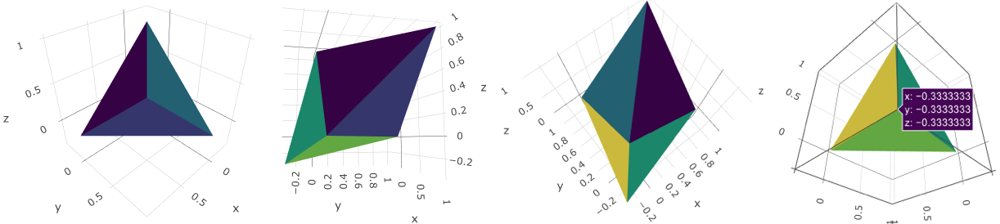
<p class="caption">(\#fig:hexahedron)여섯 개의 삼각형을 면으로 가지는 육면체</p>
</div>

삼각형 밑면과 윗면을 가지는 오면체 (Pentahedron)인 삼각기둥 (triangular prism)을 생성하려면 밑면 꼭짓점 세 개, 윗면 꼭지점 세 개, 총 여섯 개의 꼭지점이 필요합니다. 아래의 소스코드로 오면체 삼각기둥을 생성해 볼 수 있습니다 (그림 \@ref(fig:triangular-prism)). 


```r
colors <- viridisLite::viridis(5)
triangular_prism <- plot_ly(type = 'mesh3d',
  x = c(0, 1, 0, 0, 1, 0),
  y = c(0, 0, 1, 0, 0, 1),
  z = c(0, 0, 0, 1, 1, 1),
  i = c(0, 3, 4, 0, 5, 1, 5, 0),
  j = c(1, 4, 1, 3, 2, 4, 2, 3),
  k = c(2, 5, 0, 4, 1, 5, 0, 5),
  facecolor = toRGB(c(colors[1],colors[2],
                    rep(c(colors[3],colors[4],colors[5]),each=2)))
)
triangular_prism
```

<div class="figure" style="text-align: center">
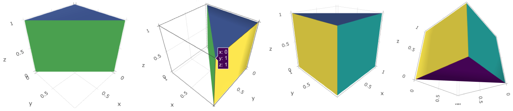
<p class="caption">(\#fig:triangular-prism)삼각형 밑면 (아랫면과 윗면)을 가지는 오면체 삼각기둥</p>
</div>

네 개의 꼭짓점 ($1$,$0$,$0$), ($0$,$1$,$0$), ($0$,$0$,$1$), ($1$,$1$,$1$)을 가지는 네 개의 삼각형을 면으로 하는 정사면체 (tetrahedron)를 생성해 보면 아래와 같습니다 (그림 \@ref(fig:triangular-pyramid)). 이 사면체는 삼각형을 밑면 (base plane)으로 가지지만 윗면은 존재하지 않고 꼭지점을 이루는 각뿔 모양이므로 삼각뿔 (triangular pyramid)이라고도 부릅니다.


```r
triangular_pyramid <- plot_ly(type = 'mesh3d',
  x = c(1, 0, 0, 1),
  y = c(0, 1, 0, 1),
  z = c(0, 0, 1, 1),
  i = c(0, 0, 0, 1),
  j = c(1, 2, 3, 2),
  k = c(2, 3, 1, 3),
  #facecolor = toRGB(viridisLite::viridis(4))
  facecolor = toRGB(viridisLite::inferno(4))
)
triangular_pyramid
```

<div class="figure" style="text-align: center">
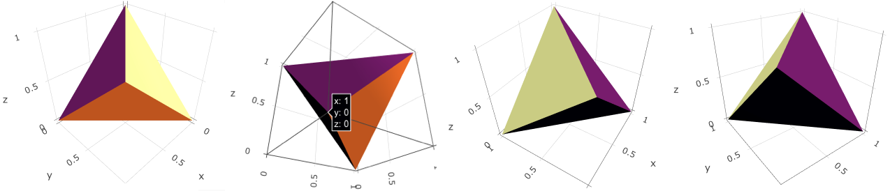
<p class="caption">(\#fig:triangular-pyramid)네 개의 정삼각형을 면으로 가지는 정사면체</p>
</div>

각뿔을 밑면에 평행한 평면으로 잘라서 생기는 두 입체 도형 중 각 뿔이 아닌 쪽을 각뿔대 (truncated pyramid,  frustum of pyramid)라고 합니다. 각뿔대에서 평행한 두 면을 밑면이라 하고, 밑면이 아닌 면을 옆면이라고 합니다. 각뿔대의 옆면은 모두 사다리꼴이 되고, 각뿔대의 두 밑면에 수직인 선분의 길이를 각뿔대의 높이라고 합니다. 아래의 소스코드를 이용하여 사각뿔대를 그려볼 수 있습니다 (그림 \@ref(fig:truncated-quadrangular-pyramid)). 각뿔대는 밑면의 모양이 삼각형이면 삼각뿔대, 밑면이 사각형이면 사각뿔대, 밑면이 오각형이면 오각뿔대가 됩니다.


```r
truncated_quadrangular_pyramid <- plot_ly(type = 'mesh3d',
  x = c(0, 0, 4, 4, 1, 1, 3, 3),
  y = c(0, 4, 4, 0, 1, 3, 3, 1),
  z = c(0, 0, 0, 0, 2, 2, 2, 2),
  i = c(0, 2, 4, 6, 0, 7, 1, 4, 2, 5, 3, 6),
  j = c(1, 3, 5, 7, 4, 3, 5, 0, 6, 1, 7, 2),
  k = c(2, 0, 6, 4, 7, 0, 4, 1, 5, 2, 6, 3),
  #facecolor = toRGB(viridisLite::viridis(4))
  facecolor = rep(toRGB(viridisLite::plasma(6)),each=2)
)
truncated_quadrangular_pyramid
```

<div class="figure" style="text-align: center">
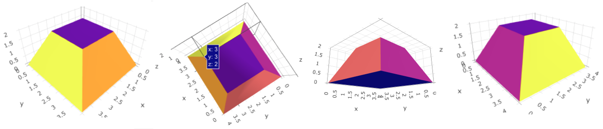
<p class="caption">(\#fig:truncated-quadrangular-pyramid)육면체인 사각뿔대</p>
</div>

다면체 중에서 아래의 두 조건을 모두 만족시키는 다면체를 정다면체 (regular polyhedron, platonic solid)라고 합니다.

1. 각 면이 모두 합동인 정다각형이다.
1. 각 꼭짓점에 모인 면의 개수가 모두 같다.

정다면체는 정사면체 (tetrahedron, 그림 \@ref(fig:triangular-pyramid)), 정육면체 (Hexahedron, 그림 \@ref(fig:cube)), 정팔면체 (Octahedron), 정십이면체 (Dodecahedron), 정이십면체 (Icosahedron)의 다섯 가지만 존재하는 것으로 알려져 있습니다 (표 \@ref(tab:regular-polyhedron-table)). 표에 사용된 다면체의 꼭지점 좌표 중 $\phi$는 황금비율로 $\phi$의 값은 $\frac {1+ \sqrt {5}} {2} \approx 1.618$입니다.

<table class="table" style="font-size: 15px; width: auto !important; margin-left: auto; margin-right: auto;">
<caption style="font-size: initial !important;">(\#tab:regular-polyhedron-table)정다면체의 성질</caption>
 <thead>
  <tr>
   <th style="text-align:left;">   </th>
   <th style="text-align:center;"> 정사면체 </th>
   <th style="text-align:center;"> 정팔면체 </th>
   <th style="text-align:center;"> 정이십면체 </th>
   <th style="text-align:center;"> 정육면체 </th>
   <th style="text-align:center;"> 정십이면체 </th>
  </tr>
 </thead>
<tbody>
  <tr>
   <td style="text-align:left;border-right:1px solid;border-right:double lightgrey;"> 면의 모양 </td>
   <td style="text-align:center;"> 정삼각형 </td>
   <td style="text-align:center;"> 정삼각형 </td>
   <td style="text-align:center;"> 정삼각형 </td>
   <td style="text-align:center;"> 정사각형 </td>
   <td style="text-align:center;"> 정오각형 </td>
  </tr>
  <tr>
   <td style="text-align:left;border-right:1px solid;border-right:double lightgrey;"> 면의 개수 </td>
   <td style="text-align:center;"> 4 </td>
   <td style="text-align:center;"> 8 </td>
   <td style="text-align:center;"> 20 </td>
   <td style="text-align:center;"> 6 </td>
   <td style="text-align:center;"> 12 </td>
  </tr>
  <tr>
   <td style="text-align:left;border-right:1px solid;border-right:double lightgrey;"> 한 꼭짓점에 모인<br>면의 개수 </td>
   <td style="text-align:center;"> 3 </td>
   <td style="text-align:center;"> 4 </td>
   <td style="text-align:center;"> 5 </td>
   <td style="text-align:center;"> 3 </td>
   <td style="text-align:center;"> 3 </td>
  </tr>
  <tr>
   <td style="text-align:left;border-right:1px solid;border-right:double lightgrey;"> 꼭짓점<br>개수 </td>
   <td style="text-align:center;"> 4 </td>
   <td style="text-align:center;"> 6<br>(2 x 3) </td>
   <td style="text-align:center;"> 12<br>(4 x 3) </td>
   <td style="text-align:center;"> 8 </td>
   <td style="text-align:center;"> 20<br>(8 + 4 x 3) </td>
  </tr>
  <tr>
   <td style="text-align:left;border-right:1px solid;border-right:double lightgrey;"> 꼭짓점<br>좌표 </td>
   <td style="text-align:center;"> (1,1,1) <br> (1,−1,−1)<br>(−1,1,−1)<br>(−1,−1,1) </td>
   <td style="text-align:center;"> (±1,0,0)<br>(0,±1,0)<br>(0,0,±1) </td>
   <td style="text-align:center;"> (0,±1,±𝜙)<br>(±1,±𝜙,0)<br>(±𝜙,0,±1) </td>
   <td style="text-align:center;"> (±1,±1,±1) </td>
   <td style="text-align:center;"> (±1,±1,±1)<br>(0,±1/𝜙,±𝜙)<br>(±1/𝜙,±𝜙,0)<br>(±𝜙,0,±1/𝜙) </td>
  </tr>
  <tr>
   <td style="text-align:left;border-right:1px solid;border-right:double lightgrey;"> 그림 </td>
   <td style="text-align:center;"> 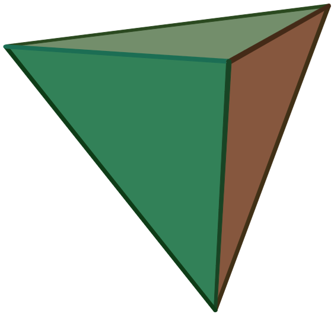{width=100px} </td>
   <td style="text-align:center;"> {width=100px} </td>
   <td style="text-align:center;"> 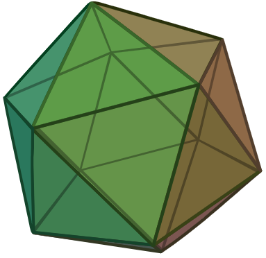{width=100px} </td>
   <td style="text-align:center;"> 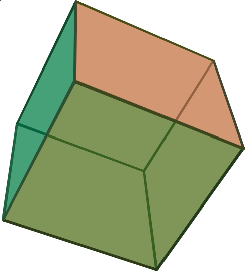{width=100px} </td>
   <td style="text-align:center;"> 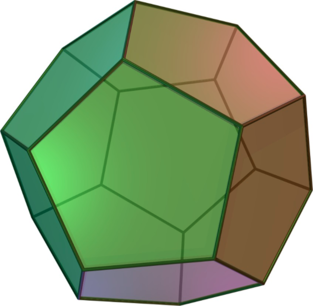{width=100px} </td>
  </tr>
  <tr>
   <td style="text-align:left;border-right:1px solid;border-right:double lightgrey;"> 움직이는<br>그림 </td>
   <td style="text-align:center;"> {width=150px} </td>
   <td style="text-align:center;"> {width=150px} </td>
   <td style="text-align:center;"> {width=150px} </td>
   <td style="text-align:center;"> 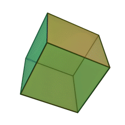{width=150px} </td>
   <td style="text-align:center;"> 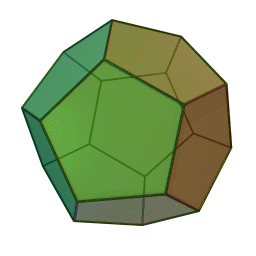{width=150px} </td>
  </tr>
</tbody>
<tfoot>
<tr>
<td style = 'padding: 0; border:0;' colspan='100%'><sup>*</sup> 표에 포함된 그림의 출처 https://en.wikipedia.org/wiki/Platonic_solid</td>
</tr>
</tfoot>
</table>

한 직선을 축으로 하여 직사각형, 직각삼각형, 반원을 한 바퀴 회전시키면 원기둥, 원뿔, 구와 같은 입체도형을 얻을 수 있는데 이러한 입체도형을 **회전체**라고 하고 축으로 사용된 직선을 **회전축** (axis of rotation)이라고 합니다 (그림 \@ref(fig:cylinder-cone-sphere)). 아래의 소스코드를 이용하여 원기둥, 원뿔, 구를 그려볼 수 있습니다.

원뿔의 꼭짓점과 밑면을 이루는 원의 한 점을 이은 거리가 가장 짧은 선을 **모선** (generating line)이라 하고, 이 선을 밑변을 이루는 원을 따라 움직이면 원뿔이 생성됩니다. 원기둥의 경우, 위의 밑변을 이루는 원의 한 점과 아래의 밑변을 이루는 원의 한 점을 이은 거리가 가장 짧은 선이 모선이 됩니다.

<div class="figure" style="text-align: center">
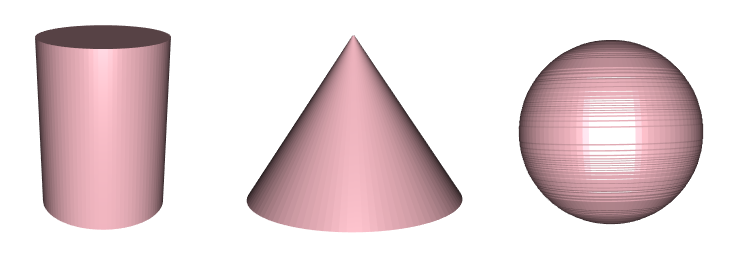
<p class="caption">(\#fig:cylinder-cone-sphere)원기둥, 원뿔, 그리고 구</p>
</div>


```r
library(rgl) #cylinder3d() 함수를 사용하기 위한 패키지 로딩 
#cylinder3d()함수를 이용한 원기둥 그리기
open3d() #삼차원 도형을 위한 창 열기
#높이축 z값이 증가함에 따라 원기둥의 반지름은 1로 일정함
cylinder3d(center = cbind(0,0,seq(0,by=0.3,len=11)),radius=1,closed=-2,sides=100) %>%
  shade3d(col = "pink")
#decorate3d() #좌표축 보이기
```


```r
#cylinder3d()함수를 이용한 원뿔 그리기
open3d() #삼차원 도형을 위한 창 열기
#높이축 z값이 증가함에 따라 원기둥의 반지름을 2부터 0까지 일정하게 줄임
cylinder3d(center = cbind(0,0,c(seq(0,by=0.03,len=101))),radius=c(seq(2,by=-0.02,len=101)), closed = -2, sides = 100) %>%
  shade3d(col = "pink")
```


```r
#cylinder3d()함수를 이용한 구 그리기
open3d() #삼차원 도형을 위한 창 열기
#반지름이 pi/2인 원, z^2 + r^2 = (pi/2)^2, r^2 = (pi/2)^2 - z^2, r = sqrt((pi/2)^2 - z^2)
z <- round(seq(-pi/2,by=pi/180,len=181),2)
r <- round(sqrt((pi/2)^2 - z^2),2) 
#원기둥의 반지름을 반원의 모양으로 변화시킴, 높이축 z값이 증가함에 따라 r값이 반원의 궤적을 따라 변화함
cylinder3d(center = cbind(0,0,z),radius=r, closed = -1, sides = 100) %>%
  shade3d(col = "pink")
```


```r
#spheres3d()함수 이용하여 구 그리기, 반지름은 pi/2
open3d()
spheres3d(0,0,0,radius=pi/2,color='pink')
```


```r
#persp3d()함수 이용하여 좀 더 매끄러운 구 그리기, 반지름은 pi/2
open3d()
sphere.f <- function(x0 = 0, y0 = 0, z0 = 0, r = 1, n = 101, ...){

  #상하 방향 s = -90°~90°, 좌우 방향 t = 0°~360°의 값을 이용하여 구의 3차원 좌표 x,y,z를 얻는 함수
  f <- function(s,t){ 
    cbind(   r * cos(t)*cos(s) + x0,
             r *        sin(s) + y0,
             r * sin(t)*cos(s) + z0)
  }
  #f() 함수와 s값 범위 slim, t값 범위 tlim을 persp3d()함수의 입력값으로 넘김
  persp3d(f, slim = c(-pi/2,pi/2), tlim = c(0, 2*pi), n = n, add = T, ...)
}
#반지름이 pi/2인 구를 그림
sphere.f(r=pi/2,col = 'pink')
```

원뿔의 윗부분을 밑면에 평행한 평면으로 자르면 두 개의 입체도형이 생기는 데 이 둘 중 원뿔이 아닌 입체도형을 **원뿔대** (truncated cone)라고 합니다. 아래의 소스코드를 이용하면 그림 \@ref(fig:truncated-cone)과 같은 원뿔대를 그려볼 수 있습니다.


```r
open3d() #삼차원 도형을 위한 창 열기
#원뿔대 그리기, 원기둥의 반지름을 1.8부터 0.8까지 일정하게 줄임
cylinder3d(center = cbind(0,0,c(seq(0,by=0.3,len=6))),radius=c(seq(1.8,by=-0.2,len=6)), 
  closed = -2, sides = 100) %>%
  shade3d(col = "pink")
```

<div class="figure" style="text-align: center">
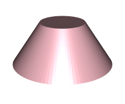
<p class="caption">(\#fig:truncated-cone)원뿔대</p>
</div>

모든 회전체에 대하여 아래의 두가지 조건이 성립합니다.

1. 회전축에 수직인 평면으로 화전체를 자르면 그 단면의 경계는 항상 원이 된다.
1. 회전축을 포함하는 평면으로 회전체를 자르면 그 단면은 모두 합동이고 회전축을 대칭으로 하는 선대칭도형 (symmetric figure for a line)이 된다.

### 기둥의 겉넓이와 부피

삼각기둥 (그림 \@ref(fig:triangular-prism))은 오면체로 서로 합동인 $2$개의 삼각형 모양 밑면 (base plane)과 
$3$개의 사각형 모양 옆면 (lateral face, side face)으로 이루어져 있으며, 옆면을 모두 펼치면 직사각형 모양이 됩니다. 따라서, 삼각기둥의 전개도 (development figure)는 두 개의 밑면과 하나의 펼쳐진 옆면으로 이루어집니다 (그림 \@ref(fig:triangular-pris-development-figure)). 삼각기둥의 전개도는 아래의 소스코드로 그려볼 수 있습니다.

<div class="figure" style="text-align: center">
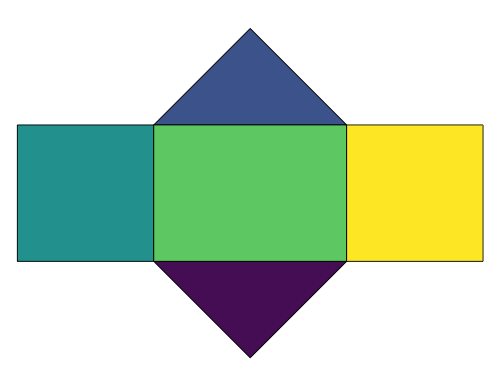
<p class="caption">(\#fig:triangular-pris-development-figure)삼각기둥의 전개도</p>
</div>


```r
library(sf)
colors <- viridisLite::viridis(5)
#밑면 그리기
triangle1 <- st_polygon(list(cbind(c(0,sqrt(2),sqrt(2)/2,0),
                                   c(0,0,-sqrt(2)/2,0))))
plot(triangle1,col=colors[1],xlim=c(-1,sqrt(2)+1),ylim=c(-1,sqrt(2)+1))
triangle2 <- st_polygon(list(cbind(c(0,sqrt(2),sqrt(2)/2,0),
                                   c(1,1,1+sqrt(2)/2,1))))
plot(triangle2,add=TRUE,col=colors[2])
#옆면 그리기
rectangle1 <- st_polygon(list(cbind(c(0,0,-1,-1,0),
                                    c(0,1,1,0,0))))
plot(rectangle1,add=TRUE,col=colors[3])
rectangle2 <- st_polygon(list(cbind(c(0,0,sqrt(2),sqrt(2),0),
                                    c(0,1,1,0,0))))
plot(rectangle2,add=TRUE,col=colors[4])

rectangle3 <- st_polygon(list(cbind(c(sqrt(2),sqrt(2),sqrt(2)+1,sqrt(2)+1,sqrt(2)),
                                    c(0,1,1,0,0))))
plot(rectangle3,add=TRUE,col=colors[5])
```

원기둥 (그림 \@ref(fig:cylinder-cone-sphere)의 왼쪽 첫 번째)의 전개도도 두 개의 원 모양 밑면과 한 개의 펼쳐진 사각형 모양 옆면으로 이루어집니다 (그림 \@ref(fig:cylinder-development-figure)). 원기둥의 전개도는 아래의 소스코드로 그려볼 수 있습니다.

<div class="figure" style="text-align: center">
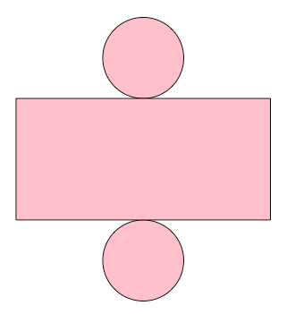
<p class="caption">(\#fig:cylinder-development-figure)원기둥의 전개도</p>
</div>


```r
library(sf)
r <- 1; h <- 3
#밑면 그리기
circle_1 <- st_buffer(st_point(c(0,-r)), r)
plot(circle_1,col='pink',xlim=c(-pi-2,pi+2),ylim=c(-pi-2,pi+2))
circle_2 <- st_buffer(st_point(c(0,h+r)), r)
plot(circle_2,add=TRUE,col='pink')
#옆면 그리기
rectangle1 <- st_polygon(list(cbind(c(pi,pi,-pi,-pi,pi),
                                    c(0,h,h,0,0))))
plot(rectangle1,add=TRUE,col='pink')
```

위의 삼각기둥과 원기둥의 전개도로 부터 기둥의 겉넓이는 서로 합동인 두 밑면의 넓이와 옆넓이 (옆면 전체의 넓이)의 합인 것을 알 수 있습니다.

$$\small (기둥의 \: 겉넓이) \normalsize = 2 \times \small (밑넓이) \normalsize + \small (옆넓이)$$

반지름이 $r$이고 높이가 $h$인 원기둥의 경우, 옆면의 가로의 길이는 원모양 밑면의 원주 (원의 둘레, circumference)인 $2 \pi r$과 같고 세로의 길이는 높이 $h$이므로 옆면의 넓이는 $2 \pi r h$이고, 밑면의 넓이는 $\pi {r}^{2}$입니다. 따라서 원기둥의 겉넓이 $S$를 구하는 공식은 아래와 같습니다. 원기둥의 밑면 반지름과 높이의 단위가 $cm$이면 원기둥 겉넓이의 단위는 ${cm}^{2}$가 됩니다.

$$S = 2 \times (\pi {r}^{2}) + (2 \pi r h) = 2 \pi {r}^{2} + 2 \pi r h$$

기둥이 밑면의 모양을 높이 방향으로 계속 쌓아서 만들었다고 생각해보면, 기둥의 부피를 아래와 같이 짐작할 수 있습니다. 

$$\small (기둥의 \: 부피) \normalsize = \small (밑넓이) \normalsize \times \small (높이)$$

반지름이 $r$이고 높이가 $h$인 원기둥의 경우, 밑면의 넓이가 $\pi {r}^{2}$이므로 원기둥의 부피 $V$를 구하는 공식은 아래와 같습니다. 원기둥의 밑면 반지름과 높이의 단위가 $cm$이면 원기둥 부피의 단위는 ${cm}^{3}$가 됩니다.

$$V = (\pi {r}^{2}) \times h = \pi {r}^{2} h$$


### 뿔의 겉넓이와 부피

사각뿔의 전개도를 그려보면 사각뿔은 사각형 모양의 밑면 $1$개와 삼각형 모양의 옆면 $4$개로 이루어져 있습니다 (그림 \@ref(fig:quadrangular-pyramid-development-figure)).

<div class="figure" style="text-align: center">
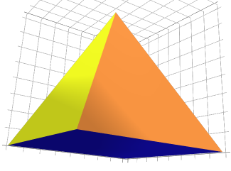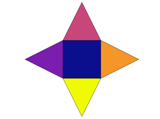
<p class="caption">(\#fig:quadrangular-pyramid-development-figure)사각뿔과 사각뿔의 전개도</p>
</div>


```r
library(plotly)
colors <- viridisLite::plasma(5)
quadrangular_pyramid <- plot_ly(type = 'mesh3d',
  x = c(0, 0, 4, 4, 2),
  y = c(0, 4, 4, 0, 2),
  z = c(0, 0, 0, 0, 4),
  i = c(0, 3, 0, 0, 1, 2),
  j = c(3, 2, 3, 1, 2, 3),
  k = c(1, 1, 4, 4, 4, 4),
  facecolor = toRGB(c(rep(colors[1],2),colors[2],colors[3],colors[4],colors[5]))
)
quadrangular_pyramid
```


```r
library(sf)
colors <- viridisLite::plasma(5)
#밑면 그리기
rectangle1 <- st_polygon(list(cbind(c(0,4,4,0,0),c(0,0,4,4,0))))
plot(rectangle1,col=colors[1],xlim=c(-4,8),ylim=c(-4,8))
#옆면 그리기
triangle1 <- st_polygon(list(cbind(c(0,-4,0,0),c(0,2,4,0))))
plot(triangle1,add=TRUE,col=colors[2])
triangle2 <- st_polygon(list(cbind(c(0,4,2,0),c(4,4,8,4))))
plot(triangle2,add=TRUE,col=colors[3])
triangle3 <- st_polygon(list(cbind(c(4,4,8,4),c(0,4,2,0))))
plot(triangle3,add=TRUE,col=colors[4])
triangle4 <- st_polygon(list(cbind(c(0,2,4,0),c(0,-4,0,0))))
plot(triangle4,add=TRUE,col=colors[5])
```

뿔의 겉넓이는 밑넓이와 옆넓이 (옆면 전체의 넓이)의 합으로 아래의 공식이 성립합니다. 

$$\small (뿔의 \: 겉넓이) \normalsize = \small (밑넓이) \normalsize + \small (옆넓이)$$

사각뿔의 겉넓이를 구할때 사각뿔의 옆넓이는 옆면 전체의 넓이이므로 $4$개의 삼각형 모양 옆면의 넓이를 합한 넓이가 됩니다. 원뿔의 경우, 전개도를 그려보면 밑면은 원, 옆면은 부채꼴로 이루어져 있습니다. 따라서, 밑면의 반지름의 길이가 $r$, 모선의 길이가 $l$인 원뿔의 밑넓이는 $\pi {r}^2$이고 옆넓이는 $\frac{1}{2} \times 2 \pi r \times l = \pi r l$이므로 원뿔의 겉넓이 $S$를 구하는 공식은 아래와 같습니다.

$$S = \pi {r}^2 + \pi rl$$

뿔의 부피는 밑면이 합동이고 높이가 같은 기둥 부피의 $\frac {1}{3}$이라고 알려져 있고, 공식으로 나타내면 아래와 같습니다.

$$\small (뿔의 \: 부피) \normalsize = \frac{1}{3} \times \small (밑넓이) \normalsize \times \small (높이)$$

밑면의 반지름이 $r$이고 높이가 $h$인 원뿔 (그림 \@ref(fig:cylinder-cone-sphere)의 가운데)의 밑넓이는 $\pi {r}^{2}$이므로 원뿔의 부피 $V$를 구하는 공식은 아래와 같습니다.

$$V = \frac{1}{3} \pi {r}^{2} h$$


### 구의 겉넓이와 부피

구 (그림 \@ref(fig:cylinder-cone-sphere)의 오른쪽 첫번째)의 겉넓이는 반지름의 길이가 같은 원 넓이의 $4$배라고 알려져 있습니다. 따라서, 반지름이 $r$인 구의 겉넓이 $S$를 구하는 공식은 아래와 같습니다.

$$S = 4 \times \pi {r}^{2} = 4 \pi {r}^{2}$$

구의 중심점을 꼭짓점으로 하는 한없이 많은 각뿔 모양으로 나누어 생각하면, 구의 부피는 모든 각뿔의 부피의 합과 같으며, 구의 겉넓이 또한 모든 각뿔의 밑넓이의 합과 같습니다 (그림 \@ref(fig:sphere-mesh)). 아래의 소스코드를 이용하여 구를 한없이 많은 각뿔 모양으로 나누었을 때의 그림을 그려볼 수 있습니다. 코드 한 줄 한 줄을 이해하려 하기 보다는 흐름만 이해하고 복붙하세요. 

<div class="figure" style="text-align: center">
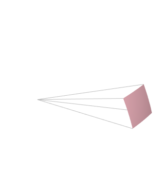
<p class="caption">(\#fig:sphere-mesh)구를 한없이 많은 각뿔 모양으로 분해</p>
</div>


```r
open3d() #삼차원 도형을 위한 창 열기
#구를 그리는 함수에 구를 한없이 많은 각뿔 모양으로 나누었을 때, 각뿔들의 밑면 그리는 옵션 추가
sphere.f <- function(x0=0,y0=0,z0=0,r=1,n=101,n_line=101,
                    srange=c(-pi/2,pi/2),trange=c(0, 2*pi),with_line=FALSE, ...){
  #상하 방향 s = -90°~90°, 좌우 방향 t = 0°~360°의 값을 이용하여 구의 3차원 좌표 x,y,z를 얻는 함수
  f <- function(s,t){ 
    cbind(   r * cos(t)*cos(s) + x0,
             r *        sin(s) + y0,
             r * sin(t)*cos(s) + z0)
  }
  #위의 f() 함수와 s값 범위 slim, t값 범위 tlim을 이용하여 구를 그림
  persp3d(f, slim = srange, tlim = trange, n = n, add = T, ...)
  # 구를 수많은 사각형으로 나눔
  if (with_line) persp3d(f, slim=srange,tlim=trange,n=n_line,col='dimgray',
                         front = "lines", back = "lines", lit = FALSE, add = T)
}
#구를 한없이 많은 각뿔 모양으로 나누었을 때, 각뿔들의 밑면
sphere.f(r=pi/2,col='pink',with_line=TRUE)
```


```r
open3d() #삼차원 도형을 위한 창 열기
#구를 한없이 많은 각뿔 모양으로 나누었을 때, 한 각뿔의 밑면 그리기
sphere.f(r=pi/2,col='pink',srange = c(0,pi/18), trange = c(pi/18,pi/9))
#각뿔의 4개 모서리 그리기
s <- seq(0,pi/18,length.out=2)
t <- seq(pi/18,pi/9,length.out=2)
for (i in s) {
  for (j in t) {
    x <- r * cos(j)*cos(i) 
    y <- r * sin(i)
    z <- r * sin(j)*cos(i)
    lines3d(x=c(0,x),y=c(0,y),z=c(0,z), col = "gray")
  }
}
```

구의 반지름의 길이는 각 각뿔의 높이이고, 구의 부피는 모든 각뿔의 부피의 합이므로, 아래의 공식으로 구의 부피를 구할 수 있습니다.

$$\small (구의 \: 부피) \normalsize = \small (모든 \: 각뿔의 \: 부피의 \: 합)  \normalsize = \frac{1}{3} \times \small (모든 \: 각뿔의 \: 밑넓이의 \: 합) \normalsize \times \small (각뿔의 \: 높이)$$
$$\qquad \qquad \qquad \qquad \qquad \qquad = \frac{1}{3} \times \small (구의 \: 겉넓이) \normalsize \times \small (구의 \: 반지름의 \: 길이) $$

구의 반지름의 길이를 $r$이라고 하면 구의 겉넓이는 $4 \pi {r}^{2}$이므로 구의 부피 $V$를 구하는 공식은 아래와 같습니다.

$$V = \frac{1}{3} \times 4 \pi {r}^{2} \times r = \frac{4}{3} \pi {r}^{3}$$


### 그리고, 공간

입체도형에 대해서 살펴본 김에, 우리가 일상 생활에서 매일 경험하는 더 큰 공간인 우리가 사는 땅 (한반도)에 대한 삼차원 시각화에 도전해 봅시다. ```rayshader``` 패키지를 이용하면 \@ref(prime-factor)절의 그림 \@ref(fig:elevation-korea) 한반도 주변의 높이 정보 생성에 사용된 데이터를 삼차원으로 시각화할 수 있습니다. 데이터는 높이 정보를 가지고 있지만 보통 디지털 이미지와 동일한 구조를 가집니다. 하나의 디지털 이미지는 픽셀 (pixel; picture element) 또는 화소 (畵素)라고 부르는 작은 점들로 이루어 집니다. 하나의 이미지가 가지는 픽셀의 개수가 많을 수록 이미지의 파일 용량 (file size)은 커지게 됩니다. 이미지 파일이나 데이터 파일의 용량이 클수록 컴퓨터에서 처리하는 속도는 느려지게 됩니다. 아래의 소스코드에서는 기존의 소스코드에서 저장해 놓았던 데이터 파일을 읽어온 후 해상도 (resolution)를 조금 낮추어 사용하였으며, 여섯 단계로 나누어져 있습니다. 첫 번째 단계에서는 패키지를 로딩하고, 두 번째와 세 번째 단계에서 기존 데이터 파일의 해상도를 낮춥니다. 네 번째 단계에서 데이터 프레임을 생성하고 다섯번째 단계에서 ```ggplot()``` 그래프를 생성한 후에, 여섯 번째 단계에서 삼차원 시각화합니다.


```r
## 1. 처음 사용하는 패키지를 설치하고 필요한 패키지들을 로딩합니다. 
#remotes::install_github("tylermorganwall/rayshader")
library(rayshader)
library(raster)
library(scales)
## 2. 그림 2.5 생성 시 저장해둔 한반도 높이 데이터를 읽어오고 픽셀 개수와 해상도를 확인합니다.
elevation <- raster("korea_elevation.grd") #한반도 높이 자료 읽어오기
dim(elevation)  #픽셀 차원 (dimension) 확인, rows(1114) x columns(987) x layers(1)
res(elevation)  #픽셀 해상도 (resolution) 확인, x축 해상도 (경도 0.01°), y축 해상도 (위도 0.01°)
## 3. raster 파일 해상도를 낮추어 파일 사이즈를 줄이고 난 후, 픽셀 개수와 해상도를 확인합니다.
#raster 파일 해상도를 낮추어 파일 사이즈를 줄임
newraster <- raster(extent(elevation), crs = crs(elevation), resolution = c(0.01,0.01))
newraster <- resample(elevation,newraster,method='ngb')
dim(newraster)
res(newraster)
#저해상도 raster를 ascii 파일로 저장
writeRaster(newraster, filename="korea_elevation2.grd", format="raster",overwrite=TRUE) 
## 4. 저해상도 raster 파일을 이용하여 x, y, z 컬럼을 가지는 데이터 프레임을 생성합니다.
elevation <- raster("korea_elevation2.grd") 
e_df <- as.data.frame(elevation,xy = TRUE)
colnames(e_df)[3] ='z'
str(e_df)
## 5. ggplot()을 이용하여 그림 2.5와 유사한 색상을 가지는 그래프를 생성합니다.
#그림 2.5와 동일하도록 색상 단계 구분
my.at <- c(seq(-3800, -100, 100), seq(-80, 80, 10), seq(100, 2700, 70))
# 그래프 생성
plot <- ggplot(e_df, aes(x, y)) +
  geom_raster(aes(fill=z)) +
  scale_fill_distiller(palette = "RdBu", direction = -1, values=rescale(my.at)) +
  coord_quickmap()
## 6. ggplot()으로 생성된 그래프를 rayshader 패키지의 plot_gg()으로 삼차원 시각화 합니다. 
#삼차원 그래프 생성, 높이를 250배 과장해서 표현함으로써 삼차원 효과를 극대화 함
plot_gg(plot,multicore=TRUE,width=5,height=5,scale=250, #높이의 250배로 과장 (과고감)
  windowsize=c(1400,866),zoom=0.55,theta=-30,phi=30)    #화면크기, 확대, 카메라 각도
```

위의 소스코드를 단계 별로 실행하면 그림 \@ref(fig:plane-to-3d2)와 같은 결과를 얻을 수 있습니다. 마우스를 이용하여 삼차원 영상을 확대하거나 회전해 보면서 제주도의 한라산, 울릉도, 독도, 울릉도 윗부분 깊은 바다 그리고 그림의 제일 윗부분에 위치한 백두산을 찾아보세요.

<div class="figure" style="text-align: center">
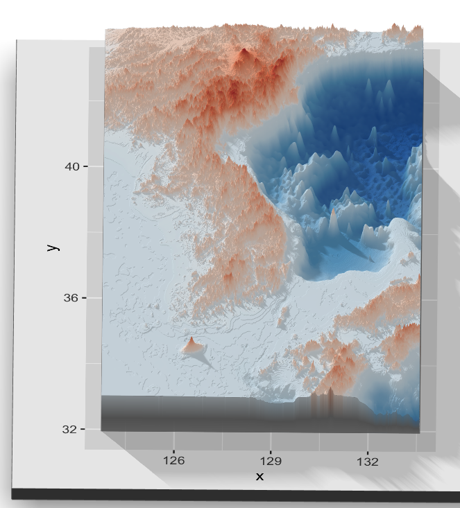
<p class="caption">(\#fig:plane-to-3d2)한반도 주변의 높이 (고도) 정보를 이용한 삼차원 시각화</p>
</div>

위의 정육면체와 정사면체를 생성하는 데 사용한 ```plotly``` 패키지로도 한반도 주변의 높이 정보를 이용한 삼차원 시각화가 가능합니다. 아래의 소스코드를 실행하여 생성되는 삼차원 그래프를 확인하세요. 코드의 세부적인 부분을 이해하려고 하기보다는 '이런 방법도 있구나' 하는 느낌으로 실행해보세요. ```plot_gg()```와는 달리, ```plot_ly()```를 이용하면 그려낸 그래프 자체를 확대, 축소해 볼 수 있다는 장점이 있습니다.


```r
library(reshape2)
library(RColorBrewer)
library(plotly)
mat <- acast(e_df, y~x, value.var="z")
nrow(mat)
y <- round(as.numeric(rownames(mat)),2)
rownames(mat) <- y
ncol(mat)
x <- round(as.numeric(colnames(mat)),2)
colnames(mat) <- x
colfunc<-colorRampPalette(rev(brewer.pal(9, "RdBu")))
colfunc(93)
plot <- plot_ly(type = "surface", x=x, y=y, z = mat, 
  colorscale = list(rescale(my.at), colfunc(93)),
  contours = list(z = list(show=TRUE,usecolormap=TRUE,project=list(z=TRUE)))
)
plot <- plot %>% layout(scene = list(camera=list(
                eye = list(x=-0.5, y=-1.5, z=1.5))))
plot
```

한반도에서 좀 더 공간을 확장하여 극동 아시아로 가볼까요? 지구는 평면이 아니라 구의 형태이기 때문에 넓은 공간을 이차원 평면에 표현하면 원래 모양대로 표현하기가 어려워 집니다. 컴퓨터가 없던 시절에는 삼차원 지구를 이차원 평면인 종이 위에 지도 형태로 주로 표현했기 때문에 이를 위한 다양한 방법 (투영법, projection)들이 개발되어 왔습니다. 하지만, 컴퓨터의 발전으로 삼차원 지구를 컴퓨터, 핸드폰, 가상현실 (virtual reality), 홀로그램(hologram) 등을 이용하여 구의 형태 그대로 시각화할 수 있습니다. 아래 소스코드를 이용하면 한반도와 주변 국가 (중국, 일본)들을 구의 형태로 시각화해 볼 수 있습니다.


```r
## 1. 처음 사용하는 패키지를 설치하고 필요한 패키지들을 로딩합니다.  
#devtools::install_github("hypertidy/anglr")
library(anglr)
library(stringr)
library(maptools)
library(scales)
library(plotly)
data(wrld_simpl)
```


```r
## 2. 시각화할 공간 다각형 데이터 프레임 (map1)을 가져옵니다.
#아래 세 개의 지도 중 하나 선택하여 시각화, 나머지 두 개의 지도는 반드시 주석처리하여 실행되지 않도록 함
#map1 <- wrld_simpl #세계 지도
map1 <- subset(wrld_simpl, str_detect(NAME, "Korea|China|Japan")) #극동아시아 지도
#map1 <- subset(wrld_simpl, str_detect(NAME, "Korea")) #한반도 지도
```


```r
## 3. 지구본 모양의 시각화를 위해 삼차원 삼각형 면 (mesh)을 생성합니다.
#지구 중심을 원점으로 하는 삼차원 좌표계를 이용한 삼각형 면 정보 생성
delmesh <-  anglr::globe(anglr::DEL(map1, max_area = 0.5)) #삼차원좌표계에 삼각형 면 생성
mesh <- as.mesh3d(delmesh) #TRI 객체를 mesh3d 객체로 변환
```


```r
## 4. mesh의 꼭짓점과 삼각형 면을 이용하여 plot_ly() 입력값을 생성합니다. 
#삼차원 삼각형 꼭짓점 (mesh$vb)을 이용하여 x, y, z 좌표 벡터를 생성
x <- mesh$vb[1,]
y <- mesh$vb[2,]
z <- mesh$vb[3,]
#삼차원 삼각형 면 (mesh$it)을 이용하여 i, j, k 면 벡터 생성
i <- mesh$it[1,]-1  #시작이 0부터 이므로 1을 빼줌
j <- mesh$it[2,]-1  #시작이 0부터 이므로 1을 빼줌
k <- mesh$it[3,]-1  #시작이 0부터 이므로 1을 빼줌
#각 삼각형의 면 (mesh$it)의 위치정보를 이용한 색상 설정 facecolor (무지개색, 아래부분 빨간색, 윗부분 보라색)
zmean <- apply(t(mesh$it),MARGIN=1,function(i){mean(z[i])})
facecolor = colour_ramp(rainbow(9))(rescale(x=zmean))
```


```r
## 5. 정육면체, 정사면체 그래프와 마찬가지로 꼭짓점 정보 (x,y,z)와 면 정보 (i,j,k)로 삼차원 시각화
globe <- plot_ly( type = "mesh3d",
  x = x, y = y, z = z,
  i = mesh$it[1,]-1, j = mesh$it[2,]-1, k = mesh$it[3,]-1,
  facecolor = facecolor
)
globe  #삼차원 시각화 확인
```

위의 소스코드 ```## 2. 시각화할 공간 다각형 데이터 프레임 (map1)```을 가져오는 부분에서는 극동아시아 데이터를 사용했지만 아래와 같이 ```map1``` 부분을 ```#극동아시아 지도```라인에서 ```#세계 지도``` 라인으로 변경하면 그림 \@ref(fig:globe1)과 같이 지구본 형태의 세계 지도도 생성할 수 있습니다. 

```r
map1 <- wrld_simpl #세계 지도
#map1 <- subset(wrld_simpl, str_detect(NAME, "Korea|China|Japan")) #극동아시아 지도
#map1 <- subset(wrld_simpl, str_detect(NAME, "Korea")) #한반도 지도
```

<div class="figure" style="text-align: center">
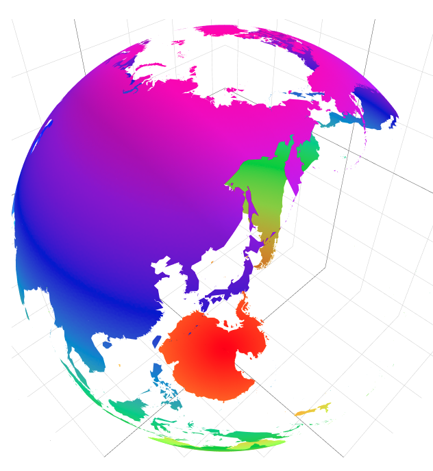
<p class="caption">(\#fig:globe1)지구 삼차원 시각화</p>
</div>

이번 장에서는 다각형, 원, 부채꼴 등과 같은 평면도형과 다면체, 기둥, 뿔, 구 등과 같은 입체도형의 성질에 대해서 살펴보았습니다. 또한, 우리가 사는 한반도, 지구의 삼차원 시각화에 대해서도 다루었습니다. 이제 **\@ref(statistics)장 통계**에 대하여 본격적으로 알아봅시다.
