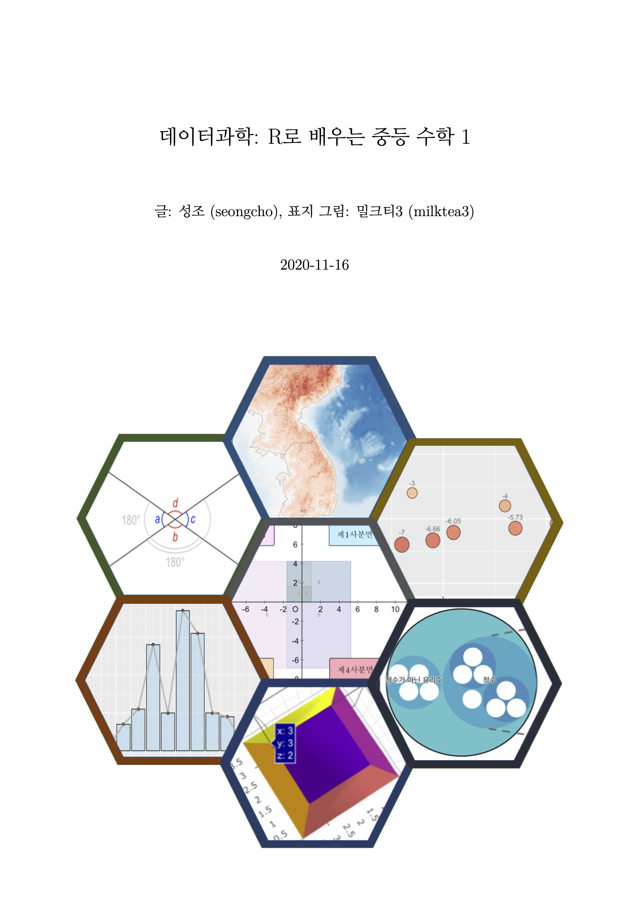

--- 
title: "데이터과학: R로 배우는 중등 수학 1"
author: "글: seongcho, 표지 그림: milktea3"
date: "`r Sys.Date()`"
site: bookdown::bookdown_site
output: bookdown::gitbook
documentclass: book
fontsize: 12pt
bibliography: [book.bib, article.bib]
biblio-style: "apalike"
link-citations: yes
latex_engine: xelatex
github-repo: seongcho1.github.io/rmath01
---

# 시작하기에 앞서 {-}

```{r echo = FALSE, out.width = '80%'}

```

## 지은이 소개 {-}


이 책(<https://seongcho1.github.io/rmath01>)은 seongcho가 쓰고, milktea3가 표지 그림을 디자인했습니다. seongcho는 우연히 중학교 $1$학년 수학 교과서를 보게 되고 중등 수학 개념들을 **R**로 구현해보면 어떨까 하는 생각에서 이 책을 시작하게 되었습니다. 그리고, 시작을 하였으니 끝까지 쓰게 되었습니다. 

**seongcho**

seongcho는 최근 몇 년간 데이터 처리, 분석, 시각화에 주로 **R**을 이용해 왔으며, **R**의 다양한 패키지들을 통하여 다양한 분야로 관심을 확장하고 있습니다. 현재는 데이터 사이언스에 푹 빠져있으며 **C** 언어를 비롯한 다양한 프로그래밍 언어들을 더 깊게 배우는 중입니다. 팟캐스트 듣기, 걷기, 카푸치노 마시기, 킨들로 책읽기를 좋아합니다.


**milktea3**

milktea3는 애플 펜슬로 라인 스티커 (<https://rebrand.ly/line_milktea3>)와 네이버 OGQ 마켓 스티커 (<https://rebrand.ly/naver_milktea>)를 디자인하고, 캔버스나 예쁜 돌 위에 그림 그리기를 좋아합니다. 클라리넷 주자로 오케스트라 활동을 $3$년 째 하고 있으며, 친구들과 농구하기, 노래 부르고 춤추기를 좋아합니다. 프리코드캠프 (<https://freecodecamp.org/milktea13>)에서 html, css, javascript도 꾸준히 공부하고 있습니다. 하지만, 넷플릭스와 유튜브에 한번 빠지면 시간 가는 줄 모릅니다. 


## 이 책의 구성 {-}

이 책은 중등 수학 1의 개념들을 **R**에서 어떻게 다룰 수 있을까? 라는 의문에서 출발했기 때문에, 제목과는 다르게 이 책에서 다루는 내용은 '중등 수학 1로 배우는 R'에 더 가깝습니다. 중등 수학 1 교과서의 차례를 따라가며 R을 활용하는 방법을 다룹니다.


**\@ref(r-get-started)장 R 시작하기**에서는 R의 핵심적인 데이터 객체인 벡터와 데이터 프레임에 대해서 알아보고 기본적인 소스코드 작성법에 대하여 익혀봅니다.

**\@ref(number-calc)장 수와 연산**에서는 벡터, 리스트, 데이터 프레임 등의 데이터 객체와 반복문, 조건문, 연산자, 함수 등을 활용하여 원하는 로직을 소스코드로 구현하는 방법을 알아보고, 중요 패키지인 ```dplyr```와 ```ggplot2```의 사용법을 익혀봅니다.

**\@ref(x-equation)장 문자와 식**에서는 자연수의 소인수분해, 최대공약수와 최소공배수 구하기, 정수와 유리수의 대소관계 및 절대값, 정수와 유리수의 연산를 다루면서 벡터, 리스트, 데이터 프레임 등의  데이터 객체들을 알아보고, 반복문, 조건문, 연산자, 함수 등을 활용하여 원하는 로직을 구현하는 방법을 익혀봅니다.

**\@ref(coordinates-graph)장 좌표평면과 그래프**에서는 좌표를 이용하여 두 변수 간의 관계를 그래프로 그려보고, 두 변수들 간의 관계 식을 이용하여 정비례 관계에 있는지 반비례 관계에 있는지 알아봅니다. 두 변수의 관계를 측정, 기록, 표현, 시각화하는데 표, 수식 및 그래프를 사용하는 방법을 익혀봅니다. 

**\@ref(features-dimensions)장 도형의 기초**에서는  점, 선, 면과 이 들 간의 위치 관계를 알아봅니다. 각, 평행선, 삼각형의 성질을 이 들을 그림으로 그리는 방법을 익혀봅니다.

**\@ref(features-characteristics)장 도형의 성질**에서는 다각형, 원, 부채꼴과 같은 평면도형과 다면체, 기둥, 뿔, 구와 같은 입체도형의 성질에 대해서 알아보고 도형들을 그리는 여러가지 방법들을 익혀봅니다.

**\@ref(statistics)장 통계**에서는 통계적 대푯값과 그림 상자, 도수분포표, 히스토그램, 상대도수 등의 통계 기본 개념을 알아보고 다양한 데이터 탐색 기법과 시각화 기법을 익혀봅니다.

